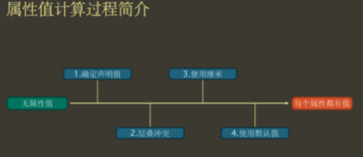
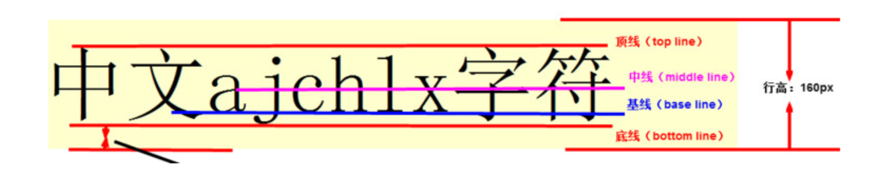
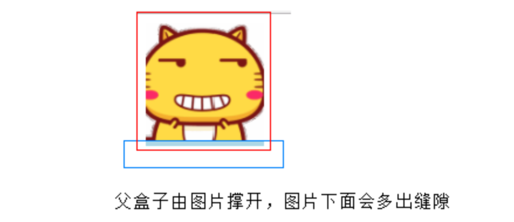

# 属性值的计算过程【重点】

**属性值计算过程：**

- 渲染过程

  一个元素一个元素依次渲染，顺序按照页面文档的树形目录结构进行。

- 计算过程

  渲染每个元素的前提条件：该元素的所有 CSS 属性必须有值。

  一个元素，从所有属性都没有值，到所有的属性都有值，这个计算过程，叫做属性值计算过程。



1. 确定声明值：参考样式表中没有冲突的声明，则作为 CSS 属性值

2. 层叠冲突：对样式表有冲突的声明使用层叠规则，确定 CSS 属性值

3. 使用继承：对仍然没有值的属性，若可以继承，则继承父元素的值

4. 使用默认值：对仍然没有值的属性，使用默认值


- 特殊的两个 CSS 取值

  `inherit`：手动（强制）继承，将父元素的值取出应用到该元素。

  `initial`：初始值，将该属性设置为默认值。

# 行盒的盒模型

## 行盒

- 常见的行盒

```html
span、strong、em、i、img、video、audio
```

- 显著特点

  只沿着内容沿伸。

  行盒不能设置宽高（调整行盒的宽高，应该使用字体大小、行高、字体类型，间接调整）。

- 内边距（填充区）

  水平方向有效，垂直方向不会实际占据空间。

-  边框

  水平方向有效，垂直方向不会实际占据空间。

- 外边距

  水平方向有效，垂直方向不会实际占据空间。

# vertical-align 垂直对齐

垂直对齐，它只针对于**行内元素**或者**行内块元素**；`vertical-align: baseline |top |middle |bottom` 。




**注意：**

- vertical-align 不影响块级元素中的内容对齐，它只针对于**行内元素**或者**行内块元素**
- 特别是行内块元素， **通常用来控制图片/表单与文字的对齐**
- 有宽度的块级元素居中对齐，是margin: 0 auto;
- 让文字居中对齐，是 text-align: center;

# 去除图片底侧空白缝隙？

图片或者表单等行内块元素，他的底线会和父级盒子的基线对齐，就是图片底侧会有一个空白缝隙。




**解决方法：**

- 给`img vertical-align:middle | top| bottom`等等。  让图片不要和基线对齐
- 给`img 添加 display：block;`转换为块级元素就不会存在问题了

