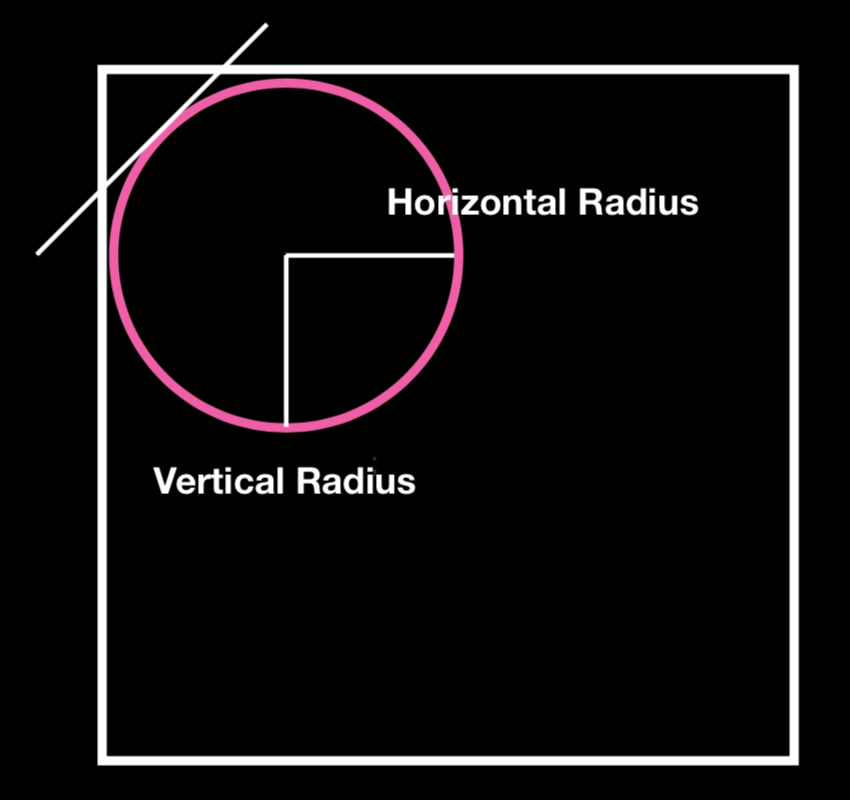
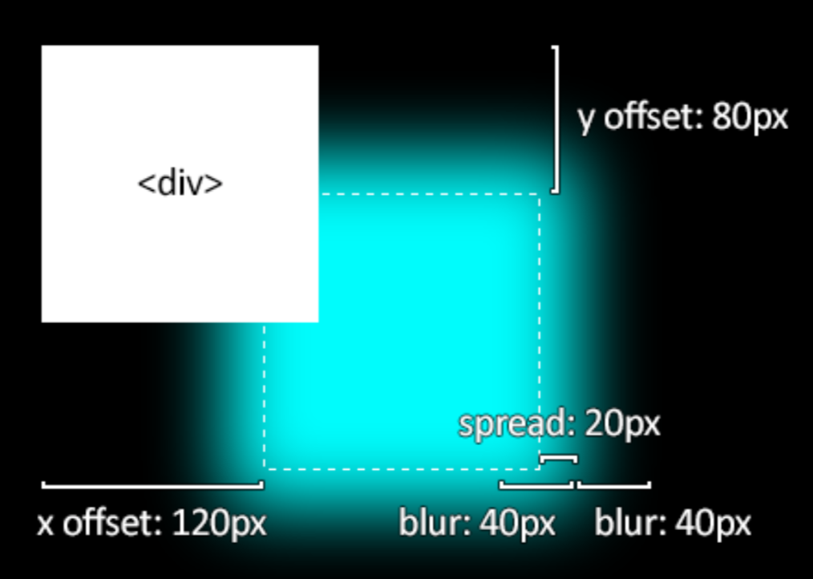
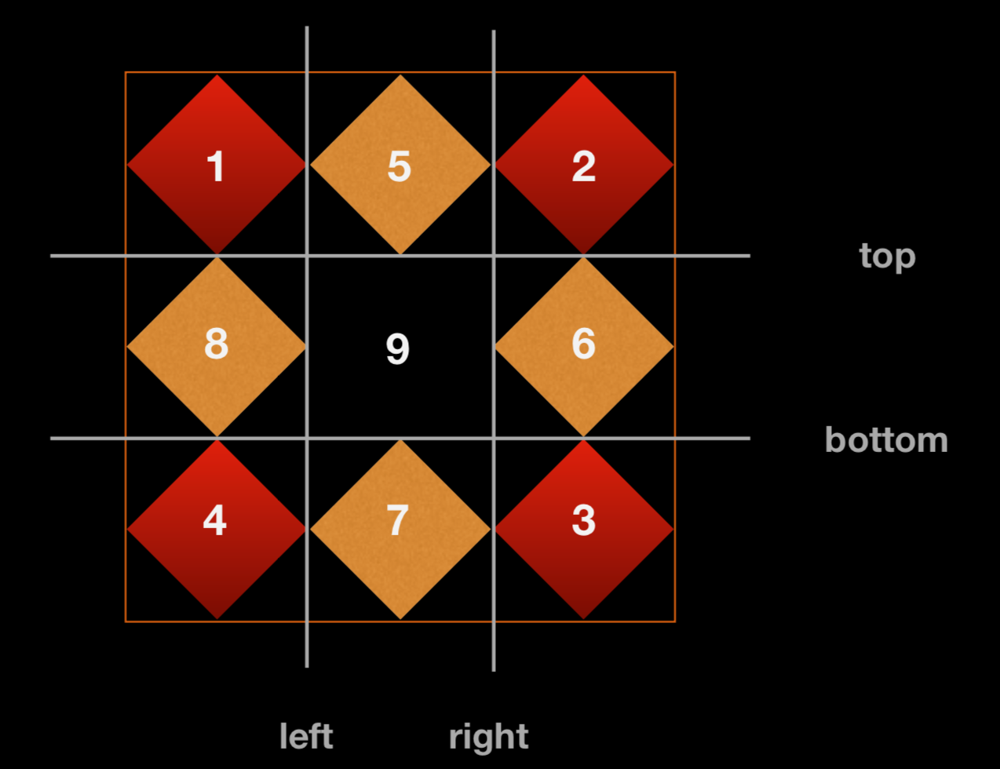
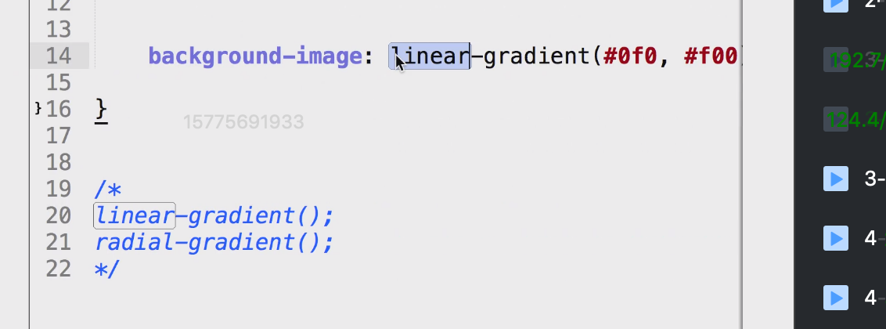
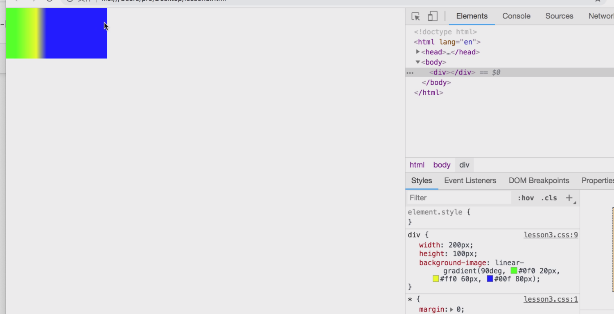
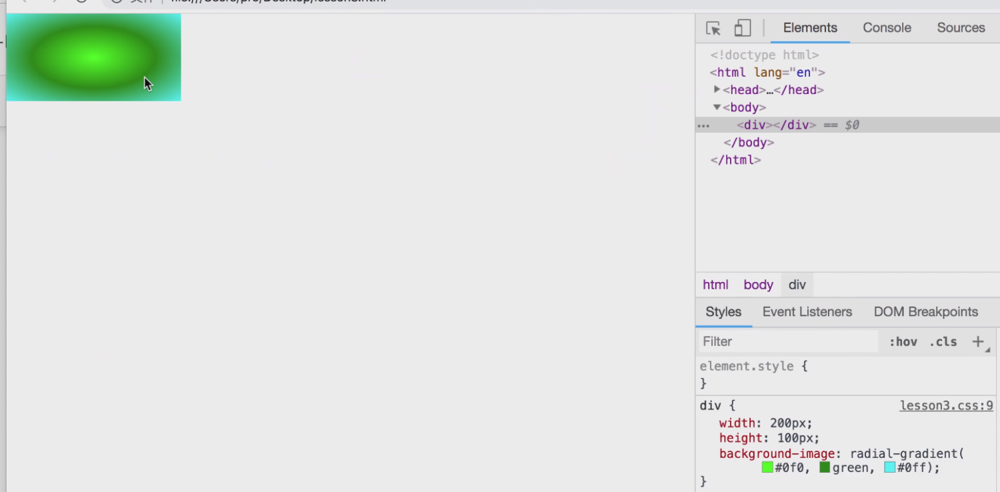
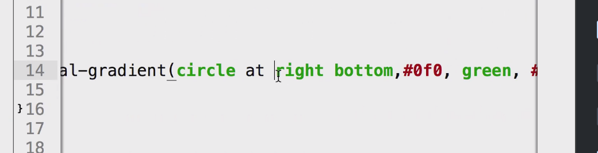

# CSS3 border&background 
# Border

## **border-radius**

**语法**

**说明**

border-radius: 10px;

设置4个角

border-top-left-radius: 10px;

border-top-right-radius: 10px;

border-bottom-right-radius: 10px;

border-bottom-left-radius: 10px;

设置单个圆角，先写上下方向。一个值代表两个方向。

border-top-left-radius: 10px 10px;

border-top-right-radius: 10px 10px;

border-bottom-right-radius: 10px 10px;

border-bottom-left-radius: 10px 10px;

设置单个圆角，先写上下方向。分别设置水平 垂直的圆角半径

border-radius: 10px 20px 30px 40px / 10px 20px 30px 40px;

简写。水平 / 垂直

**原理：**

> 水平、垂直为半径的圆，与边框相切的部分。
> 
> 垂直、水平半径一致，圆；不一致，椭圆。

## 1box-shadow

**语法**

**说明**

**解释**

`box-shadow: inset xOffset  yOffset  blur sqread color;`

内阴影

xOffset  水平偏移量

yOffset  	垂直偏移量

blur  	模糊值，基于边框原来的位置向两边同时模糊

sqread  扩大，在水平、垂直同时增加

color  	阴影颜色

`box-shadow:  xOffset  yOffset  blur sqread color;`

外阴影

**原理：**

**注意：**

> 哪个阴影最先设置，在最上面。
> 
> 阴影在背景上面，在文字在下面。

## 1border-image

**语法**

**说明**

**解释**
`border-image-source`
设置border背景图片，支持渐变色

`border-image-slice`
4根横线分割背景图位置（上 右 下 左）。

 |[border-image-slice , border-image-width , border- image-outset ]

border- image-outset：向外拉伸

border-image-width：默认值为1，设置border-image 里面图片的宽度。

border-image-slice: 10 10 10 10 fill;      上右下左，可填数字（不带px）、百分比；fill 填充内容区。

注意:不填border-image-slice默认值100%。
border-image-repeat

stretch、round、no-repeat、space

传两个参数时，分别代表水平、垂直

**border-image-slice原理：
**

# background

## 1background-image

语法

说明

解释

url()

可填多url()

**案例：**多url

> 多url， 以下样式配合使用

    /* 多url 以下样式配合使用 */background-image: url(eye1.jpg),url(eye2.jpg);
    background-repeat: no-repeat;
    background-size: 400px200px, 400px200px;
    background-position: 00, 400px0;

**案例：**线性渐变

渐变：

线性渐变

    linear-gradient(toright, #0f020px, #ff0);
                                                        颜色的起止位置。
    90deg

放射渐变：

## 1background-origin

**语法**

**说明**

**解释**

background-origin

以什么位置开始

border-box、padding-box（默认值）、content-box 

**注意：**position 相对于origin定位。
background-clip以什么位置截断，以外的内容不显示。
border-box（默认值）、padding-box、content-box、text  

**注意：**text 用文字内容区截取背景图片，文字以外的内容不显示。只在webkit下兼容

background-repeat

repeat-x、repeat-y、round、space、no-repeat background-attachment
改变背景的定位属性。

scroll：默认值，相当于容器定位。

local：相对于容器里内容区定位。

fixed：相对于视口定位。
background-size
前提都是用一张图片来填充背景。

cover：一张图片填充容器，填充满容器，不改变图片比例。可能存在超出的风险

contain：在不改变图片比例的前提下，让容器包含一张完整的图片。可能超出重复的风险

**案例：**文字内容截取背景图片

> text 用文字内容区截取背景图片，文字以外的内容不显示。只在webkit 下兼容。

    font-weight: 1000;
    background-image: url(eye1.jpg);
    -webkit-background-clip: text;
    background-clip: text;
    -webkit-text-fill-color: transparent;