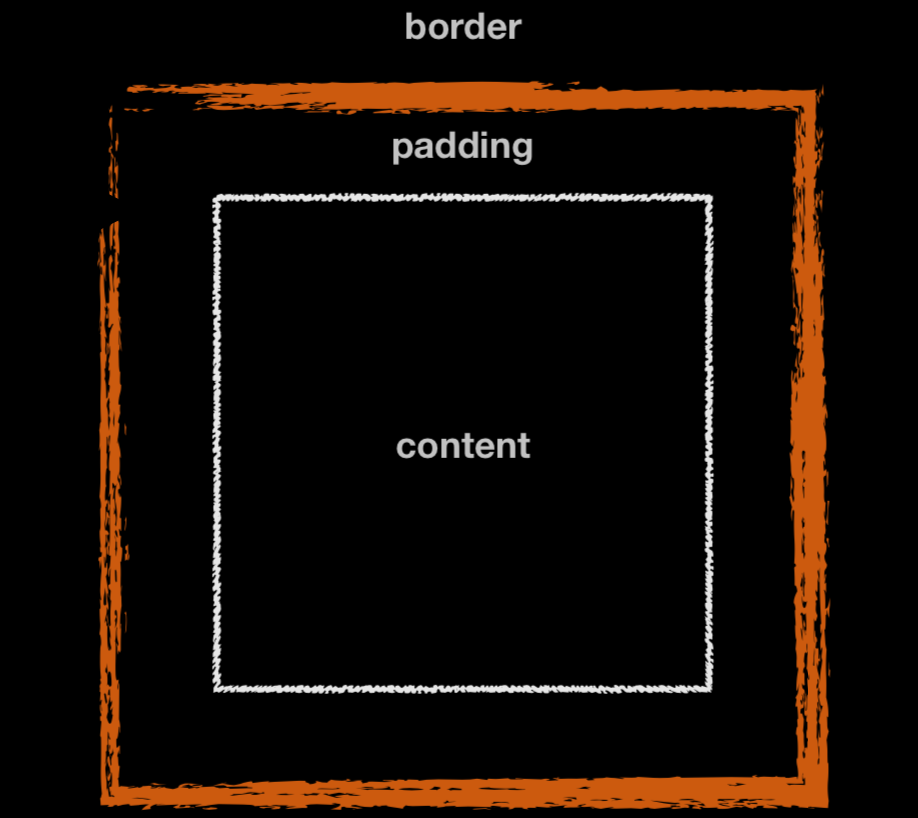

# CSS3 Box 
# Box

## 盒模型

- W3C Standards mode

> `boxWidth = width + padding(2) + border(2)`

- IE 6 Quirks mode

> `boxWidth = width`

**怪异盒模型场景：**

- 场景一：宽度不固定，但是内边距固定
- 场景二：宽度用户自定、后端传入的，但是padding、border固定的

**overflow属性：**

> `visible（默认值）、hidden、scroll、auto`
> 
> 
> 
> 
> overflow-x,overflow-y设置非visible的属性时，另一个方向属性会自动将默认值visible设置为auto。

**resize属性:**

> `both 、horizontal、vertical`
> 必须和overflow一起使用，才生效。

## flex

** flexible Box：**

- 当我们为父盒子设为 flex 布局以后，子元素的 float、clear 和 vertical-align 属性将失效

- flex布局又叫伸缩布局 、弹性布局 、伸缩盒布局 、弹性盒布局 

- 通过给父盒子添加flex属性，来控制子盒子的位置和排列方式

> `display: flex;`

### 父项常见属性 

**属性**

**说明**
flex-direction 
设置主轴的方向， flex 布局中，是分为主轴和侧轴两个方向，同样的叫法有 ： 行和列、x 轴和y 轴

row: 水平

column：垂直

row-reverse

column-reverse

**注意：** 主轴和侧轴是会变化的，就看 `flex-direction`设置谁为主轴，剩下的就是侧轴。而我们的子元素是跟着主轴来排列的
justify-content 
设置主轴上的子元素排列方式

flex-start:

flex-end

center：在主轴居中对齐

space-between：先两边贴边，再平分剩余空间（重要）

space-around：平分剩余空间
flex-wrap
设置子元素是否换行

wrap：换行

nowrap

wrap-reverse
align-content 
设置侧轴上的子元素的排列方式（多行），在单行下是没有效果的

flex-start

flex-end

center

space-between

space-around

stretch：前提：未设置子元素的高度；拉伸子元素
align-items 
设置侧轴上的子元素排列方式（单行），默认值：stretch

stretch：拉伸子元素；前提：未设置子元素的高度；

flex-start

flex-end

center：居中显示

baseline：基于子元素内容的底线对齐
flex-flow 
复合属性，相当于同时设置了 flex-direction 和 flex-wrap

### 子项常见属性

**属性**

**说明**

order

子项的排列顺序（前后顺序）。

默认值0；越小值，越排在前面。

align-self

自己在侧轴的排列方式；优先级大于父级设置的align-items，小于父级设置的align-content。

auto:

stretch：拉伸子元素；前提：未设置子元素的高度；

flex-start

flex-end

center：居中显示

baseline：基于子元素内容的底线对齐

flex

定义子项目分配剩余空间，用flex来表示占多少份数。

默认值 0。

flex-grow：按照设置的比例，瓜分剩余的空间，形成新的宽度

flex-shrink：压缩内容区。默认值：1

flex-basis：覆盖width。默认值：auto，跟width对齐

**flex-shrink****伸缩公式：**

> **加权值：** 元素1内容区的宽度 * shrink  + 元素2内容区的宽度 * shrink + 元素3内容区的宽度 * shrink

> **缩放公式： **多出来的值 * shrink / 加权值

**flex-basis与width：**

> 在不进行伸缩达到前提下。

> 当你没设置width，只写basis或者basis大于width，basis代表元素的最小宽度。内容超过会撑开元素。

> 设置width，并且basis小于width的时候，basis代表最小值， `basis <  realWidht  < width`

**注意：**

> 无论什么情况，被不换行内容撑开的容器，不会被压缩计算。
> 
> 设置basis，当内容区大于basis时，不参与shrink压缩。若需要压缩，设置文本换行：`word-break: break-word;`

### flex场景

- 居中

    .wrapper {
    display: flex;
    justify-content: center;
    align-items: center;
    }

- 可动态增加的导航栏

> 需求：菜单项不固定，等分导航栏

    .wrapper {
    display: flex;
    }
    .con {
    flex: 11auto;
    }

- 等分布局

    .con {
    flex: 11auto;
    }

- 固定、自适应

    // 父级
    .wrapper {
    resize: both;
    overflow: hidden;;
    display: flex;
    width: 400px;
    height: 100px;
    border: 1pxsolid#f10;
    }
    // 自适应
    .con {
    flex: 11auto;
    border: 1pxsolid#f10;
    }
    // 固定
    .fix {
    flex: 00auto;
    width: 200px;
    }

- 圣杯布局

> 垂直三栏：上下20%，中间自适应
> 
> 左右三栏：左右20%，中间自适应

    <!DOCTYPEhtml>
    <htmllang="en">
    <head>
        <metacharset="UTF-8">
        <metaname="viewport"content="width=device-width, initial-scale=1.0">
        <title>可动态增加的导航栏</title>
        
    </head>
    <body>
        <divclass="wrapper">
            <divclass="header">header

            <divclass="contain">
                <divclass="left">left

                <divclass="center">center

                <divclass="right">right

            

            <divclass="footer">footer

        

    </body>
    </html>

- 流式布局

    .wrapper {
    display: flex;
    flex-wrap: wrap;
    align-content: flex-start;
    }