# CSS3 transition & animation 
# transition

## transition 

> 过渡动画。

**取值**

**解释**
transition-property 检索或设置对象中的参与过渡的属性 transition-duration 检索或设置对象过渡的持续时间 transition-timing-function
检索或设置对象中过渡的动画类型
transition-delay检索或设置对象延迟过渡的时间

- 缩写

    transition: all.5sease-in.1s;

- 拆分

    transition-property:all;
    transition-duration: .5s;
    transition-timing-function: ease-in;
    transition-delay: .1s;

## transition-timing-function

**3次贝塞尔曲线：**

- 取值

> linear：线性过渡。等同于贝塞尔曲线(0.0, 0.0, 1.0, 1.0)
> 
> ease：平滑过渡。等同于贝塞尔曲线(0.25, 0.1, 0.25, 1.0)
> 
> ease-in：由慢到快。等同于贝塞尔曲线(0.42, 0, 1.0, 1.0)
> 
> ease-out：由快到慢。等同于贝塞尔曲线(0, 0, 0.58, 1.0)
> 
> ease-in-out：由慢到快再到慢。等同于贝塞尔曲线(0.42, 0, 0.58, 1.0)

- 3次贝塞尔曲线 

> 描述一种运动状态。
> 
> cubic-bezier(<number>, <number>, <number>, <number>)：特定的贝塞尔曲线类型，4个数值需在[0, 1]区间内。
> 
> 用法：`cubic-bezier(P1x, P1y, P2x, P2y);`  （P1，P2是控制点）
> 
> 公式：`Cubic-bezier B(t) = P₀(1 - t)³ + 3P₁t(1 - t)² + 3P₂t²(1 - t) + P₃t³ ,t ∈ [0,1]`
> 
>     至少两个点，P0：起点，P3：终点；P1、P2是控制点，只控制方向（斜率）

- 自定义运动状态 

     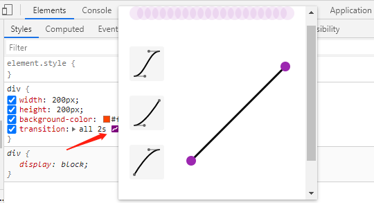

- 注意 

> n次贝塞尔曲线有n-1个控制点；
> 
> 总点：n + 1个点

**steps：**

- 取值

> step-start：等同于 steps(1, start)
> 
> step-end：等同于 steps(1, end)
> 
> steps(<integer>[, [ start | end ] ]?)：接受两个参数的步进函数。
> 
> 第一个参数必须为正整数，指定函数的步数（每一帧执行的步数）。第二个参数取值可以是start或end，指定每一步的值发生变化的时间点。第二个参数是可选的，默认值为end。
> 
> end：保留当前帧状态，直到这段动画时间结束
> 
> start：保留下一帧状态，直到这段动画时间结束

- 第二个参数的区别

    .demo1 {
    animation: run4ssteps(1, start); 
    }
    .demo2 {
    animation: run4ssteps(1, end); 
    }

- 弥补最后一帧看不到的缺陷

    .demo2 {
    animation: run4ssteps(1, end) forwards; 
    }

# animation

多状态改变的动画。

**animation：**

属性描述[animation](http://css.doyoe.com/properties/animation/animation.htm)复合属性。检索或设置对象所应用的动画特效[animation-name](http://css.doyoe.com/properties/animation/animation-name.htm)
检索或设置对象所应用的动画名称。

`@keyframes 动画名称 {}`
[animation-duration](http://css.doyoe.com/properties/animation/animation-duration.htm)
检索或设置对象动画的持续时间

[animation-timing-function](http://css.doyoe.com/properties/animation/animation-timing-function.htm)
检索或设置对象动画的过渡类型，每一段的运动状态

[animation-delay](http://css.doyoe.com/properties/animation/animation-delay.htm)检索或设置对象动画延迟的时间[animation-iteration-count](http://css.doyoe.com/properties/animation/animation-iteration-count.htm)
检索或设置对象动画的循环次数

infinite：无限循环

[<number>](http://css.doyoe.com/values/numeric/number.htm)：指定对象动画的具体循环次数
[animation-direction](http://css.doyoe.com/properties/animation/animation-direction.htm)
检索或设置对象动画在循环中是否反向运动

normal：正常方向

reverse：反方向运行

alternate：动画先正常运行再反方向运行，并持续交替运行

alternate-reverse：动画先反运行再正方向运行，并持续交替运行
[animation-play-state](http://css.doyoe.com/properties/animation/animation-play-state.htm)
检索或设置对象动画的状态

running：运动

paused：暂停
[animation-fill-mode](http://css.doyoe.com/properties/animation/animation-fill-mode.htm)
检索或设置对象动画时间之外的状态

none：默认值。不设置对象动画之外的状态

forwards：设置对象状态为动画结束时（最后一帧）的状态

backwards：设置对象状态为动画开始时（第一帧）的状态

both：设置对象状态为动画结束或开始的状态

- `@keyframes`

> 关键帧状态用%表示。0%，可用from；100%， 可用to。

    @keyframesrun {
    0% {
      }
    50% {
      }
    100%  {}
    }

**案例：**

**打字效果**

**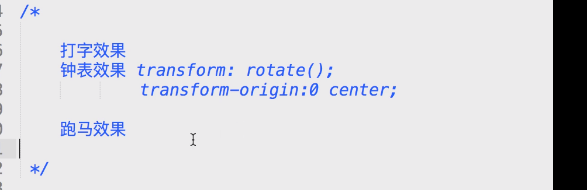**

**
**

**逐帧动画**

**
**

# transform

## rotate()

- `rotate()`

> 参照物：被设置的元素。
> 
> 注意：旋转后，坐标轴也跟着变化。注意旋转顺序。

- `transform-orign`

> 变换中心，是给transform设置的。共用一个transform。
> 
> 空间的变换中心：`transform-origin: 100px 100px 100px;`
> 
> 百分比、方位名词、像素。

**浏览器坐标系：**

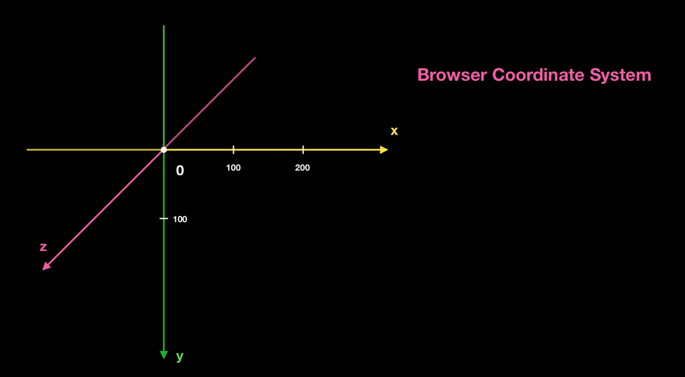

## rotate3d()

- 矢量方向

> `transform: rotate3d(x, y, z, angle);`
> 
> x,y,z 确定空间的矢量值。 数值不重要，比值很重要。
> 
> 设置的矢量方向，作为接下来旋转的轴。以该轴旋转angle 角度。

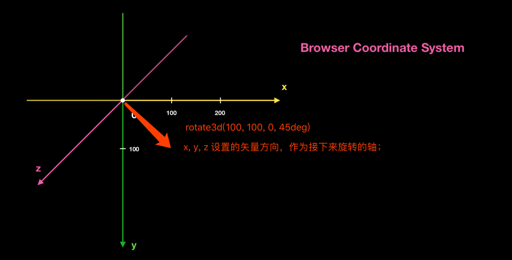

## scale()

> 伸缩的是此元素的变化坐标轴的刻度。
> 
> 可进行叠加操作。
> 
> 伸缩轴随着旋转改变。

    scale(x, y);
    scalex();
    scaley();
    scalez();
    scale3d();

## skew()

> 倾斜坐标轴。刻度肯定被拉伸了。
> 
> x 倾斜y轴，y 值倾斜x轴。

    skew(x, y);
    skewx();
    skewy();

## translate()

> 参考自身。

    translate(x, y);
    translatex();
    translatey();
    translatez();
    translate3d();

- 自身宽高不确定，居中

    left: 50%;
    top: 50%;
    transform: translate(-50%, -50%);

## perspective()

> `transform: perspective(800px);`   在元素自身上加一双眼睛。
> 
> 注意：写在最前面。不能设置perspective-origin 。默认是center center。

## matrix

transform的一系列属性值：`rotate() scale() translate() skew()`； 底层都是通过matrix实现。

矩阵就是transfrom 选中的计算规则。

**矩阵的乘法：**

- 规则

> 矩阵满足相乘条件：第一个矩阵的列数等于第二个矩阵的行数；第二个矩阵有多少列，结果就有多少列。
> 
> 第一个矩阵的行乘以第二个矩阵的列中的相同位置的行，生成结果。
> 
> 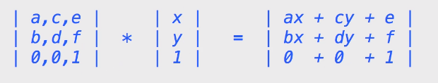

**平面变换的矩阵基础：**

`a,c,e,b,d,f` 是选填的值；`x,y` 是变换位置的元素的原始坐标。

得到的结果也是矩阵，是元素最终的坐标位置。

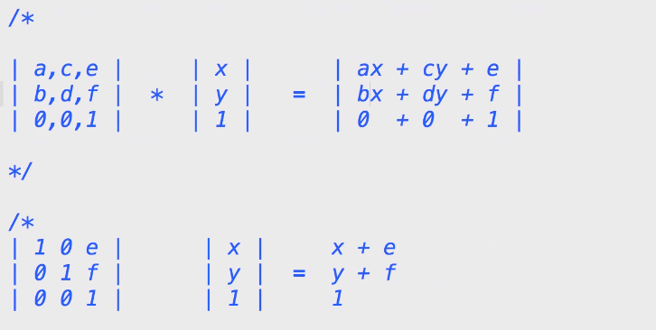

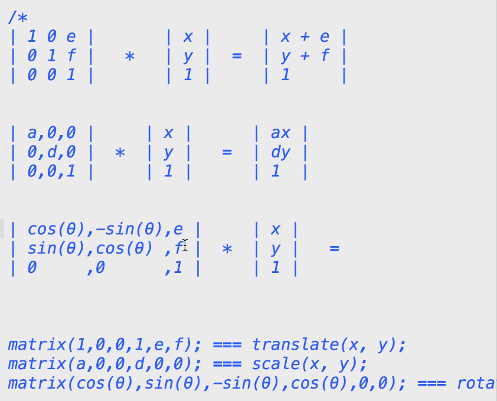

3d 

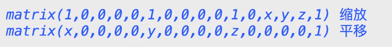

案例：镜像

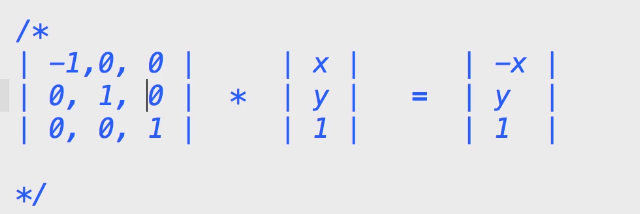

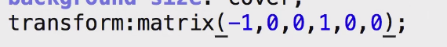

# 4 perspective

- 设置景深

> `perspective: 800px;`     眼镜离屏幕的距离。  给父级设置，子集受影响。景深可叠加。
> 
> `perspective-origin: 300px 300px;`       控制角度

- 投影大小

> 我们看到的结果都是元素在屏幕上的投影。

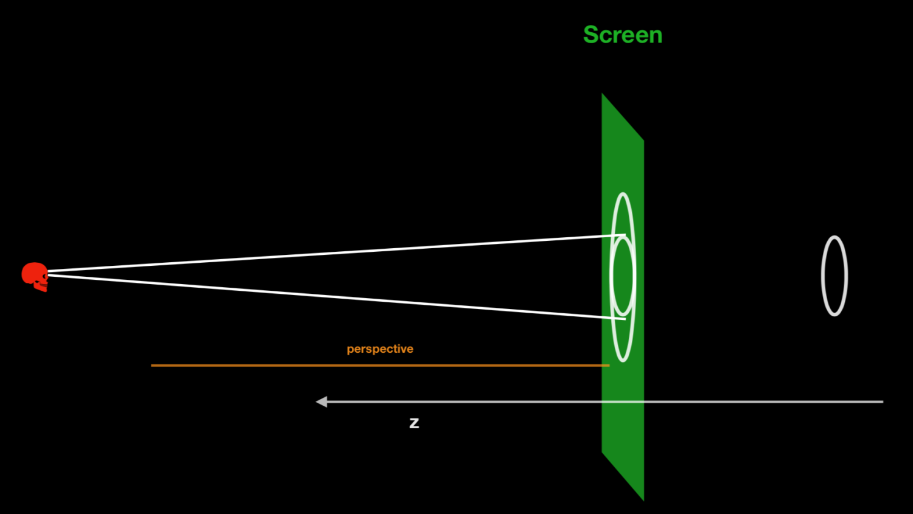

> 问题1：没有translateZ时，无论perspective 距离屏幕多远，投影的大小不变。
> 
> 问题2：translate 为负值时， perspective 值越小，投影越小。

- 保持3d状态

> `transform-style: preseve-3d;`   在直接父级上添加。

- 注意

> 设置了`perspective: 800px;  transform-style: preserve-3d;` 其中一个，这个元素就变成了定位的参照物元素。