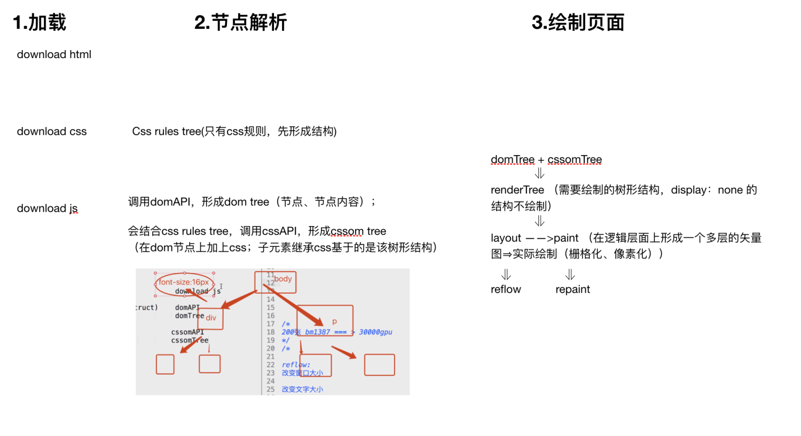
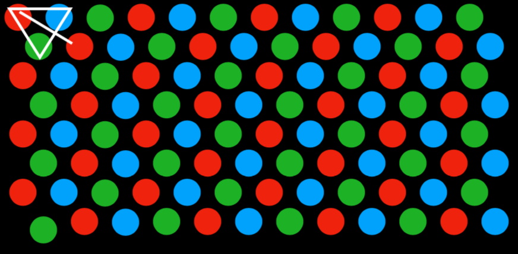
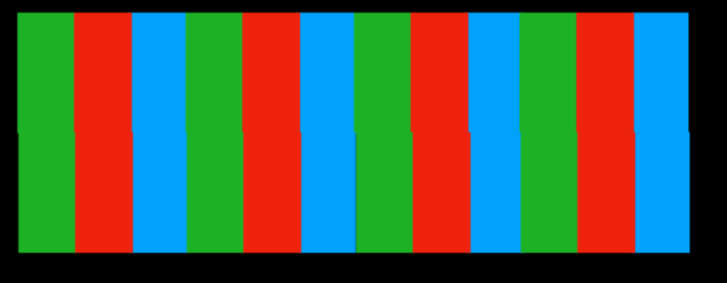
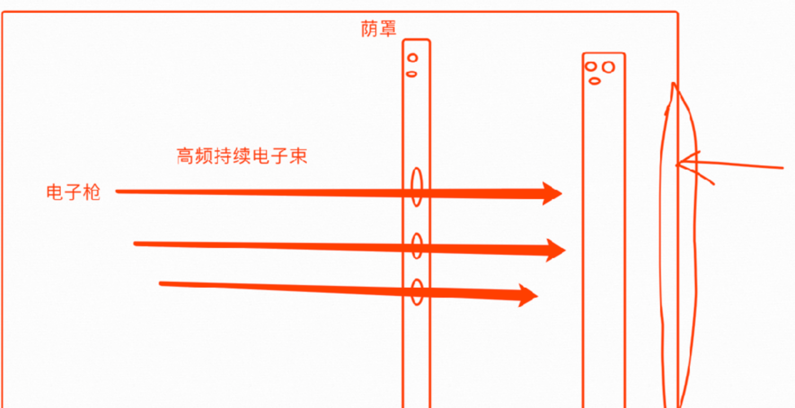
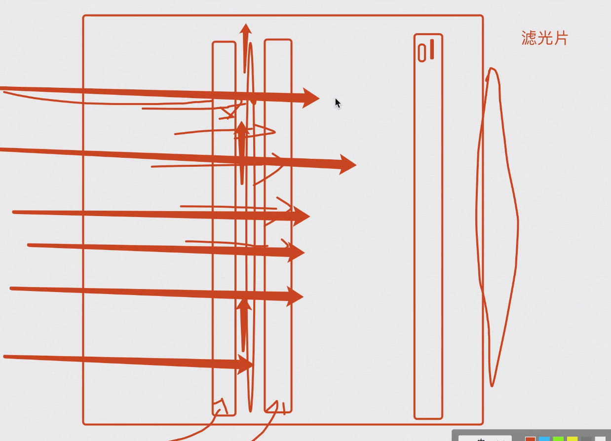
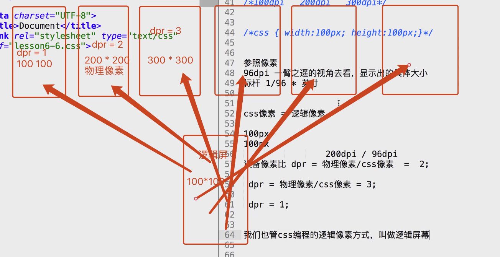

# CSS3 screen 
# 性能优化

## 浏览器渲染顺序

    reflow:
    改变窗口大小
    改变文字大小
    内容的改变，输入框输入文字
    激活伪类，如:hover操作class属性
    脚本操作DOM计算offsetWidth和offsetHeight设置style属性
    repaint：
    repaint：如果只是改变某个元素的背景色、
    文 字颜色、边框颜色，不影响它周围或内部布局的属性
    repaintrepaint 速度快于 reflow

## c3优化

**标准的gpu加速方法：**

> `will-change` 属性
> 
> `will-change: tranform;` 提前告诉浏览器，单独起一层。

- 案例

    div {
    width: 100px;
    height: 100px;
    }
    div:hover {
    will-change: transform;
    }
    div:active {
    transform: scale(2,3);
    }

# 显示器的成像原理

## 成像原理

**像素：**

1个像素由3个像点排列（红、绿、蓝）。

**空间混色法：**

> 像点的排列方式。

- 点状排列

- 柱状排列

**成像原理：**

- crt显示屏

> 电子枪打出电子束，打到屏幕上。
> 
> 屏幕上有荧光粉（红、绿、蓝），接收到电子束，会被点亮。持续接收到就持续亮。
> 
> 荧光粉的排列方式就是像点的排列方式。根据电子束强弱的不同，每个被点亮的荧光的颜色强弱不同，混合出不同的颜色，形成一个像素点。那么多个像素点就成像了。
> 
> 
> 
> 
> 单枪3束，单枪1束。
> 
> 荫罩层：和荧光粉的位置相对应。矫正电子束。
> 
> 

- lcd液晶屏

> 液晶材料：能变成固态、液态，非常细腻的受控。
> 
> 滤光片（红、绿、蓝）

## 2.1 像素

**像素：**

> 相对单位

**物理像素：**

> 设备出厂时，像素的大小。
> 
> dpi： 1英寸所能容纳的像素点束。 1 in = 2.54cm。

> 96dpi 约等于 2.54 / 100 = 0.25 mm；200 dpi 约等于 0.15mm。

**参照像素：**

> css像素、逻辑像素。  100px。

> 96dpi 一臂的视角去看，显示出的具体大小；标杆： 1/96 * 英寸

**物理像素比：**

> `dpr = 物理像素  / css像素`​

**参考像素转换为实际像素：**

> 操作系统会根据 dpr 转换成物理像素

> 100dpi 放到 200dpi 屏幕显示：(2*100px)   *  (2*100px )

**怎么区分屏幕好坏？**

> 分辨率：固定宽高下，展示的像素点数。

> 屏幕好不好，不看分辨率；看dpi 。