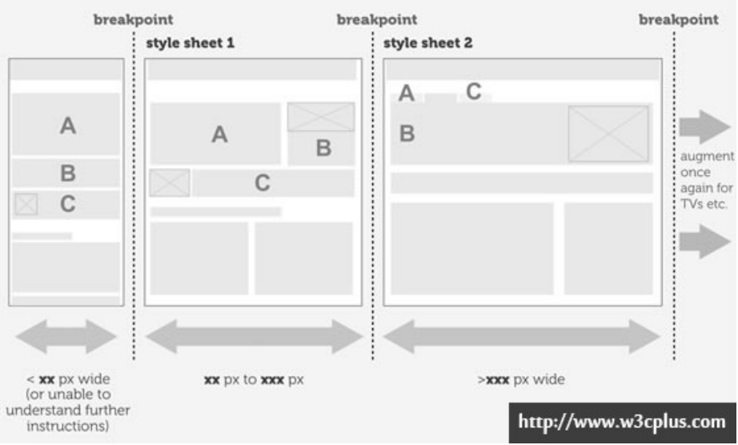

# CSS3响应式布局 
# 响应式设计

**如何使页面在不同的设备上展示的效果相同的？**

> - 以前
> 
> 
> 不同的设备 开发不同的页面  
> 
> - 现在
> 
> 
> 只需要开发一套页面 让用户在不同的设备（大小或者分辨率如何变化）上看到的页面呈现效果是完美的。

**响应式网页设计：**

> 称为自适应网页设计或称为回应式网页设计/对应式网页设计，是一种网页设计的技术做法，该设计可使网站在不同的设备（从桌面计算机显示器到移动电话或其他移动产品设备）上浏览时对应不同分辨率皆有适合的呈现，减少用户进行缩放，平移和滚动等操作行为。
> 
> 
> 
> 
> 真正的响应式设计方法不仅仅是根据可视区域大小而改变网页布局，而是要从整体上颠覆当前网页的设计方法，是针对任意设备的网页内容进行完美布局的一种显示机制。
> 
> 
> 
> 
> 用一套代码解决几乎所有设备的页面展示问题。
> 
> 
> 
> 
> 设计工作由产品经理或者美工来出。

**meta视口标签****：**

> 将页面大小根据分辨率不同进行相应的调节，以展示给用户的大小感觉上差不多。

    // device-width：默认980px，initial-scale：缩放比
    <metaname="viewport"content="width=device-width, initial-scale=1.0">

- 属性

width
可视区宽度
device-width设备宽度minimum-scale
最小缩放比
maximum-scale
最大缩放比
user-scalable是否允许用户缩放

# 响应式布局实现

## 响应式开发

**响应式网页开发方法？**

> 1. 流体网格：可伸缩的网格 （大小宽高  都是可伸缩（可用flex或者百分比来控制大小）float）---》 布局上面 元素大小不固定可伸缩
> 
> 
> 
> 
> 2. 弹性图片：图片宽高不固定（可设置min-width: 100%）
> 
> 
> 
> 
> 3. 媒体查询：让网页在不同的终端上面展示效果相同（用户体验相同让用户用着更爽） 在不同的设备（大小不同 分辨率不同）上面均展示合适的页面
> 
> 
> 
> 
> 主要断点： 设备宽度的临界点 
> 
> 大小的区别 ---》 宽度不同   ---》 根据不同宽度展示不同的样式
> 
> 
> 
> 4. 响应式网页开发主要是在css样式上面进行操作

**主要断点:**

> 在临界点的左右显示不一样。

## 2.2 媒体查询

**媒体查询：**

> 媒体查询是向不同设备提供不同样式的一种方式，它为每种类型的用户提供了最佳的体验。
> 
> 
> 
> 
> css2: media typemedia type(媒体类型)是css 2中的一个非常有用的属性，通过media type我们可以对不同的设备指定特定的样式，从而实现更丰富的界面。 
> 
> 
> 
> 
> css3: media querymedia query是CSS3对media type的增强，事实上我们可以将media query看成是media type+css属性(媒体特性Media features)判断。 

**
**

**易混淆的宽度：**

> device-width/device-height 是设备的宽度（如电脑手机的宽度 不是浏览器的宽度）

> 

> width/height使用documentElement.clientWidth/Height即viewport的值。渲染宽度/高度

> 视口宽度/高度

## 相对单位

    Rem：rem是CSS3新增的一个相对单位（rootem，根em）相对的只是HTML根元素。
    Em：em是相对长度单位。相对于当前对象内文本的字体尺寸。如当前对行内文本的字体尺寸未被人为设置，则相对于浏览器的默认字体尺寸。
    Px： px像素（Pixel）。相对长度单位。像素px是相对于显示器屏幕分辨率而言的。
    Vw：相对于视口的宽度。视口被均分为100单位的vwVh：相对于视口的高度。视口被均分为100单位的vhVmax： 相对于视口的宽度或高度中较大的那个。其中最大的那个被均分为100单位的vmaxVmin：相对于视口的宽度或高度中较小的那个。其中最小的那个被均分为100单位的vmin

**响应式设计是最佳选择吗？ **

    不是的，内容设计胡问题都可以通过响应式设计思路解决， 项目的预算，目标用户以及定位决定了其实现方式。
    项目的预算，人力，物力，财力， 时间成本
    目标用户，
    产品定位
    渐进增强 ---》  iphone6 向上兼容  兼容最新设备   
    优雅降级 ---》  开发通用版本  再兼容老版本   向下兼容
    先移动端  ---》 pc端
    先iphone6为初始原型 开发  ---》 兼容其他的设备  ====》 渐进增强

# 