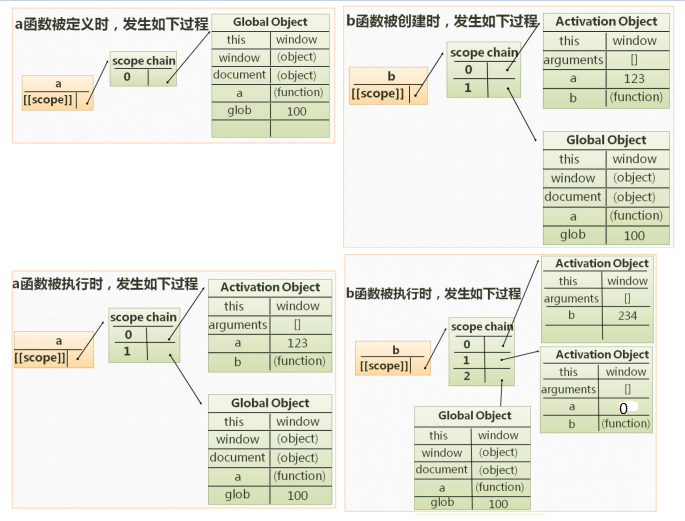
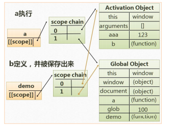

# 
# 作用域精解

## 作用域

**[[scope]]:**

- 每个** javascript 函数**都是一个对象，对象中有些属性我们可以访问，但有些 不可以，这些属性仅供 javascript 引擎存取，`[[scope]]`就是其中一个隐式属性。
- 指的就是我们所说的作用域
- 存的是函数生成的作用域（**运行期上下文的集合**）

**作用域链：**

- [[scope]]中所存储的执行期上下文对象的集合，这个集合呈链式链接，我 们把这种链式链接叫做作用域链。 

**运行期上下文:**

- 当函数在执行的前一刻，会创建一个称为执行期上下文的内部对象。 
- 一个执行期上下文定义了一个函数执行时的环境，函数每次执行时对应的执行上下文都是独一无二的，所以多次调用一个函数会导致创建多个执行上下文，当函数执 行完毕，执行上下文被销毁 

**查找变量：**

- 在哪个函数里面查找变量，就从哪个函数作用域链的顶端依次向下查找。 

函数类对象，我们能访问 `test.name,test.[[scope]]`隐式属性——作用域

- 案例

    function test (){
    }
    第一次执行 test(); → AO{} //AO 是用完就不要的
    第二次执行 test(); → AO{} //这是另外的 AO

## 案例

### 案例1

        

**图解：**

0 是最顶端，1 是次顶端，查找顺序是从最顶端往下查。

### 案例2

        

**理解过程：**

    a 被定义 a.[[scope]] → 0 : GO{}
    a 被执行 a.[[scope]] → 0 : aAO{}
    											1 : GO{}
    
    b 被定义 b.[[scope]] → 0 : aAO{}
     											1 : GO{}
    b 被执行 b.[[scope]] → 0 : bAO{}
                          1 : aAO{}
                          2 : GO{}
    
    c 被定义 c.[[scope]] → 0 : bAO{}
                          1 : aAO{}
                          2 : GO{}
    c 被执行 c.[[scope]] → 0 : cAO{}
                          1 : bAO{}
                          2 : aAO{}
                          3 : GO{}
    
    当 c 执行完后，会干掉自己的 cAO，回到 c 被定义的状态，当 c 再被执行时，会生
    成一个新的 newcAO{}，其余都一样，因为基础都是 c 的被定义状态
    c 被执行 c.[[scope]] → 0 : newcAO{}
                          1 : bAO{}
                          2 : aAO{}
                          3 : GO{}
    
    如果 function a 不被执行，下面的 function b 和 function c 都是看不到的（也不会被执行，被折叠）。
    只有 function a 被执行，才能执行 function a 里面的内容a();不执行，根本看不到 function a (){}里面的内容

# 闭包

当**内部函数被保存到外部时**，将会生成闭包。闭包会导致原有作用域链不释放，造成内存泄露。

内存泄漏就是内存占用，内存被占用的越多，内存就变得越来越少了，就像内存被 泄露了一样。

## 案例

### 案例1 

        

因为没有 b();此时 b 还是被定义的状态，和 a 执行的状态是一样的。

function a(){} 是在 return b 之后才执行完，才销毁。return b 让 a 执行时的 AO 被保存在外面。

return b 是把 b（包括 a 的 AO）保存到了外部（放在全局）， 当 a 执行完砍掉自己的 AO 时，b 依然可以访问到 a 的 AO(因为 return b) ，但凡是**内部的函数被保存到外部**，一定生成闭包。

### 案例2

        

**理解过程：**

    理解过程
    a 被执行 0 : a AO: num = 100;
            1 : GO: demo = a();
    
    b 被执行 0 : bAO :
            1 : aAO : num = 100;
            2 : GO: demo = a();

​    
    在第一次执行 function b 时，num ++就把 aAO 变成{num : 101}，当 function b 执行完
    毕时，剪断的是 bAO，而 aAO 不变，当执行 function a 的 return b 时就把 aAO,GO 都存在了外部，执行完 a 销毁 scope 时去掉 a 的连接线，但是因为 return b 把 aAO,GO
    存在了外部，所以依然还是可以访问值
    在第二次执行 function b 时，aAO{num : 101}，在 num ++就是 102

### 案例3

        

**过程：**

    执行过程：
    先执行 function a(){ var aa = 345;function b (){}b();}
    想要执行完上面的 b();就需要执行完 function b(){var bb = 234; function c(){}c();}，
    想要执行 c();就要先执行完 function c(){var cc =123;},
    b();是一个复合语句，执行完 b 里面的每一句话，才能执行 b();
    
    销毁顺序：
    哪个先被执行完，哪个先被销毁
    当 c 执行完，先销毁 c 自己的执行期的上下文，
    当 c();执行完，那么 b 也执行完了，就销毁 b 的执行期上下文；
    当 b();执行完，那么 a 也执行完了，就销毁 a 的执行期上下文

## 闭包的作用

### 实现公有变量

**案例：**函数累加器

        

### 可以做缓存

缓存是外部不可见的，但是确实有存储结构

        

**过程：**

    答案 101 和 100，
    思考过程：说明两个用的是一个 AO
    test  defined test[[scope]] 0：GO
    test doing test[[scope]] 0：testAO
     												 1：GO
                             
    a defined a.[[scope]] 0 : testAO
     											1 : GO
                          
    b defined b.[[scope]] 0 : testAO
                          1 : GO
     
    return[a, b]将 a 和 b 同时被定义的状态被保存出来了。
    
    当执行 myArr[0]();时
    a doing a.[[scope]] 0 : aAO
                       1 : testAO
                       2 : GO
                       
    当执行 myArr[1]();时
    b doing b.[[scope]] 0 : bAO
                       1 : a 运行后的 testAO
                       2 : GO
                       
    a 运行后的 testAO， 与 a doing 里面的 testAO 一模一样
    a 和 b 连线的都是 test 环境，对应的一个闭包
    function a 和 function b 是并列的，不过因为 function a 在前，所以先执行 num ++，在
    执行 num --
    
    myArr[0]是数组第一位的意思，即 a，myArr[0]();就是执行函数 a 的意思；
    myArr[1]是数组第二位的意思，即 b，myArr[1](); 就是执行函数 b 的意思

**案例：**缓存的应用，对象里面可以用属性和方法

        
    
    答案 i am eating banana，eat 和 push 操作的是同一个 food
    在 function eater(){里面的 food}就相当于一个隐式存储的机构
    obj 对象里面是可以有 function 方法的,也可以有属性，方法就是函数的表现形式

### 可以实现封装，属性私有化。 eg: Person(); 

### 模块化开发，防止污染全局变量

## 闭包的防范

闭包会导致多个执行函数共用一个公有变量，如果不是特殊需要，应尽量防止这种 情况发生。

# 立即执行函数

## 定义

此类函数没有声明，在一次执行过后即释放（被销毁）。适合做初始化工作。 针对初始化功能的函数：只想让它执行一次的函数 立即执行的函数也有参数，也有返回值，有预编译。

    例(function (){ //写成(function abc(){}())也调用不到
      var a = 123;
      var b = 234;
      console.log(a + b);
    }())
    
    例(function (a, b, c){
       console.log(a + b + c * 2);
    }(1, 2, 3))这一行里面的(1,2,3)是实参
    
    例 var num = (function (a, b, c){
      var d = a + b + c * 2 – 2;
      return d;
    }(1, 2, 3))
    答案 num = 7

**立即执行函数的两种写法： **

- `(function (){}());`     //在 W3C 建议使用这一种 
- `(function (){})();`    只有表达式才能被执行符号执行 

**注意：**

- 能被执行符号执行的表达式，这个函数的名字就会被自动忽略（放弃名字）
- 能被执行符号执行的表达式基本上就是立即执行函数 
- 函数声明和函数表达式是两个东西，虽然都能定义函数 
- 函数声明：`function test ( ){}` 函数表达式：`var test = function( ){}`

## 案例

### 案例1

    例 function (){
     var a = 123;
    }()
    答案这是函数声明，不能执行，报语法错误，因为只有表达式才能被执行符号执行

​    
    例 function test(){
     console.log(‘a’);
    }
    答案这也是函数声明
    test();
    答案 test()；就是表达式，所以能执行

​    
    例 var test = function (){
     console.log(‘a’);
    }()
    答案这是表达式，可以被执行，此时在控制台执行 test 的结果是 undefined，这个函
    数的名字就会被放弃

​    
    例+ function test(){
     console.log(‘a’);
    }()
    答案加了个“正“，在趋势上要把他转换成数字，就是表达式了，既然是表达式就
    能被执行，就会放弃名字，此时 console.log (test)，就会报错；这就是立即执行函数
    同样放了正号，负号，！就会放弃函数名字，转换成表达式；但是*和/不行，&&||前
    面放东西也行

​    
​    
    例 var test = function (){}
    其中= function (){}把 function 赋到 test 里面去叫表达式，var test 是声明
    在执行时，会放弃这个函数，储存到 test 里面储存引用，让这个 test 恢复到被声明的
    状态
    
    例(function test(){console.log(‘a’);})()
    这个被()包起来的 function 函数声明变表达式了，就能被外面的最后的()执行
    
    例(function test(){console.log(‘a’);} ())
    最外面的大括号是数学运算符号，是最先被执行，其余的括号都是有语法意义的，
    就把函数变表达式了
    ()也是数学执行符，能打印 a，但是执行 test 就报错，所以干脆就不写 test
    
    例 function test (a, b, c, d){
     console.log(a + b + c + d);
    }(1, 2, 3, 4); //写成(1)也是这种效果
    理论上不能执行，只写()就会被当成执行符，但是(1, 2, 3, 4);这样写暂时不会当成运
    算符，没意义，但是不会执行，也不报错。还能调用 test                    

### 案例2

例：先定义一个 10 位数的数组，就是在 `var arr[i] = function () {document.write(i + " ");}` 返回数组。

循环执行每个函数。

        
    
    答案 10 10 10 10 10 10 10 10 10 10
    第二个 for 是为了打印这个数组，麻烦写法 myArr[0](); myArr[1](); 。。。myArr[9]();
    过程 for (var i = 0; i < 10; i ++){}执行了十次，产生了十个彼此独立的函数。并且把这
    十个函数放在数组里面去，还把数组返回了，这十个函数和 test 一起产生了一个闭
    包。
    既然是闭包，那么访问 test 里面的变量时，实际上访问的是同一套，而 test 产生了
    arr 和 i 变量（写在 for 循环里面的 i 变量），而这十个函数在外边要访问 i 变量，其实
    访问的是同一个 i。
    什么时候访问的？在 test 执行完以后，在下面 for(j)访问的
    第一个 i=0，转到 9 的时候，i ++变 10 终止 for 循环，结束的时候 i=10，结束之后把
    return arr 返回，arr；
    这十个函数都是为了打印 i 的，在外部访问 i 的时候 i=10，所以打印的是 10
    arr[i] = function () {
     document.write( i + “ ”);
    }
                    
    理解过程：在这个函数体中，当 arr[0] 时，document.write(i)的 i 是不变的，还是 i，
    等函数保存到外部之后，等执行的时候，才会去找 i 的值。
    这个赋值语句中，arr[0] = 函数;把一个函数体或者说是一个函数引用赋给数组的当前
    位，数组的当前位需要马上被索取出来的（数组现在是当前第几位，我们是知道的，
    因为这个是执行语句），当 for(var i = 0)时，arr[i]会变成 arr[0]，但是这个 i 跟函数体
    里面的 d.w(i+“”）里面的 i 是没有关系的，因为函数体 function(){}不是现在执行，
    不会在意函数里面写的是什么，不是现在执行那么里面的 document.write 不会变成现
    实的值，不是现在执行就是函数引用（函数引用就是被折叠起来的，系统不知道里
    面写的是什么）
    在执行 myArr[j]();的时候，系统才会读 document.write(i +””)里面的语句
    在定义函数的时候是不看里面的，在执行的时候才看  

### 案例3

例：我们让上面这个变成打印 0,1,2,3,4,5,6,7,8,9，用立即执行函数解决。

        
    
    理解过程：相当于在 for 循环里面有十个立即执行函数 function(j){}
    在第一圈 i 是 0，j 也是 0，function(){document.write( j + “ ”)}拿着 j=0，进行循环
    的第二圈 i 是 1，又有了一个新的 j 是 1，反复循环
    形成了十个立即执行函数，有十个 j 对应