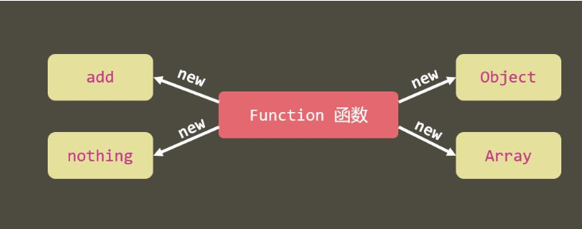
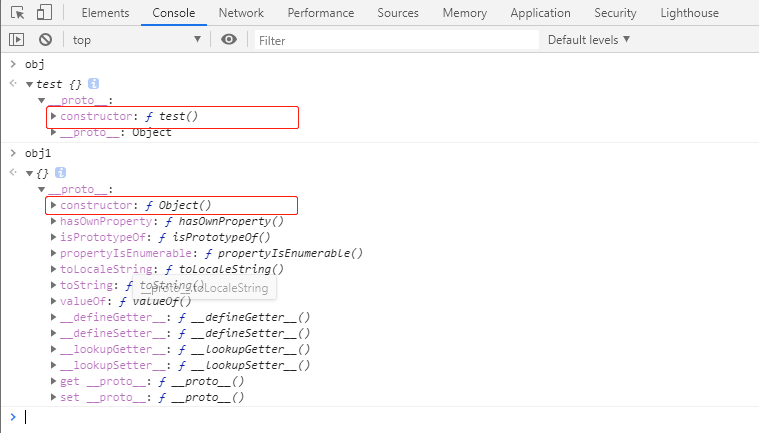
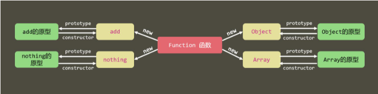
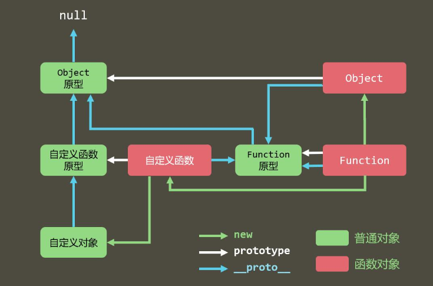
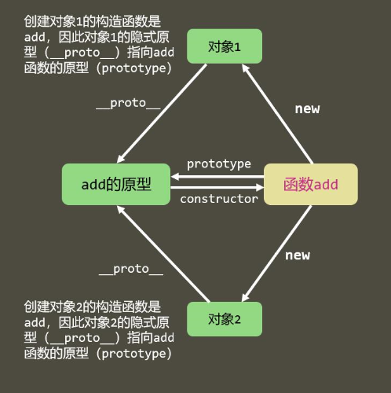
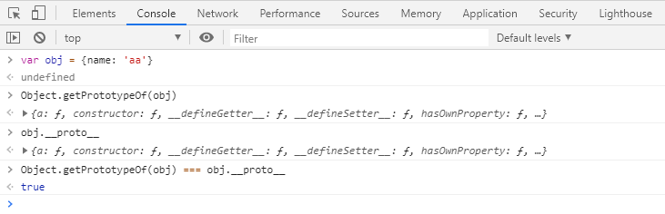

# 08-原型、原型链 
# 原型和原型链

- 所有对象都是通过`new 函数`创建

- 所有的函数也是对象

通过`new Funciton() `产生，函数中可以有属性。

**特殊：** JS引擎启动的时候，直接将 `Function函数` 放到内存中。

- 所有对象都是引用类型

    <body>
        
        
    </body>

## 原型 prototype

- 所有函数都有一个属性：prototype，称之为函数原型
- 默认情况下，prototype是一个普通的Object对象

- 默认情况下，prototype中有一个属性，constructor，它也是一个对象，它指向构造函数本身。

    test.prototype.constructor === test   // true
    Object.prototype.constructor === Object  // true

**注意：**

普通对象没有prototype。

    var obj = {name: 'DUDU'};
    obj.prototype			// undefined

## 隐式原型 `__proto__`

所有的对象都有一个属性：`__proto__`，称之为隐式原型

默认情况下，隐式原型指向创建该对象的函数原型。

当访问一个对象的成员时：

1. 看该对象自身是否拥有该成员，如果有直接使用
2. 在原型链中依次查找是否拥有该成员，如果有直接使用

猴子补丁：在函数原型中加入成员，以增强起对象的功能，猴子补丁会导致原型污染，使用需谨慎。

            function test(){
            }
    
            var obj = new test();           // obj: test {}
    
    obj.__proto__ === test.prototype			// true

## 原型链

**特殊点：**

1. Function的`__proto__`指向自身的prototype
2. Object的prototype的 `__proto__`指向null

案例：

    <body>
        
    </body>

**隐式原型的指向:**

# 原型链的应用

## 基础方法

W3C不推荐直接使用系统成员`__proto__`

- `Object.getPrototypeOf(obj)`

获取对象obj 的隐式原型

- `objA.prototype.isPrototypeOf(objB)`

判断当前对象 objA (this)是否在指定对象objB的原型链上

    // Test 是否在son的原型链上
    console.log(Test.prototype.isPrototypeOf(son))

- `对象 instanceof 函数`

判断目标函数的原型是否在对象的原型链上，参数为函数。

- `Object.create(对象)`

创建一个新对象，其隐式原型指向指定的对象。

- `Object.hasOwnProperty(属性名)`

判断一个对象**自身**是否拥有某个属性。