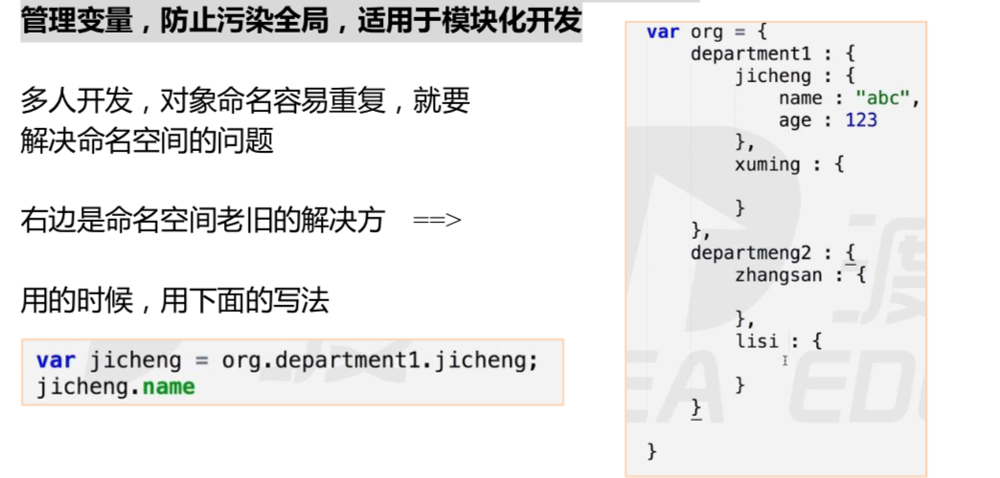

# 继承模式

## 传统形式

**原型链：**

- 过多的继承了没用的属性

    目的：继承LastName属性。
    缺点：同时会继承father、father的原型、Grand、Grand的原型。
        
    
           
           

## 借用构造函数 

**利用 call、apply 所以不算标准的继承模式：**

- **不能继承借用构造函数的原型**
- 每次构造函数都要多走一个函数 ==>浪费效率

- this 放进去的前提，这个函数必须是 **new** 来的

    function Person(name, age, sex) {
     	this.name = name;
      this.age = age;
      this.sex = sex;
    }
    function Student(name, age, sex, grade) {
     	Person.call(this, name, age, sex);
      this.grade = grade;
    }
    
    var student = new Student('deng', 34, 'male', 100);

## 共享原型

共享原型（较好的继承方法） 不能随便改动自己的原型，会影响父级。

共享同一个原型。

**案例：**

让 son 和 father 共享原型

        

**封装：**

在 inherit（Target，Origin）里面传进去的值是构造函数，需要大驼峰式书写，target（目标）继承 origin

son.prototype 和 father.prototype 指向的是一个房间，改 son 就改了father。

        

## 圣杯模式

圣杯模式是在方法三的共有原型，但是在共有原型的基础上有改变。 

共享原型是：son.prototype=father.prototype 

圣杯模式是：

另外加个构造函数 `function F（）{}`当做中间层，然后让 F 和 father 共 有一个原型 F.prototype=father.prototype，

然后 `son.prototype = new F（）；`

使用原 型链形成了继承关系，现在改 son.prototype 就不会影响 father.prototype

**案例1：**

存在`**son.constructor**`指向`**Father() {}**` 的问题？

        

**圣杯模式：**

        

**案例：**

雅虎写法。

var F 这个 F 形成了闭包，成为了这个函数的私有化变量，而且变成私有化变 量就更好。

    var inherit = (function () {
    	var F = function() {};		// F 是私有化变量
    	return function (Target, Origin) {
    		F.prototype = Origin.prototype;
        Target.prototype = new F();
        Target.prototype.constuctor = Target;		
        Target.prototype.uber = Origin.prototype;		// 超类，真正继承自谁。
    	}
    }());

## 属性私有化

**联系到闭包作用：**可以实现封装，属性私有化。

**案例：**为什么在外部执行的 divorce 能用内部的变量？能换成 xiaozhang？

因为 this.divorce 在对象上，由于对象被返回了，这个方法也被返回了。 因为闭包。

这个函数被储存到了外部，所以储存了这个函数的执行期上下文。所以 可以用这个闭包。所以 var prepareWife 被下面的 this=fn 三个函数共用，这三个函数 分别与 fn Deng 形成了闭包，共同用 Deng 的 AO,所以可以在外部随意存取。

        

# 命名空间

多人开发，对象命名容易重复，就要解决命名空间的问题。

管理变量，防止污染全局，适用于模块化开发。

命名空间其实就是对象。

## 2.1 解决方案

**方案1:**

命名空间老旧的解决方案。

**方案2：**

公司最常见的方法:用闭包来解决(也可用 webpack)，返回方法的调用。

        

## 2.2 模拟链式编程

        

## 2.3 查看属性

    var obj = { name : “abc” } 这两种基本上完全相同
    obj.name → obj [ ‘name’ ]

**案例：**

想实现属性名的拼接，只能用方括号的形式。

        

# 3 对象枚举

## 3.1 for in 循环

目的：便利对象。

通过对象属性的个数来控制循环圈数，这个对象有多少属性循环多少圈，而且在每一圈时，都把对象的属性名放到 Prop里面 在枚举里面，一定要写成 `obj[prop] `不能加字符串。

不能写`obj.prop` （会把prop当作属性。系统： --> `obj['prop']`）。

        

## 3.2 obj.hasOwnProperty(prop)

判断一个属性属不属于这个对象的只能用 hasOwnProperty。

true： 代表是自己的

false： 原型链的

        

**注意：**

for in 循环理论上可以返回原型和原型链上的东西，一旦这个原型链延展到了 的 object.prototype 上，不会打印系统的，只会打印自带的。

        

## 3.3 in

很少用。

in 操作符你的也是你的，你父亲的也是你的，只能判断这个对象能不能访问到这个属性，包括原型上;

不是判断属性属不属于这个对象的。

    'height' in obj