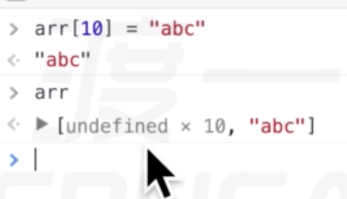
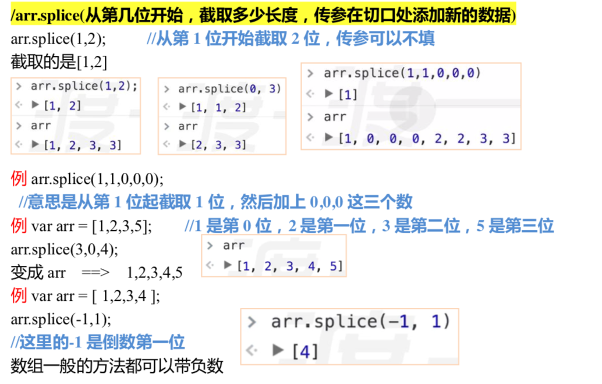
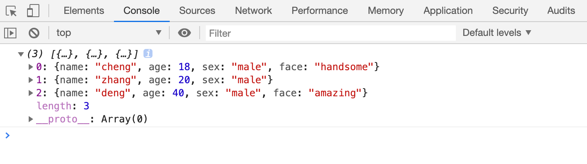
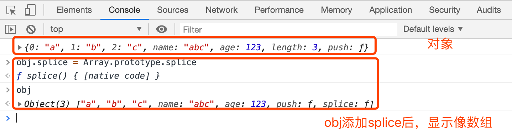

# 数组

## 数组的定义

    vararr= [1,2,3,4];                    数组字面量，推荐。vararr=newArray(1,2,3,4)        构造方法定义。

**注意：**

    稀松数组vararr= [1,2,,,,4];
    newArray(10)       只传一个参数。代表长度newArray(10.2)   报错，参数非法

## 数组的读和写

> `arr[num] ;`       不可以溢出读，溢出结果是undefined。
> `arr[num] = xxx;`    可以溢出写

## 数组常用的方法

ES3.0的方法。

**改变原数组：**

> push：返回长度，能添加多位。
> 
> pop：最后一位剪切走，返回剪切值；无参数
> 
> shift：删除第一位
> 
> unshift：在开头添加，能添加多位
> 
> sort：排序。是按**ASCII码**来排序。
> 
> reverse：翻转
> 
> `splice（从第几位开始， 截取的长度， 在切口处添加新的数据）`。切片方法，第3位开始的形参可以不填。

**不改变原数组：**

> concat：连接， 把后面的数组拼到前面，并成立一个新的数组，不影响之前的两个 数组。
> 
> join：参数需要用字符串形式(标准语法规定)，数组会用参数连接起来，返回字符串。
> 
> 不传参默认按`，`连接。
> 
> split：按照参数拆分为数组。
> 
> toString
> 
> slice：截取。
> 
> slice 里面可以填 0 个参数，也可以填 1 个参数，也可以填两个参数。
> 
> 1、如果填两个参数，slice(从该位开始截取，截取到该位)
>             如 arr.slice(1,2)从第一位开始截取，截取到第二位
> 
> 2、如果填一个参数，从第几位开始截取，一直截取到最后。
> 
> 如果 arr.slice(1) ，从第 1 位开始截取，截取到最后一位
> 
> 3、不写参数就是整个截取数组(把类数组转换成数组的时候经常使用到)
> 
> 4、克隆数组 `var arr1 = arr.slice();`

### push

案例：

> 重写push方法。

    

### splice

**案例：**

> splice 。

    vararr= [1,1,2,2,3,3]

****

**案例：**

> 模拟系统内部解决splice传参负数的问题。

    len=function (pos) {
    pos+=pos>0?0 : this.length; 
    }

### sort

**案例：sort**

> 自定义sort留下的接口。
> 
> 1 必须写两形参
> 
> 2 看返回值
> 
> 1）当返回值为负数时，那么前面的数放在前面
> 
> 2）为正数时，后面的数在前
> 
> 3）为0，不变

    vararr= [1,2,5,4,10];
    arr.sort(function(a,b) {
    returna-b;       // 升序returnb-a ;       // 降序});

**案例：**

> 将一个数组乱序。

    vararr= [1,2,3,4,5,6];
    arr.sort(function() {
    returnMath.random() -0.5; 
    }

**案例：**

> 将对象按照age 升序。

    

****

**案例：**

> 按字符串长度排序。

    

## 5 类数组

是对象但是可以像数组一样用。

可以利用属性名模拟数组的特性。

可以动态的增加length属性。

如果强行让类数组调用push方法，则会根据length属性值的位置进行属性的扩充。

**类数组的基本形态：**

> 属性要为索引（数字）属性；
> 
> 必须要有length属性；
> 
> 注意：length值决定，push的位置。
> 
> 最好加上push ；
> 
> 加上splice后长的和数组一样；

    

**案例：**

    
    

# 数组其他操作

**数组清空**

> 数组.splice(0, 数组.length);
> 数组.length = 0;

**查找数组中某一项的下标**

- 数组.indexOf(数据)

> 从数组中依次查找对应的数据，查找时使用严格相等进行比较。找到第一个匹配的下标，返回。如果没有找到，则得到-1；

- 数组.lastIndexOf(数据)

> 功能和indexOf类似，只是查找的是最后一个匹配的下标

**数组.fill**

> 数组.fill(数据)：将数组的所有项，填充为指定的数据

> 数组.fill(数组, 开始下标): 将数组从开始下标起，到数组的末尾，填充为指定的数据

> 数组.fill(数组, 开始下标，结束下标): 将数组从开始下标起，到数组的结束下标（取不到），填充为指定的数据

## 语法补充

**in关键字：**

判断某个属性名在对象中是否存在

> 属性名 in 对象

    <body></body>

**for-in  foreach 循环：**

> 取出对象的所有属性名，每次循环将其中一个属性名赋值给变量prop，运行循环体。

    for(varpropin对象){
    //循环体}

案例：for in 遍历数组

> 获取不到没有属性的稀松数组。

    <body></body>

# Object

**静态成员:**

- keys(某个对象)，得到某个对象的所有属性名数组

- values(某个对象)，得到某个对象的所有属性值数组

- `entries(某个对象)`，得到某个对象的所有属性名和属性值的数组

  Object.keys(obj);

# Array构造器

凡是通过Array构造函数创建的对象，都是数组

## 静态成员

- from方法：可以将一个伪数组转换为真数组
- isArray方法：判断一个给定的数据，是否为一个真数组
- of方法：类似于中括号创建数组，依次赋予数组每一项的值

