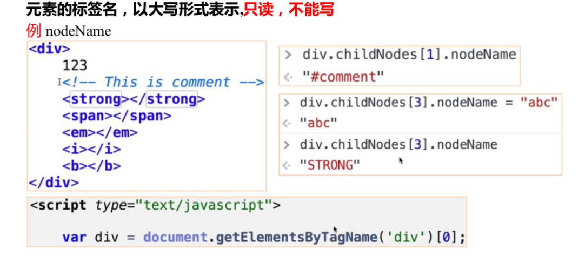

# DOM 基本操作

从 dom 开始，我们所学的一切系统给我们**生成的成组的东西，基本上都是类数组。**

大部分都是类数组——方法类操作。

**dom树：**文档中不同的节点形成的树形结构

## DOM选择器

### getElementById() 

> 元素 id 在 Ie8 以下的浏览器，不区分 id 大小写，而且也返回匹配 name 属性的元素，通过 id 标识我们来选择这个元素，一一对应。

    <body><divid='demo'>aaa
</body>

### getElementsByTagName() 

> 标签名，这是一个类数组，最主流的用法，**常用。**

    <body>

</body>

### getElementByName()

> IE 不支持。
> 
> 需注意，只有部分标签 name 可生效(表单，表单 元素，img，iframe)，不是在所有的浏览器都能用——**开发一般不用**

    <body><inputname="fruit"></body>

### getElementsByClassName()

> 类名 ->缺点: ie8 和 ie8 以下的 ie 版本中没有，可 以多个 class 一起，不是所有浏览器都能用。

### querySelector()/.querySelectorAll()

> 参数为css选择器。
> 
> 在IE7及以下的版本中没有。
> 
> 选择出来的元素**不是实时的（是静态的）是副本，**所以**一般不用**。

# 节点类型

## 遍历节点树

灵活，兼容好，所有浏览器都支持。

**parentNode：**

父节点 (最顶端的 parentNode 为#document);

**childNodes：**

> 子节点们(直接的节点数)，返回所有的类型的节点。
> 
> **节点类型：**
> 
> 后面的数字是调用nodeType返回的数字。
> 
> 元素节点 —— 1
> 属性节点 —— 2节点 —— 3注释节点 —— 8document —— 9DocumentFragment —— 11

**firstChild：**

第一个子节点

**lastChild：**

最后一个子节点

**nextSibling：**

后一个兄弟节点

**previousSibling ：**

前一个兄弟节点

## 基于元素节点树的遍历

不含文本节点。

除 children 外，其余 ie9 及以下不兼容。

**parentElement：**

返回当前元素的父元素节点 (IE9不兼容)

**children:**

只返回当前元素的元素子节点。**常用**。

**firstElementChild：**

返回第一个元素子节点（IE9不兼容）。

**lastElementChild：**

返回最后一个元素子节点（IE9不兼容）。

**nextElementSibling/previousElementSibling:**

返回后一个/前一个兄弟元素节点（IE9不兼容）。

## 节点的四个属性

**nodeName:**

> 元素的标签名，以大写形式表示，只读。

**nodeValue:**

> Text节点或Comment节点才有的文本属性，可读写。

**nodeType:**

> 该节点的类型，只读。**常用**。
> 
> **节点类型：**

> 后面的数字是调用nodeType返回的数字。
> 
> 元素节点 —— 1
> 属性节点 —— 2

> 节点 —— 3

> 注释节点 —— 8

> document —— 9

> DocumentFragment —— 11

**案例：**返回这个 div 的所有的元素节点。

    <body>
123<!--Thisiscomment--><strong></strong><em></em>
</body>

**attributes:**

> ELement节点的属性集合。

## 2.4 Node.hasChildNodes()

判断有没有子节点。返回值：true、false。

# 15-dom继承树，dom基本操作 

# 1 DOM继承树

**DOM接口：**

`**Document**`**和**`**document的**`**关系？**

> `document `继承自 `HTMLDocument.prototype`。`HTMLDocument.prototype`继承自 `Document.prototype` 。
>
> `document --> HTMLDocument.prototype --> Document.prototype`

**看看每层返回的值？**

# DOM基本操作

## 查

**getElementById()：**

> 定义在 `Document.prototype` 上，即 `Element` 节点上不能使用。

**getElementsByName()：**

> 定义在 `HTMLDocument.prototype`上，即非 html 中的 document 以外不能使用(`xml document,Element无法`使用)

**getElementsByTagName():**

> 定义在 `Document.prototype` 和`Element.prototype` 上。
>
> 开发中，经常利用先选择的父级，在他父级里面再次选什么元素来定位一个元素。

    <body>
1
</body>

**HTMLDocument.prototype():**

> 定义了一些常用的属性，body，head分别指代HTML文档中的<body><head>标签。

**Document.prototype()：**

> 定义了documentElement属性，指代文档的根元素，在HTML文档中，总是指代<html>元素。

**Document、Element均能使用：**

> getElementsByClassName、querySelectorAll、querySelector在Document、Element类中均有定义。

## 增

> `document.createElement();`
> `document.createTextNode();``document.createComment();``document.createDocumentFragment()`

## 插

> `PARENTNODE.appendChild();`     剪切操作,可以操作已有的元素。
>
> `PARENTNODE.insertBefore(a,b);`   把a插到b之前。

## 删

> `parent.removeChild();`  // 被剪切出去了。
>
> `child.remove();`        //自尽，完全删除。无参数，无返回值：undefined。

## 替换

> `parent.replaceChild(new, origin);`

# Element节点

## 一些属性

> innerHTML：可取，可写，可赋值。
>
> innerText：可取，可赋值（火狐不兼容）

    div.innerHTML=“123”;       // 是覆盖div.innerHTML+='456'// 可赋值，可写值的才能+=

## 一些方法

> ele.setAttribute();    设置
>
> ele.getAttrbute();    取值

# 作业

封装函数，返回元素 e 的第 n 层祖先元素？

    <body>

<strong><i></i></strong>

</body>

封装 children 功能，解决以前部分浏览器的兼容性问题?

    <body>
aaa<!--strong--><strong></strong><i></i>
</body>

封装hasChildren()方法，不可用 children 属性。

    <body>
aaa<!--strong--><strong></strong><i></i>
<ahref=""></a></body>

封装函数，返回元素 e 的第 n 个兄弟节点，n 为正，返回后面的兄弟节点，n 为负， 返回前面的，n 为 0，返回自己。

    <body>
aaa<i></i><!--strong--><strong></strong><i></i>
</body>

> 给3个标签，让他们行间有一个属性 this-name，值为标签名。

    <body>

<strong></strong></body>

封装函数insertAfter()；功能累屎insertBefore();

> insertAfter() 是系统没有提供的。
>
> 把a插到b后面。

    <body>
<!--strong--><strong></strong><i></i>
</body>

2.将目标节点内部的节点顺序，逆序。(标签逆序)

eg:

    <body>
<strong></strong><i></i>
</body>

