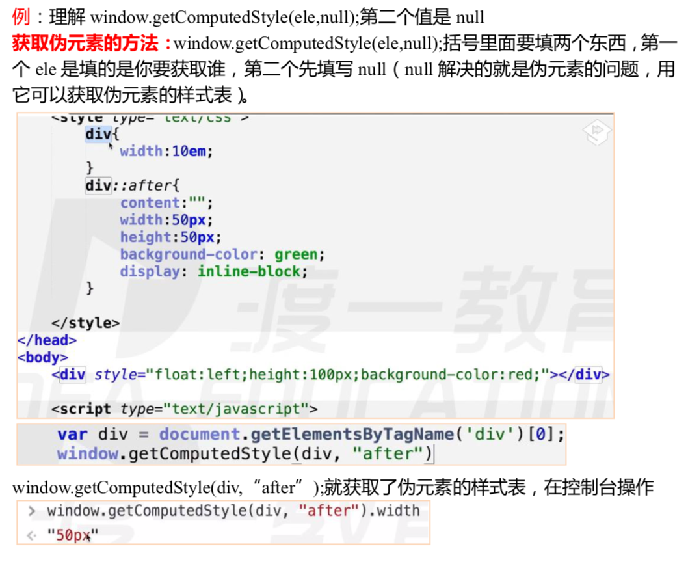

# 窗口属性

## 查看滚动条滚动距离

> `window.pageXOffset`  横向滚动条。
> 
> `window.pageYOffset` 纵向滚动条。
> 
> IE8 及 IE8 以下不兼容(IE9 部分兼容)IE9 以上能用。

**例:滚动条往下滚动了400px，求浏览器最顶端到滚动条滚动的位置的像素？**

> 400px+首屏像素(此时这个屏幕的底端距离整个网页的最顶端也是这样算)。

**IE8及IE8以下：**

> document.body.scrollLeft/scrollTop——求横向距离和纵向距离
> 
> document. documentElement.scrollLeft/scrollTop 兼容性比较混乱，其中一个有值，另外一个的值一定是 0。这两个最好的用 法是取两个值相加，因为不可能存在两个同时有值。

**封装兼容性方法，求滚动轮滚动距离：**

    

## 查看视口的尺寸

> 可视区窗口就是编写的 html 文档可以看到的部分，不含菜单栏、地址栏、控制台 。
> 
> `window.innerWidth/innerHeight` 可视区域的宽高 (加上滚动条宽度 / 高度)。
> 
> IE8 及 IE8 以下不兼容 。
> 
> w3c 标准方法。

**IE8及IE8以下：**

> `document.documentElement.clientWidth/clientHeight`标准模式下，任意浏览器都兼容 。
> 
> `document.body.clientWidth/clientHeight` 适用于怪异模式下的浏览器。

**渲染模式：**

> 标准模式: 加上`<!DOCTYPE html>`。
> 
> 怪异/混杂模式:试图去兼容之前的语法，去掉<!DOCTYPE html>这一行即可开启(向后兼容)。
> 
> `document.compatMode `是用于判断是怪异模式还是标准模式。

**封装兼容性方法，求****可视区窗口的尺寸：**

# dom尺寸

## 获取元素的几何尺寸

**domEle.getBoundingClientRect()：**

> 这是 es5.0 的方法。
> 
> 兼容性很好。
> 
> 该方法返回一个对象，对象里面有 left,top,right,bottom 等属性。left 和 top 代表 该元素左上角的 X 和 Y 坐标，right 和 bottom 代表元素右下角的 X 和 Y 坐标 。
> 
> height 和 width 属性老版本 IE 并未实现，在老版本的 ie 里面，利用右侧边减左侧面解决。
> 
> 返回的结果并不是“实时的”。

## 查看元素的尺寸

**dom.offsetWidth，dom.offsetHeight：**

> 包含padding的值。

## 查看元素的位置

**dom.offsetLeft, dom.offsetTop：**

> 对于无定位父级的元素，返回相对文档的坐标。 
> 
> 对于有定位父级的元素，返回相对于最近的有定位的父级的坐标。(无论是left、margin-left或者其他方法等。)
> 
> 
> 
> 
> ** 注意：**
> 
> position:static;是 position 是默认值，是不定位的写法，是静态的意思。

** dom.offsetParent：**

> 返回最近的有定位的父级，如无，返回 `body`,。
> 
> `body.offsetParent` 返回 null 。

**作业:求元素相对于文档的坐标**

    思路:先看有没有有定位的父级，如果有，先求他与有定位的父级的距离，然后把视角换到他有定位的父级上，这他这个有定位的父级上还有没有有定位的父级，一段一段的加，一直加到最后，是一个循环递归的过。

## 让滚动条滚动

> **window 上有三个方法 :**
> 
> scroll(), scrollTo(),两个功能一样，scrollBy();累加滚动距离 。实现让滚动轮滚动到当前位置。 
> 
> scroll(x，y), scrollTo(x，y),功能是一样的，里面能填两个参数，scroll(x 轴滚动条的距离，y 轴滚动条的距离)，里面的 xy 可以填负数 。
> 
> scrollBy(x，y);是累加滚动距离，填负数就往上滚动 。
> 
> 
> 
> 
> **区别:**
> 
> `scrollBy()`会在之前的数据基础之上做累加。

作业:点完收起，页面回到点展开时候的位置

    求滚动条的位置，记录点击展开时候的位置，点收起回到位置，记录是查看getScrollOffset()封装方法，回去是window.scroll，在执行

作业：做个自动翻页的阅读(当点击 start 就自动阅读)

加锁。

## 控制dom元素的类样式

> className： 获取或设置元素的类名
> classList： dom4的新属性，是一个用于控制元素类名的对象

> add：用于添加一个类名

> remove：用于移除一个类名

> contains：用于判断一个类名是否存在

> toggle：用于添加/移除一个类名

# 脚本化CSS

## 读写元素css属性

> dom 不能操作 css，是间接操作css。
> 
> dom.style.prop  可读写行间样式，没有兼容性问题。
> 
> 碰到 float 这样的关键字属性，前面应加 css(行间样式以外没用) eg:float — > cssFloat。
> 
> 复合属性必须拆解(建议)。
> 
> 组合单词变成小驼峰式写法，写入的值必须是字符串格式。

    CSSStyleDeclaration是css样式表声明(类数组，有索引类的属性)，把你能够用的所有的css都展示出来了，里面不填写就有没有值是空串。可以用div.style[‘width’]拿出属性，也可以用div.style.width，效果一样。在js访问属性的时候没有-杠的形式，不能写background-color，要写小驼峰。不在html文件里面写的值也可以利用js调用，如div.style.borderRadius=”50”;

## 查询计算样式

**window.getComputedStyle(ele,null)：**

> 获取的是最终的展示样式。
> 
> 计算样式只读，不可以写入 返回的计算样式的值都是绝对值，没有相对单位 IE8 及 IE8 以下不兼容。
> 
> 括号里面要填两个东西，第一 个 ele 是填的是你要获取谁，第二个先填写 null(null 解决的就是伪元素的问题， 用它可以获取伪元素的样式表)。
> 
> 
> 
> **注意：**
> div.style.width 获取的是行间样式。
> 
> getComputedStyle 取一个元素显示样式更准。

****

**ele.currentStyle：**

> 展示权重最高的。
> 计算样式只读，不可以写入。

> 返回的计算样式的值不是经过转换的绝对值，是原封不动的。

> IE 独有的属性。

**作业：**封装兼容性方法

