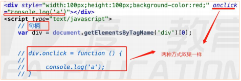
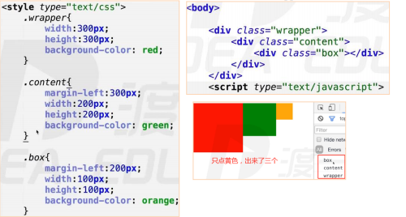
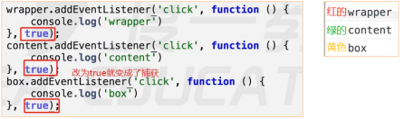
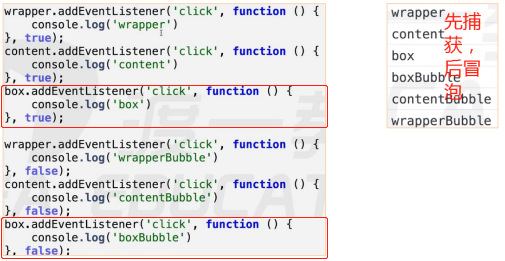
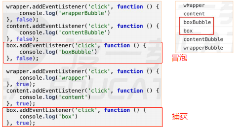
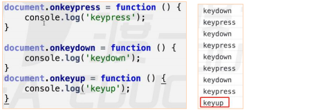
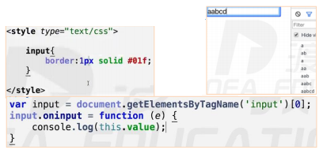
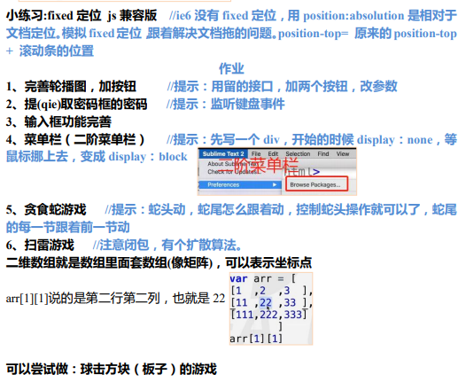

# 如何绑定事件

## 句柄式绑定

> `ele.onxxx = function (event) {}`
> 
> 兼容性很好，但是一个元素只能绑定一个事件处理程序。

**基本等同于写在 HTML 行间上：**

> `onclick="consolo.log('a')"`是句柄的绑定方式，写在行间不用写 `function(){}`

## ele.addEventListener 

> `ele.addEventListener(type, fn, false);`
> 
> IE9 以下不兼容，可以为一个事件绑定多个处理程序。

**案例：**

> div.addEventListener（'事件类型'，处理函数，false）。
> 
> function(){} 是函数引用，和外面定义一个 function test(){}直接写 test 是一样的。

    div.addEventListener（‘click’，function(){
    }，false）

**事件监听机制：**

> 例一个事件绑定了两个处理函数。
> 
> 结果是两个 a。这是两个处理函数，是两个地址。

    <body><divstyle="width : 100px;height : 100px; background-color: #f40;">
</body>

> 结果是一个 a。这种写法是一个地址 。

    <body><divstyle="width : 100px;height : 100px; background-color: #f40;">
</body>

**案例：**

> 使用ele.addEventListener 给每个li绑定一个点击事件，输出他们的顺序。
> 
> 绑定事件出现在循环里面（用到 i），考虑是否形成闭包，用立即执行函数来写。

    <body><ul><li>a</li><li>b</li><li>c</li><li>d</li></ul></body>

## ele.attachEvent

> `ele.attachEvent('on' + type, fn);`
> 
> IE 独有，一个事件同样可以绑定多个处理程序，**同一个函数绑定多次都可以。
> **

**案例：**

>  div.attachEvent('on' + 事件类型，处理函数);

    div.attachEvent('onclick'，function（）{});

# 事件处理程序的运行环境

## ele.onxxx

程序 this 指向是 dom 元素本身（指向自己）

    <body><divstyle="width : 100px;height : 100px; background-color: #f40;">
</body>

## obj.addEventListener

> 程序 this 指向是 dom 元素本身（指向自己）

    <body><divstyle="width : 100px;height : 100px; background-color: #f40;">
</body>

## obj.attachEvent

> 程序 this 指向 window。

**案例：例让 obj.attachEvent 指向自己**

> 封装function handle(){}里面是事件处理程序。

    <body><divstyle="width : 100px;height : 100px; background-color: #f40;">
</body>

## 封装兼容性的addEvent 

> `addEvent(elem, type, handle);`
> addEvent 是给一个 dom 对象添加一个该事件类型的处理函数。

    <body><divstyle="width : 100px;height : 100px; background-color: #f40;">
</body>

# 解除事件处理程序

> 若绑定匿名函数，则无法解除。

    // 解除 ele.onxxx = function (event) {}ele.onclick=false/''/null;            
    // 解除 addEventListener(type, fn, false)ele.removeEventListener(type, fn, false);   
    // 解除 ele.attachEvent(‘on’ + type, fn);ele.detachEvent(‘on’+type, fn); ==>ele.attachEvent(‘on’+type, fn);

# 事件处理模型 

事件处理的两个模型：事件冒泡、捕获（不能同时存在）

## 事件冒泡

> 事件冒泡： 结构上（非视觉上）嵌套关系的元素，会存在事件冒泡的功能，即同一事件，自子元素冒泡向父元素（自底向上） 。

**案例：**

> 只点黄色的，出现了 box,content,wrapper。

**不冒泡事件：**

> focus，blur，change，submit，reset，select 等事件不冒泡。

## 事件捕获

> 事件捕获：
> 
> 只有谷歌有，最新火狐有。
> 结构上（非视觉上）嵌套关系的元素，会存在事件捕获的功能，即同一事件，自父元素捕获至子元素（事件源元素）。 IE 没有捕获事件一个对象的一个事件类。

**案例：**

> 点击黄色盒子：先红的捕获事件执行，再绿的捕获事件执行，最后黄的执行事件执行。
> 捕获是把结构的最外面先抓住。最外面先捕获，再一层层向里面捕获，最里面的是按常规执行。把 false 改成 true，就变成了事件捕获。

## 触发顺序

> 先捕获，后冒泡。
> 
> 同一个对象的一个事件处理类型，上面绑定了两个事件处理，分别执行事件冒泡和 事件执行（谁先绑定，谁先执行）。

**案例：点击黄色盒子。**

> 先捕获后冒泡。

**
**

> 改变冒泡和捕获的顺序。
> 
> 这个的顺序是先捕获红色，再捕获绿色，boxBubble 黄色区域事件执行，box 黄色区域事件执行（谁先绑定，谁先执行，boxBubble 先绑定， 所以先执行），冒泡到绿色，冒泡到红色。

## 取消冒泡和阻止默认事件

**事件对象：**

> 在每一个事件处理函数中【div.onclick=function(){}】，我们可以写一个形参（如 e）， 系统可以传递事件对象（记载了事件发生时的状态和信息）到这个参数里面去。

### 取消冒泡

> 1）W3C 标准 event.stopPropagation();但不支持 ie9 以下版本
> 
> 2）IE 独有 event.cancelBubble = true;【实际上谷歌也实现了】

**封装取消冒泡的函数：**

    functionstopBubble(event) {
    if(event.stopPropagation) {
    event.stopPropagation();
      }else {
    event.cancelBubble=true; 
      }
    }

### 阻止默认事件

> 1）默认事件 — 表单提交，a 标签跳转，右键菜单等
> 
> return false; 兼容性非常好，以对象属性的方式注册的事件才生效（这是句柄的 方式阻止默认事件，只有句柄的方式绑定事件才好使）
> 
> ele.onxxx = function (event) {} 是句柄的绑定方式，才能用return false;
> 
> 3）event.preventDefault(); W3C 标注，IE9 以下不兼容
> 
> 4）event.returnValue = false; 兼容 IE

**封装阻止默认事件的函数：**

    functioncancelHandler(event) {
    if(event.preventDefault) {
    event.preventDefault();
      } else {
    event.returnValue=false;
      }
    }

**tips：**

    <ahref="javascript:void()">demo</a>void()  相当于写return

## 4.5 事件对象

**事件对象：**

> 在每一个事件处理函数中【div.onclick=function(){}】，我们可以写一个形参（如 e）， 系统可以传递事件对象非 ie 浏览器会把事件对象（记载了事件发生时的状态和信息）打包传到参数里面去。
> ie 浏览器在 window.event 里面储存事件对象。

**兼容性写法：**

    div.onclick=function(e) {
    varevent=e||window.event; 
    }

## 事件源对象

> 触发事件的地方叫事件源。事件对象上有个专门的信息是存储事件源的。
> 
> `event.target` 火狐独有的 。
> 
> `event.srcElement` IE独有的。
> 
>  chrome 都有。

**兼容性写法：**

    div.onclick=function(e) {
    varevent=e||window.event;
    vartarget=event.target||event.srcElement;
    }

## 事件委托

**事件委托：**利用事件冒泡，和事件源对象进行处理。

**优点：**

- 性能：不需要循环所有的元素一个个绑定事件
- 灵活：当有新的子元素时不需要重新绑定事件

## 其他方法

**currentTarget：**

当前目标：获取绑定事件的元素，等效于this

**type：**

字符串，得到事件的类型

**eventPhase：**

得到事件所处的阶段

1： 事件捕获 2： 事件目标 3： 事件冒泡

# 鼠标事件

## 事件类型

> click：用户单击主鼠标按钮（一般是左键）或者按下在聚焦时按下回车键时触发
>
> dblclick：用户双击主鼠标按键触发（频率取决于系统配置）
>
> mousedown：用户按下鼠标任意按键时触发
>
> mouseup：用户抬起鼠标任意按键时触发
>
> mousemove：鼠标在元素上移动时触发
>
> mouseover：鼠标进入元素时触发
>
> mouseout：鼠标离开元素时触发
>
> mouseenter：鼠标进入元素时触发，该事件不会冒泡。html5 方法
>
> mouseleave：鼠标离开元素时触发，该事件不会冒泡。html5 方法
>
> contextmenu：
>
> 不需要小驼峰和大驼峰 。

**mouseover、mouseout、mouseenter、mouseleave的区别？**

- over和out，不考虑子元素，从父元素移动到子元素，对于父元素而言，仍然算作离开
- enter和leave，考虑子元素，子元素仍然是父元素的一部分
- mouseenter和mouseleave不会冒泡

**案例：**

> click=mousedown+mouseup
>
> 这三个事件的触发顺序是 mousedown，mouseup，click。

    

**button区分鼠标按键：**

> 只有 mouseup、mousedown 两个能区分鼠标垫左右键。
>
> button 返回值，右键是 0，左键是 2，中间是 1。

    

**注意：**

> DOM3 标准规定:click 事件只能监听左键,只能通过`mousedown` 和 `mouseup `来 判断鼠标键。
>
> click 不能监听右中键。

**如何解决 mousedown 和 click 的冲突？**

> 看时间差解决：按下+抬起的时间差 > 多少 ，判断是click。

    

## 事件对象

`MouseEvent`

- altKey：触发事件时，是否按下了键盘的alt键
- ctrlKey：触发事件时，是否按下了键盘的ctrl键
- shiftKey：触发事件时，是否按下了键盘的shift键
- button：触发事件时，鼠标按键类型

- 0：左键
- 1：中键
- 2：右键

**位置：**

- page：pageX、pageY，当前鼠标距离页面的横纵坐标
- client: clientX、clientY，鼠标相对于视口的坐标
- offset：offsetX、offsetY，鼠标相对于事件源的内边距的坐标
- screen: screenX、screenY，鼠标相对于屏幕
- x、y，等同于clientX、clientY
- movement：`movementX、movementY`，只在鼠标移动事件中有效，相对于上一次鼠标位置，偏移的距离

# 键盘事件

## 事件类型

> keydown：按下键盘上任意键触发，如果按住不放，会重复触发此事件
>
> keypress：按下键盘上一个**字符键**时触发
>
> keyup：抬起键盘上任意键触发
>
> 
>
>
> keydown、keypress 如果阻止了事件默认行为，文本不会显示。
>
> 触发顺序： keydown > keypress > keyup。

**keydown 和 keypress 的区别？**

> 1）keydown 可以响应任意键盘按键，keypress 只可以相应字符类键盘按键 ；keydown检测字符类不准确，不区分大小写，keypress 检测字符很准，区分大小写。
>
> 用法：如果你想监控字符类按键，并想区分大小写，就用 keypress，如果是操作类按 键的话，就用 keydown（which：39 是给按键牌号 39，不是 asc 码） 。
>
> 2）keypress 返回 ASCII 码，可以转换成相应字符

## 事件对象

`KeyboardEvent`

- code：得到按键字符串，适配键盘布局。
- key：得到按键字符串，不适配键盘布局。能得到打印字符。
- keyCode、which：得到键盘编码

**案例：连续按键。**

> 连续按键盘按键的时候就是连续触发 keydown 和 keypress，松开触发 keyup。
>
> 注意：游戏触发设置在 keydown 上，机械键盘抬起速度快反馈力量大，对游戏没用。

****

**案例：ASCII码 转换为字符。**

> 把 Unicode 编码转成对应值。

    

# 文本操作事件

`input、select、text等`

> focus：元素聚焦的时候触发（能与用户发生交互的元素，都可以聚焦），该事件不会冒泡
>
> blur：元素失去焦点时触发，该事件不会冒泡。
>
> submit：提交表单事件，仅在form元素有效。
>
> change：文本改变事件
>
> input: 文本改变事件，即时触发

**案例：**框里面所有变化（增删改）都会触发 input 事件

**案例：change**

> change 对比鼠标聚焦，或失去焦点的时，两个状态是否发生改变，如果两个状态 没有改变就不触发，如果发生改变就触发。

    varinput=document.getElementsByTagName('input')[0];
    input.onchange=function(e) {
    console.log(this.value); 
    }

**补充：**

    input :
    <inputtype="text"placeholder="请输入账号">defaultValueselect :
    sel.onchange=function() {
    console.log(sel.value, sel.options[sel.selectedIndex].innerHTML);
    }

# 窗体操作类(window 上的事件)

> window是全局对象。
>
> `load、DOMContentLoaded、readystatechange` 事件。
>
> scroll： 当滚动条一滚动，scroll 事件就触发了。

**window的load：**

页面中所有资源全部加载完毕的事件。

**图片的load：**

图片资源加载完毕的事件。

图片、视频、音频 是异步渲染。

**浏览器渲染页面的过程：**

> 1. 得到页面源代码
> 2. 创建document节点
> 3. 从上到下，将元素依次添加到dom树中，每添加一个元素，进行预渲染
> 4. 按照结构，依次渲染子节点

**document的DOMContentLoaded:**

dom树构建完成后触发的事件。

**window的readystatechange：**

> 页面状态改变触发。
>
> **页面的3个状态****readystate:**  loading、interactive、complete
>
> - loading：加载状态
> - interactive：dom树生成完毕的状态，触发DOMContentLoaded事件
> - complete：页面加载完成的状态，触发window的load事件

**注意：**

- css应该写到页面顶部：避免出现闪烁（如果放到页面底部，会导致元素先没有样式，使用丑陋的默认样式，然后当读到css文件后，重新改变样式）
- js代码应该尽量写到页面底部，不影响页面渲染
- JS应该写到页面底部：避免阻塞后续的渲染，也避免运行JS时，得不到页面中的元素。

**案例：**获取图片宽高。

> 回调函数，图片加载完成后返回图片宽高。

    functiongetImgSize(img, callback) {
    if (img.width===0&&img.height===0) {
    img.onload=function () {
    callback({
    width: img.width,
    height: img.height            });
            }
        }
    else {
    callback({
    width: img.width,
    height: img.height        });
        }
    }

**案例：IE6fixed定位**

> ie6 没 fixed 定位，就用 position 的 top=原来的 top+滚动条的位置来写。
>
> absolute 定位 相对于文档定位，用 absolute 定位模拟 fixed 定位。

    window.onscroll=function() {
    console.log(window.pageXOffset+" "+window.pageYOffset);
    }

**load 重要但是不用？**

> **理由：**
>
> html 和 css 是一起解析的，在解析的时候会有 html 有 domTree，css 有 cssTree 生成（树形图的顶底是 document，然后是 html，然后是 head，body），两个树拼在 一起是 renderTree。
>
> 
>
>
> **什么时候把节点放在树里？**
>
> dom 节点解析，如确定是 img 标签就把他放到树里。（先解析完img，同时开启一个线程异步的去下载里面的内容，后下载完）。
>
> 
>
>
> window.onload 要等整个页面解析完，下载完才能操作 js，才能触发事件（效率很差）。

# 5 作业

# 其他事件

**unload、beforeunload：**

beforeunload: window的事件，关闭窗口时运行，可以阻止关闭窗口，比unload先执行。

unload：window的事件，关闭窗口时运行，不可以阻止关闭。

**scroll：**

窗口发生滚动时运行的事件

通过scrollTop和scrollLeft，可以获取和设置滚动距离。

**resize：**

窗口尺寸发生改变时运行的事件，监听的是视口尺寸

**contextmenu：**

右键菜单事件

**paste：**

粘贴事件

**copy：**

复制事件

**cut：**

# 补充

## 7.1 元素位置

**offsetParent：**

获取某个元素第一个定位的祖先元素，如果没有，则得到body

body的offsetParent为null

**offsetLeft、offsetTop：**

相对于该元素的offsetParent的坐标

如果offsetParent是body，则将其当作是整个网页

**案例：**获得相对于视口的距离

    functiongetPagePosition(dom) {
    varleft=dom.offsetLeft;
    vartop=dom.offsetTop;
    varparent=dom.offsetParent;
    while (parent) {
    left+=parent.offsetLeft;
    top+=parent.offsetTop;
    parent=parent.offsetParent;
                }
    return {
    x: left,
    y: top            }
            }

**getBoundingClientRect方法：**

该方法得到一个对象，该对象记录了该元素相对于视口的距离

**案例：**吸附效果

## 事件模拟

**常用：**

> `​click() 、​sumbit()`​   事件加（）表示触发事件。

**dispatchEvent：**事件分发

    <body><formaction="https://www.taobao.com"><divstyle="width:100px; height:100px; background:red">
</form><buttonid="btn1">按钮1</button><buttonid="btn2">按钮2</button><buttonid="btn3">鼠标移入按钮1</button><buttonid="btn4">鼠标移出按钮1</button></body>

## 其他补充

- window.scrollX、window.pageXOffset、window.scrollY、window.pageYOffset

window.scrollX、window.pageXOffset: 相当于根元素的scrollLeft

window.scrollY、window.pageYOffset: 相当于根元素的scrollTop

- scrollTo、scrollBy

scrollTo: 设置滚动条位置

- resizeTo、resizeBy