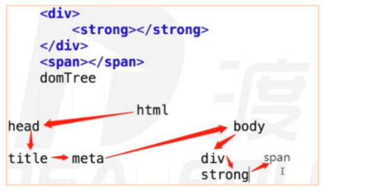
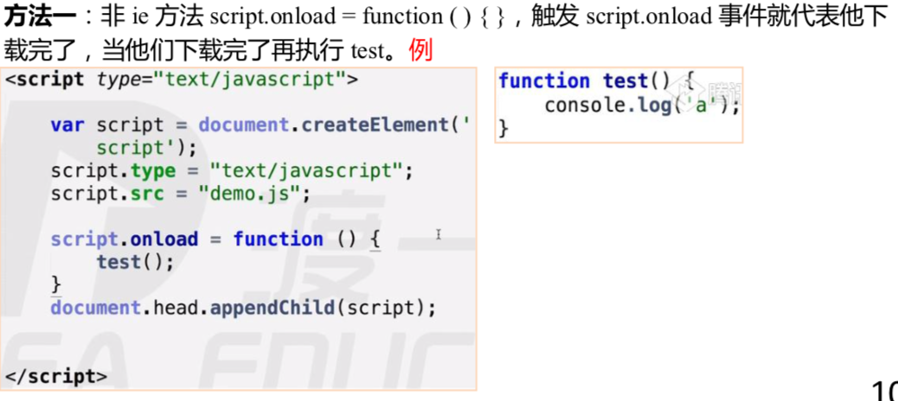
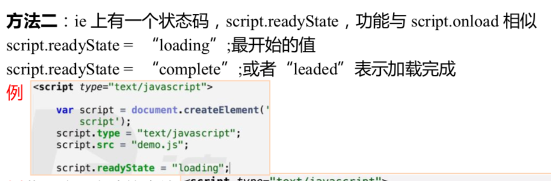
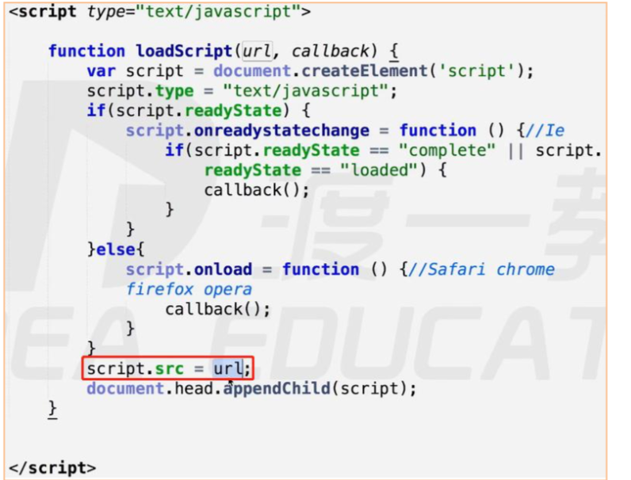
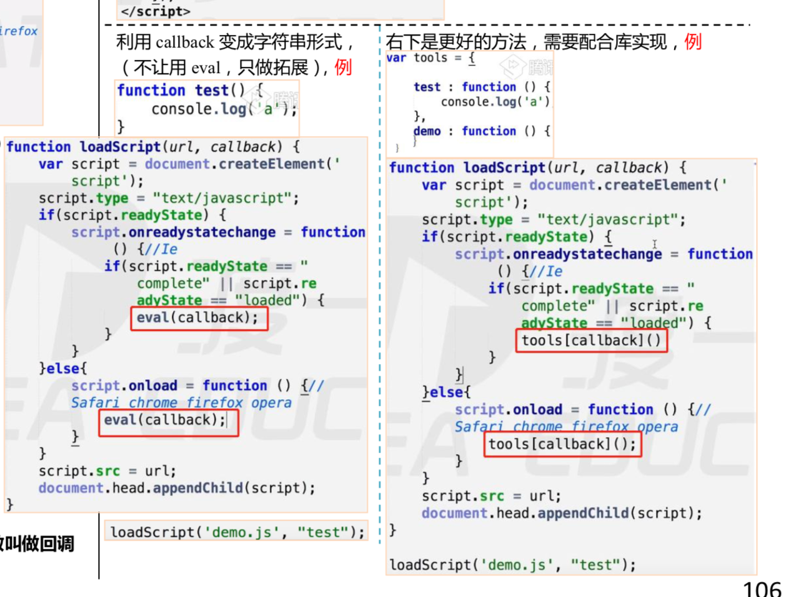
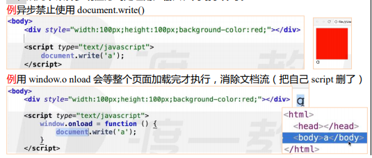
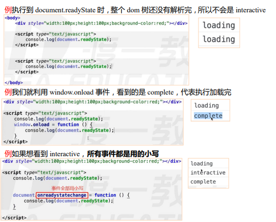
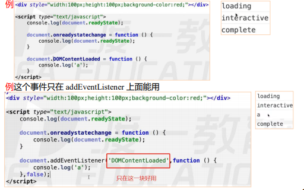
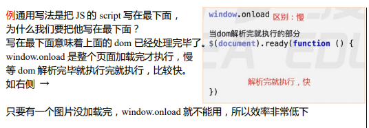
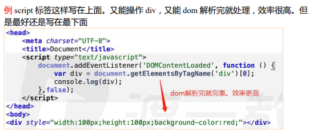

# json

> JSON 是一种传输数据的格式（以对象为样板，本质上就是对象，但用途有区别，对象就是本地用的，json 是用来传输的）。
> 
> json的属性名必须加双引号(传的是二进制文本)。
> 
> `JSON.parse(); `     string — > json
> 
> `JSON.stringify();`       json — > string

**案例：**

>  json 的属性名必须加双引号(传的是二进制文本)。

    

# dom树

**绘制 domTree：**

> 符合深度优先（纵向）原则，比如先看 head → title → meta →body → div → strong → span。

****

**dom 树是节点解析：**

> dom 树解析完毕代表 dom 数所有的节点解析完毕，不代表加载（下载完毕）完毕。如看到 img 标签就放到 dom 树上，然后同时下载。
> 
> 
> 
> dom 树形成完了以后，就等 css 树形成【cssTree 也是深度优先原则】。domTree + cssTree = randerTree，randerTree 形成以后，渲染引擎才会绘制页面。

**重排和重绘：**

- randerTree 触发重排reflow 

> dom 节点的删除，添加，dom 节点的宽高变化，位置变化，display none ==> block，offsetWidth，offsetLeft。

> domTree 改变，randerTree 也会改变，会重排，影响效率,要尽量避免重排。

- randerTree 触发重绘repaint  

> 效率也比较低，效率影响较小。触发情况：改颜色，图片。

# 异步加载 js

**javascript 异步加载的三种方案？**

> defer 异步加载，但要等到 dom 文档全部解析完（dom 树生成完）才会被执行。 只有 IE 能用。 dom 文档全部解析完时，就执行。
> 
> 
> 
> 
> async 异步加载，加载完脚本就执行，async 只能加载外部脚本，不能把 js 写在 script 标签里。ie9 以上可以用，w3c 标准。
> 
> 
> 
> 
> 创建 script，插入到 DOM 中，加载完毕后 callBack（按需加载，方便）→常用

**案例：**

> defer、async

    <scripttype="text/javascript"src="tools.js"defer="defer"></script>

**案例：**

> 创建script。

    varscript=document.createElement('script');
    script.type="text/javascript";
    script.src="tools.js";
    document.head.appendChild(script);  //如果不写这一段，就是只加载，不执行。

    方法二:ie上有一个状态码，script.readyState，功能与script.onload相似script.readyState=“loading”;最开始的值script.readyState=“complete”;或者“leaded”表示加载完成

把以上两种异步加载 js 方法封装成函数:

    事件里面有一个绑定的事件处理函数，当满足一定执行条件才执行的函数叫做回调函数。回调函数叫callback

# js 加载时间线

可以理解成**浏览器加载时间线** -- 背。

**js 加载时间线：**

> 依据 js 出生的那一刻起，记录了一系列浏览器按照顺序做的事（就是一个执行顺序）。
> js 时间线步骤（创建 document 对象==>文档解析完==>文档解析完加载完执行完）。

    1、创建Document对象，开始解析web页面。解析HTML元素和他们的文本内容后添加Element对象和Text节点到文档中。这个阶段document.readyState='loading'。2、遇到link外部css，创建线程，进行异步加载，并继续解析文档。3、遇到script外部js，并且没有设置async、defer，浏览器同步加载，并阻塞，等待js加载完成并执行该脚本，然后继续解析文档。4、遇到script外部js，并且设置有async、defer，浏览器创建线程异步加载，并继续解析文档。对于async属性的脚本，脚本加载完成后立即执行。（异步禁止使用document.write()，因为当你整个文档解析到差不多，再调用document.write()，会把之前所有的文档流都清空，用它里面的文档代替）5、遇到img等（带有src），先正常解析dom结构，然后浏览器异步加载src，并继续解析文档。看到标签直接生产dom树，不用等着img加载完scr。6、当文档解析完成（domTree建立完毕，不是加载完毕），document.readyState='interactive'。7、文档解析完成后，所有设置有defer的脚本会按照顺序执行。（注意与async的不同,但同样禁止使用document.write()）;
    8、document对象触发DOMContentLoaded事件，这也标志着程序执行从同步脚本执行阶段，转化为事件驱动阶段。9、当所有async的脚本加载完成并执行后、img等加载完成后（页面所有的都执行加载完之后），document.readyState='complete'，window对象触发load事件。10、从此，以异步响应方式处理用户输入、网络事件等。

例通用写法是把 JS 的 script 写在最下面， 为什么我们要把他写在最下面？ 写在最下面意味着上面的 dom 已经处理完毕了。 window.onload 是整个页面加载完才执行，慢 等 dom 解析完毕就执行完就执行，比较快。 如右侧 → 只要有一个图片没加载完，window.onload 就不能用，所以效率非常低下

例 script 标签这样写在上面。又能操作 div，又能 dom 解析完就处理，效率很高。但 是最好还是写在最下面

