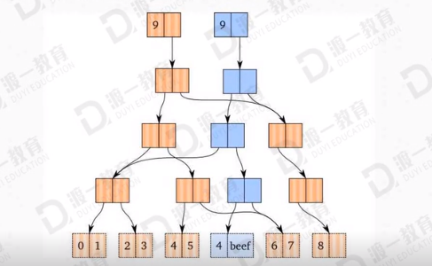

# 你不知道的JS之原理篇

ui多线程-深入刨析js执行机制

## 浏览器常驻的线程

> js引擎线程 （解释执行js代码、用户输入、网络请求）。
> GUI线程 （绘制用户界面、与js主线程是互斥的）。

> http网络请求线程 （处理用户的get、post等请求，等返回结果后将回调函数推入任务队列）。

> 定时触发器线程 （setTimeout、setInterval等待时间结束后把执行函数推入任务队列中）。

> 浏览器事件处理线程 （将click、mouse等交互事件发生后将这些事件放入事件队列中）。

**GUI****主线程负责协调运转：**

**JS****引擎线程和****GUI****线程****-****互斥：**

> JS可以操作DOM元素，进而会影响到GUI的渲染结果，因此JS引擎线程与GUI渲染线程是互斥的。
>
> 也就是说当JS引擎线程处于运行状态时，GUI渲染线程将处于冻结状态。

## JS 引擎线程-单线程 

### 单线程

> 单线程-同一时间只能做一件事。

JavaScript是基于单线程运行的，同时又是可以异步执行的，一般来说这种既是单线程又是异步的语言都是基于事件来驱动的，恰好浏览器就给JavaScript提供了这么一个环境。

**导图：**

> 同步和异步任务分别进入不同的执行"场所"，同步的进入主线程，异步的进入Event Table并注册函数。
>
> 当指定的事情完成时，Event Table会将这个函数移入Event Queue。
>
> 主线程内的任务执行完毕为空，会去Event Queue读取对应的函数，进入主线程执行。
>
> 上述过程会不断重复，也就是常说的Event Loop(事件循环)。

### 同步任务

> 0.代码没有执行的时候，执行栈为空栈
> 1.foo函数执行时，创建了一帧，这帧中包含了形参、局部变量（预编译过程），然后把这一帧压入栈中

> 2.然后执行foo函数内代码，执行bar函数

> 3.创建新帧，同样有形参、局部变量，压入栈中

> 4.bar函数执行完毕，弹出栈

> 5.foo函数执行完毕，弹出栈
> 6.执行栈为空
> **执行栈其实相当于****js****主线程**

    function foo (ot) {
    	function bar (it) {
    		console.log(it);	
    	}
    	bar(20);
    	console.log(ot);
    }
    foo(10);

### 异步任务

> Ajax 进入Event Table，注册回调函数success
>
> 执行console.log(‘run’)

> ajax事件完成http网络请求线程把任务放入Event Queue中

> 主线程（调用栈）读取任务下执行success函数

    $.ajax({
    	url: ‘localhost:/js/demo.json’,
    	data: {},
    	success: function (data) {
    		console.log(data);
    	}
    });
    console.log(‘run’);

**案例：定时器**

> setTimeout的等待时间结束后并不是直接执行的而是先推入浏览器的一个任务队列，在同步队列结束后在依次调用任务队列中的任务。

> setTimeout(function(){}, 0) Js主线程中的执行栈为空时，0毫秒实际上也达不到的，根据HTML标准，最低4毫秒。

> setInterval是每隔一段时间把任务放到Event Queue之中。

    function test (num) {
    	for (var i = 0; I < num; i++) {
    		console.log(i);
    	}
    }
    
    setTimeout(function () {console.log(‘time’)}, 400);
    
    outer(100000);
    
    console.log(‘hello world’);

**
**

**Js****执行机制****-****多线程不好吗？**

> js设计出来就是为了与用户交互，处理DOM，假如js是多线程，同一时间一个线程想要修改DOM，另一个线程想要删除DOM，问题就变得复杂许多，浏览器不知道听谁的，如果引入“锁”的机制，这不就又回到了被其他语言尴尬的困境了吗。

**大量数据操作怎么办？**

> 单线程计算能力有限，大量数据需要计算渲染的话，我们可以配合后端进行操作，比如我们后期进阶班里降到的VUE与nodejs配合，也就是传说中的SSR（服务端渲染）技术。

# Bind的模拟实现

重源码！bind的模拟实现。

`bind()`**的使用：**

> 1. `A.bind(o, x, y, ...)` 第一个参数 o 为一个对象，决定返回函数的this指向；x，y，z 等是函数实际参数。
> 2. 返回一个函数B 等待你去执行。

> 1. 函数B在执行的时候，具体的功能实际上还是使用A，只不过this 指向变成了o 或window。
> 2. 函数B在执行的时候，传递的参数会拼接到 x,y,z后面，一并在内部传递给A执行。
> 3. `new B()` ；构造函数依旧是A，而且o 不会起到任何作用
>
>
> `console.log((new B()).constructor);`   => `A () {}`

    <body>
        
    </body>

**单对象编程：

**

    <body>
        <button id='demo'>点击</button>
        
    </body>

**案例：多参数

**

        

**注意：**

> 事件对象 e ， 在实际参数后面。

    <body>
        <button id='demo'>点击</button>
        
    </body>

****

**模拟实现：**

# 函数式编程之纯函数

避免Bug思想利器-纯函数。

## 纯函数

> 纯函数是指**不依赖，修改其作用域之外**变量的函数。
>
> 没有用到返回值，一定不是纯函数。

**案例：纯函数**

    1.
    function compare (x) {
     	return x > 18; 
    }
    
    2.
    var num = 18;
    function compare (x, num) {
      // Ao --> { x: undefined,
      //				  num : undefined}
      
     	return x > num; 
    }
    console.log(compare(20,num));

**案例：非纯函数**

> 对外界有影响，不是纯函数。

    var arr = [];
    function add(_arr) {
     	var obj = {name : 'dd'};
      _arr.push(obj);
    }
    
    add(arr)			// 影响了全局变量arr，不是纯函数。

> 修改为纯函数。

    var arr = [{name: 'duyi'}];
    function add(_arr) {
     	var obj = {name: 'cst'};
      var newArr = [];
      for (var i = 0; i < _arr.length; i++) {
        newArr[i] = deepClone(_arr[i]);		// 注意：使用tools.js深度克隆，不能直接赋值。
      }
      
      newArr.push(obj);
      return newArr;
    }
    var newArr = add(arr);
    newArr.push({name: 'haha'});

**纯函数-作用：**

> 纯函数非常容易进行单元测试，因为不需要考虑上下文环境，只需要考虑输入和输出。
>
> 纯函数是健壮的，改变执行次序不会对系统造成影响，因此纯函数的操作可以并行执行。

**举例：数组过滤**

    <body>
        

            <input type="text" class = 'iSearch' style="width: 198px;height: 40px; border: 1px solid #f40;">
            
 

        

        
    </body>

## 组件化开发-状态共享

# 科里化

- **函数柯里化**

> 固定某个函数的一些参数，得到该函数剩余参数的一个新函数，如果没有剩余参数，则调用。

- **前端****why****？柯里化**

> 前端使用柯理化的用途主要就应该是简化代码结构，提高系统的维护性，一个方法，只有一个参数，强制了功能的单一性，很自然就做到了功能内聚，降低耦合。

> 柯理化的优点就是降低代码的重复，提高代码的适应性。

- **实现柯里化**

> 固定某个函数的一些参数，得到该函数剩余参数的一个新函数，如果没有剩余参数，则调用。

            function sum(a, b, c, d, e) {
                var result = a + b + c + d + e
                console.log(result)
            }
            function curry(fn) {
                var _args = [].slice.call(arguments, 1)
                // console.log(_args)
                return function () {
                    var totalArgs = _args.concat(Array.from(arguments))
                    if (totalArgs.length >= fn.length) {
                        fn(...totalArgs)
                    } else {
                        return curry(fn, ...totalArgs)
                    }
                }
            }
            var newSum = curry(sum, 1, 2)
            newSum(3)(4)(6)
    
    /**
     * 科里化函数
     * 在函数式编程中，科里化最重要的作用是把多参函数变为单参函数
     */
    this.myPlugin.curry = function (func) {
        //得到从下标1开始的参数
        var args = Array.prototype.slice.call(arguments, 1);
        var that = this;
        return function () {
            var curArgs = Array.from(arguments); //当前调用的参数
            var totalArgs = args.concat(curArgs);
            if (totalArgs.length >= func.length) {
                //参数数量够了
                return func.apply(null, totalArgs);
            }
            else {
                //参数数量仍然不够
                totalArgs.unshift(func);
                return that.curry.apply(that, totalArgs);
            }
        }
    }

- **应用柯里化**

> **流程剖析**

# 属性描述符

**属性描述符的配置参考：**

[https://developer.mozilla.org/zh-CN/docs/Web/JavaScript/Reference/Global_Objects/Object/defineProperty](https://developer.mozilla.org/zh-CN/docs/Web/JavaScript/Reference/Global_Objects/Object/defineProperty)

**属性描述符：**

它表达了一个属性的相关信息（元数据），它本质上是一个对象。

1. 数据属性
2. 存取器属性

3. 当给它赋值，会自动运行一个函数
4. 当获取它的值时，会自动运行一个函数

**`Object.defineProperty(obj, "x", {})`**

> 第3个属性代表存取器属性，是一个对象。
>
> 配置的是第二个参数：  'x'  的相关信息。

- 描述符可拥有的键值

> 存取器属性

`configurable``enumerable``value``writable``get``set`数据描述符可以可以可以可以不可以不可以存取描述符可以可以不可以不可以可以可以

**案例：**

    <body>
        
    </body>

**案例：**

> 限制赋值范围。

    <body>
        
    </body>

**案例：**

**[存取器属性.2.html](https://www.yuque.com/attachments/yuque/0/2021/html/714097/1615639268352-b3009867-710e-4de7-8ffa-f6ec3a64a5bc.html?_lake_card=%7B%22uid%22%3A%221596201944764-0%22%2C%22src%22%3A%22https%3A%2F%2Fwww.yuque.com%2Fattachments%2Fyuque%2F0%2F2021%2Fhtml%2F714097%2F1615639268352-b3009867-710e-4de7-8ffa-f6ec3a64a5bc.html%22%2C%22name%22%3A%22%E5%AD%98%E5%8F%96%E5%99%A8%E5%B1%9E%E6%80%A7.2.html%22%2C%22size%22%3A2417%2C%22type%22%3A%22text%2Fhtml%22%2C%22ext%22%3A%22html%22%2C%22progress%22%3A%7B%22percent%22%3A99%7D%2C%22status%22%3A%22done%22%2C%22percent%22%3A0%2C%22id%22%3A%22CSydh%22%2C%22card%22%3A%22file%22%7D)**

**其他的属性描述符：**

    <body>
        
    </body>

`**Object.getOwnPropertyDescriptor（obj, 'name')**`

> 获取某个对象的某个属性的属性描述符对象（该属性必须直接属于该对象）。
>
> 获取普通属性时，会自动配置属性描述符。

# 函数管道

**函数管道：**

将多个单参函数组合起来，形成一个新的函数，这些函数中，前一个函数的输出，是后一个函数的输入

    /**
     * 函数管道
     */
    this.myPlugin.pipe = function () {
        var args = Array.from(arguments);
        return function (val) {
            return args.reduce(function (result, func) {
                return func(result);
            }, val);
            // for (var i = 0; i < args.length; i++) {
            //     var func = args[i];
            //     val = func(val);
            // }
            // return val;
        }
    }   

**案例：**

    <body>
        
        
    </body>