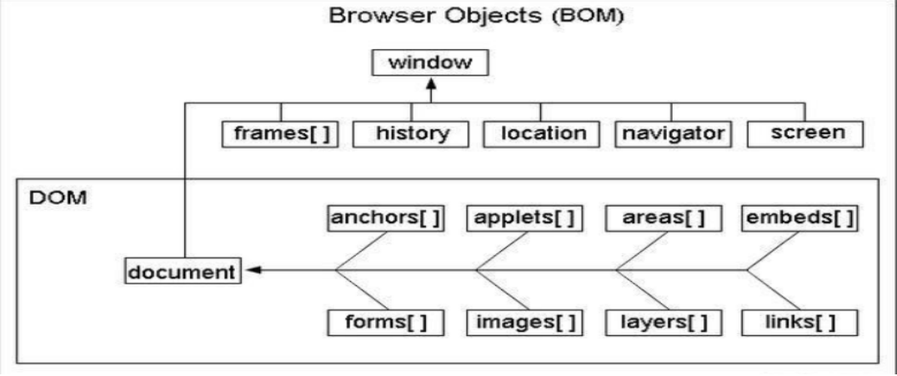
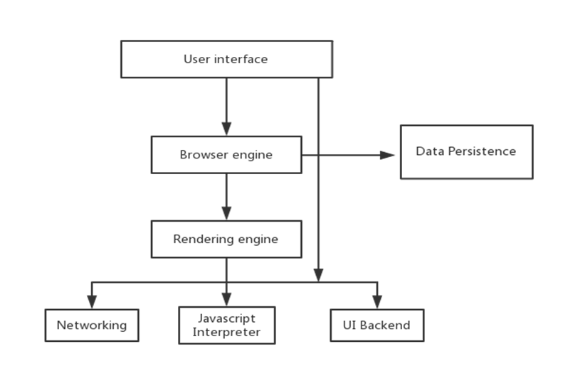
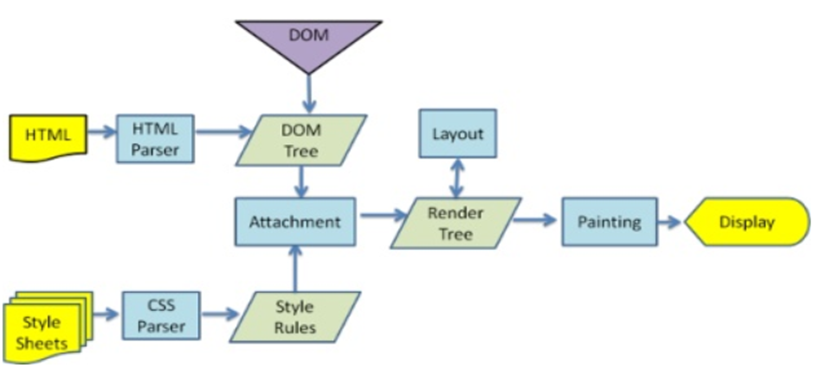
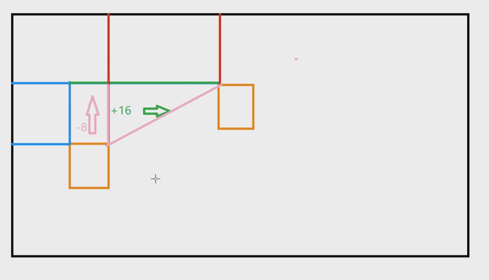
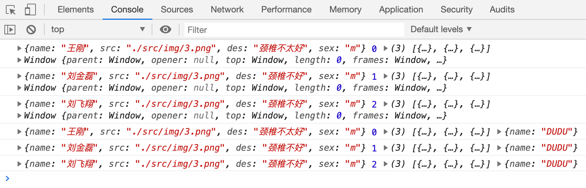
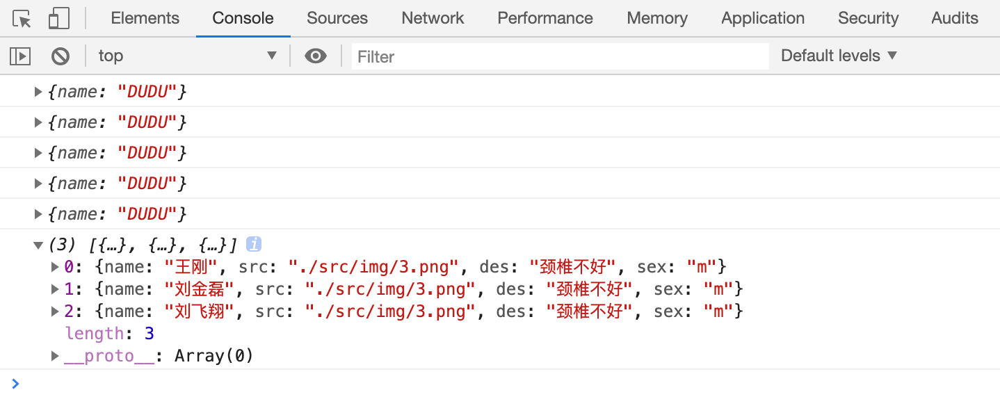
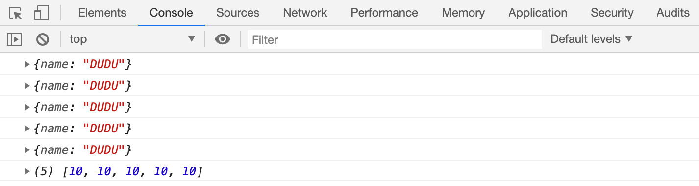
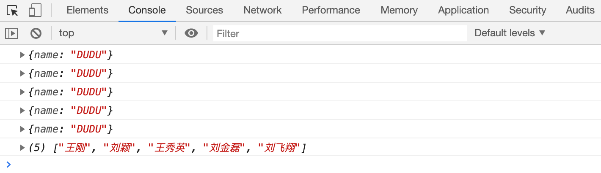
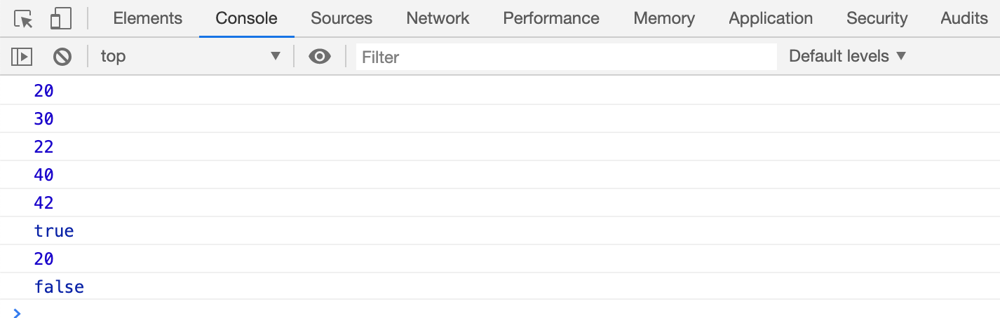
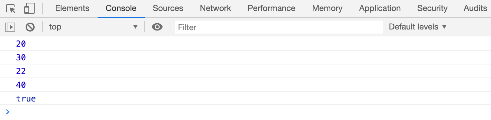

# BOM

[https://www.w3school.com.cn/jsref/dom_obj_window.asp](https://www.w3school.com.cn/jsref/dom_obj_window.asp)

## 什么是BOM？

BOM是browser object model的缩写，简称浏览器对象模型。

主要处理浏览器窗口（window）和框架（iframe），描述了与浏览器进行交互的方法和接口，可以对浏览器窗口进行访问和操作，不过通常浏览器特定的 JavaScript 扩展都被看做 BOM 的一部分。

**扩展如下：**

> 1.弹出新的浏览器窗口
> 2.移动、关闭浏览器窗口以及调整窗口大小3.提供 Web 浏览器详细信息的定位对象
> 4.提供用户屏幕分辨率详细信息的屏幕对象
>
> 5.对 cookie 的支持
>
> 6.IE 扩展了BOM，加入了ActiveXObject 类，可以通过 JavaScript 实例化 ActiveX 对象

## BOM核心window

window对象是BOM的顶层(核心)对象，玩转BOM，就是玩转window的属性和方法。

Window对象它具有双重角色，既是通过js访问浏览器窗口的一个接口，又是一个全局对象。这意味着在网页中定义的任何对象，变量和函数，都是window的属性。

## BOM 和DOM的关系

> JavaScript语法的标准化组织是ECMA。
>
> DOM的标准化组织是W3C。
>
> BOM…(很尴尬)

## BOM的组成

Window： JavaScript 层级中的顶层对象表示浏览器窗口。

Navigator：包含客户端浏览器的信息。

History： 包含了浏览器窗口访问过的URL。

Location： 包含了当前 URL 的信息。

Screen： 包含客户端显示屏的信息。兼容性太差，用的很少。

# BOM对象

## Window

Window： JavaScript 层级中的顶层对象表示浏览器窗口。

### window 对象属性

history

对 History 对象的只读引用。请参数 History 对象。

innerheight

返回窗口的文档显示区的高度。

innerwidth

返回窗口的文档显示区的宽度。

location

用于窗口或框架的 Location 对象。请参阅 Location 对象。

Navigator

对 Navigator 对象的只读引用。请参数 Navigator 对象。

pageXOffset

设置或返回当前页面相对于窗口显示区左上角的 X 位置。

pageYOffset

设置或返回当前页面相对于窗口显示区左上角的 Y 位置。

parent

返回父窗口。

Screen

对 Screen 对象的只读引用。请参数 Screen 对象。

top

返回最顶层的先辈窗口。

screenLeft screenTop screenX screenY

只读整数。声明了窗口的左上角在屏幕上的的 x 坐标和 y 坐标。IE、Safari、Chrome 和 Opera 支持 screenLeft和 screenTop，而 Chrome、Firefox 和 Safari 支持 screenX 和 screenY。

### window 对象方法

alert()

显示带有一段消息和一个确认按钮的警告框。

clearInterval()

取消由 setInterval() 设置的 timeout。

clearTimeout()

取消由 setTimeout() 方法设置的 timeout。

close()

关闭浏览器窗口。

confirm()

显示带有一段消息以及确认按钮和取消按钮的对话框。返回值：true,false

open()

打开一个新的浏览器窗口或查找一个已命名的窗口。window.open(URL,name,features,replace)

prompt()

显示可提示用户输入的对话框。

scrollBy()

按照指定的像素值来滚动内容。

scrollTo()

把内容滚动到指定的坐标。

setInterval()

按照指定的周期(以毫秒计)来调用函数或计算表达式。

setTimeout()

在指定的毫秒数后调用函数或计算表达式。

**案例：**图片懒加载模拟。

    <body>
        

        
    </body>

**案例：open()**

> 返回值wIndow。

    // 新弹出窗口 
    window.open('https://www.baidu.com','duyi','width=400,height=200');
    
    // 新标签打开
    window.open('https://www.baidu.com');

## Navigator

## History

### History 对象属性、方法

length

返回浏览器历史列表中的 URL 数量。

back()

加载 history 列表中的前一个 URL。

forward()

加载 history 列表中的下一个 URL。

go()

加载 history 列表中的某个具体页面。

## Location

    //url
    
    //协议
    // https://
    
    // //域名
    // www.baidu.com:443
    // //路径
    // /s 
    
    // //参数
    // ?ie=utf-8&f=8&rsv_bp=0&rsv_idx=1&tn=baidu&wd=nba&rsv_pq=b07bc8ac00008677&rsv_t=6332vNWuKAWk0z%2Be3i0Us%2Fy57isnFUgi5BkSHV66DDbmlHqv%2B4z3clPFJwY&rqlang=cn&rsv_enter=1&rsv_sug3=3&rsv_sug1=3&rsv_sug7=100&rsv_sug2=0&inputT=448&rsv_sug4=448
    // //锚点
    // #dasdas

### Location 对象属性

hash

设置或返回从井号 (#) 开始的 URL(锚)。

host

设置或返回主机名和当前 URL 的端口号。

href

设置或返回完整的 URL。

pathname

设置或返回当前 URL 的路径部分。

protocol

设置或返回当前 URL 的协议。

search

设置或返回从问号 (?) 开始的 URL(查询部分)。

### Location 对象方法

属性描述[assign()](https://www.w3school.com.cn/jsref/met_loc_assign.asp)加载新的文档。[reload()](https://www.w3school.com.cn/jsref/met_loc_reload.asp)重新加载当前文档。[replace()](https://www.w3school.com.cn/jsref/met_loc_replace.asp)用新的文档替换当前文档。

## Screen

### Screen 对象属性

assign()

加载新的文档。

reload(‘force’)

重新加载当前文档。参数可选，不填或填 false 则取浏览器缓存的文档

replace()

用新的文档替换当前文档。

# 浏览器基本组成

**浏览器请求页面大致经历了哪些过程?**

> 1. 发送url：DNS查询，请求IP地址
>
> 2. TCP三次握手
>
> 3. 服务器响应内容
>
> 4. 按照成哥讲的js时间线理解js解析执行的过程就好
>
> 5. 渲染页面： DOM树 CSSDOM树，生成RENDER树，布局，渲染
>
> 6. TCP四次挥手

**浏览器基本组成：**

> 1. 用户界面
> 2. 浏览器引擎
> 3. 渲染引擎：(html、css渲染）
> 4. 网络
> 5. UI后端
> 6. Js引擎：
> 7. 数据存储：提供持久化缓存。

# 渲染引擎-渲染模式

**渲染引擎，渲染过程？**

> 渲染引擎: 
>
> 其职责就是渲染，即在浏览器窗口中显示所请求的内容。
> 过程：解析html从而构建DOM树->CSS Rule 树->构建Render树->布局Render树->绘制Render树。

**渲染模式的历史意义？**

在多年以前（IE6诞生以前），各浏览器都处于各自比较封闭的发展中（基本没有兼容性可谈）。

随着WEB的发展，兼容性问题的解决越来越显得迫切，随即，各浏览器厂商发布了按照标准模式（遵循各厂商制定的统一标准）工作的浏览器，比如IE6就是其中之一。

但是考虑到以前建设的网站并不支持标准模式，所以各浏览器在加入标准模式的同时也保留了混杂模式（即以前那种未按照统一标准工作的模式，也叫怪异模式）。

**渲染模式如何控制？**

> 三种标准模式的写法。

    1.<!DOCTYPE html>
    
    2.<!DOCTYPE HTML PUBLIC "-//W3C//DTD HTML 4.01//EN" "http://www.w3.org/TR/html4/strict.dtd">
    
    3.<!DOCTYPE html PUBLIC "-//W3C//DTD XHTML 1.0 Strict//EN" "http://www.w3.org/TR/xhtml1/DTD/xhtml1-strict.dtd">

# 查漏补缺

## Label标签

绑定在一起，一体化。

**案例：**绑定label和input，点击文字获得焦点。

    <body>
        <label for="demo">username</label>
        <input type="text" id="demo">
    </body>

## 属性和特性

属性包含特性。

> 特性：type、value、id、class。DOM 对象 === input 一一映射关系，可以通过`domEle.prop`访问。
>
> 
>
>
> 属性：data。自定义的。`domEle.prop`获取不到，只能通过`getAttribute()`获取。
>
> 通过`setAttriute()`设置的属性，只能通过`getAttribute()`获取。

    <body>
        <input type="text" value="aaa" id="demo" data="duyi" ss="ss">
        
    </body>

## 图片预加载和懒加载

懒加载：按需加载。到那再加载。

预加载：提前加载。加载完成才显示。

**案例：**预加载

    <body>
        

    
        
    </body>

**案例：**淘宝图片预加载+懒加载

> **懒加载：**监控滑轮事件，不断判断当前的位置
>
> 到达位置时，采取**预加载：**图片加载完成后， 把图片正式的添加到页面之中。

    <body style="height: 2000px;">
        

   
        
    </body>

## Math.random() 应用

> `[0,1)` 区间。

    				// 取12-36的随机数
            //  12-36     36-12=24   24 * Math.random() -> [0, 24)  再加 12    
    				12 + 24 * Math.random() -> [12, 36)

## 文档碎片-虚拟DOM

> **1.文档碎片：**
>
> `docuemnt.createDocumentFragment();`
> 集中操作减少布局计算（重排）和绘制次数（重绘）。后期并不常用，效率低。
>
> 
>
> **2.字符串拼接：**
>
> 字符串拼接的方式，`innerHTML = htmlStr;` 当前阶段建议使用。

> **3.虚拟DOM：**
>
> 操作DOM成本高，所以可以采用虚拟DOM来搞定。

**文档碎片：**

    var oF = document.createDocumentFragment();
    var oUl = 
     for (var i = 0 ;i < 10; i ++） {
          var newLi = document.createElement('li');
    			newLi.innerText = i + '';
    		  oF.appendChild(newLi);		// 缓存起来。
          
          }
      oUl .appdendChild(oF);

**字符串拼接：**

> innerHTML()。

    var htmlStr = '';
    var oUl = 
     for (var i = 0 ;i < 10; i ++） {
          htmlStr += '<li>' + i + '</li';
          
          }
    oUl.innerHTML = htmlstr;

**虚拟DOM：**

> 后期源码阶段。

## 断点调试

> `debugger`

## 封装getElementsByClassName

**案例1：**

> 封装兼容性 `document.getElementsByClassName('demo');`

    <body>
        

            

                
                
            

            

                
            

        
  
        
    </body>

**案例2：**

> 封装兼容性 `element.getElementsByClassName('demo');`

    <body>
        

            

                
                
                <i class='demo box2'></i>
            

            

                
            

        
  
        
    </body>

# JavaScript运动 

# 案例

## 匀速运动

> 匀速运动停在目标点。

    <body>
        

        <button style="margin-top: 140px;">run</button>
        
    
        
    </body>

**封装：**

    <body>
        

        

        <button style="margin-top: 140px;">向右运动</button>
        <button style="margin-top: 140px;">向左运动</button>
    
        
    
        
    </body>

## 缓冲运动

    <body>
        
 
            
        

        
    </body>

案例：缓动透明度

    <body>
        
 
        

        
    </body>

## 多物体运动

> 注意：给每个div生成一个定时器 

    <body>
        
 
        

        
 
        

        
 
        

        
 
        

        
 
        

        
    </body>

## 多物体多值运动

多物体不同值运动

    <body>
        
 
        

        
 
        

        
 
        

        
    </body>

**多物体多值运动：**

    <body>
        
 
        

    
        
 
        

    
        
    </body>

**多物体多值运动+****回调机制：**

    <body>
        
 
        

    
        
 
        

    
        
    </body>

# 加速运动-拖拽实例 

# 案例

## 加速度运动

    <body>
        

        
    </body>

**弹性运动： **

    <body>
        

        
        
    </body>

**弹性运动：**

    <!DOCTYPE html>
    <html lang="en">
    <head>
        <meta charset="UTF-8">
        <meta name="viewport" content="width=device-width, initial-scale=1.0">
        <title>Document</title>
        
    </head>
    <body>
        

            <ul class = 'content'>
                <li class="sg"></li>
                <li class="sg"></li>
                <li class="sg"></li>
                <li class="sg"></li>
                <li class="bg"></li>
            </ul>
        

    
        
    </body>
    </html>

## 模拟重力场

> 多方向运动+碰撞检测+重力加速度+能量损失

    <!DOCTYPE html>
    <html lang="en">
    <head>
        <meta charset="UTF-8">
        <meta name="viewport" content="width=device-width, initial-scale=1.0">
        <title>模拟重力场</title>
    </head>
    <body>
        

        
    </body>
    </html>

## 拖拽实例

    <!DOCTYPE html>
    <html lang="en">
    <head>
        <meta charset="UTF-8">
        <meta name="viewport" content="width=device-width, initial-scale=1.0">
        <title>拖拽实例</title>
    </head>
    <body>
        

        
    </body>
    </html>

 

# 深入数组扩展方法并应用 

# 数组扩展

> ForEach
>
> Filter
>
> Map
>
> Every
>
> Some
>
> Reduce
>
> ReduceRight

## forEach

> 循环执行数组长度的次数。
>
> `Array.prototype.forEach`
>
> forEach参数：（ func， obj)
>
> obj 决定 func里this指向，默认指向window。
>
> func参数： => ele index self  （数组元素、索引、数组本身）

**案例：**

    <body>
        
    </body>

**实现forEach：**

    <body>
        
    </body>

## Filter

> 对数组过滤的作用，基于遍历的。
>
> `Array.prototype.filter`
>
> filter 参数：(func,obj) 
>
> 返回值：返回一个新的数组。
>
> 
>
>
> obj 决定 func里this指向，默认指向window。
>
> func => 参数：ele index self （数组元素、索引、数组本身）
>
> 返回值：true： 保存到数组，false不保存。

    <body>
        
    </body>

实现：myfilter

    <body>
        
    </body>

## Map

> 映射。
>
> `Array.prototype.map`
>
> map 参数：(func,obj) 
>
> 按照规则返回一个新的数组。
>
> func => 参数：ele index self （数组元素、索引、数组本身）
>
> 返回值：返回值决定新数组的值。

    <body>
        
    </body>

实现：map

    <body>
        
    </body>

## Every

> 判断数组中的元素是否都符合条件。true，false。

func  true flase 

    <body>
        
    </body>

实现：every

    <body>
        
    </body>

## Some

> 有一个返回true 就返回true。

    <body>
        
    </body>

    <body>
        
    </body>

## Reduce、ReduceRight

> 从左向右遍历  
>
> 从右向左遍历
>
> `Array.prototype.reduce`
>
> 参数：(func, initialValue)
>
> func参数：(prevValue, icurValue, index, self)
>
> 返回值：决定下一次 prevValue的值。

不支持改变this。

**案例：**cookieStr -->cookieObj

    <body>
        
    </body>

实现：reduce

    <body>
        
    </body>

