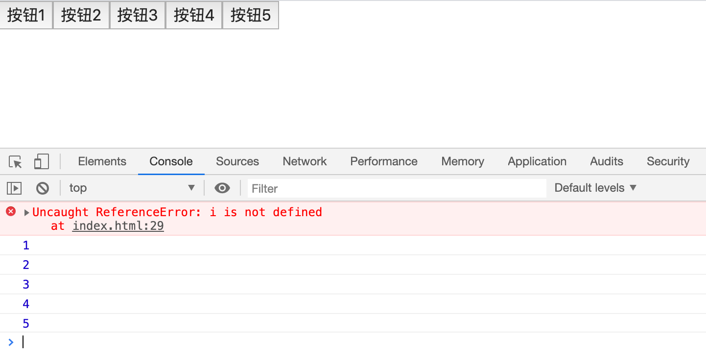

#  块级绑定 
# ES5声明变量的问题?

**使用var声明变量的问题？**

> 允许重复的变量声明：导致数据被覆盖
> 
> 
> 变量提升：怪异的数据访问、闭包问题
> 
> 
> 全局变量挂载到全局对象：全局对象成员污染问题

# ES6 let声明变量

## 解决声明变量的问题？

**全局变量挂载到全局对象：全局对象成员污染问题？**

> let声明的变量不会挂载到全局对象

**允许重复的变量声明：导致数据被覆盖问题？**

> let声明的变量，不允许当前作用域范围内重复声明
> 
> 在块级作用域中用let定义的变量，在作用域外不能访问（花括号结束，销毁块级作用域）

**变量提升：怪异的数据访问、闭包问题?**

- let 不会变量提升

> 使用let不会有变量提升，因此，不能在定义let变量之前使用它。
> 
> 
> 
> 
> 底层实现上，let声明的变量实际上也会有提升，但是，提升后会将其放入到“暂时性死区”，如果访问的变量位于暂时性死区，则会报错：“`Cannot access 'a' before initialization`”。
> 
> 当代码运行到该变量的声明语句时，会将其从暂时性死区中移除。

    console.log(a)
    leta=123;

- 循环中，会开启一个新的作用域

> 在循环中，用let声明的循环变量，会特殊处理，每次进入循环体，都会开启一个新的作用域，并且将循环变量绑定到该作用域（每次循环，使用的是一个全新的循环变量）。
> 
> 
> 
> 
> 在循环中使用let声明的循环变量，在循环结束后会销毁。

    letdiv=document.getElementById("divButtons");
    for (leti=1; i<=5; i++) {
    letbutton=document.createElement("button")
    button.innerHTML="按钮"+i;
    button.onclick=function () {
    console.log(i) //使用的是当前作用域中的i    }
    div.appendChild(button)
    }
    console.log(i); // 在循环中使用let声明的循环变量，在循环结束后会销毁。

## 块级作用域

ES6不仅引入let关键字用于解决变量声明的问题，同时引入了块级作用域的概念。

**块级作用域：**

> 代码执行时遇到花括号，会创建一个块级作用域，花括号结束，销毁块级作用域。

# 3 ES6 const声明常量

**const:**

> const和let完全相同。
> 
> 区别在于用const声明的变量，必须在声明时赋值，而且不可以重新赋值。

**在开发中，尽量使用const来声明变量，以保证变量的值不会随意篡改，原因如下：**

> 根据经验，开发中的很多变量，都是不会更改，也不应该更改的。
> 
> 
> 
> 
> 后续的很多框架或者是第三方JS库，都要求数据不可变，使用常量可以一定程度上保证这一点。

**注意的细节：**

- 常量地址不可变

> 常量不可变，是指声明的常量的内存空间不可变，并不保证内存空间中的地址指向的其他空间不可变。

    consta= {
    name: "kevin",
    age: 123};
    a.name="abc";
    console.log(a)          // {name: "abc", age: 123}

- 常量的命名

> **特殊的常量：**
> 
> 该常量从字面意义上，一定是不可变的，比如圆周率、月地距地或其他一些绝不可能变化的配置。通常，**该常量的名称全部使用大写，多个单词之间用下划线分割 **`PI、MOON_EARTH_DISTANCE`
> 
> 
> 
> 
> **普通的常量：**
> 
> 使用和之前一样的命名即可。

- 循环中

> 在 `for`循环中，循环变量不可以使用常量。

    for (const i; i<5; i++) {
    console.log(i)
    }

> `for in` 循环中，可以使用常量。

    varobj= {
    name:"kevin",
    age:1}
    for (constpropinobj) {
    console.log(prop)
    }

