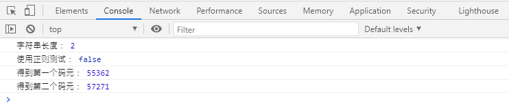
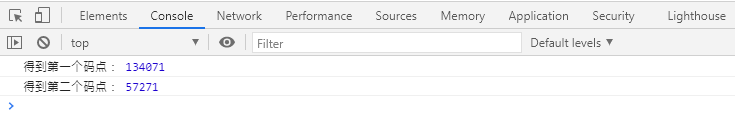
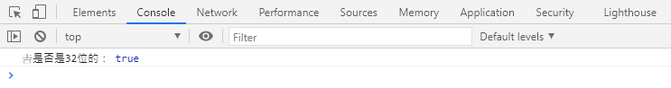
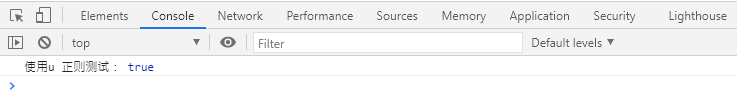
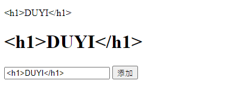

# 字符串和正则表达式 
# 更好的Unicode支持

**更好的Unicode支持：**

- 码元

> 早期，由于存储空间宝贵，Unicode使用16位二进制来存储文字。我们将一个16位的二进制编码叫做一个码元（Code Unit）。

    consttext="𠮷"; //占用了两个码元（32位）console.log("字符串长度：", text.length);
    console.log("使用正则测试：", /^.$/.test(text));        // 按码元匹配console.log("得到第一个码元：", text.charCodeAt(0));
    console.log("得到第二个码元：", text.charCodeAt(1));

- 码点

> 后来，由于技术的发展，Unicode对文字编码进行了扩展，将某些文字扩展到了32位（占用两个码元），并且，将某个文字对应的二进制数字叫做码点（Code Point）。
> ES6为了解决这个困扰，为字符串提供了方法：`codePointAt`，根据字符串码元的位置得到其码点。

    consttext="𠮷"; //占用了两个码元（32位）//𠮷：\ud842\udfb7console.log("得到第一个码点：", text.codePointAt(0));
    console.log("得到第二个码点：", text.codePointAt(1));

- 判断char

    consttext="𠮷"; //占用了两个码元（32位）/** * 判断字符串char，是32位，还是16位 * @param {*} char  */functionis32bit(char, i) {
    //如果码点大于了16位二进制的最大值，则其是32位的returnchar.codePointAt(i) >0xffff;
    }
    console.log("𠮷是否是32位的：", is32bit("𠮷", 0));

- 字符串码点长度

    /** * 得到一个字符串码点的真实长度 * @param {*} str  */functiongetLengthOfCodePoint(str) {
    varlen=0;
    for (leti=0; i<str.length; i++) {
    //i在索引码元if (is32bit(str, i)) {
    //当前字符串，在i这个位置，占用了两个码元i++;
            }
    len++;
        }
    returnlen;
    }

- 正则表达式`flag: u`

> 同时，ES6为正则表达式添加了一个`flag: u`，如果添加了该配置，则匹配时，使用码点匹配。

    consttext="𠮷"; //占用了两个码元（32位）console.log("使用u 正则测试：", /^.$/u.test(text));     // 按码点匹配

# 更多的字符串API

**字符串的实例（原型）方法：**

- `includes()`

> 判断字符串中是否包含指定的子字符串。
> 
> 第二个参数：可以指定位置。

- `startsWith()`

> 判断字符串中是否以指定的字符串开始。
> 
> 第二个参数：可以指定位置。

- `endsWith()`

> 判断字符串中是否以指定的字符串结尾。
> 
> 第二个参数：可以指定位置。

- `repeat()`​

> 将字符串重复指定的次数，然后返回一个新字符串。

# [扩展]正则中的粘连标记

**粘连标记：**

> 标记名： `y`
> 
> 
> 
> 
> 含义：匹配时，完全按照正则对象中的lastIndex位置开始匹配，并且匹配的位置必须在lastIndex位置。
> 
> 
> 
> 
> lastindex 可以更改。

    consttext="Hello World!!!";
    constreg=/W\w+/y;
    reg.lastIndex=3;
    console.log("reg.lastIndex:", reg.lastIndex)
    console.log(reg.test(text))

#  [扩展]模板字符串标记

**在模板字符串书写之前，可以加上标记:**

> `标记名`模板字符串``            相当于执行函数。
> 
> 
> 
> 
> **标记是一个函数，函数参数如下：**

>     参数1：被插值分割的字符串数组
> 
>     后续参数：所有的插值

- 案例

    varlove1="秋葵";
    varlove2="香菜";
    vartext=myTag`邓哥喜欢${love1}，邓哥也喜欢${love2}。`;
    //相当于： // text = myTag(["邓哥喜欢", "，邓哥也喜欢", "。"], "秋葵", "香菜")functionmyTag(parts) {
    constvalues=Array.prototype.slice.apply(arguments).slice(1);
    letstr="";
    for (leti=0; i<values.length; i++) {
    str+=`${parts[i]}：${values[i]}`;
    if (i===values.length-1) {
    str+=parts[i+1];
            }
        }
    returnstr;
    }
    console.log(text);

- 案例2 

    vartext=String.raw`abc\t\nbcd`;
    console.log(text);      // abc\t\nbcd

- 案例3

> 转义字符串处理。

    <body><divid="container">
<inputtype="text"id="txt"><buttonid="btn">添加</button></body>

