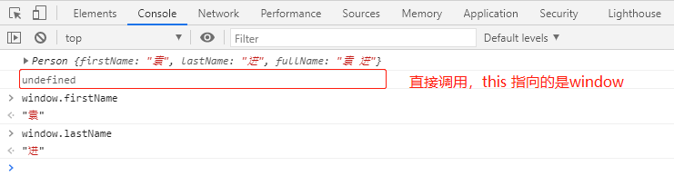
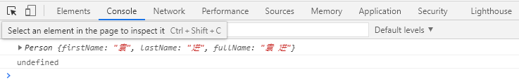
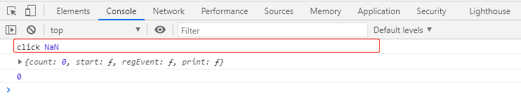
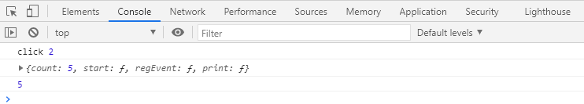
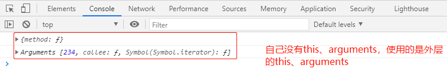

# 函数 
# 参数默认值

**使用：**

> 在书写形参时，直接给形参赋值，附的值即为默认值。
> 
> 
> 这样一来，当调用函数时，如果没有给对应的参数赋值（给它的值是undefined），则会自动使用默认值。

**[扩展]对arguments的影响？**

> 只要给函数加上参数默认值，该函数会自动变量严格模式下的规则：arguments和形参脱离。
> 
> 
> ES6 尽量不使用arguments。

**[扩展]留意暂时性死区：**

> 形参和ES6中的let或const声明一样，具有作用域，并且根据参数的声明顺序，存在暂时性死区。

# 剩余参数

**arguments的缺陷？**

> 如果和形参配合使用，容易导致混乱
> 
> 从语义上，使用arguments获取参数，由于形参缺失，无法从函数定义上理解函数的真实意图

**ES6剩余参数：**

> ES6的剩余参数专门用于收集末尾的所有参数，将其放置到一个形参数组中。
> 
> `function (...形参名) { }`

- 一个函数，仅能出现一个剩余参数

    functionsum(...args) {
    //args收集了所有的参数，形成的一个数组letsum=0;
    for (leti=0; i<args.length; i++) {
    sum+=args[i];
        }
    returnsum;
    }
    console.log(sum())
    console.log(sum(1, 2, 3, 4))

- 一个函数，如果有剩余参数，剩余参数必须是最后一个参数

    functiontest(a, b, ...args) {
    }
    test(1, 32, 46, 7, 34); 

# 展开运算符

## 对数组展开ES6

**使用方式：**

> `...数组`
> 
> 将数组的每一项展开，依次作为参数传递，而不是把整个数组作为一个参数传递

- 案例1 

    /** * 对所有数字求和 * @param  {...any} args  */functionsum(...args) {
    letsum=0;
    for (leti=0; i<args.length; i++) {
    sum+=args[i];
        }
    returnsum;
    }
    /** * 获取一个指定长度的随机数组成的数组 * @param {*} length  */functiongetRandomNumbers(length) {
    constarr= [];
    for (leti=0; i<length; i++) {
    arr.push(Math.random());
        }
    returnarr;
    }
    constnumbers=getRandomNumbers(10);
    //将数组的每一项展开，依次作为参数传递，而不是把整个数组作为一个参数传递console.log(sum(...numbers))//相当于传递了10个参数console.log(sum(1, 3, ...numbers, 3, 5))

## 对对象展开 ES7

**使用方式：**

> `...对象`

- 浅克隆

    constobj1= {
    name: "成哥",
    age: 18,
    love: "邓嫂",
    address: {
    country: "中国",
    province: "黑龙江",
    city: "哈尔滨"    }
    }
    // 浅克隆到obj2constobj2= {
    ...obj1,
    name: "邓哥"};
    console.log(obj2)
    console.log(obj1.address===obj2.address)      // true

- 深克隆

> 对象里面的对象也使用展开运算符克隆。

    constobj1= {
    name: "成哥",
    age: 18,
    loves: ["邓嫂", "成嫂1", "成嫂2"],
    address: {
    country: "中国",
    province: "黑龙江",
    city: "哈尔滨"    }
    }
    constobj2= {
    ...obj1,
    name: "邓哥",
    // address: {
    ...obj1.address    },
    loves: [...obj1.loves, "成嫂3"]
    };
    console.log(obj2)
    console.log(obj1.loves===obj2.loves)      // false

## 柯里化案例

**curry：**

> 柯里化，用户固定某个函数的前面的参数，返回一个新的函数；新的函数调用时，接收剩余的参数

    functioncal(a, b, c, d) {
    returna+b*c-d;
            }
    //curry：柯里化，用户固定某个函数的前面的参数，得到一个新的函数，新的函数调用时，接收剩余的参数functioncurry(func, ...args) {
    returnfunction(...subArgs) {
    constallArgs= [...args, ...subArgs];
    if (allArgs.length>=func.length) {
    //参数够了returnfunc(...allArgs);
                    } else {
    //参数不够，继续固定returncurry(func, ...allArgs);
                    }
                }
            }
    constnewCal=curry(cal, 1, 2)
    console.log(newCal(3, 4)) // 1+2*3-4console.log(newCal(4, 5)) // 1+2*4-5console.log(newCal(5, 6)) // 1+2*5-6console.log(newCal(6, 7)) // 1+2*6-7constnewCal2=newCal(8)
    console.log(newCal2(9)); // 1+2*8-9

# 明确函数的双重用途

**函数双重用途问题？**

> 用做构造函数，也可做普通函数。

    functionPerson(firstName, lastName) {
    this.firstName=firstName;
    this.lastName=lastName;
    this.fullName=`${firstName}${lastName}`;
            }
    constp1=newPerson("袁", "进");
    console.log(p1)
    constp2=Person("袁", "进");
    console.log(p2);

**判断是否是使用new的方式来调用的函数：**

- 过去判断是否是使用new的方式来调用函数的问题

> 可以使用 call 避开判断。

    functionPerson(firstName, lastName) {
    //过去的判断方式if (!(thisinstanceofPerson)) {
    thrownewError("该函数没有使用new来调用")
                }
    this.firstName=firstName;
    this.lastName=lastName;
    this.fullName=`${firstName}${lastName}`;
            }
    constp1=newPerson("袁", "进");
    console.log(p1)
    constp3=Person.call(p1, "袁", "进")
    console.log(p3);    

- ES6 提供的 `new.target` 方法

> ES6提供了一个特殊的API，可以使用该API在函数内部，判断该函数是否使用了new来调用 。
> 
> 
> 
> 
> **返回值：**
> 
> 如果没有使用new来调用函数，则返回undefined；
> 
> 如果使用new调用函数，则得到的是new关键字后面的函数本身。

    functionPerson(firstName, lastName) {
    //判断是否是使用new的方式来调用的函数if (new.target===undefined) {
    thrownewError("该函数没有使用new来调用")
                }
    this.firstName=firstName;
    this.lastName=lastName;
    this.fullName=`${firstName}${lastName}`;
            }
    constp1=newPerson("袁", "进");
    console.log(p1)
    constp2=Person("袁", "进");
    console.log(p2);
    constp3=Person.call(p1, "袁", "进")
    console.log(p3); 

# 箭头函数

解决this指向的问题。

## **this指向**回顾

**this指向：**

> 通过对象调用函数，this指向对象。
> 
> 直接调用函数，this指向全局对象。
> 
> 如果通过new调用函数，this指向新创建的对象。
> 
> 如果通过apply、call、bind调用函数，this指向指定的数据。
> 
> 如果是DOM事件函数，this指向事件源。

**案例：this指向问题？**

    constobj= {
    count: 0,
    start: function () {
    setInterval( function () {
    this.count++;
                    }, 1000)
                },
    regEvent: function () {
    window.onclick=function () {
    console.log('click', this.count);
                    }
                },
    print: function () {
    console.log(this);
    console.log(this.count);
                }
            }
    obj.start();
    obj.regEvent();
    setTimeout( function () {
    obj.print();
            }, 5000)

## 使用语法

箭头函数是一个函数表达式，理论上，任何使用函数表达式的场景都可以使用箭头函数。

- 完整语法

    (参数1, 参数2, ...) => {
    //函数体}

- 如果参数只有一个，可以省略小括号

    参数=> {
    }
    constprint=num=> {
    console.log("给我的数字是：", num)
    }
    print(2);

- 如果箭头函数只有一条返回语句，可以省略大括号，和return关键字

    参数=>返回值constisOdd=num=>num%2!==0;
    // 返回值为对象时constsum= (a, b) => ({
    a: a,
    b: b,
    sum: a+b});

- 箭头函数案例

    constobj= {
    count: 0,
    start: function () {
    setInterval( () => {
    this.count++;
                    }, 1000)
                },
    regEvent: function () {
    window.onclick= () => {
    console.log('click', this.count);
                    }
                },
    print: function () {
    console.log(this);
    console.log(this.count);
                }
            }
    obj.start();
    obj.regEvent();
    setTimeout( function () {
    obj.print();
            }, 5000)

## 注意细节

**细节：**

- 箭头函数中，不存在`this、arguments、new.target`，如果使用了，则使用的是函数外层的对应的`this、arguments、new.target`

    constobj= {
    method: function(){
    constfunc= () => {
    console.log(this)
    console.log(arguments)
                    }
    func()
                }
            }
    obj.method(234);

- 箭头函数没有原型

- 箭头函数不能作为构造函数使用

## 应用场景

**应用场景：**

- 临时性使用的函数

> 事件处理函数

> 异步处理函数

> 其他临时性的函数

- 为了绑定外层this的函数

- 保持代码简洁

> 在不影响其他代码的情况下，保持代码的简洁，最常见的，数组方法中的回调函数

    constnumbers= [3, 7, 78, 3, 5, 345];
    constresult=numbers.filter(num=>num%2!==0)
        .map(num=>num*2).reduce((a, b) =>a+b)
    console.log(result);    // 726