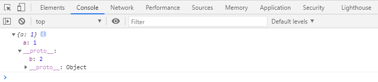
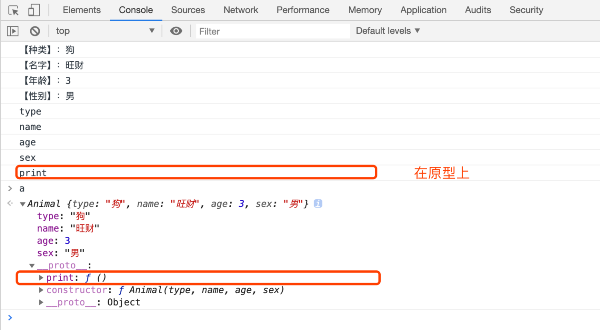
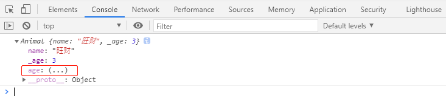
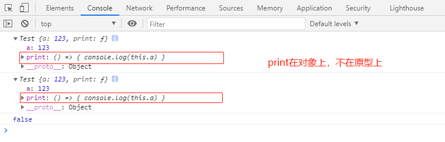
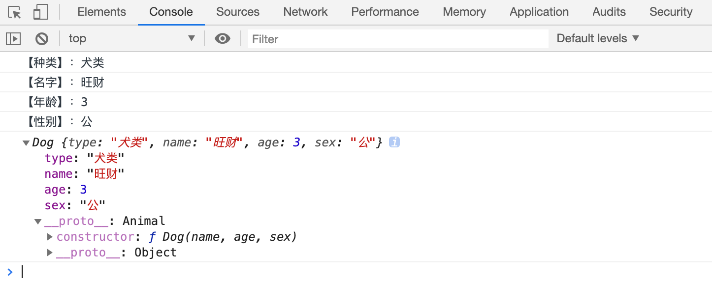
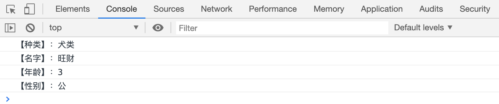
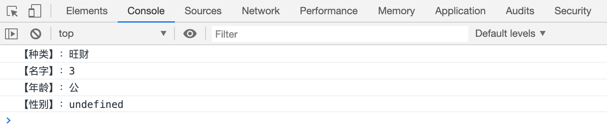

# 

# Object的新增API 

# Object的新增API

## 1.1 Object.is()

用于判断两个数据是否相等，基本上跟严格相等（===）是一致的，除了以下两点：

- NaN和NaN相等

- +0和-0不相等

  console.log(NaN===NaN); // falseconsole.log(+0===-0);  // trueconsole.log(Object.is(NaN, NaN))        // trueconsole.log(Object.is(+0, -0))          // false

## Object.assign()

**用于混合对象： **

> 第一个参数会被修改。
>
> 把`obj1、obj2、obj3`等对象混合到 第一个参数，返回第一个参数。

    constobj=Object.assign({}, obj1, obj2);

## Object.getOwnPropertyNames()

`Object.getOwnPropertyNames()`​ 方法之前就存在，只不过，官方没有明确要求，对属性的顺序如何排序，如何排序，完全由浏览器厂商决定。

**ES6规定了该方法****返回的数组的排序方式如下****：**

> 先排数字，并按照升序排序；
>
> 再排其他，按照书写顺序排序。

    constobj= {
    d: 1,
    b: 2,
    a: 3,
    0: 6,
    5: 2,
    4: 1}
    constprops=Object.getOwnPropertyNames(obj);
    console.log(props);         // ["0", "4", "5", "d", "b", "a"]

## Object.setPrototypeOf()

该函数用于设置某个对象的隐式原型。

> 比如： `Object.setPrototypeOf(obj1, obj2)`，相当于：  `obj1.__proto__ = obj2`

    constobj1= { a: 1 }
    constobj2= { b: 2 }
    // obj1.__proto__ = obj2Object.setPrototypeOf(obj1, obj2);
    console.log(obj1);

# 面向对象 

# 面向对象简介

**面向过程与面向对象的对比：**

- 面向过程

> 思考的切入点是功能的步骤。
>
> 适合小功能、小模块。

    //1. 冰箱门打开functionopenFrige(){
    }
    openFrige();
    //2. 大象装进去functionelephantIn(){
    }
    elephantIn();
    //3. 冰箱门关上functioncloseFrige(){
    }
    closeFrige();

- 面向对象

> 思考的切入点是对象的划分。
>
> 适合大项目。
>
> 确定对象，找名词。

    /** * 大象 */functionElephant() {
    }
    /** * 冰箱 */functionFrige() {
    }
    Frige.prototype.openDoor=function () {
    }
    Frige.prototype.closeDoor=function () {
    }
    Frige.prototype.join=function(something){
    this.openDoor();
    //装东西this.closeDoor();
    }
    //1. 冰箱门打开// var frig = new Frige();// frig.openDoor();// //2. 大象装进去// var ele = new Elephant();// frig.join(ele);// //3. 冰箱门关上// frig.closeDoor();varfrig=newFrige();
    frig.join(newElephant());

# 类：构造函数的语法糖

## 传统构造函数

**传统的构造函数的问题?**

> 属性和原型方法定义分离，降低了可读性；
>
> 原型成员可以被枚举；
>
> 默认情况下，构造函数仍然可以被当作普通函数使用；

    //面向对象中，将下面对一个对象的所有成员的定义，统称为类//构造函数  构造器functionAnimal(type, name, age, sex) {
    this.type=type;
    this.name=name;
    this.age=age;
    this.sex=sex;
    }
    //定义实例方法（通过定义原型方法）Animal.prototype.print=function () {
    console.log(`【种类】：${this.type}`);
    console.log(`【名字】：${this.name}`);
    console.log(`【年龄】：${this.age}`);
    console.log(`【性别】：${this.sex}`);
    }
    consta=newAnimal("狗", "旺财", 3, "男");
    a.print();
    // 枚举for (constpropina) {
    console.log(prop);      // 原型成员可以被枚举，可以打印print}

## ES6类

**ES6 类的特点：**

> 类声明不会被提升，与 let 和 const 一样，存在暂时性死区；
>
> 类中的所有代码均在严格模式下执行；
>
> 类的所有方法都是不可枚举的；
>
> 类的所有方法都无法被当作构造函数使用；
>
> 类的构造器`constructor`必须使用 new 来调用；

    classAnimal {
    // 构造器constructor(type, name, age, sex) {
    this.type=type;
    this.name=name;
    this.age=age;
    this.sex=sex;
        }
    // 是原型方法，会自动加到原型上print() {
    console.log(`【种类】：${this.type}`);
    console.log(`【名字】：${this.name}`);
    console.log(`【年龄】：${this.age}`);
    console.log(`【性别】：${this.sex}`);
        }
    }
    consta=newAnimal("狗", "旺财", 3, "男");
    a.print();
    for (constpropina) {
    console.log(prop);      // 所有方法都是不可枚举的,不会打印print}

# 类的其他书写方式 

# 类的其他书写方式

## 可计算的成员名

使用ES6 可计算的表达式`[]` 。

    constprintName="print";
    classAnimal {
    constructor(type, name, age, sex) {
    this.type=type;
    this.name=name;
        }
        [printName]() {
    console.log(`【种类】：${this.type},【名字】：${this.name}`);
        }
    }
    consta=newAnimal("狗", "旺财");
    a[printName]();     // 【种类】：狗,【名字】：旺财 

## getter和setter

对应 ES5 `Object.defineProperty` （属性描述符）：可定义某个对象成员属性的读取和设置。

**`get`****、****`set`**** ：**

> 使用`getter`和`setter`控制的属性，不在原型上。在实例上。

    constprintName="print";
    classAnimal {
    constructor(name , age) {
    this.name=name;
    this.age=age;
        }
    //创建一个age属性，并给它加上getter，读取该属性时，会运行该函数//age属性不在原型上。在实例上。getage() {
    returnthis._age+"岁";
        }
    //创建一个age属性，并给它加上setter，给该属性赋值时，会运行该函数//age属性不在原型上。在实例上。setage(age) {
    if (typeofage!=="number") {
    thrownewTypeError("age property must be a number");
            }
    if (age<0) {
    age=0;
            }
    elseif (age>1000) {
    age=1000;
            }
    this._age=age;
        }
        [printName]() {
    console.log(`【名字】：${this.name}，【年龄】：${this.age}`);
        }
    }
    vara=newAnimal( "旺财", 3);
    console.log(a);

## 静态成员

构造函数本身的成员。

使用`static`关键字定义的成员即静态成员。

    classChess {
    constructor(name) {
    this.name=name;
        }
    staticwidth=50;
    staticheight=50;
    staticmethod() {
        }
    }
    console.log(Chess.width)
    console.log(Chess.height)
    Chess.method();

## 字段初始化器（ES7）

**字段初始化：**

- 使用static

> 使用static的字段初始化器，添加的是静态成员。
>
> 
>
>
> 没有使用static的字段初始化器，添加的成员位于对象上。

    classTest {
    statica=1;           // 使用static，添加的是静态成员b=2;      // 相当于在构造器中 this.b = 2; c=3;    // 相当于在构造器中 this.c = 3; constructor() {
    this.d=this.b+this.c;
        }
    }
    constt=newTest();
    console.log(t)          // Test {b: 2, c: 3, d: 5}

- 使用箭头函数

> 使用箭头函数在字段初始化器位置上，添加的方法位于对象上。（缺点：浪费内存空间；优点：绑定了this）
>
> 
>
>
> 没有使用箭头函数在字段初始化器位置上，添加的方法位于原型上。

    classTest {
    constructor() {
    this.a=123;
        }
    // 注意：箭头函数在字段初始化器位置上，指向当前对象。print= () => {
    console.log(this.a)
        }
    }
    constt1=newTest();
    constt2=newTest();
    console.log(t1);
    console.log(t2);
    console.log(t1.print===t2.print);     // 在t1、t2 上，不在原型上

## 类表达式

**匿名类：**

    constA=class { //匿名类，类表达式        返回一个类a=1;
    b=2;
    }
    consta=newA();      
    console.log(a)

## [扩展]装饰器（ES7）(Decorator)

**装饰器：**

> 横切关注点。

> 装饰器的本质是一个函数。

    classTest {
    @Obsoleteprint() {
    console.log("print方法")
        }
    }
    functionObsolete(target, methodName, descriptor) {
    // function Test// print// { value: function print(){}, ... }// console.log(target, methodName, descriptor);constoldFunc=descriptor.valuedescriptor.value=function (...args) {
    console.warn(`${methodName}方法已过时`);
    oldFunc.apply(this, args);
        }
    }

# 类的继承

## 继承关系

如果两个类A和B，如果可以描述为：B 是 A，则，A和B形成继承关系

**如果B是A，则：**

1. B继承自A
2. A派生B
3. B是A的子类
4. A是B的父类

如果A是B的父类，则B会自动拥有A中的所有实例成员。

**ES5继承：**

> 通过原型链。

    functionAnimal(type, name, age, sex) {
    this.type=type;
    this.name=name;
    this.age=age;
    this.sex=sex;
    }
    Animal.prototype.print=function () {
    console.log(`【种类】：${this.type}`);
    console.log(`【名字】：${this.name}`);
    console.log(`【年龄】：${this.age}`);
    console.log(`【性别】：${this.sex}`);
    }
    functionDog(name, age, sex) {
    //借用父类的构造函数Animal.call(this, "犬类", name, age, sex);
    }
    Object.setPrototypeOf(Dog.prototype, Animal.prototype);
    constd=newDog("旺财", 3, "公");
    d.print();
    console.log(d);

## 继承

**新的关键字：**

- `extends`

> 继承，用于类的定义

- `super`

> 直接当作函数调用，表示父类构造函数;
>
> 如果当作对象使用，则表示父类的原型。    `super.print();`

**注意：**

> ES6要求，如果定义了constructor，并且该类是子类，则必须在constructor的第一行手动调用父类的构造函数。

    classAnimal {
    constructor(type, name, age, sex) {
    this.type=type;
    this.name=name;
    this.age=age;
    this.sex=sex;
                }
    print() {
    console.log(`【种类】：${this.type}`);
    console.log(`【名字】：${this.name}`);
    console.log(`【年龄】：${this.age}`);
    console.log(`【性别】：${this.sex}`);
                }
            }
    classDogextendsAnimal {
    constructor(name, age, sex) {
    super("犬类", name, age, sex);
                }
            }
    constd=newDog("旺财", 3, "公");
    d.print();

> 如果子类不写constructor，则会有默认的构造器，该构造器需要的参数和父类一致，并且自动调用父类构造器

    classAnimal {
    constructor(type, name, age, sex) {
    this.type=type;
    this.name=name;
    this.age=age;
    this.sex=sex;
                }
    print() {
    console.log(`【种类】：${this.type}`);
    console.log(`【名字】：${this.name}`);
    console.log(`【年龄】：${this.age}`);
    console.log(`【性别】：${this.sex}`);
                }
            }
    classDogextendsAnimal {
            }
    constd=newDog("旺财", 3, "公");
    d.print();

## 冷知识

**用JS制作抽象类：**

> 抽象类：一般是父类，不能通过该类创建对象。

    classAnimal {
    constructor(type, name, age, sex) {
    if (new.target===Animal) {
    thrownewTypeError("你不能直接创建Animal的对象，应该通过子类创建")
            }
    this.type=type;
    this.name=name;
    this.age=age;
    this.sex=sex;
        }
    print() {
    console.log(`【种类】：${this.type}`);
    console.log(`【名字】：${this.name}`);
    console.log(`【年龄】：${this.age}`);
    console.log(`【性别】：${this.sex}`);
        }
    jiao() {
    thrownewError("动物怎么叫的？");
        }
    }
    classDogextendsAnimal {
    constructor(name, age, sex) {
    super("犬类", name, age, sex);
    // 子类特有的属性this.loves="吃骨头";
        }
    print() {
    //调用父类的printsuper.print();
    //自己特有的代码console.log(`【爱好】：${this.loves}`);
        }
    //同名方法，会覆盖父类jiao() {
    console.log("旺旺！");
        }
    }
    consta=newDog("旺财", 3, "公")
    a.print();
    // 你不能直接创建Animal的对象，应该通过子类创建constb=newAnimal("旺财", 3, "公")
    b.print();

**this指向：**

> 正常情况下，this的指向，this始终指向具体的类的对象。

