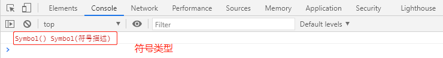
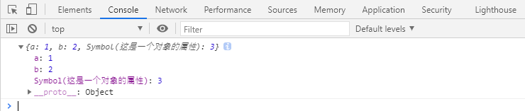
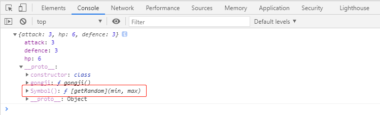

# 符号 
# 普通符号

## 符号

**符号：**

> 符号是ES6新增的一个数据类型，它通过使用函数 `Symbol(符号描述)`来创建。
> 
> 
> 
> 
> 符号设计的初衷，是为了给对象设置私有属性。
> 
> 私有属性：只能在对象内部使用，外面无法使用。

    // 创建一个符号constsyb1=Symbol();
    constsyb2=Symbol('符号描述');
    console.log(syb1, syb2);

## 符号特点

**符号特点：**

- 没有字面量

- 使用 typeof 得到的类型是 `symbol`

- 每次调用 Symbol 函数得到的符号永远不相等，无论符号名是否相同

    // 创建一个符号constsyb1=Symbol('abc');
    constsyb2=Symbol('abc');
    console.log(syb1===syb2);     // false

- 符号可以作为对象的属性名存在，这种属性称之为**符号属性**

> 使用可计算属性名`[]` 。

    // 创建一个符号constsyb1=Symbol('这是一个对象的属性');
    constobj= {
    a: 1,
    b: 2,
        [syb1]: 3}
    console.log(obj);   

****

**
**

> **设计私有属性：**
> 
> 开发者可以通过精心的设计，让这些属性无法通过常规方式被外界访问。
> 
> 立即执行函数。
> 局部符号，外面调用不到。只能在内部使用。

    // const hero = (function () {constHero= (() => {
    constgetRandom=Symbol();
    returnclass {
    constructor(attack, hp, defence) {
    this.attack=attack;
    this.hp=hp;
    this.defence=defence;
            }
    gongji() {
    //伤害：攻击力*随机数（0.8~1.1)// 注意：符号属性调用的调用方法，使用可计算属性名 []constdmg=this.attack*this[getRandom](0.8, 1.1);
    console.log(dmg);
            }
            [getRandom](min, max) { //根据最小值和最大值产生一个随机数returnMath.random() * (max-min) +min;
            }
        }
    })();
    consth=newHero(3, 6, 3);
    console.log(h);

- 符号属性是不能枚举的，因此在 for-in 循环中无法读取到符号属性，`Object.keys` 方法也无法读取到符号属性

    constsyb=Symbol();
    constobj= {
        [syb]: 1,
    a: 2,
    b: 3}
    for (constpropinobj) {
    console.log(prop);          // a b }
    console.log(Object.keys(obj))   // ["a", "b"]

- `Object.getOwnPropertyNames` 尽管可以得到所有无法枚举的属性，但是仍然无法读取到符号属性

    console.log(Object.getOwnPropertyNames(obj))        //  ["a", "b"]

- ES6 新增 `Object.getOwnPropertySymbols` 方法，可以读取符号

    // //得到的是一个符号属性的数组constsybs=Object.getOwnPropertySymbols(obj);
    console.log(sybs);          // [Symbol()]console.log(sybs[0] ===syb);       // true

> 通过`Object.getOwnPropertySymbols` 来调用通过符号设计的私有属性 。

    consth=newHero(3, 6, 3);
    constsybs=Object.getOwnPropertySymbols(Hero.prototype);
    constprop=sybs[0];
    console.log(h[prop](3, 5))

- 符号无法被隐式转换

> 因此不能被用于数学运算、字符串拼接或其他隐式转换的场景；
> 
> 符号可以显式的转换为字符串，通过 String 构造函数进行转换即可；
> 
> console.log 之所以可以输出符号，是它在内部进行了显式转换。

# 共享符号

**共享符号：**

> 根据某个符号名称（符号描述）能够得到同一个符号。
> 
> 通过`Symbol.for`  创建。    

- 创建

    constsyb1=Symbol.for("abc");
    constsyb2=Symbol.for("abc");
    constsyb3=Symbol.for();
    constsyb4=Symbol.for();
    console.log(syb1===syb2);         // trueconsole.log(syb3===syb4);         // true

- 符号属性

    constsyb1=Symbol.for("abc");
    constobj1= {
    a: 1,
    b: 2,
        [syb1]: 3}
    console.log(obj1);          // {a: 1, b: 2, Symbol(abc): 3}

- 获取

> `Symbol.for("符号名/符号描述") `   //获取共享符号

    constobj= {
    a: 1,
    b: 2,
        [Symbol.for("c")]: 3}
    console.log(obj[Symbol.for("c")]);          // 3 

# 知名（公共、具名）符号

**知名符号：**

> 知名符号是一些具有特殊含义的共享符号，通过 Symbol 的静态属性得到。

**ES6 延续了 ES5 的思想：**

> 减少魔法，暴露内部实现！
> 因此，ES6 用知名符号暴露了某些场景的内部实现。

- `Symbol.hasInstance`

> 该符号用于定义构造函数的静态成员，它将影响 instanceof 的判定。

    constobj=newA();
    functionA() {
    }
    console.log(objinstanceofA);              // true// 等效于console.log(A[Symbol.hasInstance](obj));    //true

> **参与js内部实现：**使所有的判断都为false

    Object.defineProperty(A, Symbol.hasInstance, {
    value: function (obj) {
    returnfalse;
        }
    })
    constobj=newA();
    functionA() {
    }
    console.log(objinstanceofA);                              // falseconsole.log(A[Symbol.hasInstance](obj));            // false

- `Symbol.isConcatSpreadable`

> 该知名符号会影响数组的 concat 方法。

    constarr= [3];
    constarr2= [5, 6, 7, 8];
    constresult=arr.concat(56, arr2)
    console.log(result)                 //  [3, 56, 5, 6, 7, 8]

> **参与js内部实现：**使数组不展开拼接

    constarr= [3];
    constarr2= [5, 6, 7, 8];
    arr2[Symbol.isConcatSpreadable] =false;
    constresult=arr.concat(56, arr2)
    console.log(result)     // [3, 56, [5,6,7,8]]

- `Symbol.toPrimitive`

> 该知名符号会影响类型转换的结果。

> **参与js内部实现：**修改类型转换的结果

    constobj= {
    a: 1,
    b: 2}
    obj[Symbol.toPrimitive] =function () {
    return2;
    }
    console.log(obj*123);             // 246 
    
    classTemperature {
    constructor(degree) {
    this.degree=degree;
        }
        [Symbol.toPrimitive](type) {
    if (type==="default") {
    returnthis.degree+"摄氏度";
            }
    elseif (type==="number") {
    returnthis.degree;
            }
    elseif (type==="string") {
    returnthis.degree+"℃";
            }
        }
    }
    constt=newTemperature(30);
    console.log(t+"!");                       // 30摄氏度!console.log(t/2);                         // 15console.log(String(t));                 // 30℃

- `Symbol.toStringTag`​

> 该知名符号会影响 `Object.prototype.toString` 的返回值

    classPerson {
    }
    constp=newPerson();
    console.log(Object.prototype.toString.apply(p));        // [object Object]

> **参与js内部实现：**修改 `Object.prototype.toString` 的返回值

    classPerson {
        [Symbol.toStringTag] ="Person1"}
    constp=newPerson();
    console.log(Object.prototype.toString.apply(p));        // [object Person1]

- 其他知名符号