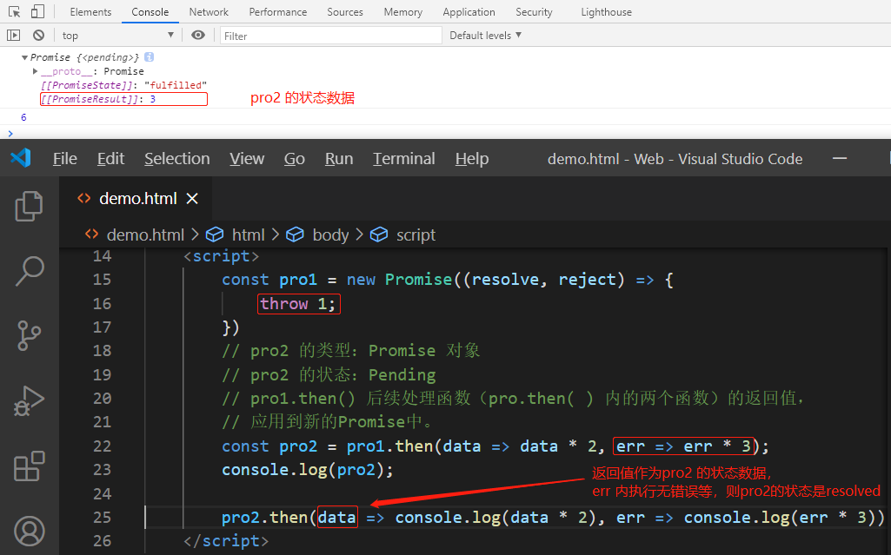
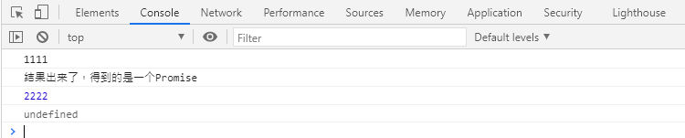
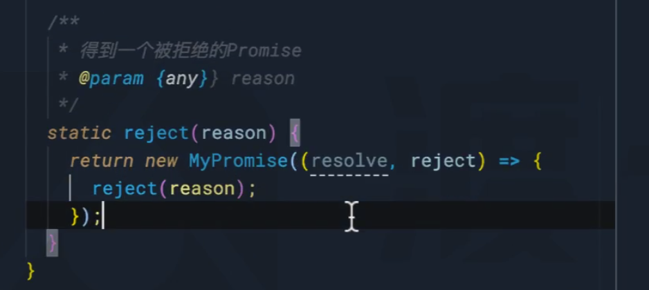

# 事件和回调函数的缺陷

**我们习惯于使用传统的回调或事件处理来解决****异步问题****？**

- 事件 

> 某个对象的属性是一个函数，当发生某一件事时，运行该函数。

    dom.onclick=function(){
    }

- 回调 

> 运行某个函数以实现某个功能的时候，传入一个函数作为参数，当发生某件事的时候，会运行该函数。

    dom.addEventListener("click", function(){
    })

- 问题

> 本质上，事件和回调并没有本质的区别，只是把函数放置的位置不同而已。

> 一直以来，该模式都运作良好。直到前端工程越来越复杂...。

**目前，该模式主要面临以下两个问题？**

- 回调地狱

> 某个异步操作需要等待之前的异步操作完成，无论用回调还是事件，都会陷入不断的嵌套。

- 异步之间的联系

> 某个异步操作要等待多个异步操作的结果，对这种联系的处理，会让代码的复杂度剧增。


# 异步处理的通用模型

**异步处理的通用模型：**

> ES官方参考了大量的异步场景，总结出了一套异步的通用模型，该模型可以覆盖几乎所有的异步场景，甚至是同步场景。
>
> 
>
>
> 值得注意的是，为了兼容旧系统，ES6 并不打算抛弃掉过去的做法，只是基于该模型推出一个全新的 API `Promise`，使用该API，会让异步处理更加的简洁优雅。

**理解该 API ****`Promise`****，最重要的，是理解它的异步模型：**

- ES6 将某一件可能发生异步操作的事情，分为两个阶段：**unsettled** 和 **settled**


> unsettled：
>
> 未决阶段，表示事情还在进行前期的处理，并没有发生通向结果的那件事。
>
> 
>
>
> settled：
>
> 已决阶段，事情已经有了一个结果，不管这个结果是好是坏，整件事情无法逆转。
>
> 
>
>
> 事情总是从 未决阶段 逐步发展到 已决阶段的。并且，未决阶段拥有控制何时通向已决阶段的能力。

- ES6将事情划分为三种状态：` pending、resolved、rejected`

> pending：
>
> 挂起，处于未决阶段，则表示这件事情还在挂起（最终的结果还没出来）。

> resolved：
>
> 已处理，已决阶段的一种状态，表示整件事情已经出现结果，并是一个可以按照正常逻辑进行下去的结果。

> rejected：
>
> 已拒绝，已决阶段的一种状态，表示整件事情已经出现结果，并是一个无法按照正常逻辑进行下去的结果，通常用于表示有一个错误。

- **unsettled** 到 **settled **的过程

> 未决阶段有权力决定事情的走向，因此，未决阶段可以决定事情最终的状态！

> 我们把事情变为resolved状态的过程叫做：**resolve**，推向该状态时，可能会传递一些数据（状态数据）。

> 我们把事情变为rejected状态的过程叫做：**reject**，推向该状态时，同样可能会传递一些数据（状态数据），通常为错误信息。

**始终记住，无论是阶段，还是状态，是不可逆的！**


- 后续处理

> 当事情达到已决阶段后，通常需要进行后续处理，不同的已决状态，决定了不同的后续处理。

> resolved状态：这是一个正常的已决状态，后续处理表示为 thenable。

> rejected状态：这是一个非正常的已决状态，后续处理表示为 catchable。
>
> 
>
> 后续处理可能有多个，因此会形成作业队列，这些后续处理会按照顺序，当状态到达后依次执行。


- 整件事称之为Promise


# Promise的基本使用

**基本使用：**

```js
constpro=newPromise((resolve, reject)=>{
// 未决阶段的处理// 通过调用resolve函数将Promise推向已决阶段的resolved状态// 通过调用reject函数将Promise推向已决阶段的rejected状态// resolve和reject均可以传递最多一个参数，表示推向状态的数据})
pro.then(data=>{
//这是thenable函数，如果当前的Promise已经是resolved状态，该函数会立即执行//如果当前是未决阶段，则会加入到作业队列，等待到达resolved状态后执行//data为状态数据}, err=>{
//这是catchable函数，如果当前的Promise已经是rejected状态，该函数会立即执行//如果当前是未决阶段，则会加入到作业队列，等待到达rejected状态后执行//err为状态数据})
```

**细节：**

> 未决阶段的处理函数是同步的，会立即执行。
>
>
> thenable和catchable函数是异步的，就算是立即执行，也会加入到事件队列中等待执行，并且，加入的队列是微队列。
>
> `pro.then`可以只添加thenable函数，`pro.catch`可以单独添加catchable函数。
>
>
> 在未决阶段的处理函数中，如果发生未捕获的错误，会将状态推向rejected，并会被catchable捕获。
>
>
> 一旦状态推向了已决阶段，无法再对状态做任何更改。
>
> **Promise并没有消除回调，只是让回调变得****可控。**

# 案例

## resolved

- 案例1 

```js
- constpro=newPromise((resolve, reject) => {
console.log("未决阶段")
resolve(123);       
        })
pro.then(data=> {
// pro的状态是resolvedconsole.log(data);
        })


```

> resolved
>
> 123 


- 案例2

```js
- constpro=newPromise( (resolve, reject) => {
console.log('resolved');
setTimeout(() => {
resolve('100');
            }, 1000);
        })
pro.then(data=> {
// pro的状态是pendingconsole.log('A'+data);
        })
pro.then(data=> {
// pro的状态是pendingconsole.log('B'+data);
        })
pro.then(data=> {
// pro的状态是pendingconsole.log('C'+data);
        })


```

> resolved
>
> A100
>
> B100
>
> C100

- 案例3 

```js
constpro=newPromise((resolve, reject) => {
console.log("a")
resolve(1);
setTimeout(() => {
console.log("b")
            }, 0);
        })
//pro: resolvedpro.then(data=> {
console.log(data)
        })
console.log("c")
```

> **结果：**微队列比宏队列先执行。
>
> a
>
> c
>
> 1
>
> b 

## rejected

- 案例1 

  constpro=newPromise((resolve, reject) => {
  thrownewError("123"); // pro: rejected        })
  pro.then(data=> {
  console.log(data)
          })
  pro.catch(err=> {
  console.log(err)
          })


- 案例2

  ```
  constpro=newPromise((resolve, reject) => {
  reject(newError("rejected!!!!"));
          })
  pro.then(data=> {
  console.log(data);
          }, err=> {
  console.log(err)
          })
  ```

  


- 案例3

```js
constpro=newPromise((resolve, reject) => {
thrownewError("abc");
resolve(1); //无效reject(2); //无效resolve(3); //无效reject(4); //无效        })
pro.then(data=> {
console.log(data)
        })
pro.catch(err=> {
console.log(err)
        })
```


# Promise的串联

**Promise 的串联：**

> 当后续的Promise需要用到之前的Promise的处理结果时，需要Promise的串联。

## Promise的返回值

**Promise 的返回值：**

> Promise对象中，无论是then方法还是catch方法，它们都具有返回值，返回的是一个全新的Promise对象。
>
> 它的状态满足下面的规则：

1. 如果当前的Promise是未决的，得到的新的Promise是挂起状态

2. 如果当前的Promise是已决的，会运行响应的后续处理函数（**pro.then( ) 内的两个函数**），并将后续处理函数的结果（返回值）作为**resolved状态数据**，应用到新的Promise中；
3. 如果后续处理函数发生错误，则把返回值作为rejected状态数据，应用到新的Promise中。

- 返回值

> pro1 的状态是 resolved。
>
> pro2 得到 `pro1.then` 是异步过程，所以pro2 的状态是pending。 

    constpro1=newPromise((resolve, reject) => {
    resolve(11111);
            })
    // pro2 的类型：Promise 对象// pro2 的状态：Pendingconstpro2=pro1.then(data=>data*2);
    console.log(pro2);


- 状态数据

> 后续处理函数（**pro.then( ) 内的两个函数**）的返回值，应用到新的Promise中。

    constpro1=newPromise((resolve, reject) => {
    resolve(11111);
            })
    // pro2 的类型：Promise 对象// pro2 的状态：Pending// pro1.then() 后续处理函数（pro.then( ) 内的两个函数）的返回值，应用到新的Promise中。constpro2=pro1.then(data=>data*2);
    console.log(pro2);
    pro2.then(data=>console.log(data), err=>console.log(err));


- 串联案例




## 后续处理函数返回Promise

**Promise 的后续处理函数的返回值****是Promise****：**

> 后续的Promise一定会等到前面的Promise有了后续处理结果后，才会变成已决状态。
>
> 如果前面的Promise的后续处理函数，返回的是一个Promise，则返回的新的Promise状态和后续处理返回的Promise状态保持一致。

- 后续处理函数返回 resolved 的Promise

> 状态数据等于pro2 的状态数据。

    constpro1=newPromise((resolve, reject) => {
    resolve(1);
            })
    constpro2=newPromise((resolve, reject) => {
    resolve(200);
            })
    constpro3=pro1.then(data=>pro2, err=>pro2);
    console.log(pro3);


- 后续处理函数返回 rejected 的Promise

  constpro1=newPromise((resolve, reject) => {
  resolve(1);
          })
  constpro2=newPromise((resolve, reject) => {
  throw300;
          })
  constpro3=pro1.then(data=>pro2, err=>pro2);
  console.log(pro3);


- 串联案例

  constpro1=newPromise((resolve, reject) => {
  console.log('1111');
  resolve(1);
          })
  constpro2=newPromise((resolve, reject) => {
  setTimeout(() => {
  resolve(2222);
              }, 3000);
          })
  pro1.then(result=> {
  console.log("结果出来了，得到的是一个Promise")
  returnpro2;
          }).then(result=> {
  console.log(result)
          }).then(result=> {
  console.log(result)
          })

> 3秒后输出2222,
>
> 上一个没有返回值。所以输出undefiend。




# Promise的其他api

## 原型成员 (实例成员)

**原型成员上：**

- then

> 参数1个：注册一个后续处理函数，当Promise为resolved状态时运行该函数。
>
> 
>
>
> 参数2个：注册 `resolved 、 rejected` 两种状态运行的后续处理函数。

    constpro=newPromise((resolve, reject) => {
    reject(1);
            })
    pro.then(resp=>console.log("resolved1", resp*1));
    pro.then(resp=>console.log("resolved2", resp*1),
    err=>console.log('rejected2', err*2));


- catch

> 注册一个后续处理函数，当Promise为rejected状态时运行该函数。

    constpro=newPromise((resolve, reject) => {
    reject(1);
            })
    pro.then(resp=>console.log("resolved2", resp*1),
    err=>console.log('rejected2', err*2));
    pro.catch(resp=>console.log("catch1", resp*2));


- finally

> [ES2018]注册一个后续处理函数（无参），当Promise为已决时运行该函数。
>
> `resolved 、 rejected` 两种状态都会运行finally 注册的后续处理函数。

    constpro=newPromise((resolve, reject) => {
    reject(1);
            })
    pro.finally(() =>console.log("finally1"))
    pro.finally(() =>console.log("finally2"))
    pro.then(resp=>console.log("then1", resp*1));
    pro.then(resp=>console.log("then2", resp*2));
    pro.catch(resp=>console.log("catch1", resp*1));
    pro.catch(resp=>console.log("catch2", resp*2));


## 构造函数成员（静态成员）

**构造函数成员：**

- resolve(数据)：

> 该方法返回一个resolved状态的Promise，传递的数据作为状态数据。

    // const pro = new Promise((resolve, reject) => {//     resolve(1);// })//等效于：constpro=Promise.resolve(1);

> 特殊情况：如果传递的数据是Promise，则直接返回传递的Promise对象

    constp=newPromise((resolve, reject) => {
    resolve(3);
            })
    // const pro = Promise.resolve(p);//等效于constpro=p;
    console.log(pro===p)

- reject(数据)

> 该方法返回一个rejected状态的Promise，传递的数据作为状态数据

    // const pro = new Promise((resolve, reject) => {//     reject(1);// })//等效于：constpro=Promise.reject(1);

- `all(iterable)`​

> 参数：​`Promise 的数组`​
>
> 
>
>
> 这个方法返回一个新的promise对象，该promise对象在iterable参数对象里所有的promise对象都成功的时候才会触发成功；
>
> 一旦有任何一个iterable里面的promise对象失败则立即触发该promise对象的失败。
>
> 
>
>
> 这个新的promise对象在触发成功状态以后，会把一个包含iterable里所有promise返回值的数组作为成功回调的返回值，顺序跟iterable的顺序保持一致；
>
> 如果这个新的promise对象触发了失败状态，它会把iterable里第一个触发失败的promise对象的错误信息作为它的失败错误信息。
>
> 
>
>
> `Promise.all` 方法常被用于处理多个promise对象的状态集合。

    functiongetRandom(min, max) {
    returnMath.floor(Math.random() * (max-min)) +min;
            }
    constproms= [];
    for (leti=0; i<10; i++) {
    proms.push(newPromise((resolve, reject) => {
    setTimeout(() => {
    if (Math.random() <0.5) {
    console.log(i, "完成");
    resolve(i);
                        } else {
    console.log(i, "失败")
    reject(i);
                        }
                    }, getRandom(1000, 5000));
                }))
            }
    //等到所有的promise变成resolved状态后输出: 全部完成constpro=Promise.all(proms)
    pro.then(datas=> {
    // datas ： proms中每一个Promise resolved后的状态数据 形成的数组console.log("全部完成", datas);
            })
    pro.catch(err=> {
    console.log("有失败的", err);
            })
    console.log(proms);

- race(iterable)

> 当iterable参数里的任意一个子promise被成功或失败后，父promise 就立即触发对应的后续执行函数。

    functiongetRandom(min, max) {
    returnMath.floor(Math.random() * (max-min)) +min;
            }
    constproms= [];
    for (leti=0; i<10; i++) {
    proms.push(newPromise((resolve, reject) => {
    setTimeout(() => {
    if (Math.random() <0.5) {
    console.log(i, "完成");
    resolve(i);
                        } else {
    console.log(i, "失败")
    reject(i);
                        }
                    }, getRandom(1000, 5000));
                }))
            }
    // 只要有成功、或失败 就立即触发后续执行函数constpro=Promise.race(proms)
    pro.then(data=> {
    console.log("有人完成了", data);
            })
    pro.catch(err=> {
    console.log("有人失败了", err);
            })
    console.log(proms);


# [扩展]手写Promise 

# promise A+

- 必须是一个对象

- 必须有then方法，then 必须是一个函数

  /**

   * 5.4 判断一个Promise对象
   * @param {any} obj 
     */
     function isPromise(obj) {
     return !!(obj && typeof obj === 'object' && typeof obj.then === 'function')
     }

## 状态控制

减少变量污染：立即执行函数。

    const MyPromise = (() => {
        const PENDING = 'pending',
              RSEOLVED = 'resolved',
              REJECTED = 'rejected';
              PromiseStatus = Symbol('PromiseStatus'),
              PromiseValue = Symbol('PromiseValue'),
              ChangeStatus = Symbol('ChangeStatus');
    
        return class MyPromise {
    
            /**
             * @param {*} executor 未决阶段（pending状态）下的处理函数
             */
            constructor (executor) {
                // MyPromise 初始状态
                this[PromiseStatus] = PENDING;
                this[PromiseValue] = undefined;
                
                const resolve = (data) => {
                    this[ChangeStatus](RSEOLVED, data);
                }
    
                const reject = (data) => {
                    this[ChangeStatus](REJECTED, data);
                }
    
                try {
                    executor(resolve, reject);
                // 捕获rejected 的错误
                } catch(err) {
                    reject(err);
                }
            }


​            

            // 改变MyPromise 的方法，定义在原型上
            [ChangeStatus](status, value) {
                if (this[PromiseStatus] != PENDING) {
                    return ;
                }
                this[PromiseStatus] = status;
                this[PromiseValue] = value;
            }
        }
    })()
    
    // 1、记录Promise的三种状态
    const PENDING = 'pending'
    const FULFILLED = 'fulfilled'
    const REJECTED = 'rejected'
    
    class MyPromise {
        constructor(exec) {
            this._status = PENDING
            this._value = undefined
            
            // 2、执行resolve、reject
            try {
                // new MyPromise((resolve, reject) => {resolve()})时，resolve()、reject() 是直接调用，this 指向window；
                // 所以需更改this 指向；
                exec(this._resolve.bind(this), this._reject.bind(this))
            } catch (error) {
                // 捕获异常，设置状态为REJECTED
                this._reject(error)
                console.log(error)
            }
        }
    
        // 3、resolve、reject 状态处理
        // 不希望别人调用（私有方法），以下划线开头命名
        _changeStatus(status, value) {  
            if (this._status !== PENDING) {
                return
            }
            this._status = status
            this._value = value
        }
        _resolve(value) {
            this._changeStatus(FULFILLED, value)
        }
        _reject(value) {
            this._changeStatus(REJECTED, value)
        }
    }
    
    const pro = new MyPromise((resolve, reject) => {
        reject(10)
        resolve(199)
    })
    console.log(pro)

## 模拟执行微队列

    // 4、模拟执行微队列
    /**
     * 运行一个微队列任务
     * 把传递的函数放到微队列中
     * @param {Function} callback 
     */
    function runMicroTask(callback) {
        // 判断node环境
        // 为了避免「变量未定义」的错误，这里最好加上前缀globalThis
        // globalThis是一个关键字，指代全局对象，浏览器环境为window，node环境为global
        if (globalThis.process && globalThis.process.nextTick) {
            process.nextTick(callback);
          } else if (globalThis.MutationObserver) {
            const p = document.createElement('p');
            const observer = new MutationObserver(callback);
            observer.observe(p, {
              childList: true, // 观察该元素内部的变化
            });
            p.innerHTML = '1';
          } else {
            setTimeout(callback, 0);
          }
    }


## 执行队列

    // 1、记录Promise的三种状态
    const PENDING = 'pending'
    const FULFILLED = 'fulfilled'
    const REJECTED = 'rejected'
    
    class MyPromise {
        constructor(exec) {
            this._status = PENDING
            this._value = undefined
            this._handlers = [] // 后续处理函数形成的队列
            
            // 2、执行resolve、reject
            try {
                // new MyPromise((resolve, reject) => {resolve()})时，resolve()、reject() 是直接调用，this 指向window；
                // 所以需更改this 指向；
                exec(this._resolve.bind(this), this._reject.bind(this))
            } catch (error) {
                // 捕获异常，设置状态为REJECTED
                this._reject(error)
                console.log(error)
            }
        }
    
        // 3、resolve、reject 状态处理
        // 不希望别人调用（私有方法），以下划线开头命名
        _changeStatus(status, value) {  
            if (this._status !== PENDING) {
                return
            }
            this._status = status
            this._value = value
        }
        _resolve(value) {
            this._changeStatus(FULFILLED, value)
        }
        _reject(value) {
            this._changeStatus(REJECTED, value)
        }
    
        // 5、A+ 规范 then 函数
        // 思路：① then 函数执行，把后续处理函数放到 处理队列中；
        //      ② 等Promise状态确定了，依次执行 处理队列中的函数
        then(onFulfilled, onRejected) {
            return new MyPromise((resolve, reject) => {
                this._handlers.push(this._pushHandler(onFulfilled, FULFILLED, resolve, reject))
                this._handlers.push(this._pushHandler(onRejected, REJECTED, resolve, reject))
            })
        }
        /**
         * 5.1 向处理队列中添加一个函数
         * @param {Function} executor 添加的函数
         * @param {String} state 该函数什么状态下执行
         * @param {Function} resolve 让then函数返回的Promise成功
         * @param {Function} reject 让then函数返回的Promise失败
        */
        _pushHandler(executor, state, resolve, reject) {
            return {
                executor,
                state,
                resolve,
                reject
            }
        }
    }
    
    // 4、模拟执行微队列
    /**
     * 运行一个微队列任务
     * 把传递的函数放到微队列中
     * @param {Function} callback 
     */
    function runMicroTask(callback) {
        // 判断node环境
        // 为了避免「变量未定义」的错误，这里最好加上前缀globalThis
        // globalThis是一个关键字，指代全局对象，浏览器环境为window，node环境为global
        if (globalThis.process && globalThis.process.nextTick) {
            process.nextTick(callback);
          } else if (globalThis.MutationObserver) {
            const p = document.createElement('p');
            const observer = new MutationObserver(callback);
            observer.observe(p, {
              childList: true, // 观察该元素内部的变化
            });
            p.innerHTML = '1';
          } else {
            setTimeout(callback, 0);
          }
    }


​    

    const pro = new MyPromise((resolve, reject) => {
        reject(10)
        resolve(199)
    })
    
    setTimeout(() => {
        console.log(pro)
    }, 0)
    pro.then(function A() {},
    function B() {})
    pro.then(function A() {},
    function B() {})


## 遍历执行队列

    // 1、记录Promise的三种状态
    const PENDING = 'pending'
    const FULFILLED = 'fulfilled'
    const REJECTED = 'rejected'
    
    class MyPromise {
        constructor(exec) {
            this._status = PENDING
            this._value = undefined
            this._handlers = [] // 后续处理函数 形成的队列
            
            // 2、执行resolve、reject
            try {
                // new MyPromise((resolve, reject) => {resolve()})时，resolve()、reject() 是直接调用，this 指向window；
                // 所以需更改this 指向；
                exec(this._resolve.bind(this), this._reject.bind(this))
            } catch (error) {
                // 捕获异常，设置状态为REJECTED
                this._reject(error)
                console.log(error)
            }
        }
    
        // 3、resolve、reject 状态处理
        // 不希望别人调用（私有方法），以下划线开头命名
        _changeStatus(status, value) {  
            if (this._status !== PENDING) {
                return
            }
            this._status = status
            this._value = value
            this._runHandlers() // 状态改变时，执行后续处理函数
        }
        _resolve(value) {
            this._changeStatus(FULFILLED, value)
        }
        _reject(value) {
            this._changeStatus(REJECTED, value)
        }
    
        // 5、A+ 规范 then 函数
        // 思路：① then 函数执行，把后续处理函数放到 处理队列中；
        //      ② 等Promise状态确定了，依次执行 处理队列中的函数
        then(onFulfilled, onRejected) {
            return new MyPromise((resolve, reject) => {
                this._handlers.push(this._pushHandler(onFulfilled, FULFILLED, resolve, reject))
                this._handlers.push(this._pushHandler(onRejected, REJECTED, resolve, reject))
                this._runHandlers() // 调用then时，执行后续处理函数
            })
        }
        /**
         * 5.1 向处理队列中添加一个函数
         * @param {Function} executor 添加的函数
         * @param {String} state 该函数什么状态下执行
         * @param {Function} resolve 让then函数返回的Promise成功
         * @param {Function} reject 让then函数返回的Promise失败
        */
        _pushHandler(executor, state, resolve, reject) {
            return {
                executor,
                state,
                resolve,
                reject
            }
        }
        // 5.2 执行后续处理函数队列
        // 什么时候调用？
        //      ① 状态改变时 调用；
        //      ② 调then时 调用；
        _runHandlers() {
            // 等待状态
            if (this._status === PENDING) {
                return 
            }
    
            // 处理掉之后删掉
            while(this._handlers[0]) {
                const handler = this._handlers[0]
                this._runOneHandler(handler)
                this._handlers.shift()
            }
        }
        /**
         * 5.3 处理一个handler
         * @param {object} handler 
         */
        _runOneHandler(handler) {
    
        }
    }
    
    // 4、模拟执行微队列
    /**
     * 运行一个微队列任务
     * 把传递的函数放到微队列中
     * @param {Function} callback 
     */
    function runMicroTask(callback) {
        // 判断node环境
        // 为了避免「变量未定义」的错误，这里最好加上前缀globalThis
        // globalThis是一个关键字，指代全局对象，浏览器环境为window，node环境为global
        if (globalThis.process && globalThis.process.nextTick) {
            process.nextTick(callback);
          } else if (globalThis.MutationObserver) {
            const p = document.createElement('p');
            const observer = new MutationObserver(callback);
            observer.observe(p, {
              childList: true, // 观察该元素内部的变化
            });
            p.innerHTML = '1';
          } else {
            setTimeout(callback, 0);
          }
    }
    
    const pro = new MyPromise((resolve, reject) => {
        reject(10)
        resolve(199)
    })
    pro.then(function A() {},
    function B() {})
    console.log(pro)

## 完成核心代码

    // 1、记录Promise的三种状态
    const PENDING = 'pending'
    const FULFILLED = 'fulfilled'
    const REJECTED = 'rejected'
    
    class MyPromise {
        constructor(exec) {
            this._status = PENDING
            this._value = undefined
            this._handlers = [] // 后续处理函数 形成的队列
            
            // 2、执行resolve、reject
            try {
                // new MyPromise((resolve, reject) => {resolve()})时，resolve()、reject() 是直接调用，this 指向window；
                // 所以需更改this 指向；
                exec(this._resolve.bind(this), this._reject.bind(this))
            } catch (error) {
                // 捕获异常，设置状态为REJECTED
                this._reject(error)
                console.log(error)
            }
        }
    
        // 3、resolve、reject 状态处理
        // 不希望别人调用（私有方法），以下划线开头命名
        _changeStatus(status, value) {  
            if (this._status !== PENDING) {
                return
            }
            this._status = status
            this._value = value
            this._runHandlers() // 状态改变时，执行后续处理函数
        }
        _resolve(value) {
            this._changeStatus(FULFILLED, value)
        }
        _reject(value) {
            this._changeStatus(REJECTED, value)
        }
    
        // 5、A+ 规范 then 函数
        // 思路：① then 函数执行，把后续处理函数放到 处理队列中；
        //      ② 等Promise状态确定了，依次执行 处理队列中的函数
        then(onFulfilled, onRejected) {
            return new MyPromise((resolve, reject) => {
                this._handlers.push(this._pushHandler(onFulfilled, FULFILLED, resolve, reject))
                this._handlers.push(this._pushHandler(onRejected, REJECTED, resolve, reject))
                this._runHandlers() // 调用then时，执行后续处理函数
            })
        }
        /**
         * 5.1 向处理队列中添加一个函数
         * @param {Function} executor 添加的函数
         * @param {String} state 该函数什么状态下执行
         * @param {Function} resolve 让then函数返回的Promise成功
         * @param {Function} reject 让then函数返回的Promise失败
        */
        _pushHandler(executor, state, resolve, reject) {
            return {
                executor,
                state,
                resolve,
                reject
            }
        }
        // 5.2 执行后续处理函数队列
        // 什么时候调用？
        //      ① 状态改变时 调用；
        //      ② 调then时 调用；
        _runHandlers() {
            // 等待状态
            if (this._status === PENDING) {
                return 
            }
    
            // 处理掉之后删掉
            while(this._handlers[0]) {
                const handler = this._handlers[0]
                this._runOneHandler(handler)
                this._handlers.shift()
            }
        }
        /**
         * 5.3 处理一个handler
         * @param {object} handler 
         */
        _runOneHandler({executor, state, resolve, reject}) {
            runMicroTask(() => {
                // 状态不一致，不处理
                if (this._status !== state) {
                    return
                }
                // 传递的后续处理函数，并非一个函数，状态穿透（返回的Promise状态跟之前的Promise保持一致）
                if (typeof executor !== 'function') {
                    this._status === FULFILLED ? resolve(this._value) : reject(this._value)
                    return
                }
                // 执行后续处理函数
                try {
                    const result = executor(this._value);
                    // 返回值是Promise，
                    if (isPromise(result)) {
                      result.then(resolve, reject);
                    } else {
                      resolve(result);
                    }
                  } catch (error) {
                    reject(error);
                    console.error(error);
                  }
            })
        }
    }
    
    // 4、模拟执行微队列
    /**
     * 运行一个微队列任务
     * 把传递的函数放到微队列中
     * @param {Function} callback 
     */
    function runMicroTask(callback) {
        // 判断node环境
        // 为了避免「变量未定义」的错误，这里最好加上前缀globalThis
        // globalThis是一个关键字，指代全局对象，浏览器环境为window，node环境为global
        if (globalThis.process && globalThis.process.nextTick) {
            process.nextTick(callback);
          } else if (globalThis.MutationObserver) {
            const p = document.createElement('p');
            const observer = new MutationObserver(callback);
            observer.observe(p, {
              childList: true, // 观察该元素内部的变化
            });
            p.innerHTML = '1';
          } else {
            setTimeout(callback, 0);
          }
    }
    
    /**
     * 5.4 判断一个Promise对象
     * @param {any} obj 
     */
    function isPromise(obj) {
        return !!(obj && typeof obj === 'object' && typeof obj.then === 'function')
    }


​    

    // 互操作
    const pro1 = new MyPromise((resolve, reject) => {
        resolve('MyPromise')
    })
    
    pro1.then(data => {
        console.log(data)
        return new Promise((resolve, reject) => {
            resolve('Promise')
        })
    }).then(data => {
        console.log(data)
    })


互操作


# 2 Promise 静态方法

## catch


## finally


## resolve


## reject



## all


## allSettled


## race


# async 和 await

`async` 和 `await` 是 ES2016 新增两个关键字，它们借鉴了 ES2015 中生成器在实际开发中的应用，

目的是简化 Promise api 的使用，并非是替代 Promise。

## async

**async：**

> 目的是简化在函数的返回值中对Promise的创建。
>
>
> async 用于修饰函数（无论是函数字面量还是函数表达式），放置在函数最开始的位置，被修饰函数的返回结果一定是 Promise 对象。

- 语法

  asyncfunctiontest(){
  console.log(1);
  return2;
  }
  //等效于functiontest(){
  returnnewPromise((resolve, reject)=>{
  console.log(1);
  resolve(2);
      })
  }

- `resolved`

  asyncfunctiontest() {
  console.log(1);
  return5;
          }
  constpro=test();
  console.log(pro);


- `rejected`

  asyncfunctiontest() {
  console.log(1);
  throw100;
  return5;
          }
  constpro=test();
  console.log(pro);


## await

**await：**

> await关键字必须出现在async函数中！！！！
>
> await用在某个表达式之前，如果表达式是一个Promise，则得到的是`thenable`中的状态数据（表达式Promise resolve 的状态数据）。

- 语法

  asyncfunctiontest1(){
  console.log(1);
  return2;
  }
  asyncfunctiontest2(){
  // 表达式是一个Promise。constresult=awaittest1();
  console.log(result);
  }
  test2();
  //等效于functiontest1(){
  returnnewPromise((resolve, reject)=>{
  console.log(1);
  resolve(2);
      })
  }
  functiontest2(){
  returnnewPromise((resolve, reject)=>{
  test1().then(data=> {
  constresult=data;
  console.log(result);
  resolve();
          })
      })
  }
  test2();

- resolved

  asyncfunctiontest() {
  console.log(1);
  return5;
          }
  asyncfunctiontest2() {
  // 表达式是一个Promise，则得到的是thenable中的状态数据。leta=awaittest();
  console.log(a);                         // 5        }
  test2();

- rejected

> 错误状态使用`try catch`。

    asyncfunctiontest() {
    console.log(1);
    throw100;
    return5;
            }
    asyncfunctiontest2() {
    try {
    // 表达式是一个Promise，则得到的是thenable中的状态数据。leta=awaittest();
    console.log(a);
                } catch (err) {
    // 错误状态用 try catch捕获console.log(err);                   // 100            }
            }
    test2();

- 表达式不是Promise

> 如果await的表达式不是Promise，则会将其使用 `Promise.resolve` 包装后按照规则运行。

    // async function test2() {//     let a = await 100;//     console.log(a);// }// 等价于functiontest2() {
    returnnewPromise((resolve, reject) => {
    Promise.resolve(100).then(data=> {
    constresult=data;
    console.log(result);
    resolve();
                    })
                })
            }
    test2();

- 注意

> 实际上await是一个让出线程的标志。await后面的表达式会先执行一遍，将await后面的代码加入到microtask中，然后就会跳出整个async函数来执行后面的代码。


