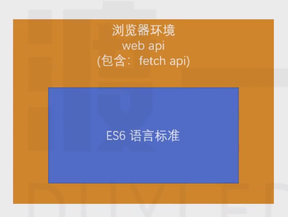
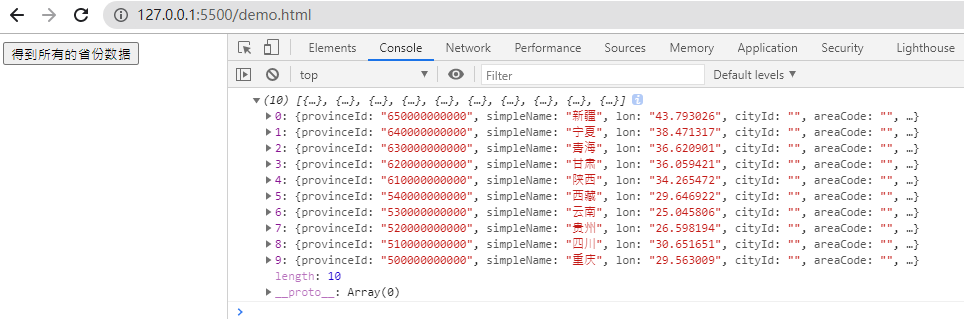
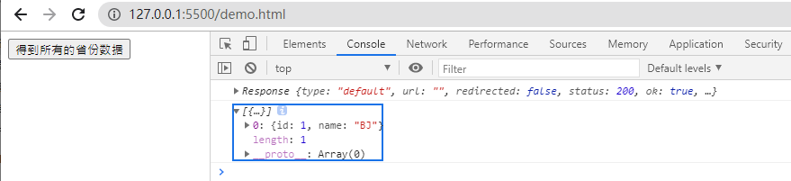

# C9-FetchApi 
# 1 Fetch Api 概述

## 1.1 概述

**XMLHttpRequest的问题？**

1. 所有的功能全部集中在同一个对象上，容易书写出混乱不易维护的代码

2. 采用传统的事件驱动模式，无法适配新的 Promise Api（**无法返回新的Promise**）

**Fetch Api 的特点：**

1. 并非取代 AJAX，而是对 AJAX 传统 API 的改进

2. 精细的功能分割

> `头部信息、请求信息、响应信息`等均分布到不同的对象，更利于处理各种复杂的 AJAX 场景

1. 使用 Promise Api，更利于异步代码的书写

2. Fetch Api 并非 ES6 的内容，属于 HTML5 新增的 Web Api

> Fetch属于浏览器环境，在浏览器环境中使用。

1. 需要掌握网络通信的知识

# 2 使用Fetch Api 

## 2.1 fetch函数

**fetch函数：**

> 使用 `fetch` 函数即可立即向服务器发送网络请求。
> 
> 
> 
> 
> 请求测试地址：[`http://101.132.72.36:5100/api/local`](http://101.132.72.36:5100/api/local)

- 简单案例

    <body><button>得到所有的省份数据</button></body>

## 2.1 参数

**fetch(url, options)****：**

- url

> 必填，字符串，请求地址。

- opstions

> 选填，请求配置。

**请求配置对象：**

- method：字符串，请求方法，默认值GET。
- headers：对象，请求头信息
- body: 请求体的内容，必须匹配请求头中的 Content-Type。（post 方式请求参数放在请求体,get 方式请求参数放在url)
- mode：字符串，请求模式

> cors：默认值，配置为该值，会在请求头中加入 origin 和 referer。（解决跨域）
> 
> no-cors：配置为该值，不会在请求头中加入 origin 和 referer，跨域的时候可能会出现问题
> 
> same-origin：指示请求必须在同一个域中发生，如果请求其他域，则会报错

- credentials: 如何携带凭据（cookie）

> omit：默认值，不携带cookie
> 
> same-origin：请求同源地址时携带cookie
> 
> include：请求任何地址都携带cookie

- cache：配置缓存模式

> default: 表示fetch请求之前将检查下http的缓存.
> 
> no-store: 表示fetch请求将完全忽略http缓存的存在. 这意味着请求之前将不再检查下http的缓存, 拿到响应后, 它也不会更新http缓存。
> 
> no-cache: 如果存在缓存, 那么fetch将发送一个条件查询request和一个正常的request, 拿到响应后, 它会更新http缓存。
> 
> reload: 表示fetch请求之前将忽略http缓存的存在, 但是请求拿到响应后, 它将主动更新http缓存。
> 
> force-cache: 表示fetch请求不顾一切的依赖缓存, 即使缓存过期了, 它依然从缓存中读取. 除非没有任何缓存, 那么它将发送一个正常的request。
> 
> only-if-cached: 表示fetch请求不顾一切的依赖缓存, 即使缓存过期了, 它依然从缓存中读取. 如果没有缓存, 它将抛出网络错误(该设置只在mode为”same-origin”时有效)。

    constconfig= {
    method: 'POST',
    headers: {
    'Content-Type': 'application/json',
    a: 1                },
    body: {
    b: 2                }
                }

## 1.2 返回值

**fetch 函数****返回一个 Promise 对象：**

- 当收到服务器的返回结果后，Promise 进入resolved状态，状态数据为 Response 对象
- 当网络发生错误（或其他导致无法完成交互的错误）时，Promise 进入 rejected 状态，状态数据为错误信息

**Response对象：**

- ok

> boolean，当响应消息码在200~299之间时为true，其他为false

- status

> number，响应的状态码

- `text()`

> 用于处理文本格式的 Ajax 响应。它从响应中获取文本流，将其读完，然后返回一个被解决为 string 对象的 Promise。

- `blob()`

> 用于处理二进制文件格式（比如图片或者电子表格）的 Ajax 响应。它读取文件的原始数据，一旦读取完整个文件，就返回一个被解决为 blob 对象的 Promise。

- `json()`

> 用于处理 JSON 格式的 Ajax 的响应。返回将 JSON 数据流转换为一个被解决为 JavaScript 对象的promise。

- redirect()

> 可以用于重定向到另一个 URL。它会创建一个新的 Promise，以解决来自重定向的 URL 的响应。

# 3 Request 对象

**fetch(Request对象)：**

> 除了使用基本的fetch方法，还可以通过创建一个Request对象来完成请求。
> 
> （实际上，fetch的内部会帮你创建一个Request对象）`new Request(url地址, 配置)` 。
> **
> **
> 注意：尽量保证每次请求都是一个新的Request对象。

    // const url = "http://101.132.72.36:5100/api/local";// const resp = await fetch(url);// 等价于consturl="http://101.132.72.36:5100/api/local";
    constreq=newRequest(url, {});
    constresp=awaitfetch(req);

- clone

> `req.clone();`  克隆一个全新的Request 对象，配置一致。

# 4 Response 对象

**创建Response对象：**

> (响应体数据，  配置对象)

    constresp=newResponse('[{"id": 1, "name": "BJ"}]', {
    ok: true,
    status: 200                });

- 案例

    asyncfunctiongetProvinces() {
    // const url = "http://101.132.72.36:5100/api/local";// const resp = await fetch(url);constresp=newResponse('[{"id": 1, "name": "BJ"}]', {
    ok: true,
    status: 200                });
    console.log(resp);
    constresult=awaitresp.json();
    console.log(result);
                }
    document.querySelector("button").onclick=function() {
    getProvinces();
                }

# 5 Header对象

在Request和Response对象内部，会将传递的请求头对象，转换为Headers 对象。

**Headers对象中的方法：**

- has(key)

> 检查请求头中是否存在指定的key值

- get(key)

> 得到请求头中对应的key值

- set(key, value)

> 修改对应的键值对

- append(key, value)

> 添加对应的键值对

- keys():

> 得到所有的请求头键的集合

- values():

> 得到所有的请求头中的值的集合

- entries():

> 得到所有请求头中的键值对的集合

    <body><button>得到所有的省份数据</button></body>

# 6 案例：文件上传

**案例：**

> 无刷新的文件上传。

**流程：**

1. 客户端将文件数据发送给服务器

2. 服务器保存上传的文件数据到服务器端

3. 服务器响应给客户端一个文件访问地址

> 测试地址：[http://101.132.72.36:5100/api/upload](http://101.132.72.36:5100/api/upload)
> 
> 键的名称（表单域名称）：imagefile

> 请求方法：POST

> 请求的表单格式：`multipart/form-data`

> 请求体：必须包含一个键值对，键的名称是服务器要求的名称，值是文件数据

> HTML5中，JS仍然无法随意的获取文件数据，但是可以获取到input元素中
> 
> 
> 
> 
> 被用户选中的文件数据可以利用HTML5提供的`FormData`构造函数来创建请求体

    <!DOCTYPEhtml><htmllang="en"><head><metacharset="UTF-8"><metaname="viewport"content="width=device-width, initial-scale=1.0"><metahttp-equiv="X-UA-Compatible"content="ie=edge"><title>Document</title></head><body><imgsrc=""alt=""id="imgAvatar"><inputtype="file"id="avatar"><button>上传</button></body></html>