# 01-迭代器 
# 1 迭代器

## 1.1 背景知识

**什么是迭代？**

> 从一个数据集合中按照一定的顺序，不断取出数据的过程

**迭代和遍历的区别？**

> 迭代强调的是依次取数据，并不保证取多少，也不保证把所有的数据取完
> 
> 
> 
> 
> 遍历强调的是要把整个数据依次全部取出

**迭代器：**

> 对迭代过程的封装，在不同的语言中有不同的表现形式，通常为对象

**迭代模式：**

> 一种设计模式，用于统一迭代过程，并规范了迭代器规格：

- 迭代器应该具有得到下一个数据的能力
- 迭代器应该具有判断是否还有后续数据的能力

## 1.2 JS中的迭代器

**迭代器：**

> JS规定，如果一个对象具有 `next`方法，并且该方法返回一个对象。

- 返回的对象格式如下：

> `{value: 值, done: 是否迭代完成}`  则认为该对象是一个迭代器。

**含义：**

- `next()`​

> 用于得到下一个数据。

- 返回的对象

> value：下一个数据的值
> 
> done：boolean，是否迭代完成

    // obj 是一个迭代器constobj= {
    next() {
    return {
    value: xxx,
    done: xx        }
        } 
    }

- 案例1 :简单迭代器

    letarr= [1, 3, 4, 5, 199];
    constiter= {
    i: 0,       // 当前数组下标next: functionnext() {
    constresult=  {
    value: arr[this.i],
    done: this.i>=arr.length-1                }
    this.i++;
    returnresult;
                }
            }

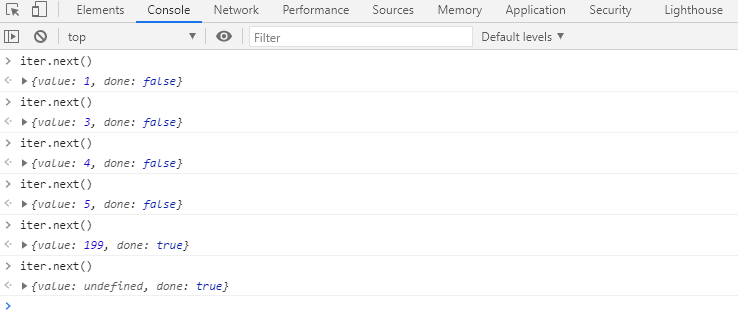

- 案例2：全量取出

    // 让迭代器不断的取出下一个数据，直到没有数据为止letdata=iter.next();
    while (!data.done) {
    data=iter.next();
    console.log(data);
            }
    console.log('迭代完成！！')

- 案例3：封装创建迭代器函数

    // 迭代器创建函数functioncreateIterator(arr) {
    constiter= {
    i: 0,       // 当前数组下标next: functionnext() {
    constresult=  {
    value: arr[this.i],
    done: this.i>=arr.length-1                    }
    this.i++;
    returnresult;
                    }
                }
    returniter;
            }

- 案例3：斐波拉契迭代器

    constfeibo= {
    prev: 1,
    last: 1,
    next: functionnext() {
    constresult= {
    value: this.prev+this.last,
    done: false                }
    this.prev=result.value-this.prev;
    this.last=result.value;
    returnresult;
                }
            }

# 可迭代协议 与 for-of 循环

## 可迭代协议

**概念回顾：**

- 迭代器(iterator)

> 一个具有​`next()`​ 的对象，next方法返回下一个数据并且能指示是否迭代完成

- 迭代器创建函数（iterator creator）

> 一个返回迭代器的函数

**可迭代协议：**

> ES6规定，如果一个对象具有知名符号属性  `Symbol.iterator`，并且属性值是一个迭代器创建函数，则该对象是可迭代的（iterable）。

    //可迭代对象letobj= {
        [Symbol.iterator]() {
    // 迭代器创建函数，返回一个迭代器return {
    next() {
    return {
    value: 1,
    done: false                }
                }
            }
        }
    }

- 数组、类数组等。都是可迭代对象 

  constarr= [5, 6, 7, 8, 9];
  // 返回一个迭代器constiter=arr[Symbol.iterator]();

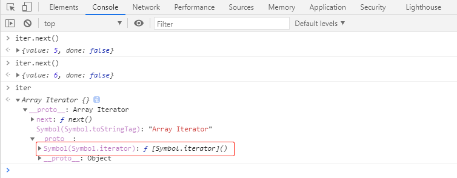

**思考：如何知晓一个对象是否是可迭代的？**

> 对象具有知名符号属性  `Symbol.iterator`，并且属性值是一个迭代器创建函数，则该对象是可迭代的（iterable）。

**思考：如何遍历一个可迭代对象？**

    constarr= [5, 6, 7, 8, 9];
    constiter=arr[Symbol.iterator]();
    letresult=iter.next();
    while (!result.done) {
    console.log(result.value);
    result=iter.next();
            }

## for-of 循环

**`for-of`****循环：**

> 用于遍历可迭代对象

- 格式

  //迭代完成后循环结束for(letitemofiterable){
  //iterable：可迭代对象//item：每次迭代得到的数据}

- 案例1

> 迭代自己定义的迭代对象

    //可迭代对象varobj= {
    a: 1,
    b: 2,
                [Symbol.iterator]() {
    constkeys=Object.keys(this);
    leti=0;
    return {
    next: () => {
    constpropName=keys[i];
    constpropValue=this[propName];
    constresult= {
    value: {
    propName,
    propValue                            },
    done: i>=keys.length                        }
    i++;
    returnresult;
                        }
                    }
                }
            }
    for (constitemofobj) {
    console.log(item); // {propName:"a", propValue:1}        }

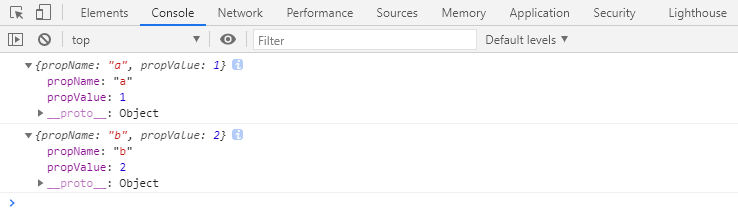

## 展开运算符

**展开运算符与可迭代对象:**

> 展开运算符可以作用于可迭代对象，这样，就可以轻松的将可迭代对象转换为数组。

- 可迭代对象展开转换为数组

  constarr= [...obj];
  console.log(arr);

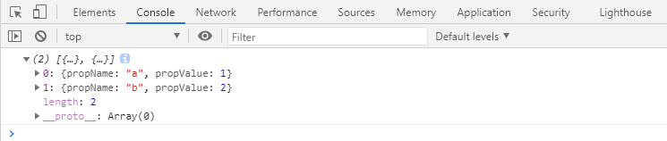

- 可迭代对象函数调用时展开

  functiontest(a, b) {
  console.log(a, b);
          }
  test(...obj);

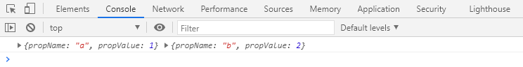

# 生成器 (Generator)

## 生成器

**什么是生成器？**

> 生成器是一个通过构造函数​`Generator`创建的对象，生成器既是一个迭代器，同时又是一个可迭代对象。

**如何创建生成器？**

> 生成器的创建，必须使用生成器函数（Generator Function）。

**如何书写一个生成器函数呢？**

    //这是一个生成器函数，该函数一定返回一个生成器function*method(){
    }
    function*method(){
    }

- 创建生成器

> 通过生成器函数创建。

    function*test() {
    console.log('aaa');
            }
    // 仅得到一个生成器，并不会执行里面得代码constg=test();
    console.log(g);

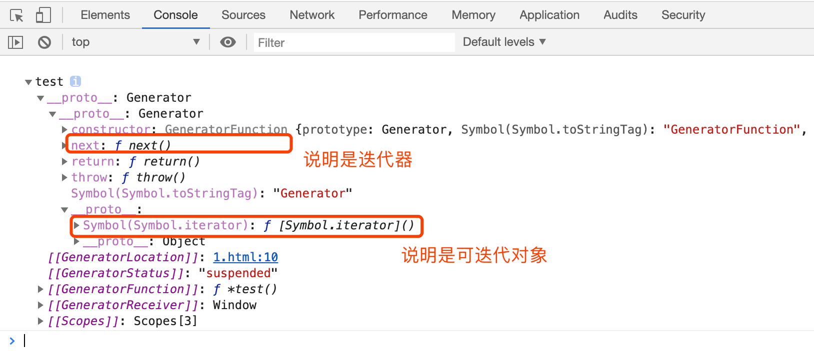

## 生成器函数执行

**生成器函数内部是如何执行的？**

> 生成器函数内部：是为了给生成器的每次迭代提供数据；
>
> 
>
>
> 每次调用生成器的next方法，将导致生成器函数运行到下一个 `yield` 关键字位置（yield 表达式并未执行）。
>
> 
>
>
> yield是一个关键字，该关键字只能在生成器函数内部使用，表达“产生”一个迭代数据。

    function*test() {
    // 函数里面是给生成器提供迭代数据的console.log("第1次运行")
    yield100;
    console.log("第2次运行")
    yield2;
    console.log("第3次运行")
            }
    // 仅得到一个生成器，并不会执行里面得代码constg=test();

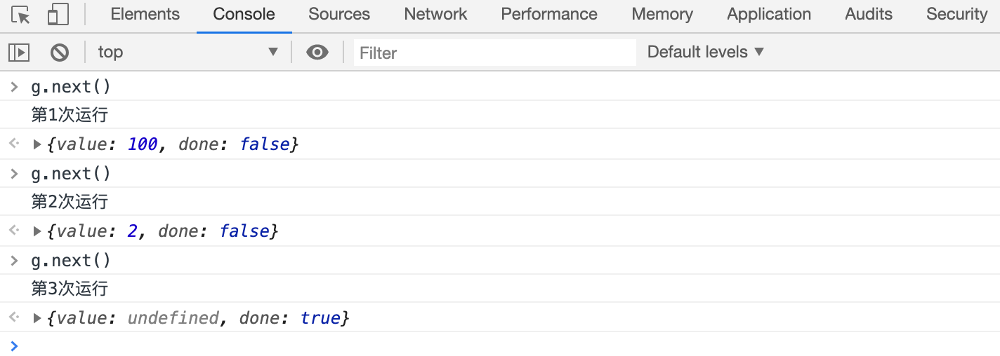

- 案例2

  constarr1= [1, 2, 3, 4, 5];
  // 迭代器创建函数  iterator creatorfunction*createIterator(arr) {
  for (constitemofarr) {
  yielditem;
              }
          }
  constiter1=createIterator(arr1);

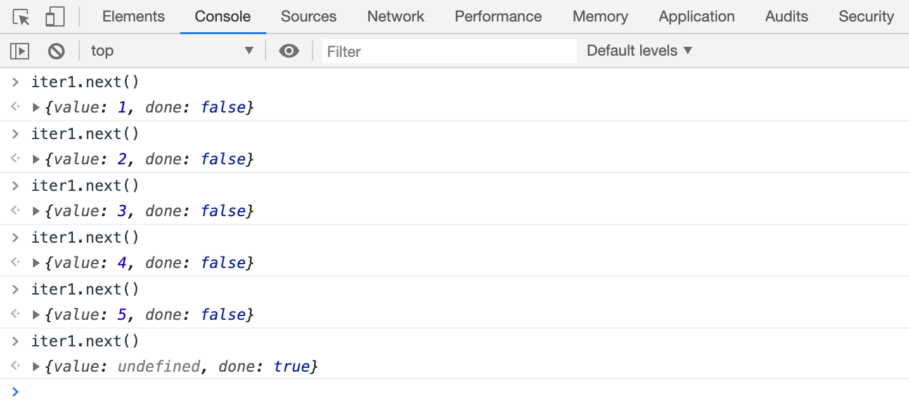

- 案例3

  //创建一个斐波拉契数列的迭代器function*createFeiboIterator() {
  letprev1=1,
  prev2=1, //当前位置的前1位和前2位n=1; //当前是第几位while (true) {
  if (n<=2) {
  yield1;
                  } else {
  constnewValue=prev1+prev2yieldnewValue;
  prev2=prev1;
  prev1=newValue;
                  }
  n++;
              }
          }
  constiterator=createFeiboIterator();

## 细节

**有哪些需要注意的细节？**

- 生成器函数可以有返回值

> 返回值出现在第一次done为true时的value属性中。

    function*test() {
    console.log("第1次运行")
    yield1;
    console.log("第2次运行")
    yield2;
    console.log("第3次运行");
    return10;
            }
    constg=test();

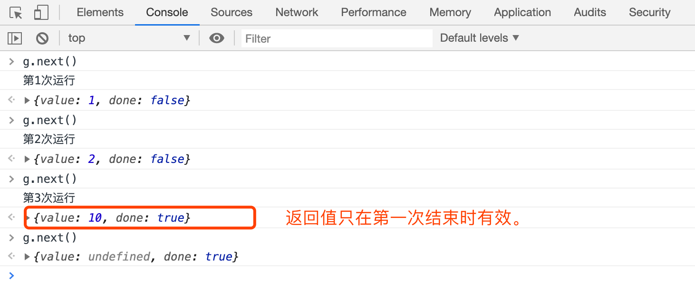

- 调用生成器的next方法时，可以传递参数

> 传递的参数会交给yield表达式的返回值。
>
> 第一次调用next方法时，传参没有任何意义。

    function*test() {
    console.log("函数开始");
    letinfo=yield1;
    console.log(info)
    info=yield2+info;
    console.log(info)
            }
    constg=test();

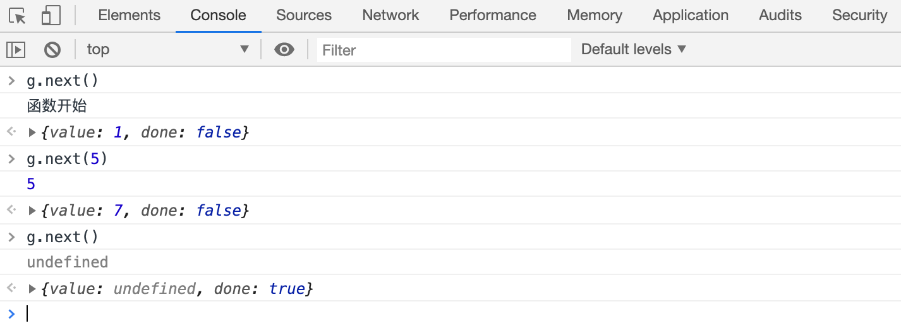

- 生成器函数内部调用其他生成器函数

> 在生成器函数内部，可以调用其他生成器函数，但是要注意加上*号。
>
> 为了重用 其他生成器函数 的迭代过程。

    function*t1(){
    yield"a"yield"b"        }
    function*test() {
    // t1内部也会参与我的迭代// 相当于：             yield "a"//                     yield "b"yield*t1();
    yield1;
    yield2;
    yield3;
            }
    constg=test();

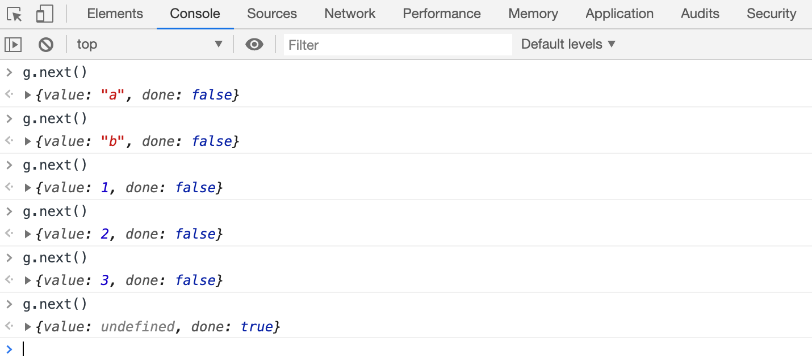

## 生成器的其他API

**return方法：**

> 调用该方法，可以提前结束生成器函数，从而提前让整个迭代过程结束。
>
> 可以传参数。

- 调用

  function*test() {
  yield(1);
  yield(2);
  yield(3);
          }
  letg=test();

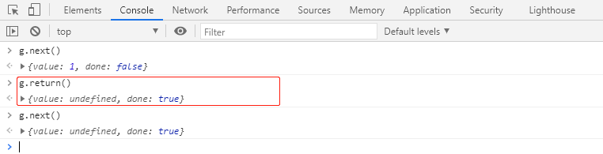

- 传参

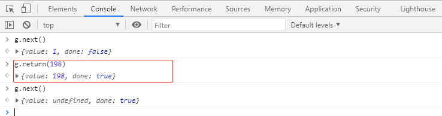

**throw方法：**

> 调用该方法，可以在生成器中产生一个错误。
>
> 在生成器内部报错。

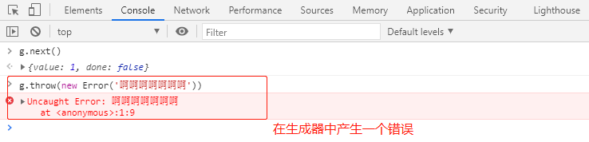

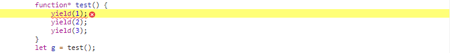

# 生成器应用-异步任务控制

    function*task() {
    constd=yield1;
    console.log(d)
    // //d : 1constresp=yieldfetch("http://101.132.72.36:5100/api/local")
    constresult=yieldresp.json();
    console.log(result);
            }
    run(task)
    functionrun(generatorFunc) {
    constgenerator=generatorFunc();
    letresult=generator.next(); //启动任务（开始迭代）, 得到迭代数据handleResult();
    //对result进行处理functionhandleResult() {
    if (result.done) {
    return; //迭代完成，不处理                }
    //迭代没有完成，分为两种情况//1. 迭代的数据是一个Promise//2. 迭代的数据是其他数据if (typeofresult.value.then==="function") {
    //1. 迭代的数据是一个Promise//等待Promise完成后，再进行下一次迭代result.value.then(data=> {
    result=generator.next(data)
    handleResult();
                        })
                    } else {
    //2. 迭代的数据是其他数据，直接进行下一次迭代result=generator.next(result.value)
    handleResult();
                    }
                }
            }