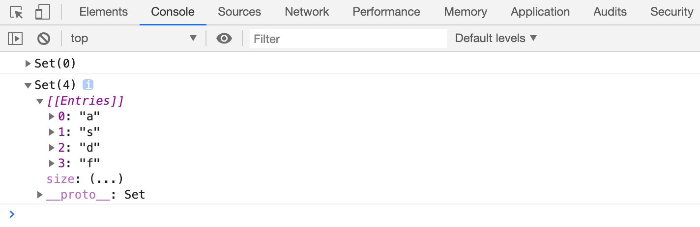
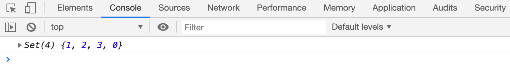
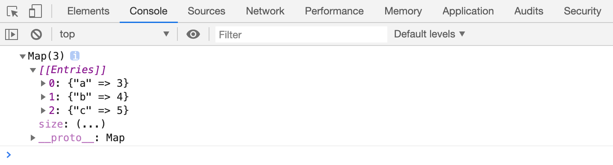
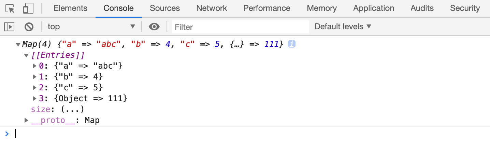
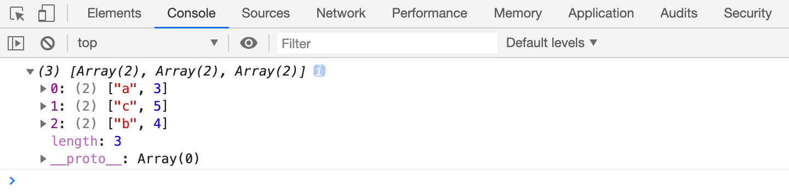
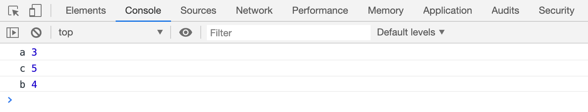
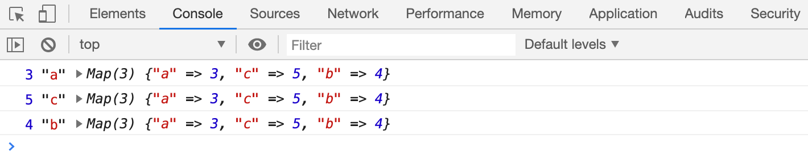

# set 集合

**set：**

> 一直以来，JS只能使用数组和对象来保存多个数据，缺乏像其他语言那样拥有丰富的集合类型。
>
> 因此，ES6新增了两种集合类型（set 和 map），用于在不同的场景中发挥作用。
>
> 
>
> set用于存放不重复的数据。

## 创建set集合

**创建：**

    newSet(); //创建一个没有任何内容的set集合newSet(iterable); //创建一个具有初始内容的set集合，内容来自于可迭代对象每一次迭代的结果

- 案例

  consts1=newSet();
  console.log(s1);
  consts2=newSet("asdfasfasf");
  console.log(s2);

## set 操作

**对set集合进行后续操作：**

- add(数据)

> 添加一个数据到set集合末尾，如果数据已存在，则不进行任何操作。
>
> 
>
>
> set使用`Object.is`的方式判断两个数据是否相同，但是，针对`+0`和 `-0`，set认为是相等。

    consts1=newSet();
    s1.add(1);
    s1.add(2);
    s1.add(3);
    s1.add(1); //无效s1.add(+0);
    s1.add(-0); //无效

- has(数据)

> 判断set中是否存在对应的数据

- delete(数据)

> 删除匹配的数据，返回是否删除成功（`true/false`）

- clear()

> 清空整个set集合

- size

> 获取set集合中的元素数量，只读属性，无法重新赋值

## 相互转换

**如何与数组进行相互转换？**

    // 数组 ==> setconsts=newSet([x,x,x,x,x]);
    // set ==> arr// set本身也是一个可迭代对象，每次迭代的结果就是每一项的值constarr= [...s];

- 案例：数组去重

> 利用set 数组去重。

    constarr= [45, 7, 2, 2, 34, 46, 6, 57, 8, 55, 6, 46];
    constresult= [...newSet(arr)];
    console.log(result);

- 案例：字符串去重

> 利用set 字符串去重。

    conststr="asf23sdfgsdgfsafasdfasfasfasfsafsagfdsfg";
    consts= [...newSet(str)].join("");
    console.log(s);

## 遍历

**遍历：**

- 使用 ​`for-of`​ 循环

  for (constitemofs1) {
  console.log(item)
          }

- 使用set中的实例方法 ​`forEach`​

> set集合中不存在下标，因此forEach中的回调的第二个参数和第一个参数是一致的，均表示set中的每一项。

    s1.forEach((item, index, s) => {
    console.log(item, index, s);
            })

## set应用

**set应用：**

- 并集

  // 两个数组的并集、交集、差集 （不能出现重复项），得到的结果是一个新数组constarr1= [33, 22, 55, 33, 11, 33, 5];
  constarr2= [22, 55, 77, 88, 88, 99, 99];
  //并集// const result = [...new Set(arr1.concat(arr2))];console.log("并集", [...newSet([...arr1, ...arr2])]);

- 交集

  //交集constcross= [...newSet(arr1)].filter(item=>arr2.indexOf(item) >=0);
  console.log("交集", cross)

- 差集

  //差集// console.log("差集", [...new Set([...arr1, ...arr2])].filter(item => arr1.indexOf(item) >= 0 && arr2.indexOf(item) < 0 || arr2.indexOf(item) >= 0 && arr1.indexOf(item) < 0))console.log("差集", [...newSet([...arr1, ...arr2])].filter(item=>cross.indexOf(item) <0))

## [扩展]手写set

    classMySet {
    constructor(iterator= []) {
    //验证是否是可迭代的对象if (typeofiterator[Symbol.iterator] !=="function") {
    thrownewTypeError(`你提供的${iterator}不是一个可迭代的对象`)
            }
    this._datas= [];
    for (constitemofiterator) {
    this.add(item);
            }
        }
    getsize() {
    returnthis._datas.length;
        }
    add(data) {
    if (!this.has(data)) {
    this._datas.push(data);
            }
        }
    has(data) {
    for (constitemofthis._datas) {
    if (this.isEqual(data, item)) {
    returntrue;
                }
            }
    returnfalse;
        }
    delete(data) {
    for (leti=0; i<this._datas.length; i++) {
    constelement=this._datas[i];
    if (this.isEqual(element, data)) {
    //删除this._datas.splice(i, 1);
    returntrue;
                }
            }
    returnfalse;
        }
    clear() {
    this._datas.length=0;
        }
    *[Symbol.iterator]() {
    for (constitemofthis._datas) {
    yielditem;
            }
        }
    forEach(callback) {
    for (constitemofthis._datas) {
    callback(item, item, this);
            }
        }
    /**     * 判断两个数据是否相等     * @param {*} data1      * @param {*} data2      */isEqual(data1, data2) {
    if (data1===0&&data2===0) {
    returntrue;
            }
    returnObject.is(data1, data2);
        }
    }

# map集合

## map

**键值对（key value pair）数据集合的特点：**

> 键不可重复。
>
> map集合专门用于存储多个键值对数据。

**在map出现之前，****使用对象存储有以下问题？**

> 在map出现之前我们使用的是对象的方式来存储键值对，键是属性名，值是属性值。
>
> 键名只能是字符串
>
> 获取数据的数量不方便
>
> 键名容易跟原型上的名称冲突

**创建map：**

- 语法

  newMap(); //创建一个空的mapnewMap(iterable); 

- 创建一个具有初始内容的map

> 初始内容来自于可迭代对象每一次迭代的结果，但是，它要求每一次迭代的结果必须是一个长度为2的数组，数组第一项表示键，数组的第二项表示值

    constmp1=newMap([["a", 3], ["b", 4], ["c", 5]]);
    console.log(mp1);

## 操作

**后续操作：**

- size

> 只读属性，获取当前map中键的数量

- set(键, 值)：

> 设置一个键值对，键和值可以是任何类型
>
> 如果键不存在，则添加一项

> 如果键已存在，则修改它的值

> 比较键的方式和set相同

    constmp1=newMap([["a", 3], ["b", 4], ["c", 5]]);
    constobj= {};
    mp1.set(obj, 6456);
    mp1.set("a", "abc");
    mp1.set(obj, 111);
    console.log(mp1)

- get(键)

> 根据一个键得到对应的值

- has(键)

> 判断某个键是否存在

- delete(键)

> 删除指定的键

- clear()

> 清空map

## 转换

**和数组互相转换：**

> 和set一样。

    constmp=newMap([
                ["a", 3],
                ["c", 10],
                ["b", 4],
                ["c", 5]
            ]);
    constresult= [...mp]
    console.log(result);

## 遍历

**遍历：**

- `for-of`​

> 每次迭代得到的是一个长度为2的数组

    constmp=newMap([
                ["a", 3],
                ["c", 10],
                ["b", 4],
                ["c", 5]
            ]);
    for (const [key, value] ofmp) {
    console.log(key, value)
            }

- `forEach`​

> 通过回调函数遍历

> 参数1：每一项的值

> 参数2：每一项的键

> 参数3：map本身

    constmp=newMap([
                ["a", 3],
                ["c", 10],
                ["b", 4],
                ["c", 5]
            ]);
    mp.forEach((value, key, mp) => {
    console.log(value, key, mp)
            })

## [扩展]手写map

    classMyMap {
    constructor(iterable= []) {
    //验证是否是可迭代的对象if (typeofiterable[Symbol.iterator] !=="function") {
    thrownewTypeError(`你提供的${iterable}不是一个可迭代的对象`)
            }
    this._datas= [];
    for (constitemofiterable) {
    // item 也得是一个可迭代对象if (typeofitem[Symbol.iterator] !=="function") {
    thrownewTypeError(`你提供的${item}不是一个可迭代的对象`);
                }
    constiterator=item[Symbol.iterator]();
    constkey=iterator.next().value;
    constvalue=iterator.next().value;
    this.set(key, value);
            }
        }
    set(key, value) {
    constobj=this._getObj(key);
    if (obj) {
    //修改obj.value=value;
            }
    else {
    this._datas.push({
    key,
    value            })
            }
        }
    get(key) {
    constitem=this._getObj(key);
    if (item) {
    returnitem.value;
            }
    returnundefined;
        }
    getsize() {
    returnthis._datas.length;
        }
    delete(key) {
    for (leti=0; i<this._datas.length; i++) {
    constelement=this._datas[i];
    if (this.isEqual(element.key, key)) {
    this._datas.splice(i, 1);
    returntrue;
                }
            }
    returnfalse;
        }
    clear() {
    this._datas.length=0;
        }
    /**     * 根据key值从内部数组中，找到对应的数组项     * @param {*} key      */_getObj(key) {
    for (constitemofthis._datas) {
    if (this.isEqual(item.key, key)) {
    returnitem;
                }
            }
        }
    has(key) {
    returnthis._getObj(key) !==undefined;
        }
    /**     * 判断两个数据是否相等     * @param {*} data1      * @param {*} data2      */isEqual(data1, data2) {
    if (data1===0&&data2===0) {
    returntrue;
            }
    returnObject.is(data1, data2);
        }
    *[Symbol.iterator]() {
    for (constitemofthis._datas) {
    yield [item.key, item.value];
            }
        }
    forEach(callback) {
    for (constitemofthis._datas) {
    callback(item.value, item.key, this);
            }
        }
    }

# WeakSet和WeakMap

## WeakSet

使用该集合，可以实现和set一样的功能。

**不同点：**

1. **它内部存储的对象地址不会影响垃圾回收**

2. 只能添加对象

3. 不能遍历（不是可迭代的对象）、没有size属性、没有forEach方法

## WeakMap

类似于map的集合。

**不同点：**

1. **它的键存储的地址不会影响垃圾回收**

2. 它的键只能是对象

3. 不能遍历（不是可迭代的对象）、没有size属性、没有forEach方法