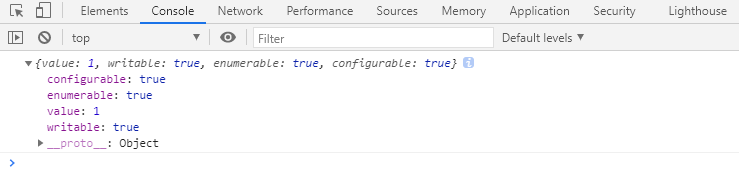
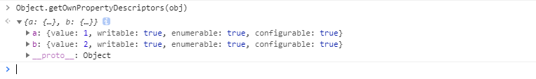
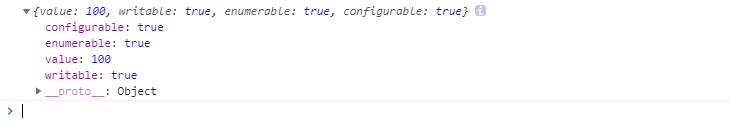
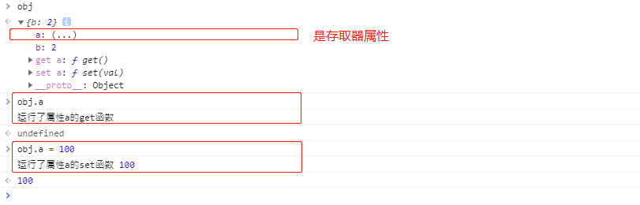
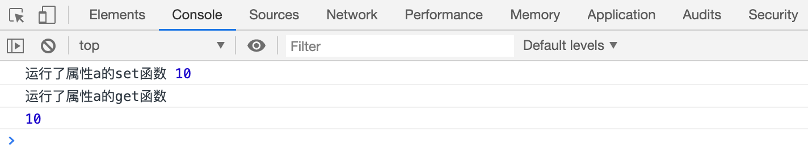
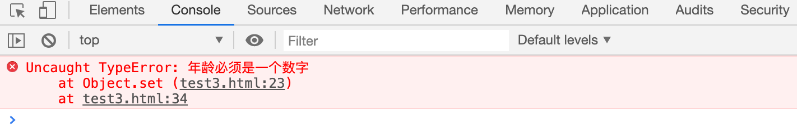
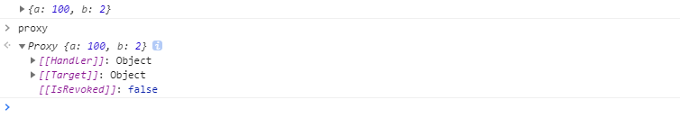
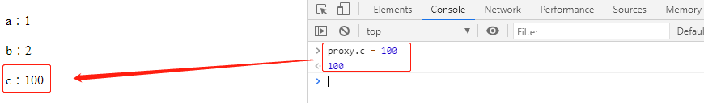

# [回顾]属性描述符 

## 属性描述符

**Property Descriptor 属性描述符：**

> 是一个普通对象，用于描述一个属性的相关信息

- `Object.getOwnPropertyDescriptor(对象, 属性名)`

> 可以得到一个对象的某个属性的属性描述符

    constobj= {
    a: 1,
    b: 2        }
    constres=Object.getOwnPropertyDescriptor(obj, 'a');
    console.log(res);

> value：属性值
>
>
> configurable：该属性的描述符是否可以修改
>
>
> enumerable：该属性是否可以被枚举
>
>
> writable：该属性是否可以被重新赋值

- `Object.getOwnPropertyDescriptors(对象)`

> 得到某个对象的所有属性描述符

**配置：**

> 如果需要为某个对象添加属性时 或 修改属性时， 配置其属性描述符，可以使用下面的代码:
>
> `Object.defineProperty(对象, 属性名, 描述符);`​
>
> `Object.defineProperties(对象, 多个属性的描述符)`​

    constobj= {
    a: 1,
    b: 2        }
    Object.defineProperty(obj, 'a' , {
    value: 100,
    configurable: true,
    enumerable: true,
    writable: true,
            })
    constres=Object.getOwnPropertyDescriptor(obj, 'a');
    console.log(res);

## 存取器属性

**存取器属性：**

> 属性描述符中，如果配置了 ​`get`​ 和 ​`set`​ 中的任何一个，则该属性，不再是一个普通属性，而变成了存取器属性。
>
> 
>
> get 和 set 配置均为函数。

> 如果一个属性是存取器属性，读取该属性时，会运行get方法，将get方法得到的返回值作为属性值；

> 如果给该属性赋值，则会运行set方法。

> 

> 存取器属性最大的意义，在于可以控制属性的读取和赋值。

- 案例

  constobj= {
  a: 1,
  b: 2        }
  Object.defineProperty(obj, 'a' , {
  get() {
  console.log('运行了属性a的get函数')
              },
  set(val) {
  console.log('运行了属性a的set函数', val)
              }
          })

- 案例

  constobj= {
  b: 2        }
  Object.defineProperty(obj, "a", {
  get() {
  console.log("运行了属性a的get函数")
  returnobj._a;
              },
  set(val){
  console.log("运行了属性a的set函数", val)
  obj._a=val;
              }
          })
  obj.a=10;     // // set(10)console.log(obj.a);

- 赋值校验

  obj= {
  name: "adsf"        }
  Object.defineProperty(obj, "age", {
  get() {
  returnobj._age;
              },
  set(val) {
  if (typeofval!=="number") {
  thrownewTypeError("年龄必须是一个数字")
                  }
  if (val<0) {
  val=0;
                  } elseif (val>200) {
  val=200;
                  }
  obj._age=val;
              }
          })
  obj.age="Asdfasasdf";
  console.log(obj.age);

# Reflect反射 

**Reflect是什么？**

> Reflect是一个内置的JS对象，它提供了一系列方法，可以让开发者通过调用这些方法，访问一些JS底层功能

> 由于它类似于其他语言的反射，因此取名为Reflect。

**它可以做什么？**

> 使用Reflect可以实现诸如： 
>
> 属性的赋值与取值、调用普通函数、调用构造函数、判断属性是否存在与对象中  等等功能。

**这些功能不是已经存在了吗？为什么还需要用Reflect实现一次？**

> 有一个重要的理念，在ES5就被提出：

> 减少魔法、让代码更加纯粹。

> 这种理念很大程度上是受到函数式编程的影响。

> ES6进一步贯彻了这种理念，它认为，对属性内存的控制、原型链的修改、函数的调用等等，这些都属于底层实现，属于一种魔法，因此，需要将它们提取出来，形成一个正常的API，并高度聚合到某个对象中，于是，就造就了Reflect对象。

> 因此，你可以看到Reflect对象中有很多的API都可以使用过去的某种语法或其他API实现。

**它里面到底提供了哪些API呢？**

- `Reflect.set(target, propertyKey, value)`

> 设置对象target的属性propertyKey的值为value，等同于给对象的属性赋值。

    constobj= {
    a: 1,
    b: 2        }
    // obj.a = 10;Reflect.set(obj, 'a', 10);

- `Reflect.get(target, propertyKey)`

> 读取对象target的属性propertyKey，等同于读取对象的属性值。

    console.log(Reflect.get(obj, 'a'))

- `Reflect.apply(target, thisArgument, argumentsList)`

> 调用一个指定的函数，并绑定this和参数列表。等同于函数调用。

    functiontest(a, b) {
    console.log(a, b);
            }
    // test(3, 4);Reflect.apply(test, null, [3, 4]);

- `Reflect.deleteProperty(target, propertyKey)`​

> 删除一个对象的属性

    constobj= {
    a: 1,
    b: 2        }
    // delete obj.aReflect.deleteProperty(obj, 'a')

- `Reflect.defineProperty(target, propertyKey, attributes)`

> 类似于Object.defineProperty，不同的是如果配置出现问题，返回false而不是报错

- `Reflect.construct(target, argumentsList)`

> 用构造函数的方式创建一个对象。

    functionTest(a, b) {
    this.a=a;
    this.b=b;
    }
    // const t = new Test(1, 3);constt=Reflect.construct(Test, [1, 3]);

- `Reflect.has(target, propertyKey)`​

> 判断一个对象是否拥有一个属性

    constobj= {
    a: 1,
    b: 2        }
    // console.log('a' in obj);console.log(Reflect.has(obj, 'a'));

- 其他API

> [https://developer.mozilla.org/zh-CN/docs/Web/JavaScript/Reference/Global_Objects/Reflect](https://developer.mozilla.org/zh-CN/docs/Web/JavaScript/Reference/Global_Objects/Reflect)

# Proxy 代理

**代理：**

> 提供了修改底层实现的方式。

- 语法

> 功能：代理一个目标对象
>
> target：目标对象
>
> handler：是一个普通对象，其中可以重写底层实现
>
> 返回值：返回一个代理对象

    newProxy(target, handler)

- 案例

> 修改代理的底层实现。

    constobj= {
    a: 1,
    b: 2        }
    constproxy=newProxy(obj, {
    set(target, propertyKey, value) {
    // console.log(target, propertyKey, value);// target[propertyKey] = value;Reflect.set(target, propertyKey, value);
                }
            })
    proxy.a=100;
    console.log(obj);

- 方法修改

  constobj= {
  a: 1,
  b: 2        }
  constproxy=newProxy(obj, {
  set(target, propertyKey, value) {
  // console.log(target, propertyKey, value);// target[propertyKey] = value;Reflect.set(target, propertyKey, value);
              },
  get(target, propertyKey) {
  if (Reflect.has(target, propertyKey)) {
  returnReflect.get(target, propertyKey);
                  } else {
  // 默认不存在返回：undefined，修改不存在的返回值：-1return-1;
                  }
              },
  has(target, propertyKey) {
  // 默认存在返回：true,修改存在的返回值：falsereturnfalse;
              }
          });
  console.log(proxy.d);                           // -1console.log("a"inproxy);              // false

# 应用

## 观察者模式

**观察者模式：**

> 有一个对象，是观察者，它用于观察另外一个对象的属性值变化，当属性值变化后会收到一个通知，可能会做一些事。
>
> 
>
> 通过修改观察者来修改目标者。

> 

> 创建一个proxy，通过操作代理 来 操作目标者。

    //创建一个观察者functionobserver(target) {
    constproxy=newProxy(target, {
    set(target, prop, value) {
    Reflect.set(target, prop, value);
    render();
                    },
    get(target, prop){
    returnReflect.get(target, prop);
                    }
                })
    render();
    functionrender() {
    lethtml="";
    for (constpropofObject.keys(target)) {
    html+=`
${prop}：${target[prop]}
`;
                    }
    document.body.innerHTML=html;
                }
    returnproxy;
            }
    consttarget= {
    a: 1,
    b: 2        }
    constproxy=observer(target)

## 偷懒的构造函数

**偷懒的构造函数：**

- 使用代理

> 使用proxy 重写construct 底层实现。

    classUser {
            }
    functionConstructorProxy(Class, ...propNames) {
    returnnewProxy(Class, {
    construct(target, argumentsList) {
    // 创建一个构造函数constobj=Reflect.construct(target, argumentsList)
    propNames.forEach((name, i) => {
    obj[name] =argumentsList[i];
                        })
    returnobj;
                    }
                })
            }
    constUserProxy=ConstructorProxy(User, "firstName", "lastName", "age")
    constobj=newUserProxy("袁", "进", 18);
    console.log(obj)
    classMonster {
            }
    constMonsterProxy=ConstructorProxy(Monster, "attack", "defence", "hp", "rate", "name")
    constm=newMonsterProxy(10, 20, 100, 30, "怪物")
    console.log(m);

## 可验证的函数参数

验证参数类型。

    functionsum(a, b) {
    returna+b;
            }
    functionvalidatorFunction(func, ...types) {
    constproxy=newProxy(func, {
    apply(target, thisArgument, argumentsList) {
    types.forEach((t, i) => {
    constarg=argumentsList[i]
    if (typeofarg!==t) {
    thrownewTypeError(`第${i+1}个参数${argumentsList[i]}不满足类型${t}`);
                            }
                        })
    returnReflect.apply(target, thisArgument, argumentsList);
                    }
                })
    returnproxy;
            }
    constsumProxy=validatorFunction(sum, "number", "number")
    console.log(sumProxy(1, 2))

