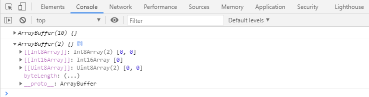
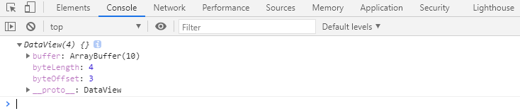
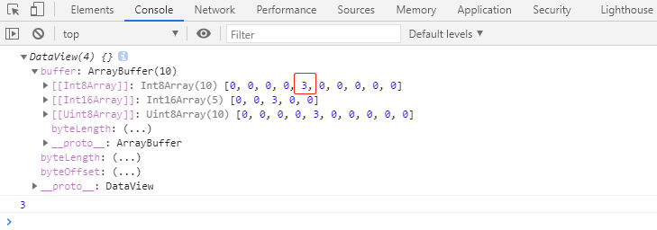
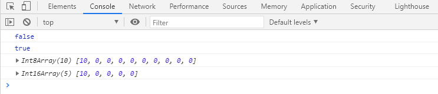
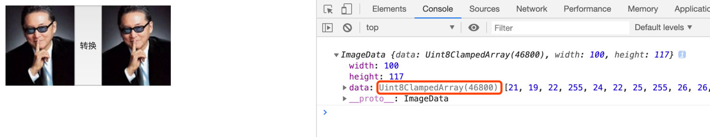
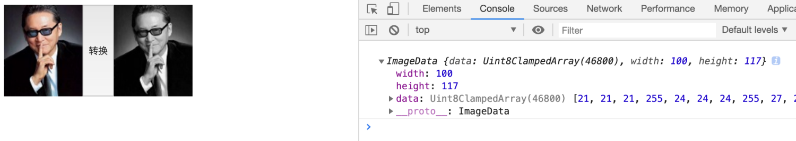
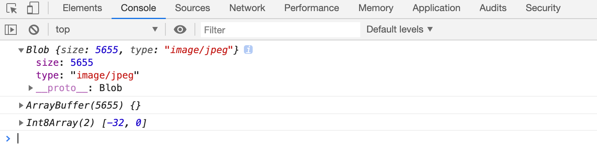

# 新增的数组API

## 静态方法

- `Array.of(...args)`​​

> 使用指定的数组项创建一个新数组

    constarr=Array.of(1,3,4)     // [1, 3, 4]constarr1=Array.of(10)           // [10]

- Array.from(arg)

> 通过给定的类数组 或 可迭代对象 创建一个新的数组。

## 实例方法

- `find(callback)`​

> 用于查找满足条件的第一个元素。

    constarr= [{
    name: "a",
    id: 1            },
                {
    name: "b",
    id: 2            },
                {
    name: "c",
    id: 3            },
                {
    name: "d",
    id: 4            },
                {
    name: "e",
    id: 5            },
                {
    name: "f",
    id: 6            },
                {
    name: "g",
    id: 7            }
            ]
    //找到id为5的对象constresult=arr.find(item=>item.id===5)

- `findIndex(callback)`​

> 用于查找满足条件的第一个元素的下标

    constresultIndex=arr.findIndex(item=>item.id===5)

- `fill(data)`​

> 用指定的数据填充满数组所有的内容

    // 创建了一个长度为100的数组，数组的每一项是"abc"constarr=newArray(100);
    arr.fill("abc"); 

- `copyWithin(target, start?, end?)`​

> 在数组内部完成复制

    constarr= [1, 2, 3, 4, 5, 6];
    //从下标2开始，改变数组的数据，数据来自于下标0位置开始// arr.copyWithin(2); // [1, 2, 1, 2, 3, 4]// arr.copyWithin(2, 1); // [1, 2, 2, 3, 4, 5]// arr.copyWithin(2, 1, 3); // [1, 2, 2, 3, 5, 6]console.log(arr)

- `includes(data)`​

> 判断数组中是否包含某个值，使用 `Object.is` 匹配

    constarr= [45, 21, 356, 66 , 6, NaN, 723, 54];
    console.log(arr.indexOf(66) >=0)
    console.log(arr.includes(NaN));

# [扩展]类型化数组

**数字存储的前置知识:**

> 计算机必须使用固定的位数来存储数字，无论存储的数字是大是小，在内存中占用的空间是固定的。
>
> 
>
>
> n位的无符号整数能表示的数字是2^n个，取值范围是：`0 ~ 2^n - 1`
>
> 
>
>
> n位的有符号整数能表示的数字是2^n个，取值范围是：`-2^(n-1) ~ 2^(n-1) - 1`

- 浮点数表示法

> **可以用于表示整数和小数，目前分为两种标准：**
>
> 32位浮点数：又称为单精度浮点数，它用1位表示符号，8位表示阶码，23位表示尾数。
>
> 64位浮点数：又称为双精度浮点数，它用1位表示符号，11位表示阶码，52位表示尾数。
>
> 
>
>
> JS中的所有数字，均使用双精度浮点数保存。

**类型化数组：**

> 用于优化多个数字的存储。

**具体分为：**

- Int8Array： 8位有符号整数（-128 ~ 127）
- Uint8Array： 8位无符号整数（0 ~ 255）
- Int16Array: ...
- Uint16Array: ...
- Int32Array: ...
- Uint32Array: ...
- Float32Array:
- Float64Array

**创建数组：**

> 只能存储范围内的数字，会溢出。

- `new 数组构造函数(长度)`​​​

  constarr1=newInt8Array(10);     // Int8Array(10) [0, 0, 0, 0, 0, 0, 0, 0, 0, 0] , 10个字节

- `数组构造函数.of(元素...)`​

  constarr=Uint8Array.of(12, 5, 6, 7);

- `数组构造函数.from(可迭代对象)`​

- `new 数组构造函数(其他类型化数组)`​

  constarr1=Int32Array.of(11, 7, 3, 11);
  // 存不下会有误差constarr2=newInt8Array(arr1);
  console.log(arr1===arr2);     //fasleconsole.log(arr1, arr2);        // Int32Array(4) [11, 7, 3, 11] Int8Array(4) [11, 7, 3, 11]

**得到长度：**

- `数组.length`​   

> 得到元素数量

- `数组.byteLength`​ 

> 得到占用的字节数

**其他：**

> 其他的用法跟普通数组一致，但是：

> 不能增加和删除数据，类型化数组的长度固定

> 一些返回数组的方法，返回的数组是同类型化的新数组

    constarr=Int8Array.of(125, 7, 3, 11);
    constarr2=arr.map(item=>item*2)
    console.log(arr2);

# ArrayBuffer

## ArrayBuffer

**ArrayBuffer：**

> 一个对象，用于存储一块固定内存大小的数据。
>
> 
>
>
> 可以指定内存的大小。
>
> 
>
>
> 可以通过属性`byteLength`得到字节数。
>
> 
>
>
> 可以通过方法`slice`得到新的ArrayBuffer。

    newArrayBuffer(字节数)

- 案例

  //创建了一个用于存储10个字节的内存空间constbf=newArrayBuffer(10);
  // 从第4个字节开始，取到第6个字节（取不到第）constbf2=bf.slice(3, 5);
  console.log(bf);
  console.log(bf2);

## 读写ArrayBuffer

**使用DataView：**

> 通常会在需要混用多种存储格式时使用DataView

- 创建

  //创建了一个用于存储10个字节的内存空间constbf=newArrayBuffer(10);
  // (bf, 偏移位置, 偏移量)  偏移量不能超过长度constview=newDataView(bf, 3, 4);
  console.log(view);

- 读写

> 写数据以set 开头
>
> 读数据以get 开头

    //创建了一个用于存储10个字节的内存空间constbf=newArrayBuffer(10);
    // (bf, 偏移位置, 偏移量)  偏移量不能超过长度constview=newDataView(bf, 3, 4);
    // console.log(view);// 写数据以set 开头// 偏移量为1 设置view.setInt8(1, 3);
    console.log(view);
    // 读数据以get 开头console.log(view.getInt8(1));

**使用类型化数组：**

> 实际上，每一个类型化数组都对应一个`ArrayBuffer`，如果没有手动指定ArrayBuffer，类型化数组创建时，会新建一个ArrayBuffer

- 创建

> 

    constbf=newArrayBuffer(10); //10个字节的内存// 指定ArrayBuffer，多个类型化数组操作同一块内存空间constarr1=newInt8Array(bf);
    constarr2=newInt16Array(bf);
    console.log(arr1===arr2);
    console.log(arr1.buffer===arr2.buffer);
    arr1[0] =10;
    console.log(arr1)
    console.log(arr2);

- 案例

  constbf=newArrayBuffer(10); //10个字节的内存constarr=newInt16Array(bf);
  arr[0] =2344; //操作了两个字节console.log(arr);           // Int16Array(5) [2344, 0, 0, 0, 0]

# 画布制作黑白图片

**黑白图片：**

> 画布中的1个图像是由多个像素点组成，每个像素点拥有4个数据：​`红、绿、蓝、alpha`​ 。
>
> 把一个图像变成黑白，只需要将图像的每个像素点设置成为红绿蓝的平均数即可。

- 案例

  10050150平均值：100设置为：100100100

- 怎么拿到每个像素点的数据？

> 将图片画到画布里面，再从画布里面获取。
>
> 
>
>
> Uint8ClampedArray 可以看作是Uint8Array的数组，只是针对图像操作有特殊的处理方式，防止值溢出。

    <body><divstyle="display: flex;"><imgsrc="./img/liao.jpg"alt=""><buttononclick="change()">转换</button><canvaswidth="100"height="117"></canvas>
</body>

> **像素点：**width  * height = 100 * 117 =   11700 个
>
> 每个像素点需要4个数据保存​`(r, g, b, a)`​
>
> 所以数组的长度 = 像素点 * 4 = 46800 

    <body><divstyle="display: flex;"><imgsrc="./img/liao.jpg"alt=""><buttononclick="change()">转换</button><canvaswidth="100"height="117"></canvas>
</body>

# 其他

    <body></body>

