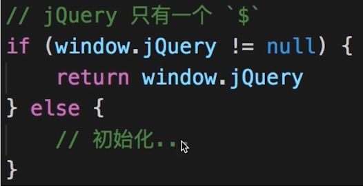
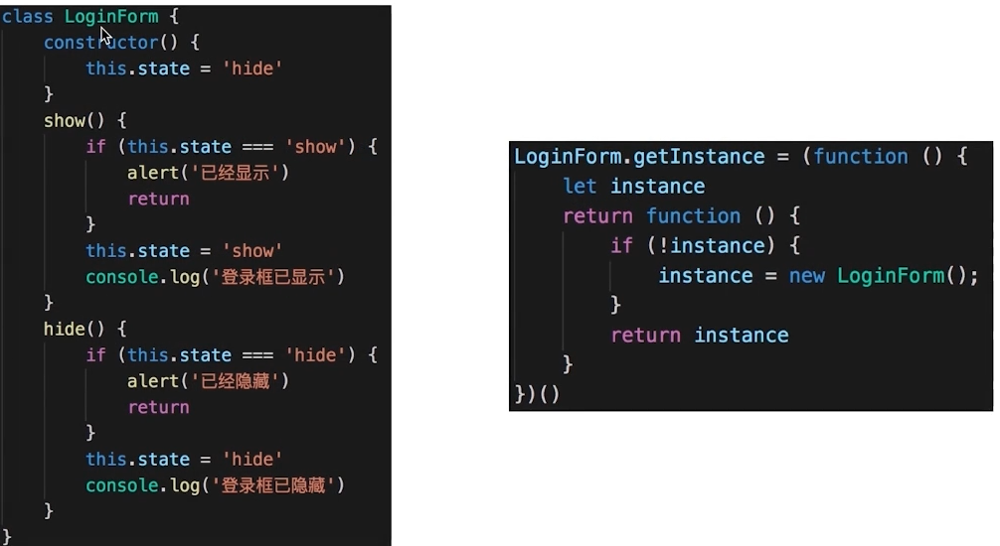

# 单例模式

# 介绍

一个类只有一个实例。

**示例：**

登录框、购物车。

JS 使用单例模式：

    class SingleObject {
        login() {
            console.log('login...')
        }
    }
    
    // 静态方法
    SingleObject.getInstance = (function () {
        let instance
        return function () {
            if (!instance) {
                instance = new SingleObject();
            }
            return instance
        }
    })()
    
    // 测试
    let obj1 = SingleObject.getInstance()
    let obj2 = SingleObject.getInstance()
    console.log(obj1 === obj2)

## 场景

jQuery 只有一个$

模拟登录框

    class LoginForm {
        constructor() {
            this.state = 'hide'
        }
        show() {
            if (this.state === 'show') {
                alert('已经显示')
                return
            }
            this.state = 'show'
            console.log('登录框已显示')
        }
        hide() {
            if (this.state === 'hide') {
                alert('已经隐藏')
                return
            }
            this.state = 'hide'
            console.log('登录框已隐藏')
        }
    }
    LoginForm.getInstance = (function () {
        let instance
        return function () {
            if (!instance) {
                instance = new LoginForm();
            }
            return instance
        }
    })()
    
    // 一个页面中调用登录框
    let login1 = LoginForm.getInstance()
    login1.show()
    // login1.hide()
    
    // 另一个页面中调用登录框
    let login2 = LoginForm.getInstance()
    login2.show()
    
    // 两者是否相等
    console.log('login1 === login2', login1 === login2)

# 其他

购物车

vuex 、redux 中的 store/state。

