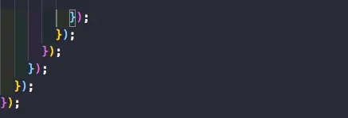

# VsCode 
# VsCode 常用

# 注释模板

    https://blog.csdn.net/hanwuqia0370/article/details/85777899

# 注释高亮

    {
    	"Print to jsNoteTitle": {
    	  "prefix": "jsNoteTitle",
    	  "body": [
    		"/**",
    		"* @description ",
    		"* @author Span",
    		"* @date ${CURRENT_YEAR}-${CURRENT_MONTH}-${CURRENT_DATE} ${CURRENT_HOUR}:${CURRENT_MINUTE}:${CURRENT_SECOND}",
    		"* @version V1.0.1",
    		"*/"
    	  ],
    	  "description": ""
    	},
    	"Print to jsfn": {
    	  "prefix": "jsfn",
    	  "body": [
    		"/**",
    		"* @description: ",
    		"* @param arg0: ${1:参数1}",
    		"* @param arg1: ${2:参数2}",
    		"* @param arg2: ${3:参数3}",
    		"* @author: Span",
    		"* @version: V1.0.1",
    		"* @date : ${CURRENT_YEAR}-${CURRENT_MONTH}-${CURRENT_DATE} ${CURRENT_HOUR}:${CURRENT_MINUTE}:${CURRENT_SECOND}",
    		"* @tips : ",
    		"* 1. ",
    		"*/"
    	  ],
    	  "description": ""
    	},
    	"Print to jsModify": {
    	  "prefix": "jsModify",
    	  "body": [
    		"/**",
    		"* @description：",
    		"* @author: Span",
    		"* @date : ${CURRENT_YEAR}-${CURRENT_MONTH}-${CURRENT_DATE} ${CURRENT_HOUR}:${CURRENT_MINUTE}:${CURRENT_SECOND}",
    		"* @modifyContent : ",
    		"* 1. ",
    		"*/"
    	  ],
    	  "description": ""
    	},
    	"Print to jsVariable": {
    	  "prefix": "jsVariable",
    	  "body": [
    		"/**",
    		"* @description: ",
    		"* @variable : ${1:变量1}",
    		"* @variable : ${2:变量2}",
    		"* @variable : ${3:变量3}",
    		"* @variable : ${4:变量4}",
    		"* @variable : ${5:变量5}",
    		"*/"
    	  ],
    	  "description": ""
    	}
      }

# 常用插件

1. 语言包：Chinese (Simplified) Language Pack for Visual Studio Code
2. Beautify：美化代码的作用

1. vscode-icons：美化图标
2. Live Server：自动搭建本地服务器，启动网页

1. Markdown Preview Enhanced：markdown的增强插件
2. Markdown All in One: 在markdown适用快捷键

- **括号配对着色(Bracket Pair Colorizer) **

## snippets(代码片段)

代码片段是编辑器中的短代码。因此，可以输入 imr 并按Tab 来展开该代码片段，而不是'import React from '。类似地，clg 变成了 console.log。

各种各样的框架和类库都有很多代码片段：Javascript，React，Redux，Angular，Vue，Jest。 我个人认为 Javascript 代码片段非常有用，因为我主要使用 JS 。

一些很好的代码片段扩展 –

- [JavaScript (ES6) code snippets](https://marketplace.visualstudio.com/items?itemName=xabikos.JavaScriptSnippets)
- [React-Native/React/Redux snippets for es6/es7](https://marketplace.visualstudio.com/items?itemName=EQuimper.react-native-react-redux)

- [React Standard Style code snippets](https://marketplace.visualstudio.com/items?itemName=TimonVS.ReactSnippetsStandard)

# vscode setting.json 

[https://code.visualstudio.com/docs/getstarted/settings](https://code.visualstudio.com/docs/getstarted/settings)

    {
      "eslint.run": "onType",
      "eslint.options": {
        "extensions": [".js", ".vue", ".jsx", ".tsx"]
      },
      "editor.codeActionsOnSave": {
        "source.fixAll.eslint": true
      },
      "editor.tabSize": 2,
      // 编辑器设置 - 保存时做格式化
      "editor.formatOnSave": true,
      // 编辑器设置 - 默认采用prettier-now做格式化
      // 如果使用的是prettier，这的设置应该是 esbenp.prettier-vscode
      "editor.defaultFormatter": "esbenp.prettier-vscode",
    
      // 控制缩进
      "prettier.useTabs": false, // 缩进不使用tab，使用空格
      "prettier.tabWidth": 2, // 缩进字节数
    
      // react的jsx让>与结束标签同行
      "prettier.jsxBracketSameLine": false,
      "prettier.bracketSpacing": false, // 去掉数组内部前后的空格
      "prettier.semi": false, // 不要给语句加;
      "prettier.singleQuote": true, // 采用单引号
      "prettier.trailingComma": "none", // 不要尾随逗号,
      "prettier.printWidth": 80, // 每行超过80列就换行
    
      // 在.js中，写div按下tab就可以自动补全，而不需要写<div再补全
      "emmet.includeLanguages": {
        "javascript": "javascriptreact"
      },
      "liveServer.settings.ChromeDebuggingAttachment": false,
      "workbench.sideBar.location": "left",
      "liveServer.settings.AdvanceCustomBrowserCmdLine": "",
      "editor.fontLigatures": null,
      "editor.detectIndentation": false,
      "notebook.kernelProviderAssociations": []
    }

# 代码规范配置 

[https://www.cnblogs.com/niuben/p/11775830.html](https://www.cnblogs.com/niuben/p/11775830.html)

[https://www.jianshu.com/p/c6e140d62ce8](https://www.jianshu.com/p/c6e140d62ce8)

# VSCode的Vue插件Vetur设置

    {
        "vetur.format.options.tabSize": 4,
        "vetur.format.options.useTabs": true,
        "vetur.format.defaultFormatterOptions": {
            "prettier": {
                "semi": false,    //不加分号
                "singleQuote": true  //用单引号
            }
        }
    }

# VsCode推荐插件 + ESLint代码规范 + Vetur格式化

## Vue-cli 创建项目

略。

## 配置

如果一切就绪，新建一个`.vscode`的文件夹并在里面创建名为`settings.json`的文件：

.setting.json

    {
      "[vue]": {
        "editor.defaultFormatter": "octref.vetur"
      },
      "[javascript]": {
        "editor.defaultFormatter": "vscode.typescript-language-features"
      },
      "eslint.validate": [
        "javascript",
        "javascriptreact"
      ],
      "vetur.format.defaultFormatter.js": "vscode-typescript",
      "vetur.format.defaultFormatter.html": "js-beautify-html",
      "vetur.format.defaultFormatterOptions": {
        "js-beautify-html": {
          "wrap_attributes": "force-expand-multiline"
        }
      },
      "editor.tabSize": 2,
      "vetur.validation.template": false,
      "files.exclude": {
        "node_modules": true
      },
      "git.ignoreLimitWarning": true,
      "editor.codeActionsOnSave": {
        "source.fixAll.eslint": true
      },
      "git.confirmSync": false,
      "eslint.quiet": true,
      "javascript.format.insertSpaceBeforeFunctionParenthesis": true,
      "typescript.format.insertSpaceAfterConstructor": true,
      "typescript.format.insertSpaceBeforeFunctionParenthesis": true,
      "javascript.preferences.quoteStyle": "single",
      "javascript.format.insertSpaceAfterConstructor": true,
      "typescript.preferences.quoteStyle": "single",
      "html.format.wrapAttributes": "force-expand-multiline",
      "editor.formatOnSave": true,
      "prettier.vueIndentScriptAndStyle": true,
      "prettier.singleQuote": true,
      "prettier.useTabs": true
    }

编辑`.eslintrc.js`文件，将`rules`的规则替换成下面的：

    rules: {
        'no-console': 'off',
        'accessor-pairs': [2, { setWithoutGet: true }], // 强制 getter 和 setter 在对象中成对出现
        'arrow-spacing': [2, { before: true, after: true }], // 强制箭头函数的箭头前后使用一致的空格
        'block-spacing': [2, 'always'], // 禁止或强制在代码块中开括号前和闭括号后有空格
        'brace-style': [2, '1tbs', { allowSingleLine: true }], // 强制在代码块中使用一致的大括号风格
        camelcase: [2, { properties: 'always' }], // 强制使用骆驼拼写法命名约定
        'comma-dangle': [2, 'never'], // 要求或禁止末尾逗号
        'comma-spacing': [2, { before: false, after: true }], // 强制在逗号周围使用空格
        'comma-style': [2, 'last'], // 要求逗号放在数组元素、对象属性或变量声明之后，且在同一行
        'constructor-super': 2, // 要求在构造函数中有 super() 的调用
        curly: 2, // 要求遵循大括号约定
        'dot-location': [2, 'property'], // 要求点操作符和属性放在同一行
        'eol-last': 2, // 要求在非空文件末尾至少存在一行空行
        eqeqeq: [2, 'always'], // 强制在任何情况下都使用 === 和 !==
        'generator-star-spacing': [2, { before: false, after: true }], // 强制 generator 函数中 * 号后有空格
        'handle-callback-err': [2, '^(err|error)$'], // 强制回调错误处理
        indent: [2, 2, { SwitchCase: 1 }], // 强制使用一致的缩进
        'jsx-quotes': [2, 'prefer-single'], // 强制在 JSX 属性中一致地使用单引号
        'key-spacing': [2, { beforeColon: false, afterColon: true }], // 强制在对象字面量的属性中键和值之间使用一致的间距
        'keyword-spacing': [2, { before: true, after: true }], // 关键字周围空格的一致性
        'new-cap': [2, { newIsCap: true, capIsNew: false }], // 要求构造函数首字母大写
        'new-parens': 2, // 要求调用无参构造函数时带括号
        'no-array-constructor': 2, // 禁止使用 Array 构造函数
        'no-caller': 2, // 禁用 caller 或 callee
        'no-class-assign': 2, // 不允许修改类声明的变量
        'no-cond-assign': 2, // 禁止条件表达式中出现赋值操作符
        'no-const-assign': 2, // 禁止修改 const 声明的变量
        'no-control-regex': 2, // 禁止在正则表达式中使用控制字符
        'no-delete-var': 2, // 禁止删除变量
        'no-dupe-args': 2, // 禁止 function 定义中出现重名参数
        'no-dupe-class-members': 2, // 禁止类成员中出现重复的名称
        'no-dupe-keys': 2, // 禁止对象字面量中出现重复的 key
        'no-duplicate-case': 2, // 禁止出现重复的 case 标签
        'no-empty-character-class': 2, // 禁止在正则表达式中使用空字符集
        'no-empty-pattern': 2, // 禁止使用空解构模式
        'no-eval': 2, // 禁用 eval()
        'no-ex-assign': 2, // 禁止对 catch 子句的参数重新赋值
        'no-extend-native': 2, // 禁止扩展原生对象
        'no-extra-bind': 2, // 禁止不必要的 .bind() 调用
        'no-extra-boolean-cast': 2, // 禁止不必要的布尔转换
        'no-extra-parens': 2, // 禁止不必要的括号
        'no-fallthrough': 2, // 禁止 case 语句落空
        'no-floating-decimal': 2, // 禁止数字字面量中使用前导和末尾小数点
        'no-func-assign': 2, // 禁止对 function 声明重新赋值
        'no-implied-eval': 2, // 禁止使用类似 eval() 的方法
        'no-inner-declarations': [2, 'both'], // 禁止在嵌套的块中出现变量声明或 function 声明
        'no-invalid-regexp': 2, // 禁止 RegExp 构造函数中存在无效的正则表达式字符串
        'no-irregular-whitespace': 2, // 禁止在字符串和注释之外不规则的空白
        'no-iterator': 2, // 禁用 __iterator__ 属性
        'no-label-var': 2, // 不允许标签与变量同名
        'no-labels': [2, { allowLoop: false, allowSwitch: false }], // 禁用标签语句
        'no-lone-blocks': 2, // 禁用不必要的嵌套块
        'no-mixed-spaces-and-tabs': 2, // 禁止空格和 tab 的混合缩进
        'no-multi-spaces': 2, // 禁止使用多个空格
        'no-multi-str': 2, // 禁止使用多行字符串
        'no-multiple-empty-lines': [2, { max: 1 }], // 不允许多个空行
        'no-global-assign': 2, // 禁止对原生对象或只读的全局对象进行赋值
        'no-unsafe-negation': 2, // 禁止在in表达式中否定左操作数
        'no-new-object': 2, // 禁用 Object 的构造函数
        'no-new-require': 2, // 禁止调用 require 时使用 new 操作符
        'no-new-symbol': 2, // 禁止 Symbolnew 操作符和 new 一起使用
        'no-new-wrappers': 2, // 禁止对 String，Number 和 Boolean 使用 new 操作符
        'no-obj-calls': 2, // 禁止把全局对象作为函数调用
        'no-octal': 2, // 禁用八进制字面量
        'no-octal-escape': 2, // 禁止在字符串中使用八进制转义序列
        'no-path-concat': 2, // 禁止对 __dirname 和 __filename 进行字符串连接path.jonin() 和 path.reslove() 非常适合替换字符串拼接来创建文件和目录路径。
        'no-redeclare': 2, // 禁止多次声明同一变量
        'no-regex-spaces': 2, // 禁止正则表达式字面量中出现多个空格
        'no-return-assign': [2, 'except-parens'], // 禁止出现赋值语句，除非使用括号把它们括起来。
        'no-self-assign': 2, // 禁止自我赋值
        'no-self-compare': 2, // 禁止自身比较
        'no-sequences': 2, // 禁用逗号操作符
        'no-shadow-restricted-names': 2, // 禁止将标识符定义为受限的名字
        'func-call-spacing': [2, 'never'], // 要求或禁止在函数标识符和其调用之间有空格
        'no-sparse-arrays': 2, // 禁用稀疏数组
        'no-this-before-super': 2, // 禁止在构造函数中，在调用 super() 之前使用 this 或 super
        'no-throw-literal': 2, // 禁止抛出异常字面量
        'no-trailing-spaces': 2, // 禁用行尾空白
        'no-undef': 2, // 禁用未声明的变量，除非它们在 /*global */ 注释中被提到
        'no-undef-init': 2, // 禁止将变量初始化为 undefined
        'no-unexpected-multiline': 2, // 禁止出现令人困惑的多行表达式
        'no-unmodified-loop-condition': 2, // 禁用一成不变的循环条件
        'no-unneeded-ternary': [2, { defaultAssignment: false }], // 禁止可以在有更简单的可替代的表达式时使用三元操作符
        'no-unreachable': 2, // 禁止在return、throw、continue 和 break 语句之后出现不可达代码
        'no-unsafe-finally': 2, // 禁止在 finally 语句块中出现控制流语句
        'no-unused-vars': [2, { vars: 'all', args: 'none' }], // 禁止出现未使用过的变量,不检查参数
        'no-useless-call': 2, // 禁止不必要的 .call() 和 .apply()
        'no-useless-computed-key': 2, // 禁止在对象中使用不必要的计算属性
        'no-useless-constructor': 2, // 禁用不必要的构造函数
        'no-useless-escape': 2, // 禁用不必要的转义字符
        'no-whitespace-before-property': 2, // 禁止属性前有空白
        'no-with': 2, // 禁用 with 语句
        'one-var': [2, { initialized: 'never' }], // 要求每个作用域的初始化的变量有多个变量声明
        // 'operator-linebreak': [
        //   2,
        //   'after',
        //   { overrides: { '?': 'before', ':': 'before' }}
        // ], // 强制操作符使用一致的换行符风格
        'padded-blocks': [2, 'never'], // 禁止块语句和类的开始或末尾有空行
        quotes: [2, 'single', { avoidEscape: true, allowTemplateLiterals: true }], // 强制使用一致的反勾号、双引号或单引号
        semi: [2, 'never'], // 禁止在语句末尾使用分号
        'semi-spacing': [2, { before: false, after: true }], // 强制分号之前和之后使用一致的空格
        'space-before-blocks': [2, 'always'], // 强制在块之前使用一致的空格
        'space-before-function-paren': ['error', 'always'], // 强制在 function的左括号之前使用一致的空格
        'space-in-parens': [2, 'never'], // 强制在圆括号内使用一致的空格
        'space-infix-ops': 2, // 要求操作符周围有空格
        'space-unary-ops': [2, { words: true, nonwords: false }], // 强制在一元操作符前后使用一致的空格
        'spaced-comment': [
          'error',
          'always',
          {
            markers: []
          }
        ], // 强制在注释中 // 或 /* 使用一致的空格
        'template-curly-spacing': [2, 'never'], // 禁止花括号内出现空格
        'use-isnan': 2, // 要求使用 isNaN() 检查 NaN
        'valid-typeof': 2, // 强制 typeof 表达式与有效的字符串进行比较
        'wrap-iife': [2, 'any'], // 要求 立即执行函数 使用括号括起来
        'yield-star-spacing': [2, 'both'], // 强制在 yield* 表达式中 * 周围使用空格
        yoda: [2, 'never'], // 禁止 “Yoda” 条件
        'prefer-const': 2, // 要求使用 const 声明那些声明后不再被修改的变量
        'no-debugger': process.env.NODE_ENV === 'production' ? 2 : 0,
        'object-curly-spacing': [2, 'always', { objectsInObjects: false }], // 要求花括号内有空格 (除了 {})禁止以对象元素开始或结尾的对象的花括号中有空格
        'array-bracket-spacing': [2, 'never'], // 强制数组方括号中使用一致的空格
        'vue/jsx-uses-vars': 2, // 防止JSX中使用的变量被标记为未使用
        'vue/no-parsing-error': [2, { 'x-invalid-end-tag': false }]
      }

至此，你可以去`App.vue`文件试下效果了，按下`ctrl + s`看看代码规范检验和自动格式化是不是都加上了，作为一个轻量级的开发工具完美替代了航母`webStorm`。

