# Git 基础

## 文件重命名

    git mv readme readme.md

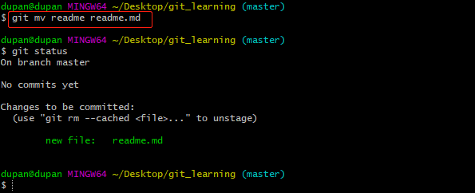

- 新建分支

切换分支：`git checkout temp`

    git checkout -b temp

    基于fix_css 创建新分支
    git checkout -b fix_readme fix_css

- `git tag `

为 commit 打 tag

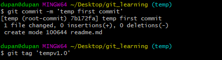

## 版本历史

    git log --oneline

    git log -n4

    查看分支
    git branch -v
    git branch -va

    查看所有分支的历史
    git log --all

​  
 查看整个版本的演进历史
git log --oneline --all --graph

    查看类型
    git cat-file -t hash_id

    查看内容
    git cat-file -p hash_id

## .git 目录

- HEAD

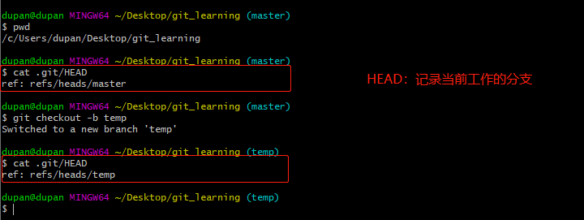

- config

存放配置信息。

- refs

heads 目录：对应我们的分支（独立的开发空间）。

tags 目录：存放的标签，对应的 commit 打上的标签。

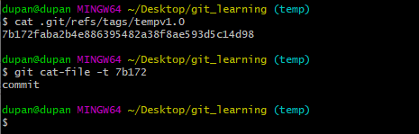

- objects

文件添加到暂存区后，git 会在`objects` 文件夹下创建 blob

    echo 'temp write' > readme.md
    git add readme.md
    git commit -m 'first wirte'

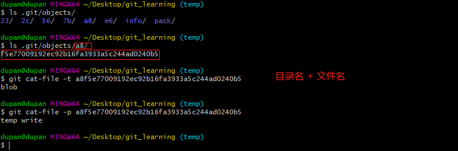

## commit、tree、blob 三个对象之间的关系

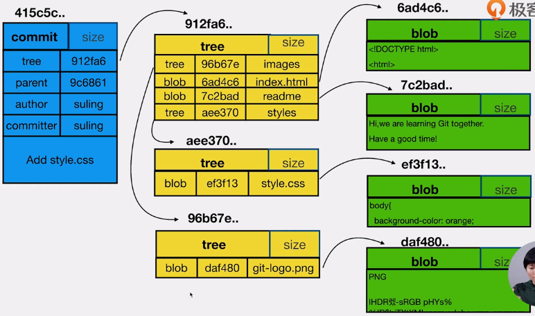

commit：一个 commit 对应一棵 tree。展现当前时间点项目的文件结构。

tree：文件夹

blob：文件

## 案例：数一数 tree 的个数

新建一个 Git 仓库，有且仅有 1 个 commit，仅仅包含 /doc/readme，请问内含多少个 tree，多少个 blob？

- 初始化

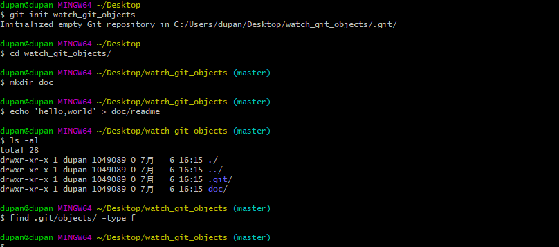

- git add

内容添加到暂存区，git 会主动的在 objects 创建对象

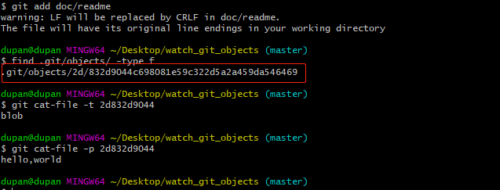

- git commit

查看 `.git/objects/` 下生成的对象

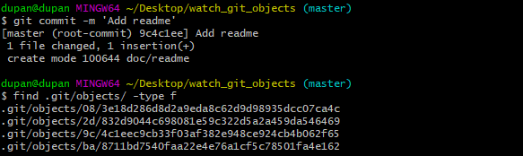

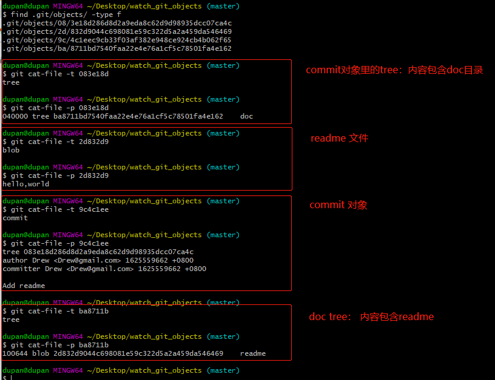

- 总结

1 个 commit ，2 个 tree ，1 个 blob

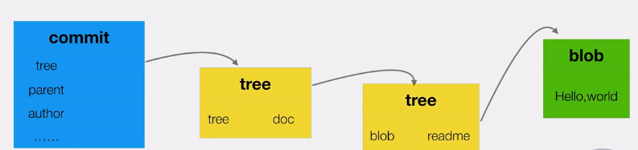

## 分离头指针情况的注意事项

分离头指针：

HEAD 指向 commit 的情况。

## 进一步理解 HEAD 和 branch

**HEAD：**

不仅仅可以指代新分支的最后一次提交（HEAD 最终指代于 commit）；

处于分离头指针的状态时，指代某个 commit 上；

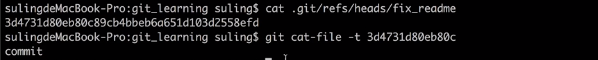

- 常用

HEAD 快速指代 commit。

`HEAD^1 / HEAD~1` HEAD 的父亲

`HEAD^^ / HEAD~2 ` HEAD 父亲的父亲

# Git 常见场景

## 修改最新 commit 的 message

`git commit --amend`

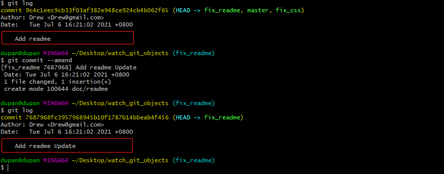

# ## 修改老旧的 commit 的 message

- git log

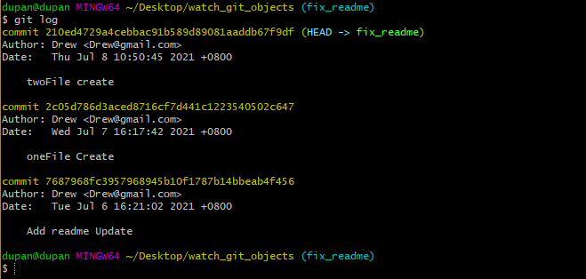

- `git rebase -i `

**变基：**要选择被变 commit 的，父亲。

    被修改的commit是：2c05d78

    git rebase -i 7687968

修改 2c05d78 的 pick 为 reword，wq! 保存退出。

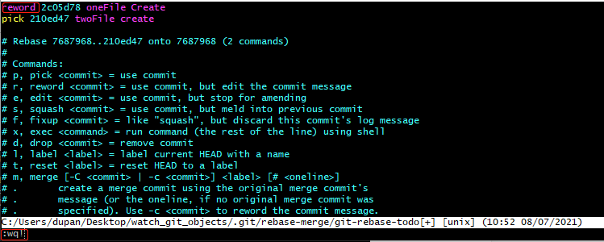

在弹出的另一个交互式文件中，修改 commit message 为 oneFile Create Reword。

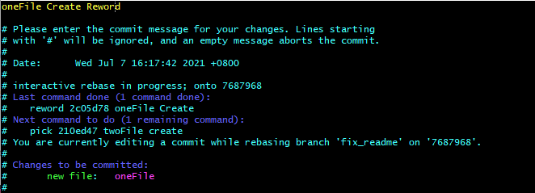

- `git log`

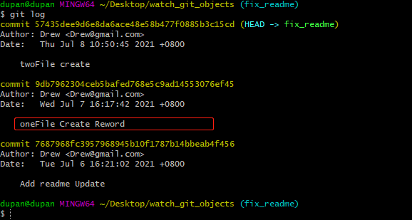

# ## 合并连续的多个 commit

- 目标

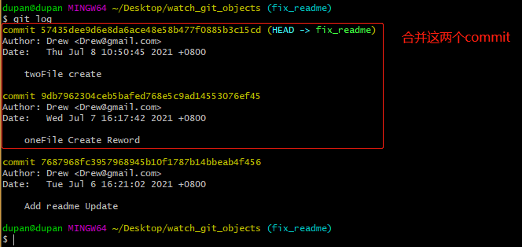

- git rebase -i 7687968

以他们的父亲。

基于 9db7962 合并，这一个为 pick ;

其他用 squash；

wq!

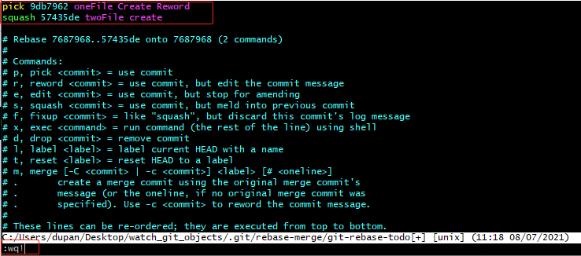

在弹出的交互式文件，添加 commit message

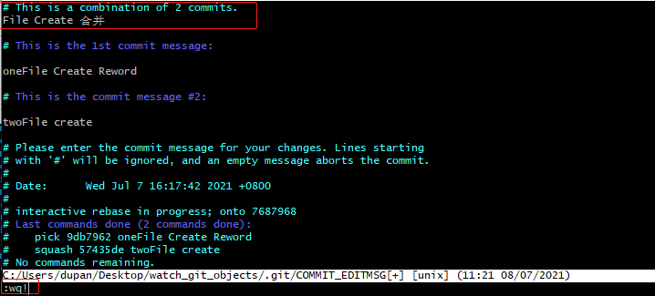

- git log

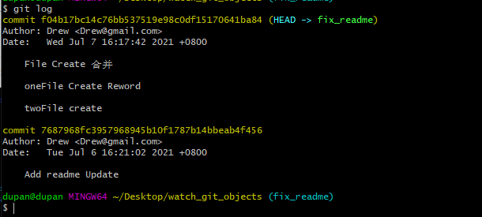

# ## 合并间隔的几个 commit

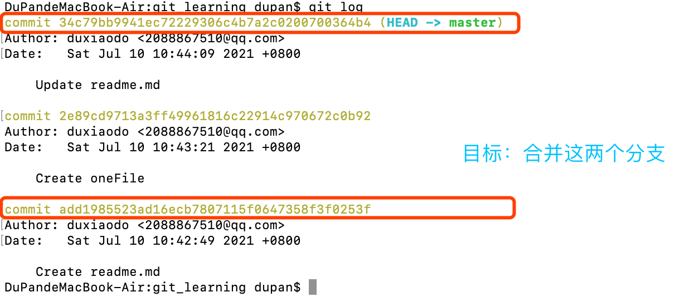

- `git rebase -i add198`

注意：

1、 弹出的交互式文件中，未包含 add198 这个 commit，需添加进去

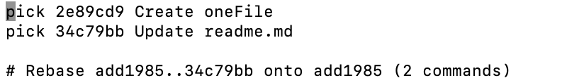

2、要合并的 commit 要放在一起。

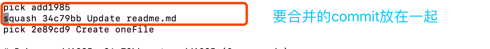

保存后，提示：

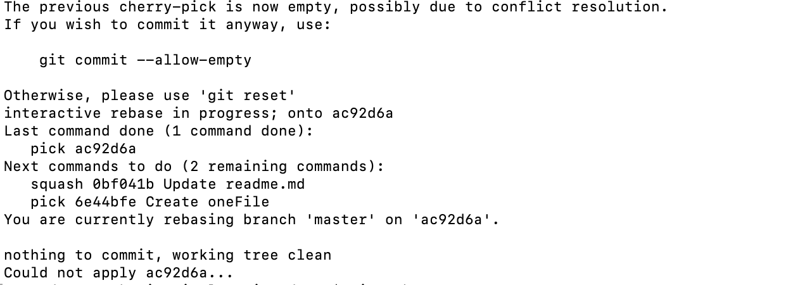

- `git rebase --continue`

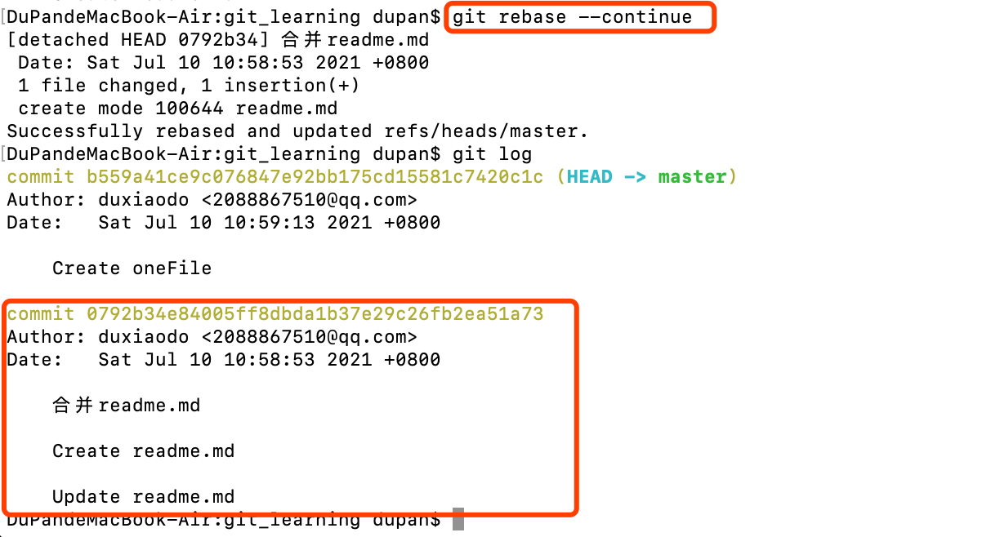

# ## 比较暂存区和 HEAD 所含文件的差异

- `git diff --cached`

暂存区与 HEAD(上一次 commit) 的差异。

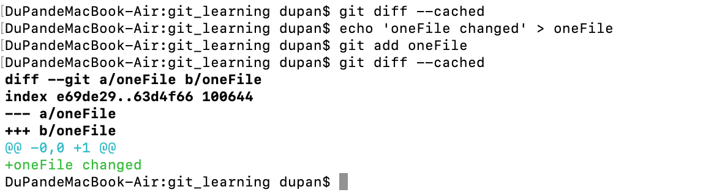

# ## 工作区和暂存区所含文件的差异

- git diff

默认将所有 工作区和暂存区 文件的差异比对。

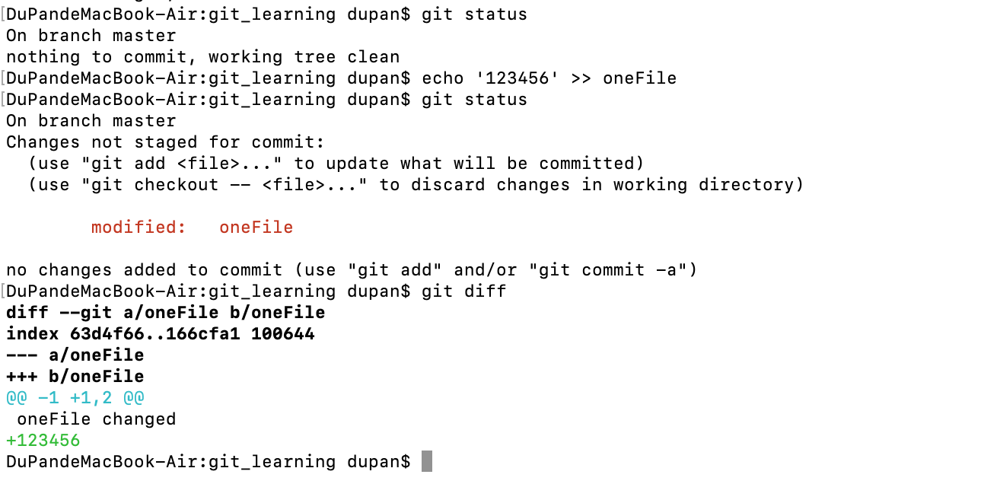

- git diff -- file1 file2 ... filen

指定文件

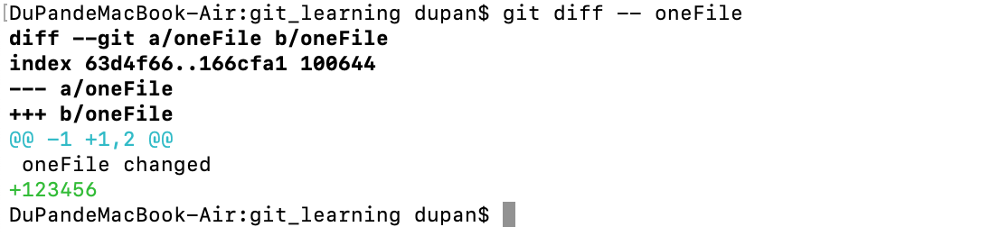

# ## 暂存区恢复成和 HEAD 的一样

- `git reset HEAD`

暂存区所有文件恢复和 HEAD 一样

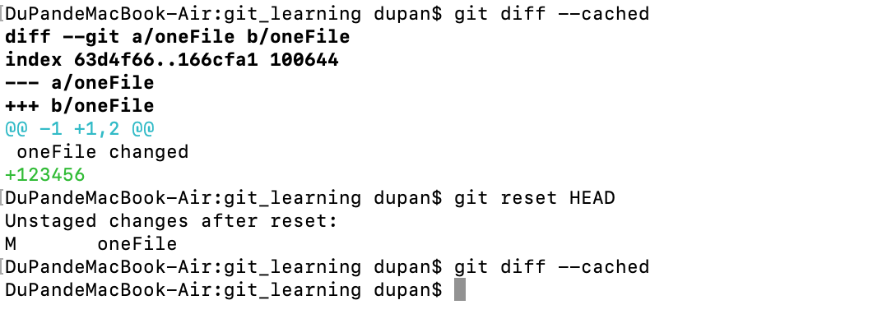

- git reset HEAD -- file1 file2 ... filen

暂存区部分文件恢复和 HEAD 一样。

# ## 工作区的文件恢复为暂存区的一样

- `git checkout -- file`

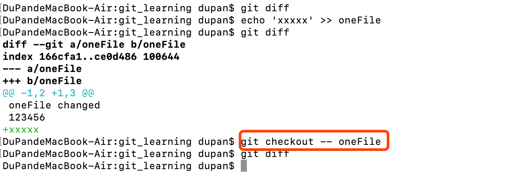

# ## 消除最近的几次提交

    git reset --hard xxxxx

# ## 不同提交的指定文件的差异

    git diff temp master -- index.html
    git diff xxx_id xxx_id -- index.html

# ## 正确删除文件的方法

git 会直接把删除文件的情况放到暂存区。

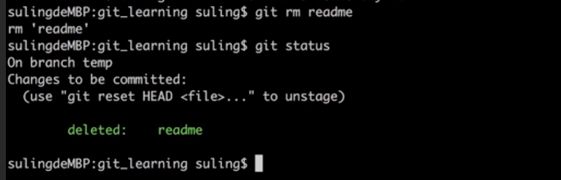

# ## 开发中临时加塞了紧急任务怎么处理

- git stash

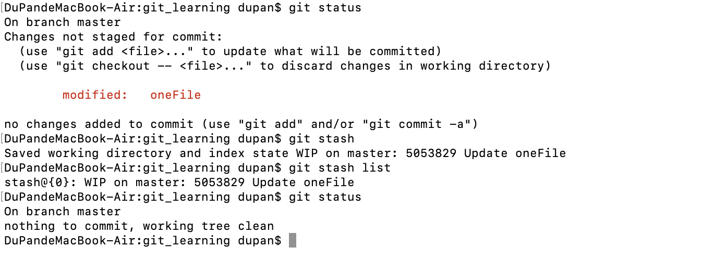

- `git stash apply`

把内容弹出来，放到工作区，stash 的堆栈里买呢还在。

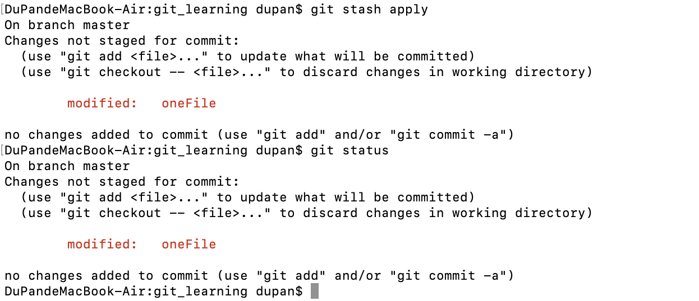

- `git stash pop`
