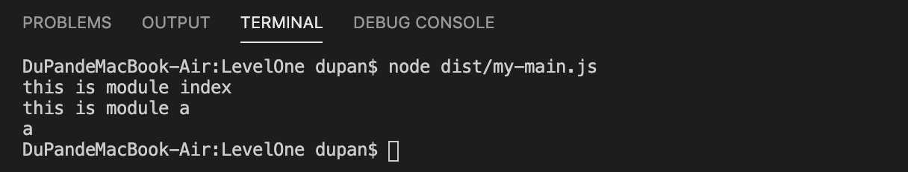
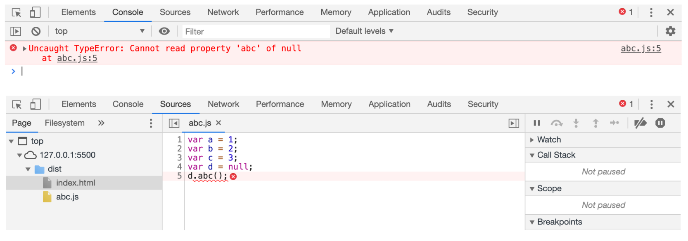
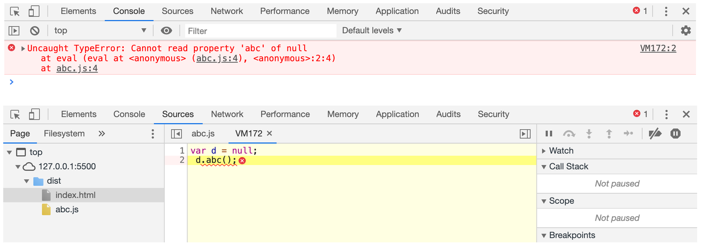
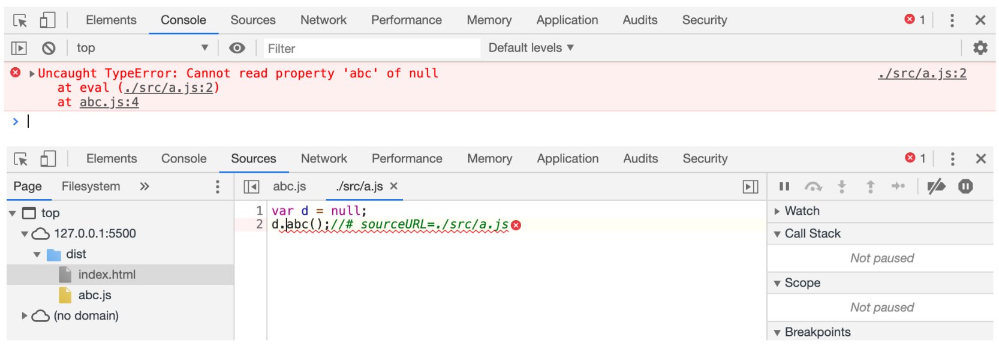
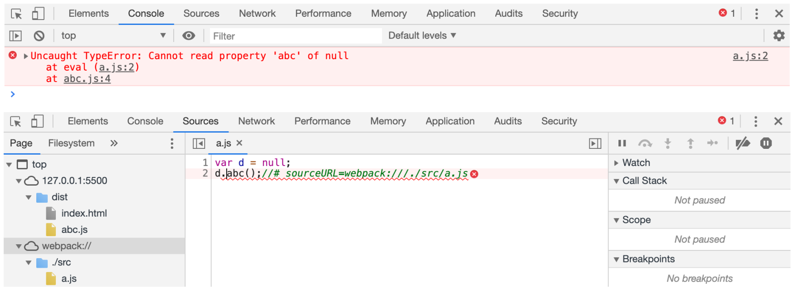

# 04-编译结果分析 
# **1 编译结果分析**

## 1.1 自己实现my-main.js

**my-main.js：**

- 用一个对象保存所有的模块，以及模块对象的代码

> 以模块名（模块路径）作为属性名，模块代码放在函数里面执行

    // 合并两个模块// ./src/a.js// ./src/index.js// 1. 用一个对象保存所有的模块，以及模块对象的代码//   以模块名作为属性名，模块代码放在函数里面letmodules= {
    './src/a.js': function (module, exports, require) {
    // 模块代码console.log("this is module a")
    module.exports="a";
        },
    './src/index.js': function (module, exports, require) {
    console.log("this is module index")
    // require(路径)：路径要和属性名一致vara=require("./src/a.js")
    console.log(a)
        }
    }

- 封装一个函数

> 处理上面的对象

    // 2. 封装一个函数，处理保存所有模块的对象functiondeal(modules) {
    letmoduleExports= {}; // 用于缓存模块的导出结果// 封装my_require：运行一个模块，得到模块导出结果functionmy_require(moduleId) { // 模块Id： 就是模块的路径// 检查是否有缓存if (moduleExports[moduleId]) {
    returnmoduleExports[moduleId]
            }
    letfunc=modules[moduleId]; // 得到该模块Id对应的函数// 构造一个空 module对象letmodule= {
    exports: {}
            }
    func(module, module.exports, my_require); // 运行模块,func 函数中 有对module赋值导出letresult=module.exports;
    moduleExports[moduleId] =result;
    returnresult;
        }
    // 执行入口模块：require函数相当于是运行一个模块，得到模块导出结果my_require('./src/index.js')
    my_require('./src/a.js')
    my_require('./src/a.js')
    }
    deal(modules)

- 执行

****

**
**

- 优化

> 避免全局污染，使用立即执行函数

    // 合并两个模块// ./src/a.js// ./src/index.js// 2. 封装一个函数，处理保存所有模块的对象(function (modules) {
    letmoduleExports= {}; // 用于缓存模块的导出结果// 封装my_require：运行一个模块，得到模块导出结果functionmy_require(moduleId) { // 模块Id： 就是模块的路径// 检查是否有缓存if (moduleExports[moduleId]) {
    returnmoduleExports[moduleId]
            }
    letfunc=modules[moduleId]; // 得到该模块Id对应的函数// 构造一个空 module对象letmodule= {
    exports: {}
            }
    func(module, module.exports, my_require); // 运行模块,func 函数中 有对module赋值导出letresult=module.exports;
    moduleExports[moduleId] =result;
    returnresult;
        }
    // 执行入口模块：require函数相当于是运行一个模块，得到模块导出结果my_require('./src/index.js');
    })(
    // 1. 用一个对象保存所有的模块，以及模块对象的代码//   以模块名作为属性名，模块代码放在函数里面    {
    './src/a.js': function (module, exports, require) {
    // 模块代码console.log("this is module a")
    module.exports="a";
        },
    './src/index.js': function (module, exports, require) {
    console.log("this is module index")
    // require(路径)：路径要和属性名一致vara=require("./src/a.js")
    console.log(a)
        }
    })

**
**

- webpack

> eavl：可以把字符串当做js代码执行

    //合并两个模块//  ./src/a.js//  ./src/index.js(function (modules) {
    varmoduleExports= {}; //用于缓存模块的导出结果//require函数相当于是运行一个模块，得到模块导出结果function__webpack_require(moduleId) { //moduleId就是模块的路径if (moduleExports[moduleId]) {
    //检查是否有缓存returnmoduleExports[moduleId];
            }
    varfunc=modules[moduleId]; //得到该模块对应的函数varmodule= {
    exports: {}
            }
    func(module, module.exports, __webpack_require); //运行模块varresult=module.exports; //得到模块导出的结果moduleExports[moduleId] =result; //缓存起来returnresult;
        }
    //执行入口模块return__webpack_require("./src/index.js"); //require函数相当于是运行一个模块，得到模块导出结果})({ //该对象保存了所有的模块，以及模块对应的代码"./src/a.js": function (module, exports) {
    eval("console.log("module a")\nmodule.exports = "a";\n //# sourceURL=webpack:///./src/a.js")
        },
    "./src/index.js": function (module, exports, __webpack_require) {
    eval("console.log("index module")\nvar a = __webpack_require("./src/a.js")\na.abc();\nconsole.log(a)\n //# sourceURL=webpack:///./src/index.js")
        }
    });

## 1.2 eval

**为什么使用eval?**

- 不使用eval，当执行报错时

    vara=1;
    varb=2;
    varc=3;
    vard=null;
    d.abc();

- 使用eval，当执行报错时

> eval 中的代码是放在另一个环境中执行的，浏览器认为是单独的执行环境，这样就看不到其他代码的干扰了，
> 
> 更加容易调试。
> 
> 
> 
> 
> `VM172:2` ： VM172是 js执行引擎的虚拟机编号。

    vara=1;
    varb=2;
    varc=3;
    eval("var d = null; \n d.abc();")

- sourceURL

> 告诉浏览器，触发调试时，显示的路径

    vara=1;
    varb=2;
    varc=3;
    eval("var d = null;\nd.abc();//# sourceURL=./src/a.js")

> `//# sourceURL=webpack:///./src/a.js"`
> 
> 在调试的时候，会把`a.js`加到这个目录下，不是真的存在这个目录和这个文件，只是浏览器调试的一种手段

    vara=1;
    varb=2;
    varc=3;
    eval("var d = null;\nd.abc();//# sourceURL=webpack:///./src/a.js")

