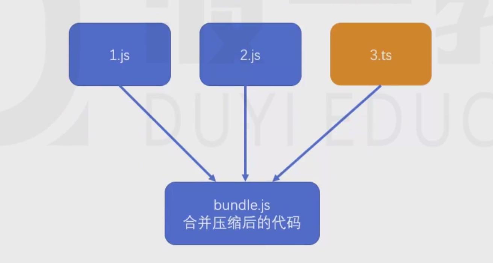
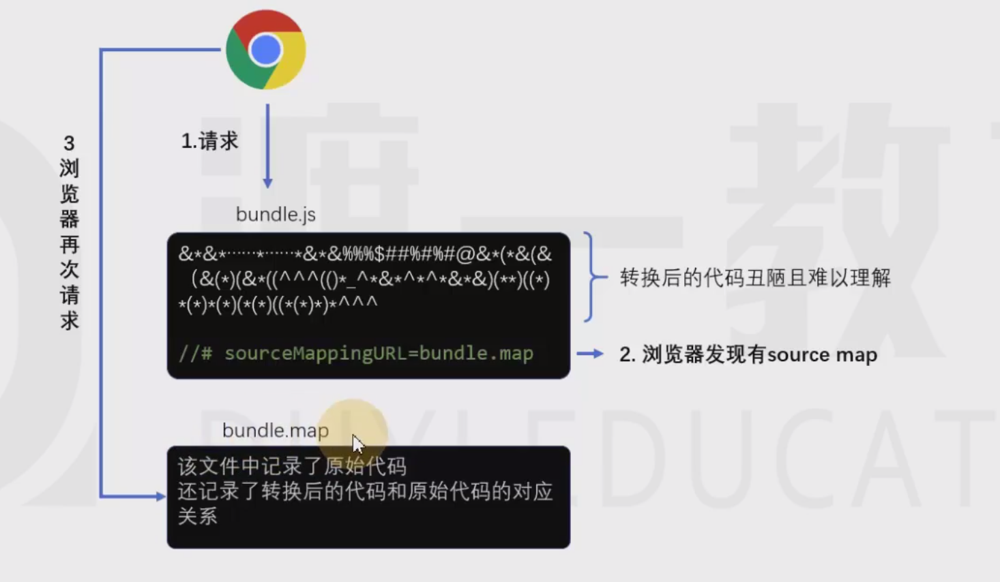
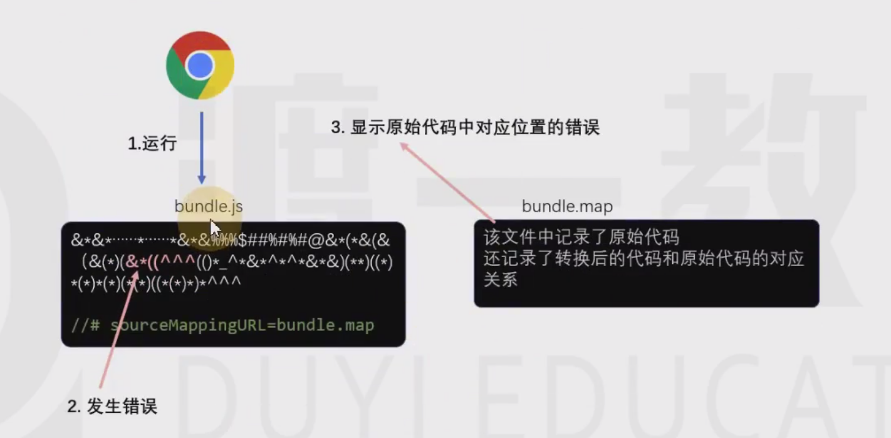
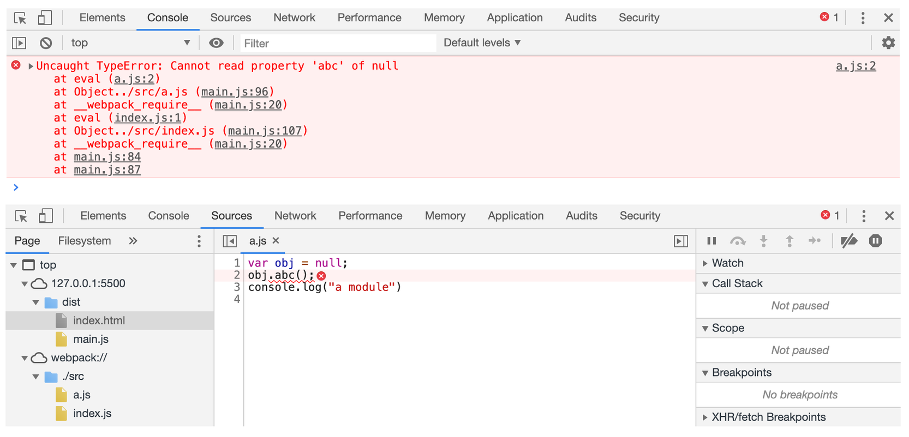
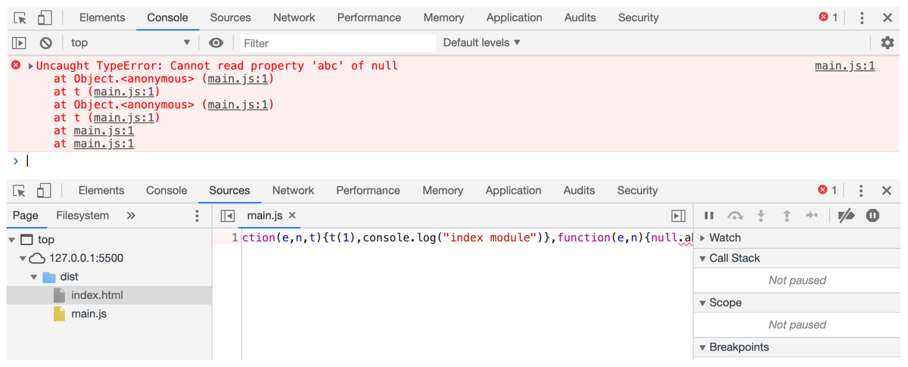
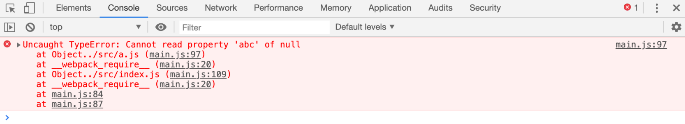
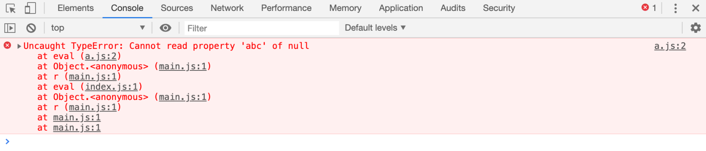

# source map 源码地图

本小节的知识与 webpack 无关。

前端发展到现阶段，很多时候都不会直接运行源代码，可能需要对源代码进行合并、压缩、转换等操作，真正运行的是转换后的代码。

这就给调试带来了困难，因为当运行发生错误的时候，我们更加希望能看到源代码中的错误，而不是转换后代码的错误。

为了解决这一问题，chrome浏览器率先支持了source map，其他浏览器纷纷效仿，目前，几乎所有新版浏览器都支持了source map。

`source map`实际上是一个配置，配置中不仅记录了所有源码内容，还记录了和转换后的代码的对应关系。

**浏览器处理source map的原理：**

****

**最佳实践**：

- source map 应在开发环境中使用

> 作为一种调试手段。

- source map 不应该在生产环境中使用

> source map的文件一般较大，不仅会导致额外的网络传输，还容易暴露原始代码。即便要在生产环境中使用source map，用于调试真实的代码运行问题，也要做出一些处理规避网络传输和代码暴露的问题。

# 2 devtool 配置

## 2.1 未配置时打包

**案例：**

- src

> `a.js`

    varobj=null;
    obj.abc();
    console.log("a module")

> `index.js`

    require("./a")
    console.log("index module")

- 开发环境打包

> `npm run dev`
> 
> 
> 
> 
> 报错显示在具体的源文件：是因为sourceURL。

- 生成环境打包

> `npm run build`
> 
> 
> 
> 
> 报错显示在真实运行的js文件中。

## webpack中的source map

**devtool：**

> 使用 webpack 编译后的代码难以调试，可以通过 devtool 配置来**优化调试体验。**
> 
> **
> **
> 
> 具体的配置：[https://www.webpackjs.com/configuration/devtool/](https://www.webpackjs.com/configuration/devtool/)。

- 开发环境不使用eval

> 打包后的main.js 中未使用eval

    module.exports= {
    mode: 'development',
    devtool: 'none'}

- 生成环境中使用eval

> 打包后的main.js 中有使用eval

    module.exports= {
    mode: 'production',
    devtool: 'eval'}

> `main.js`

    !function(e){varn={};functionr(o){if(n[o])returnn[o].exports;vart=n[o]={i:o,l:!1,exports:{}};returne[o].call(t.exports,t,t.exports,r),t.l=!0,t.exports}r.m=e,r.c=n,r.d=function(e,n,o){r.o(e,n)||Object.defineProperty(e,n,{enumerable:!0,get:o})},r.r=function(e){"undefined"!=typeofSymbol&&Symbol.toStringTag&&Object.defineProperty(e,Symbol.toStringTag,{value:"Module"}),Object.defineProperty(e,"__esModule",{value:!0})},r.t=function(e,n){if(1&n&&(e=r(e)),8&n)returne;if(4&n&&"object"==typeofe&&e&&e.__esModule)returne;varo=Object.create(null);if(r.r(o),Object.defineProperty(o,"default",{enumerable:!0,value:e}),2&n&&"string"!=typeofe)for(vartine)r.d(o,t,function(n){returne[n]}.bind(null,t));returno},r.n=function(e){varn=e&&e.__esModule?function(){returne.default}:function(){returne};returnr.d(n,"a",n),n},r.o=function(e,n){returnObject.prototype.hasOwnProperty.call(e,n)},r.p="",r(r.s=0)}([function(module,exports,__webpack_require__){eval('__webpack_require__(1)\nconsole.log("index module")\n\n//# sourceURL=webpack:///./src/index.js?')},function(module,exports){eval('var obj = null;\nobj.abc();\nconsole.log("a module")\n\n//# sourceURL=webpack:///./src/a.js?')}]);

## 2.3 最佳实践

**开发模式：**

> 这些选项通常用于开发环境中。

- `eval`

> 开发模式使用eval（默认使用）。
> 
> 
> 
> 
> 每个模块都使用 `eval()` 执行，并且都有 `//@ sourceURL`。此选项会非常快地构建。
> 
> 主要缺点是，由于会映射到转换后的代码，而不是映射到原始代码（没有从 loader 中获取 source map），所以不能正确的显示行数。

- `eval-source-map`

> 每个模块使用 `eval()` 执行，并且 source map 转换为 DataUrl 后添加到 `eval()` 中。初始化 source map 时比较慢，但是会在重新构建时提供比较快的速度，并且生成实际的文件。行数能够正确映射，因为会映射到原始代码中。它会生成用于开发环境的最佳品质的 source map。
> 
> 
> 
> base64 ，内嵌在main.js 

- `cheap-eval-source-map`

> 类似 `eval-source-map`，每个模块使用 `eval()` 执行。这是 "cheap(低开销)" 的 source map，因为它没有生成列映射(column mapping)，只是映射行数。它会忽略源自 loader 的 source map，并且仅显示转译后的代码，就像 `eval` devtool。

- `cheap-module-eval-source-map`

> 类似 `cheap-eval-source-map`，并且，在这种情况下，源自 loader 的 source map 会得到更好的处理结果。然而，loader source map 会被简化为每行一个映射(mapping)。

**生产环境：**

> 这些选项通常用于生产环境中。

- `(none)`（省略 `devtool` 选项）

> 不生成 source map。这是一个不错的选择。

- `source-map`

> 整个 source map 作为一个单独的文件生成。它为 bundle 添加了一个引用注释，以便开发工具知道在哪里可以找到它。

> 你应该将你的服务器配置为，不允许普通用户访问 source map 文件！

- `hidden-source-map`

> 与 `source-map` 相同，但不会为 bundle 添加引用注释。如果你只想 source map 映射那些源自错误报告的错误堆栈跟踪信息，但不想为浏览器开发工具暴露你的 source map，这个选项会很有用。

> 你不应将 source map 文件部署到 web 服务器。而是只将其用于错误报告工具。

- `nosources-source-map`

> 创建的 source map 不包含 `sourcesContent(源代码内容)`。它可以用来映射客户端上的堆栈跟踪，而无须暴露所有的源代码。你可以将 source map 文件部署到 web 服务器。

> 这仍然会暴露反编译后的文件名和结构，但它不会暴露原始代码。
> 
> 在使用 `uglifyjs-webpack-plugin` 时，你必须提供 `sourceMap：true` 选项来启用 source map 支持。