# 06-webpack编译过程 
# 1 webpack 编译过程

webpack 的作用是将源代码编译（构建、打包）成最终代码。

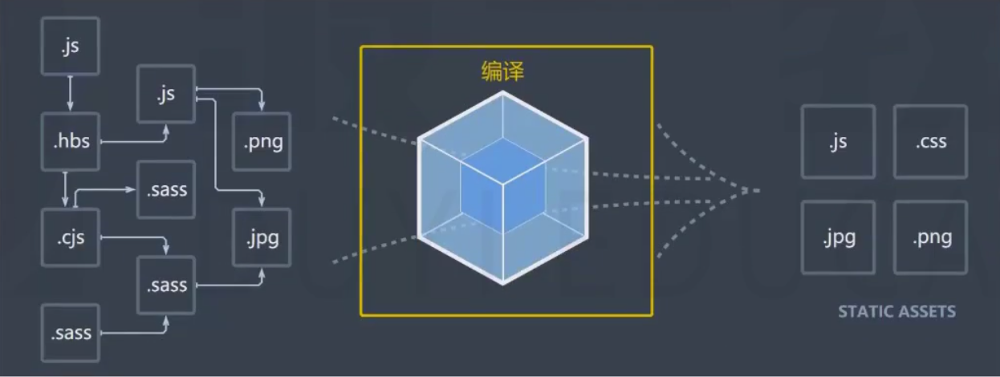

**整个过程大致分为三个步骤：**

1. 初始化
2. 编译
3. 输出

## 1.1 初始化

**初始化：**

> 此阶段，webpack会将**CLI参数**、**配置文件**、**默认配置**进行融合，形成一个最终的配置对象。
> 
> 对配置的处理过程是依托一个第三方库`yargs` 融合配置）完成的。
> 
> 此阶段相对比较简单，主要是为接下来的编译阶段做必要的准备。
> 
> 目前，可以简单的理解为，初始化阶段主要用于产生一个最终的配置。

## 1.2 编译

1. **创建chunk**

> chunk是webpack在内部构建过程中的一个概念，译为`块`，它表示通过某个入口找到的所有依赖的统称。
> 
> 
> 
> 
> 根据入口模块（默认为`./src/index.js`）创建一个chunk。

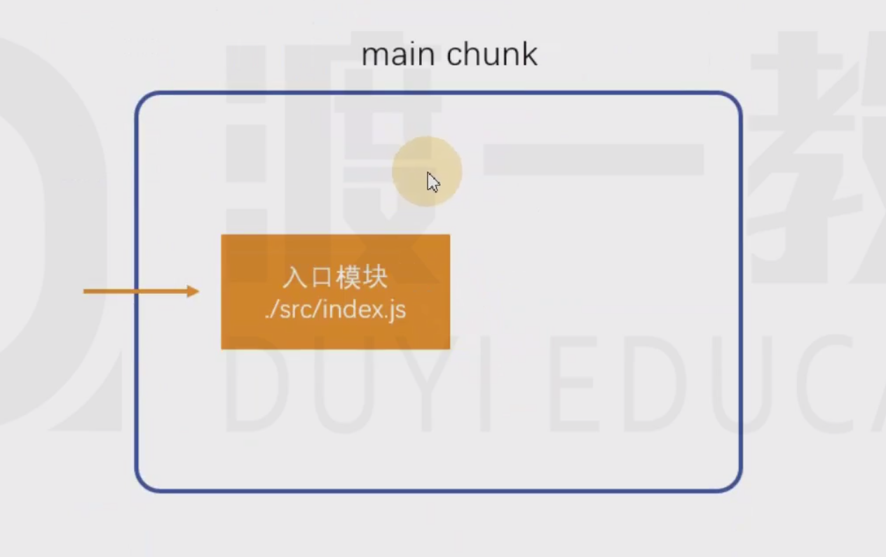

- 每个chunk都有至少两个属性

> name：默认为main。
> id：唯一编号。开发环境和name相同，生产环境是一个数字，从0开始。

1. **构建所有依赖模块**

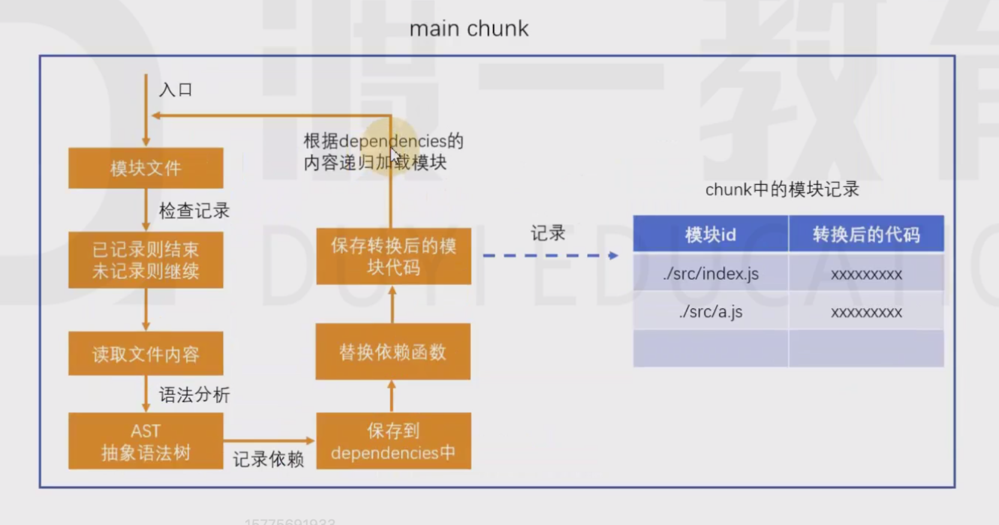

> `index.js`

    console.log("index")
    require("./a");

> 入口：`./src/index.js` 。
> 
> 
> 
> 
> 模块文件：首先拿到的是入口模块的文件路径，`./src/index.js`
> 
> 
> 
> 
> 检查记录：检查模块 `/src/index.js` 是否以加载（有一张表格记录 模块id和模块代码），已加载则结束，未加载则继续。
> 
> 
> 
> 
> 读取文件内容：`require('./a');`
> 
> 
> 
> 
> 语法分析：把文件内容转化为抽象语法树。AST--》树形结构遍历--》找到所有依赖

> AST在线测试工具：[https://astexplorer.net/](https://astexplorer.net/)
> 
> 
> 
> 
> 记录依赖：完整相对路径（模块i的方式）的方式记录到一个数组中，`['./src/a.js']`
> 
> 
> 
> 
> 替换依赖函数：`__webpack_require`  替换`require`，形成了转换后的模块代码
> 
> 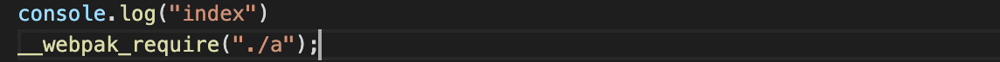
> 
> 
> 
> 
> 保存转换后的模块代码：把转换后的模块代码进行保存，保存到表格中。
> 
> 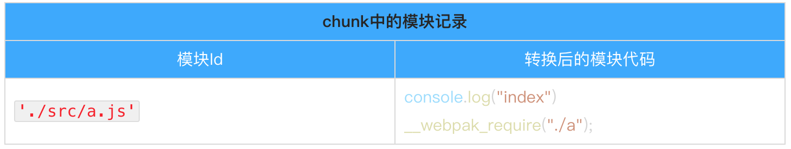
> 
> 
> 
> 
> 根据dependencies 的内容递归加载模块：递归查找dependencies数组中的模块文件。

- 简图

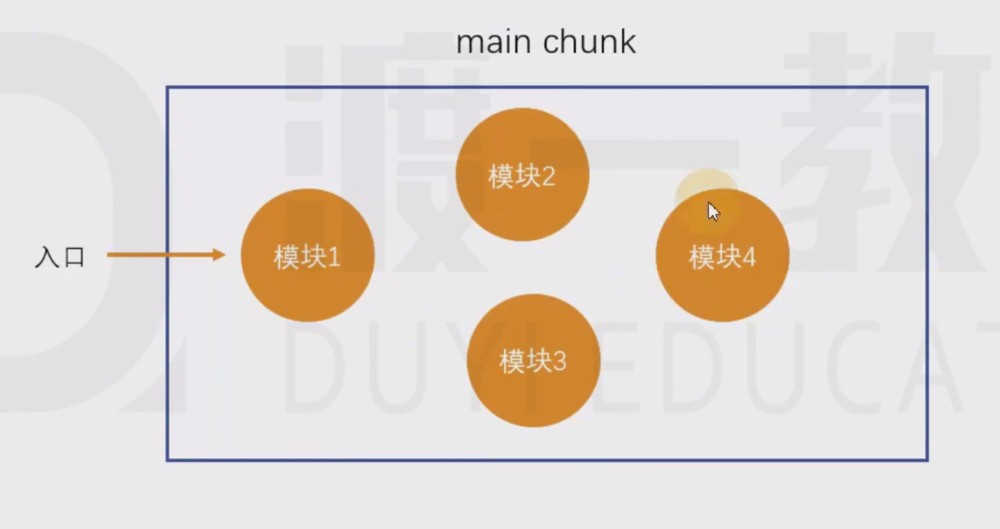

1. **产生chunk assets**

> 在第二步完成后，chunk中会产生一个模块列表，列表中包含了**模块id**和**模块转换后的代码****。**
> 
> **
> **

> 接下来，webpack会根据配置为chunk生成一个资源列表，即`chunk assets`，资源列表可以理解为是生成到最终文件的文件名和文件内容。

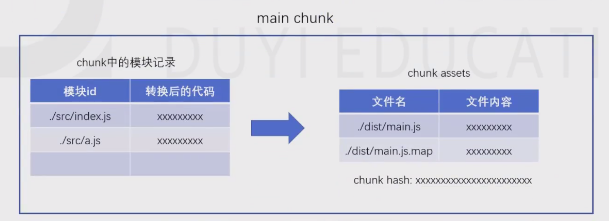

> chunk hash：是根据所有chunk assets的内容生成的一个hash字符串。
> 
> 
> 
> 
> hash：一种算法，具体有很多分类，特点是将一个任意长度的字符串转换为一个固定长度的字符串，而且可以保证原始内容不变，产生的hash字符串就不变。

- 简图

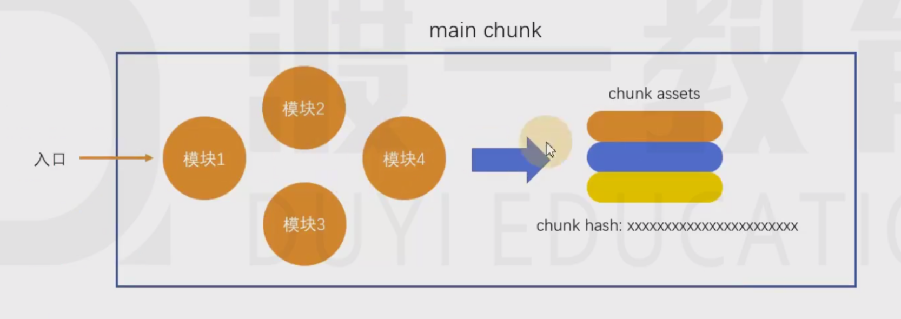

1. **合并chunk assets**

> 将多个`chunk assets`合并到一起，并产生一个总的hash`assets`

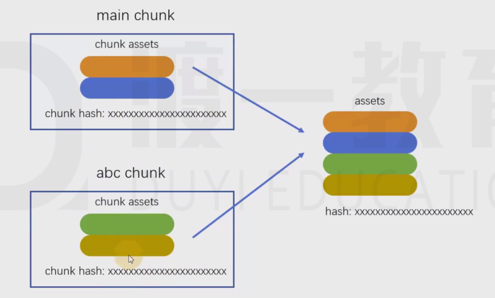

## 1.3 输出

**输出：**

> 此步骤非常简单，webpack将利用node中的fs模块（文件处理模块），根据编译产生的总的`assets`，生成相应的文件。

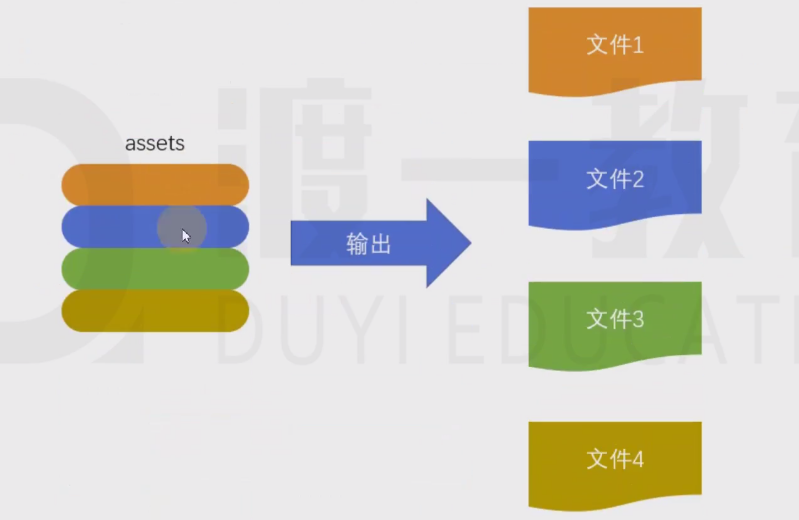

## 1.4 总过程

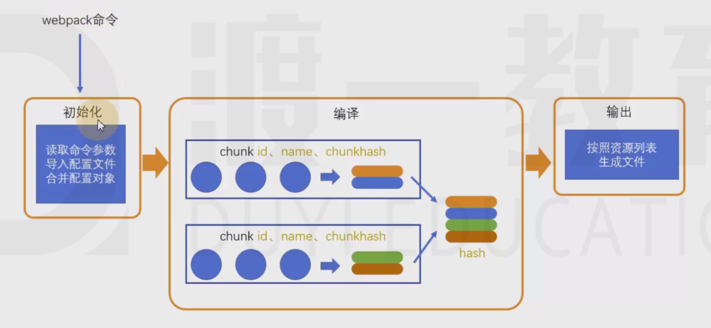

**涉及术语：**

1. module：模块，分割的代码单元，webpack中的模块可以是任何内容的文件，不仅限于JS
2. chunk：webpack内部构建模块的块，一个chunk中包含多个模块，这些模块是从入口模块通过依赖分析得来的
3. bundle：chunk构建好模块后会生成chunk的资源清单，清单中的每一项就是一个bundle，可以认为bundle就是最终生成的文件
4. hash：最终的资源清单所有内容联合生成的hash值
5. chunkhash：chunk生成的资源清单内容联合生成的hash值
6. chunkname：chunk的名称，如果没有配置则使用main
7. id：通常指chunk的唯一编号，如果在开发环境下构建，和chunkname相同；如果是生产环境下构建，则使用一个从0开始的数字进行编号

# 2 输出解读

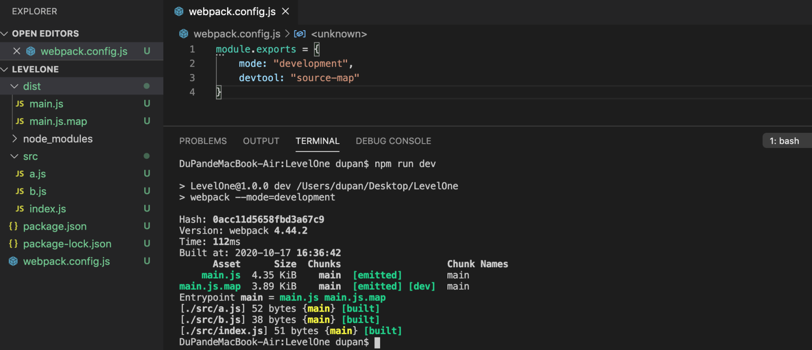

- Hash

> 最终的资源列表生成的hash值。

- 最终的资源列表

> Asset：资源

> Size：资源大小

> Chunks：chunk 的id，emitted 表示已经生成（已经输出成文件）

> Chunk Names:chunk 名称

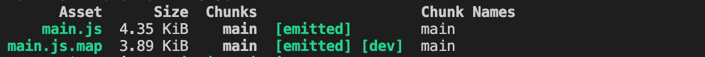

- `Entrypoint 入口： 输出`

> Entrypoint main（chunk 名字）：main 这个chunk最终生成的文件， `main.js 、main.js.map`

- 加载过程

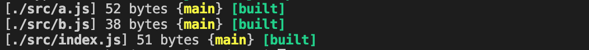