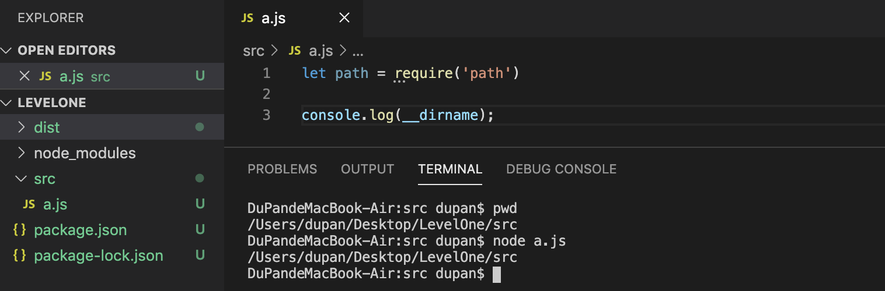
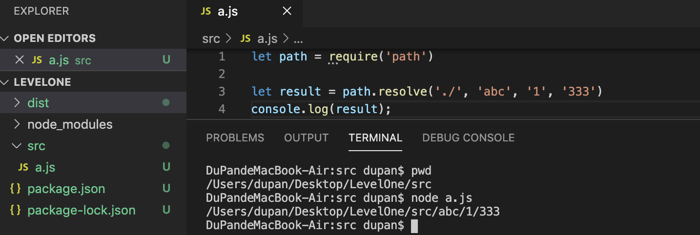
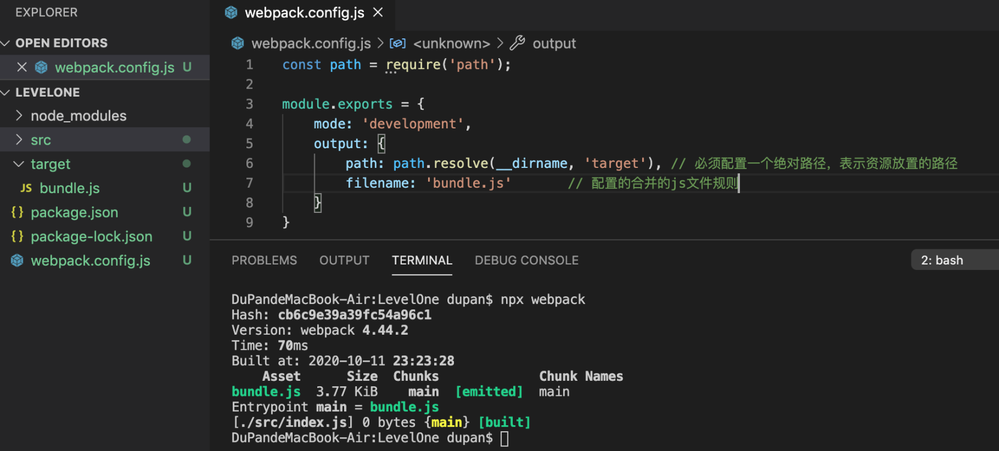
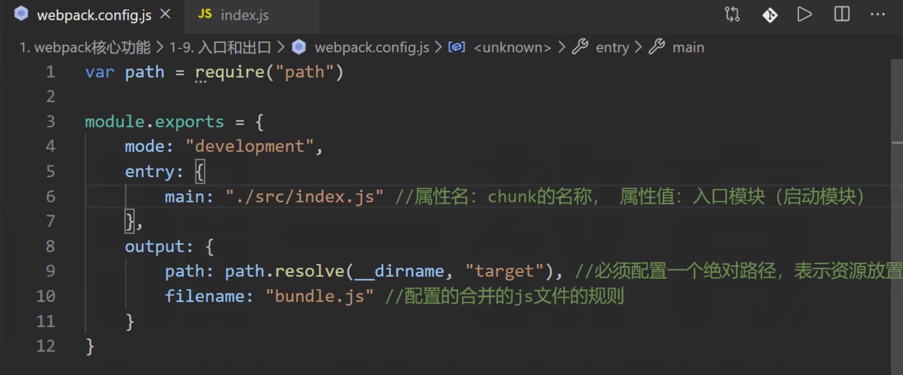
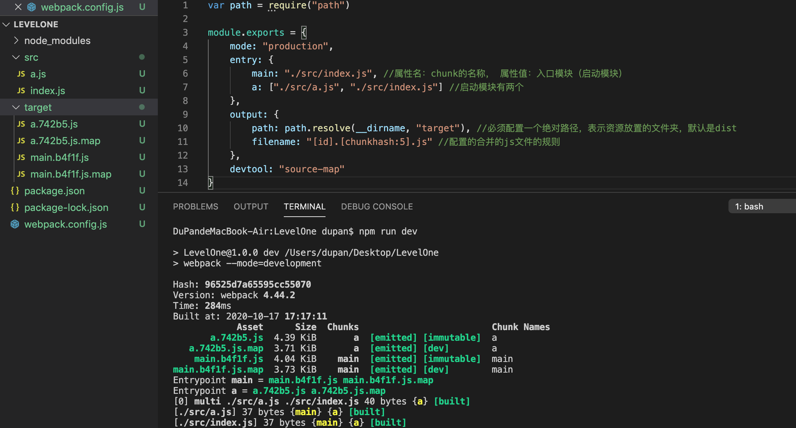
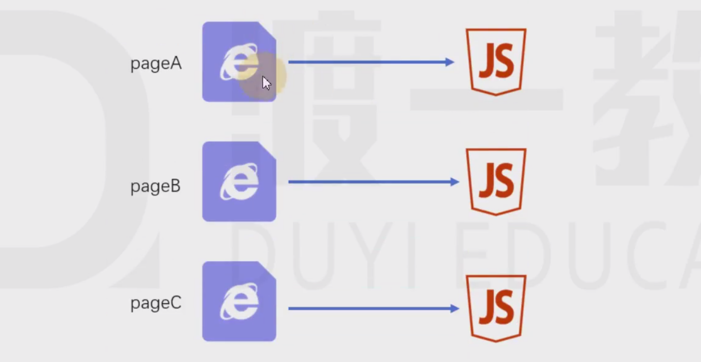
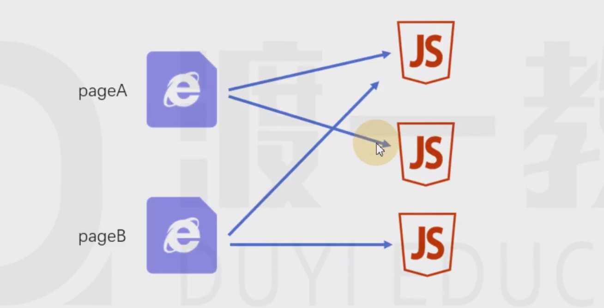

# 07-入口和出口 
# 1 入口和出口

**./：**

- 模块化代码中

> 比如require('./')，表示当前js文件所在的目录

- 在路径处理中

> 表示node运行目录

**path模块：**

> node内置模块 - path: [https://nodejs.org/dist/latest-v12.x/docs/api/path.html](https://nodejs.org/dist/latest-v12.x/docs/api/path.html)

- `__dirname`

> 所有情况下，都表示当前运行的js文件所在的目录，它是一个绝对路径

- `path.resolve()`

## 1.1 出口

**出口：**

> 这里的出口是针对资源列表的文件名或路径的配置。
> 
> 
> 
> 
> 出口通过output进行配置。

## 1.2 入口

**入口：**

> 入口真正配置的是chunk；入口通过entry进行配置。

**规则：**

> 多个chunk时使用。

- name

> chunk name

- hash:

> 总的资源hash，通常用于解决缓存问题

- chunkhash:

> 使用chunkhash

    varpath=require("path")
    module.exports= {
    mode: "production",
    entry: {
    main: "./src/index.js", //属性名：chunk的名称， 属性值：入口模块（启动模块）a: ["./src/a.js", "./src/index.js"] //启动模块有两个    },
    output: {
    path: path.resolve(__dirname, "target"), //必须配置一个绝对路径，表示资源放置的文件夹，默认是distfilename: "[id].[chunkhash:5].js"//配置的合并的js文件的规则    },
    devtool: "source-map"}

- id

> 使用chunkid，不推荐

# 2 入口和出口的最佳实践

具体情况具体分析，下面是一些经典场景。

## 2.1 一个页面一个JS

**源码结构：**

    |—— src
        |—— pageA   页面A的代码目录
            |—— index.js 页面A的启动模块
            |—— ...
        |—— pageB   页面B的代码目录
            |—— index.js 页面B的启动模块
            |—— ...
        |—— pageC   页面C的代码目录
            |—— main1.js 页面C的启动模块1 例如：主功能
            |—— main2.js 页面C的启动模块2 例如：实现访问统计的额外功能
            |—— ...
        |—— common  公共代码目录
            |—— ...

**webpack配置：**

> 这种方式适用于页面之间的功能差异巨大、公共代码较少的情况，这种情况下打包出来的最终代码不会有太多重复。

    module.exports= {
    entry:{
    pageA: "./src/pageA/index.js",
    pageB: "./src/pageB/index.js",
    pageC: ["./src/pageC/main1.js", "./src/pageC/main2.js"]
        },
    output:{
    filename:"[name].[chunkhash:5].js"    }
    }

## 2.2 一个页面多个JS

**源码结构：**

    |—— src
        |—— pageA   页面A的代码目录
            |—— index.js 页面A的启动模块
            |—— ...
        |—— pageB   页面B的代码目录
            |—— index.js 页面B的启动模块
            |—— ...
        |—— statistics   用于统计访问人数功能目录
            |—— index.js 启动模块
            |—— ...
        |—— common  公共代码目录
            |—— ...

**webpack配置：**

> 这种方式适用于页面之间有一些**独立**、相同的功能，专门使用一个chunk抽离这部分JS有利于浏览器更好的缓存这部分内容。

    module.exports= {
    entry:{
    pageA: "./src/pageA/index.js",
    pageB: "./src/pageB/index.js",
    statistics: "./src/statistics/index.js"    },
    output:{
    filename:"[name].[chunkhash:5].js"    }
    }

> 思考：为什么不使用多启动模块的方式？
> 
> 会导致增加传输量的问题。

## 2.3 单页应用

**单页应用：**

> 所谓单页应用，是指整个网站（或网站的某一个功能块）只有一个页面，页面中的内容全部靠JS创建和控制。 vue和react都是实现单页应用的利器。

**源码结构：**

    |—— src
        |—— subFunc   子功能目录
            |—— ...
        |—— subFunc   子功能目录
            |—— ...
        |—— common  公共代码目录
            |—— ...
        |—— index.js

**webpack配置：**

    module.exports= {
    entry: "./src/index.js",
    output:{
    filename:"index.[hash:5].js"    }
    }