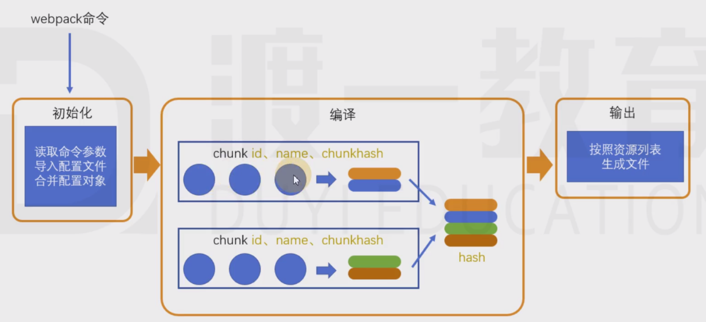
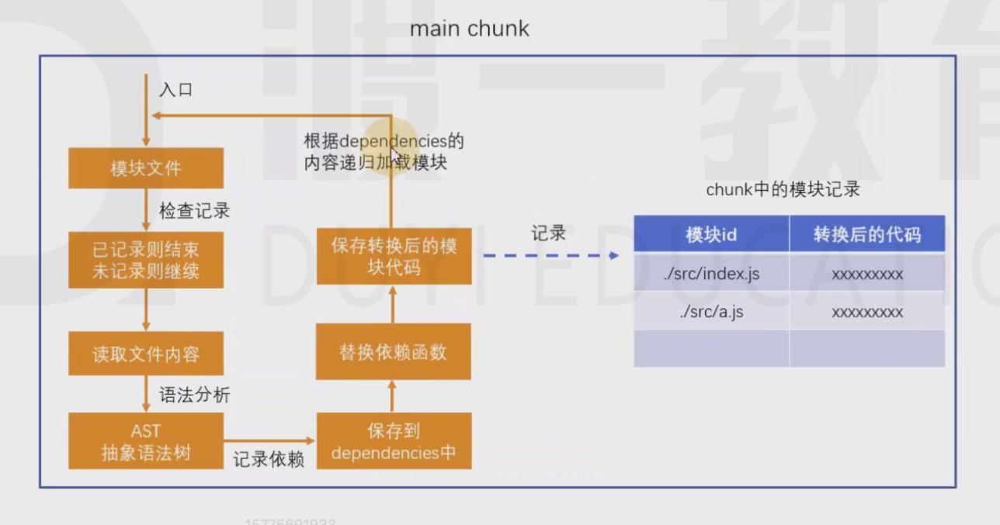
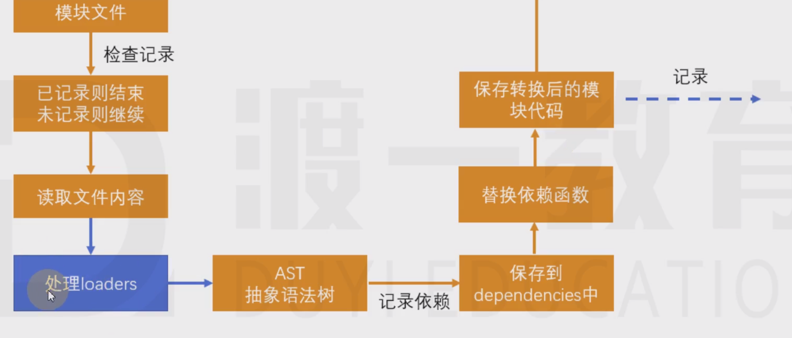
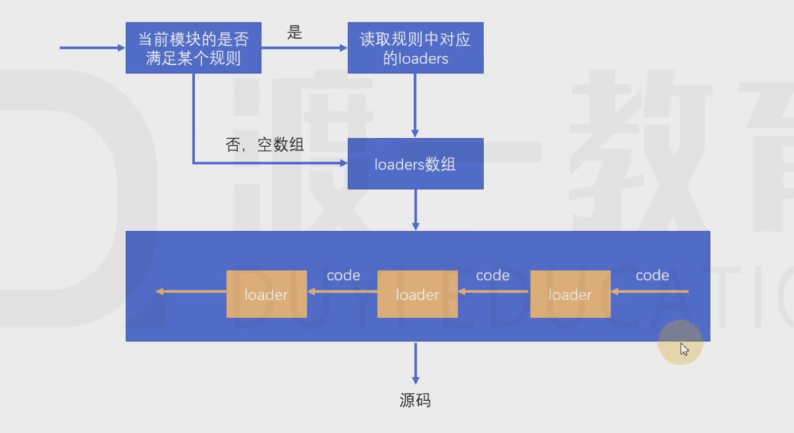
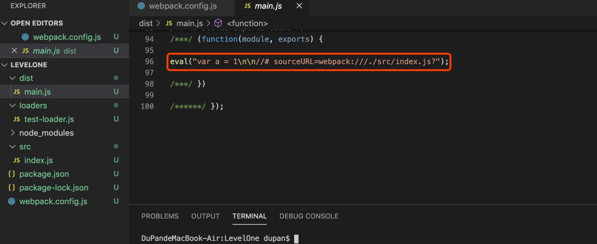
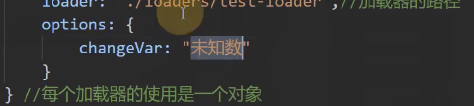
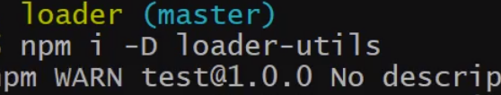
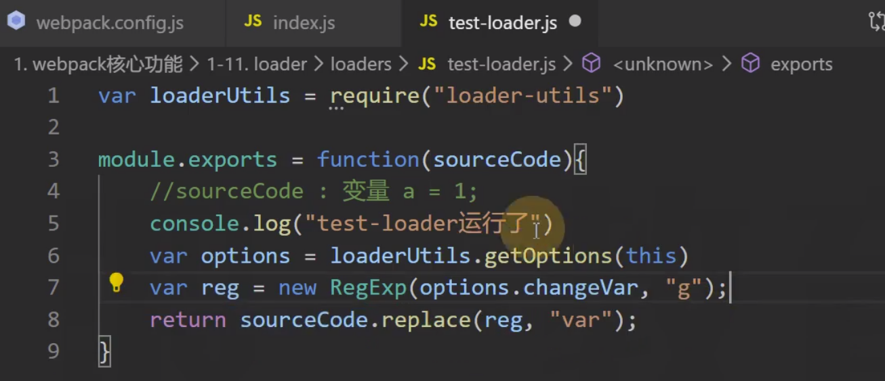
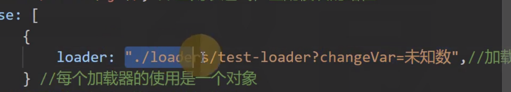

# 08-loader 
# 1 loader

> webpack做的事情，仅仅是分析出各种模块的依赖关系，然后形成资源列表，最终打包生成到指定的文件中。
> 
> 
> 
> 
> 更多的功能需要借助webpack loaders和webpack plugins完成。

## 1.1 处理loader流程

**webpack loader： **

> loader本质上是一个函数，它的作用是将某个源码字符串转换成另一个源码字符串返回。
> 
> loader函数的将在模块解析的过程中被调用，以得到最终的源码。

**全流程：**

**chunk中解析模块的流程：**

> loader 在语法分析处扩展。

**chunk中解析模块的更详细流程：**

> loaders 返回结果交给AST分析。

**处理loaders流程：**

> 有多个loader时，从右向左把loader的结果交给下一个loader。

**案例：**

- index.js

    变量a=1;

- test-loader.js

    module.exports=function(sourceCode) {
    // sourceCode：变量 a = 1;return"var a = 1"}

- 引入loader

    module.exports= {
    mode: "development",
    module: {
    rules: [
                {
    test: /index\.js$/, //正则表达式，匹配模块的路径use: [
                        {
    loader: './loaders/test-loader'// 加载器的路径                    } // 每个加载器是一个对象                ] // 匹配到了之后，使用哪些加载器            }, //规则1        ] //模块的匹配规则    }
    }

- 打包

借助第三方库来获得options

## 1.2 loader配置

**完整配置：**

    module.exports= {
    module: { //针对模块的配置，目前版本只有两个配置，rules、noParserules: [ //模块匹配规则，可以存在多个规则            { //每个规则是一个对象test: /\.js$/, //匹配的模块正则use: [ //匹配到后应用的规则模块                    {  //其中一个规则loader: "模块路径", //loader模块的路径，该字符串会被放置到require中options: { //向对应loader传递的额外参数                        }
                        }
                    ]
                }
            ]
        }
    }

**简化配置：**

    module.exports= {
    module: { //针对模块的配置，目前版本只有两个配置，rules、noParserules: [ //模块匹配规则，可以存在多个规则            { //每个规则是一个对象test: /\.js$/, //匹配的模块正则use: ["模块路径1", "模块路径2"]//loader模块的路径，该字符串会被放置到require中            }
            ]
        }
    }

# 2 案例

## 2.1 处理样式

**处理样式：**

- `style-loader.js `

    module.exports=function (sourceCode) {
    varcode=`var style = document.createElement("style");style.innerHTML = \`${sourceCode}\`;document.head.appendChild(style);module.exports = \`${sourceCode}\``;
    returncode;
    }

- `index.js`

    varcontent=require("./assets/index.css")
    console.log(content); //css的源码字符串

- `index.css`

    body{
    background: #333;color: #fff;}

- `webpack.config.js`

    module.exports= {
    mode: "development",
    devtool: "source-map",
    module: {
    rules: [{
    test: /\.css$/,
    use: ["./loaders/style-loader"]
            }]
        }
    }

- `index.html`

    <!DOCTYPEhtml><htmllang="en"><head><metacharset="UTF-8"><metaname="viewport"content="width=device-width, initial-scale=1.0"><title>Document</title></head><body><scriptsrc='./main.js'></script></body></html>

## 2.2 处理图片