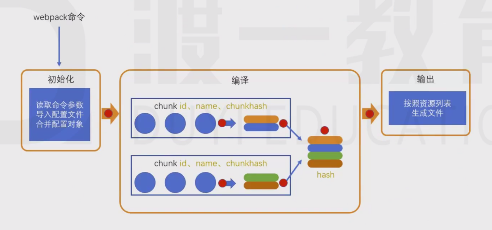
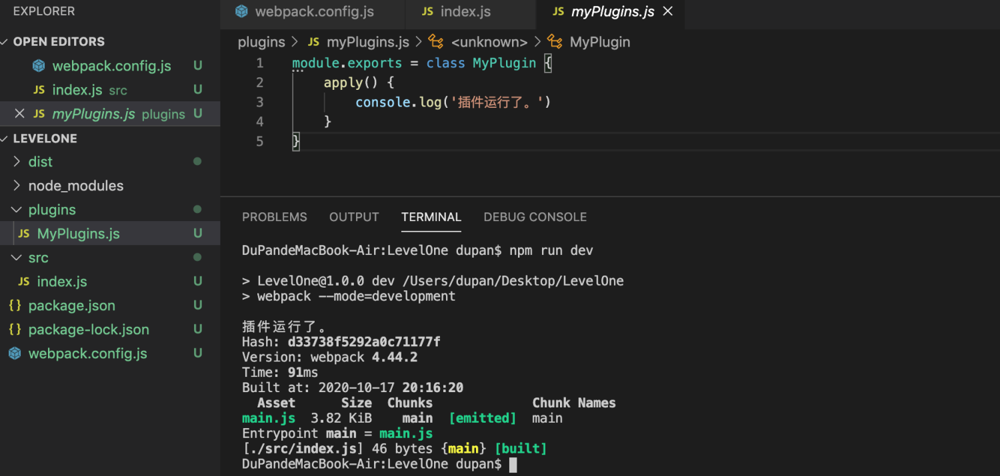
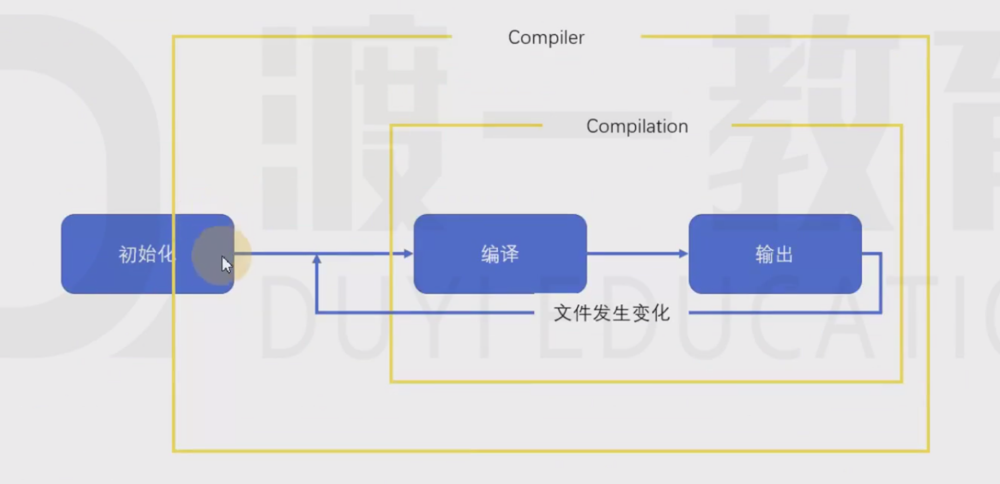
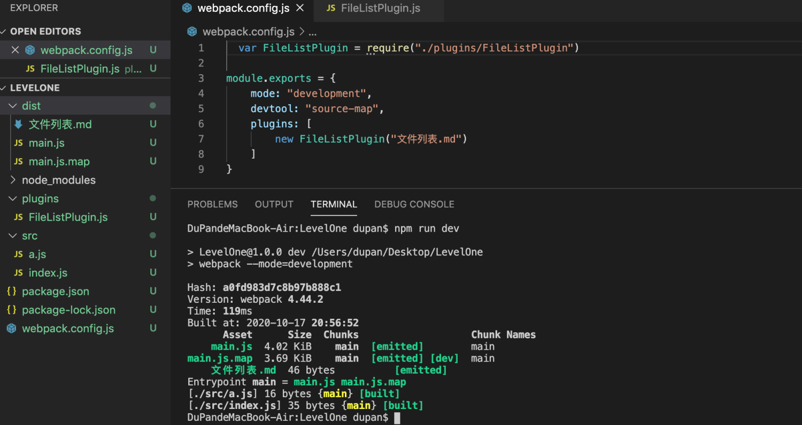

# 09-plugin 
# 1 plugin

loader的功能定位是转换代码，而一些其他的操作难以使用loader完成，比如：

- 当webpack生成文件时，顺便多生成一个说明描述文件
- 当webpack编译启动时，控制台输出一句话表示webpack启动了
- 当xxxx时，xxxx

> 这种类似的功能需要把功能嵌入到webpack的编译流程中，而这种事情的实现是依托于plugin的。

> 红点表示触发点，可以被plugin监听。

## 1.1 plugin

**plugin：**

> plugin的**本质**是一个带有apply方法的对象

    varplugin= {
    apply: function(compiler){
        }
    }

> 通常，习惯上，我们会将该对象写成构造函数的模式

    classMyPlugin{
    apply(compiler){
        }
    }
    varplugin=newMyPlugin();

- 使用

> 要将插件应用到webpack，需要把插件对象配置到webpack的plugins数组中，如下：

    module.exports= {
    plugins:[
    newMyPlugin()
        ]
    }

**案例：**

- `Myplugin.js`

    module.exports=classMyPlugin {
    apply() {
    console.log('插件运行了。')
        }
    }

- `webpack.config.js`

    varMyPlugin=require('./plugins/MyPlugins')
    module.exports= {
    plugins:[
    newMyPlugin()
        ]
    }

## 1.2 compiler

**compiler:**

> apply函数会在初始化阶段，创建好Compiler对象后运行。
> 
> 
> 
> 
> compiler对象是在初始化阶段构建的，整个webpack打包期间只有一个compiler对象，后续完成打包工作的是compiler对象内部创建的compilation 完成的。
> 
> 
> 
> 
> apply方法会在**创建好compiler对象后调用**，并向方法传入一个compiler对象

**钩子函数：**

> compiler对象提供了大量的钩子函数（hooks，可以理解为事件），plugin的开发者可以注册这些钩子函数，参与webpack编译和生成。

- 注册

> 你可以在apply方法中使用下面的代码注册钩子函数

    classMyPlugin{
    apply(compiler){
    compiler.hooks.事件名称.事件类型(name, function(compilation){
    //事件处理函数        })
        }
    }

- 事件名称

> 即要监听的事件名，即钩子名，所有的钩子：[https://www.webpackjs.com/api/compiler-hooks](https://www.webpackjs.com/api/compiler-hooks)

- 事件类型

> 这一部分使用的是 Tapable API，这个小型的库是一个专门用于钩子函数监听的库。
> 
> 
> 
> 
> 它提供了一些事件类型：
> 
> tap：注册一个同步的钩子函数，函数运行完毕则表示事件处理结束

> tapAsync：注册一个基于回调的异步的钩子函数，函数通过调用一个回调表示事件处理结束

> tapPromise：注册一个基于Promise的异步的钩子函数，函数通过返回的Promise进入已决状态表示事件处理结束

- 处理函数

> 处理函数有一个事件参数`compilation`

- 案例

    module.exports=classMyPlugin {
    apply(compiler) {
    //在这里注册事件，类似于window.onload  $(function(){})compiler.hooks.done.tap("MyPlugin-done", function(compilation){
    //事件处理函数console.log("编译完成");
            })
        }
    }

# 2 **[练习]添加文件列表**

- `FileListPlugin.js`

    module.exports=classFileListPlugin {
    constructor(filename="filelist.txt"){
    this.filename=filename;
        }
    apply(compiler) {
    compiler.hooks.emit.tap("FileListPlugin", complation=> {
    varfileList= [];
    for (constkeyincomplation.assets) {
    varcontent=`【${key}】大小：${complation.assets[key].size()/1000}KB`;
    fileList.push(content);
                }
    varstr=fileList.join("\n\n");
    complation.assets[this.filename] = {
    source() {
    returnstr                },
    size() {
    returnstr.length;
                    }
                }
            })
        }
    }

- `webpack.config.js`

    varFileListPlugin=require("./plugins/FileListPlugin")
    module.exports= {
    mode: "development",
    devtool: "source-map",
    plugins: [
    newFileListPlugin("文件列表.md")
        ]
    }

- 打包

