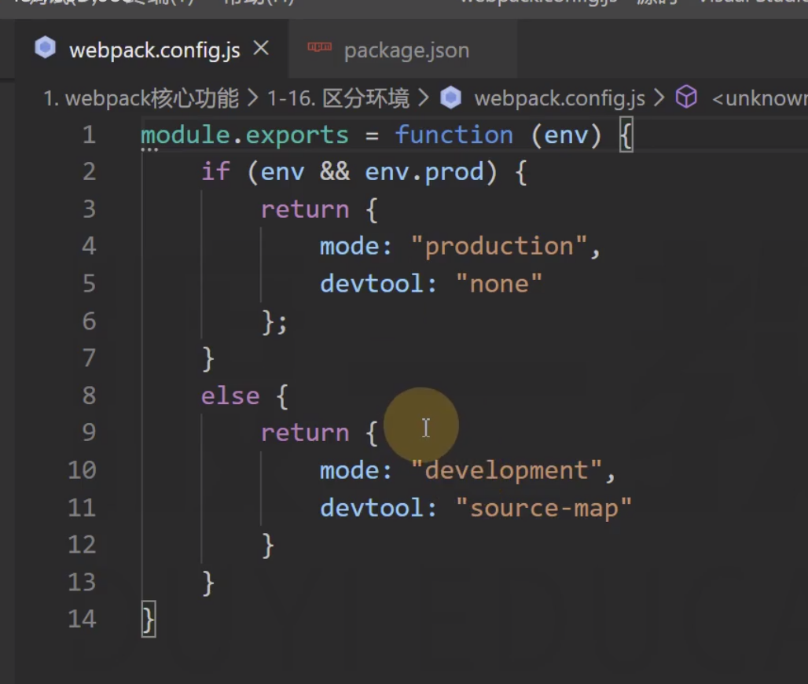

# 10-区分环境 
# 1 区分环境 

**区分环境：**

> 有些时候，我们需要针对生产环境和开发环境分别书写webpack配置。

- 配置函数

> 为了更好的适应这种要求，webpack允许配置不仅可以是一个对象，还可以是一个**函数****。**
> 
> **
> **
> 
> 在开始构建时，webpack如果发现配置是一个函数，会调用该函数，将函数返回的对象作为配置内容，因此，开发者可以根据不同的环境返回不同的对象。

    module.exports=env=> {
    return {
    //配置内容    }
    }

- 命令行指定env

> 在调用webpack函数时，webpack会向函数传入一个参数env，该参数的值来自于webpack命令中给env指定的值。

    npxwebpack--envabc# env: "abc"npxwebpack--env.abc# env: {abc:true}npxwebpack--env.abc=1# env： {abc:1}npxwebpack--env.abc=1--env.bcd=2# env: {abc:1, bcd:2}

- 完整配置

> 这样一来，我们就可以在命令中指定环境，在代码中进行判断，根据环境返回不同的配置结果。

