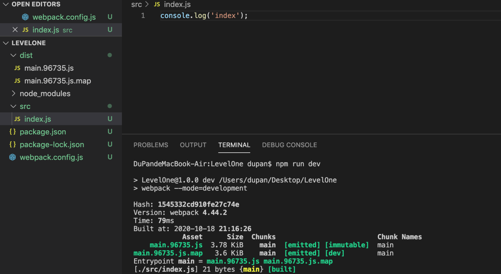
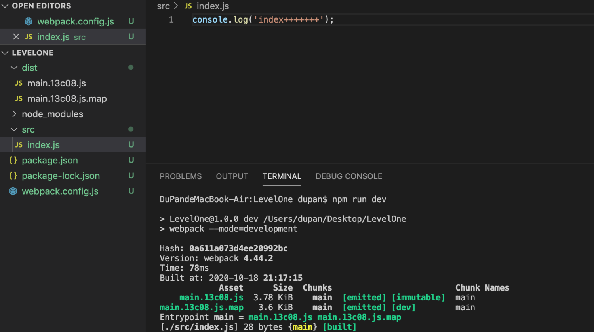

# 01-清除输出目录 
# 1 清除输出目录

**`clean-webpack-plugin`：**

- npm package

> [https://www.npmjs.com/package/clean-webpack-plugin](https://www.npmjs.com/package/clean-webpack-plugin)

- 安装

> `npm i -D clean-webpack-plugin`

- webpack.config.js

    var { CleanWebpackPlugin } =require("clean-webpack-plugin")
    module.exports= {
    mode: "development",
    devtool: "source-map",
    output: {
    filename: "[name].[chunkhash:5].js"    },
    plugins: [
    newCleanWebpackPlugin()
        ]
    }

- 第一次打包

> `npm run dev`

- 修改src内容后，再打包

> `npm run dev`

