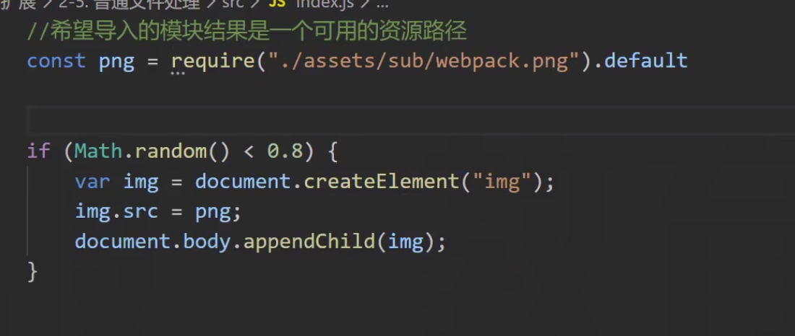
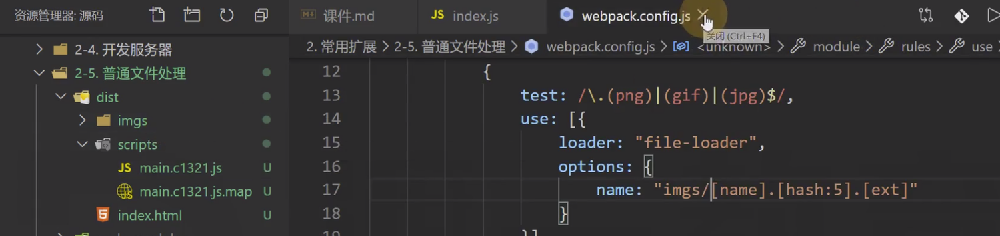

# 05-普通文件处理 
# 1 普通文件处理

## 1.1 **file-loader**

**file-loader: **

> 生成依赖的文件到输出目录，然后将模块文件设置为：导出一个路径\

    //file-loaderfunctionloader(source){
    // source：文件内容（图片内容 buffer）// 1. 生成一个具有相同文件内容的文件到输出目录// 2. 返回一段代码   export default "文件名"}

## **1.2 url-loader**

**url-loader：**

> 将依赖的文件转换为：导出一个base64格式的字符串

    //file-loaderfunctionloader(source){
    // source：文件内容（图片内容 buffer）// 1. 根据buffer生成一个base64编码// 2. 返回一段代码   export default "base64编码"}
    
    //希望导入的模块结果是一个可用的资源路径importpngfrom"./assets/webpack.png"console.log(png)
    varimg=document.createElement("img");
    img.src=png;
    document.body.appendChild(img);
    
    module: {
    rules: [
                {
    test: /\.(png)|(gif)|(jpg)$/,
    use: [{
    loader: "url-loader",
    options: {
    // limit: false //不限制任何大小，所有经过loader的文件进行base64编码返回limit: 10*1024, //只要文件不超过 100*1024 字节，则使用base64编码，否则，交给file-loader进行处理name: "imgs/[name].[hash:5].[ext]"                    }
                    }]
                }
            ]
        },