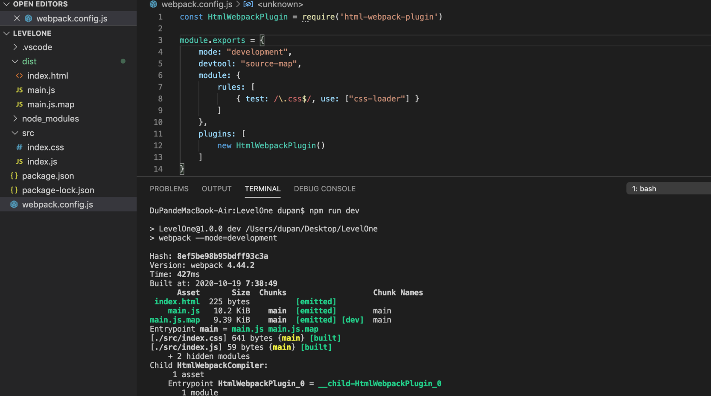
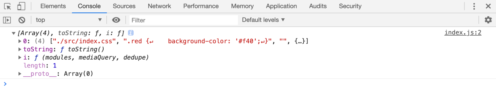
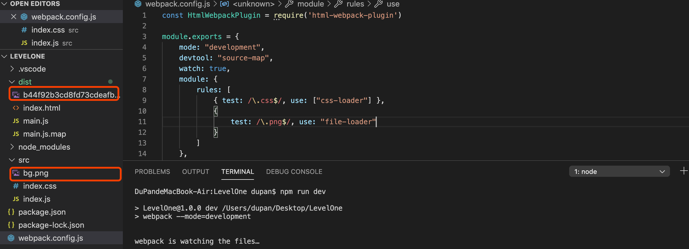
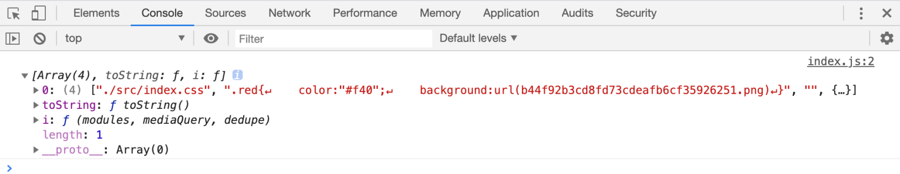

# 02-利用webpack拆分css 
# 1 利用webpack拆分css

**要拆分css，就必须把css当成像js那样的模块？**

> 要把css当成模块，就必须有一个构建工具（webpack），它具备合并代码的能力。
> 
> 
> 
> 
> 而webpack本身只能读取css文件的内容、将其当作JS代码进行分析，因此，会导致错误。
> 
> 于是，就必须有一个loader，能够将css代码转换为js代码。

## 1.1 css-loader

**`css-loader`** ：

> css-loader的作用，就是将css代码转换为js代码。
> 
> 
> 
> 
> 它的处理原理极其简单：将css代码作为字符串导出。

**案例1:**

> 简单使用。

- index.css

    .red {
    background-color: '#f40';
    }

- index.js

    constresult=require('./index.css').default;
    console.log(result);

- webpack.config.js

    constHtmlWebpackPlugin=require('html-webpack-plugin')
    module.exports= {
    mode: "development",
    devtool: "source-map",
    module: {
    rules: [
                { test: /\.css$/, use: ["css-loader"] }
            ]
        },
    plugins: [
    newHtmlWebpackPlugin()
        ]
    }

- 打包，打开index.html

> `npm run dev`

- 结果分析

> 经过css-loader转换后。

    module.exports=`.red{color:"#f40";}`

> 上面的js代码是经过简化后的，不代表真实的css-loader的转换后代码，css-loader转换后的代码会有些复杂，同时会导出更多的信息，但核心思想不变。

**案例2:**

> 依赖其他文件时。

- index.css

    .red{
    color:"#f40";
    background:url("./bg.png")
    }

- webpack.config.js

    constHtmlWebpackPlugin=require('html-webpack-plugin')
    module.exports= {
    mode: "development",
    devtool: "source-map",
    watch: true,
    module: {
    rules: [
                { test: /\.css$/, use: ["css-loader"] },
                {
    test: /\.png$/, use: "file-loader"            }
            ]
        },
    plugins: [
    newHtmlWebpackPlugin()
        ]
    }

- 打包，打开index.html

- 结果分析

> 经过css-loader转换后变成js代码。

    varimport1=require("./bg.png");
    module.exports=`.red{color:"#f40";background:url("${import1}")}`;

> 这样一来，经过webpack的后续处理，会把依赖`./bg.png`添加到模块列表，然后再将代码转换为

    varimport1=__webpack_require__("./src/bg.png");
    module.exports=`.red{color:"#f40";background:url("${import1}")}`;

**案例3:**

> 导入css文件。

    @import"./reset.css";
    .red{
    color:"#f40";
    background:url("./bg.png")
    }

会转换为：

    varimport1=require("./reset.css");
    varimport2=require("./bg.png");
    module.exports=`${import1}.red{color:"#f40";background:url("${import2}")}`;

**总结，css-loader干了什么：**

> 将css文件的内容作为字符串导出。
> 
> 
> 
> 
> 将css中的其他依赖作为require导入，以便webpack分析依赖。

## 1.2 style-loader

**`style-loader`** ：

> 由于css-loader仅提供了将css转换为字符串导出的能力，剩余的事情要交给其他loader或plugin来处理。
> 
> 
> 
> 
> style-loader可以将css-loader转换后的代码进一步处理，将css-loader导出的字符串加入到页面的style元素中。

**例如：**

> index.css

    .red{
    color:"#f40";
    }

> 经过css-loader转换后变成js代码：

    module.exports=`.red{color:"#f40";}`

> 经过style-loader转换后变成：

    module.exports=`.red{color:"#f40";}`varstyle=module.exports;
    varstyleElem=document.createElement("style");
    styleElem.innerHTML=style;
    document.head.appendChild(styleElem);
    module.exports= {}

> 以上代码均为简化后的代码，并不代表真实的代码 style-loader有能力避免同一个样式的重复导入

- webpack.config.js

> 注意：从右向左把loader的结果交给下一个loader，所以先使用css-loader。

    constHtmlWebpackPlugin=require('html-webpack-plugin')
    module.exports= {
    mode: "development",
    devtool: "source-map",
    watch: true,
    module: {
    rules: [
                { test: /\.css$/, use: ["style-loader", "css-loader"] },
                {
    test: /\.png$/, use: "file-loader"            }
            ]
        },
    plugins: [
    newHtmlWebpackPlugin()
        ]
    }