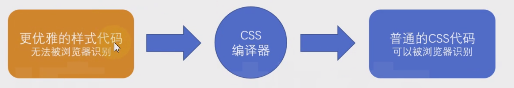
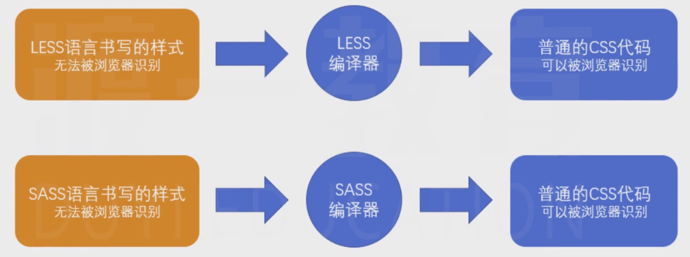

# 06-CSS预编译器 
# 1 CSS预编译器

## 1.1 基本原理

**编写css时，受限于css语言本身，常常难以处理一些问题：**

- 重复的样式值

> 例如：常用颜色、常用尺寸

- 重复的代码段

> 例如：绝对定位居中、清除浮动

- 重复的嵌套书写

**预编译器：**

> 由于官方迟迟不对css语言本身做出改进，一些第三方机构开始想办法来解决这些问题，其中一种方案，便是预编译器。
> 
> 
> 
> 
> 预编译器的原理很简单，即使用一种更加优雅的方式来书写样式代码，通过一个编译器，将其转换为可被浏览器识别的传统css代码。

> 目前，最流行的预编译器有**LESS**和**SASS**，由于它们两者特别相似，因此仅学习一种即可（本课程学习LESS）

> less官网：[http://lesscss.org/](http://lesscss.org/)
> 
> less中文文档1（非官方）：[http://lesscss.cn/](http://lesscss.cn/)
> 
> less中文文档2（非官方）：[https://less.bootcss.com/](https://less.bootcss.com/)
> 
> 
> 
> 
> sass官网：[https://sass-lang.com/](https://sass-lang.com/) s
> 
> ass中文文档1（非官方）：[https://www.sass.hk/](https://www.sass.hk/)
> 
> sass中文文档2（非官方）：[https://sass.bootcss.com/](https://sass.bootcss.com/)

## 1.2 LESS的安装和使用

**LESS:**

- 安装

> 从原理可知，要使用LESS，必须要安装LESS编译器。
> 
> LESS编译器是基于node开发的，可以通过npm下载安装。

> `npm i -D less`​

- 编译

> 安装好了less之后，它提供了一个CLI工具`lessc`，通过该工具即可完成编译。
> 
> 
> 
> 
> `lessc less代码文件 编译后的文件`​

- 案例

> 新建一个`index.less`文件，编写内容如下：

    // less代码@red: #f40;.redcolor {
    color: @red;
    }

> 编译：`lessc index.less index.css`

    .redcolor {
    color: #f40;}

**LESS的基本使用：**

> 具体的使用见文档：[https://less.bootcss.com/](https://less.bootcss.com/)

- 变量

- 混合

- 嵌套
- 运算
- 函数
- 作用域
- 注释
- 导入