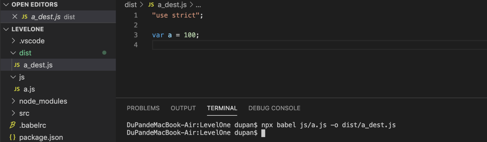

# 02-babel预设 
# 1 babel预设

**babel预设：**

> babel有多种预设，最常见的预设是`@babel/preset-env` 。
> 
> 
> 
> 
> `@babel/preset-env`可以让你使用最新的JS语法，而无需针对每种语法转换设置具体的插件。

- 安装

> `npm i -D @babel/preset-env`

- `.babelrc`

    {
    "presets": [
    "@babel/preset-env"    ]
    }

- `js/a.js`

    consta = 100;

- 编译

> `npx babel js/a.js -o dist/a_dest.js`

**兼容的浏览器：**

> `@babel/preset-env`需要根据兼容的浏览器范围来确定如何编译，和postcss一样，可以使用文件`.browserslistrc`来描述浏览器的兼容范围。

- `.browserslistrc`

    last 3 version
    > 1%
    not ie <= 8

**
**

**自身的配置：**

> 和`postcss-preset-env`一样，`@babel/preset-env`自身也有一些配置。
> 
> 
> 
> 
> 具体的配置见：[https://www.babeljs.cn/docs/babel-preset-env#options](https://www.babeljs.cn/docs/babel-preset-env#options)

- `.babelrc`

    {
    "presets": [
            ["@babel/preset-env", {
    "配置项1": "配置值",
    "配置项2": "配置值",
    "配置项3": "配置值"        }]
        ]
    }

- `usebuiltins` 配置项

> 其中一个比较常见的配置项是`usebuiltins`，该配置的默认值是false。

> 它有什么用呢？由于该预设仅转换新的语法，并不对新的API进行任何处理。

    例如：
    newPromise(resolve => {
    resolve()
    })
    转换的结果为
    newPromise(function (resolve) {
    resolve();
    });

> 如果遇到没有Promise构造函数的旧版本浏览器，该代码就会报错。

> 而配置`usebuiltins`可以在编译结果中注入这些新的API，它的值默认为`false`，表示不注入任何新的API；可以将其设置为`usage`，表示根据API的使用情况，按需导入API。

    {
    "presets": [
            ["@babel/preset-env", {
    "useBuiltIns": "usage",
    "corejs": 3        }]
        ]
    }