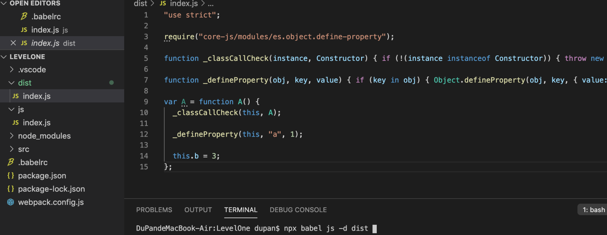
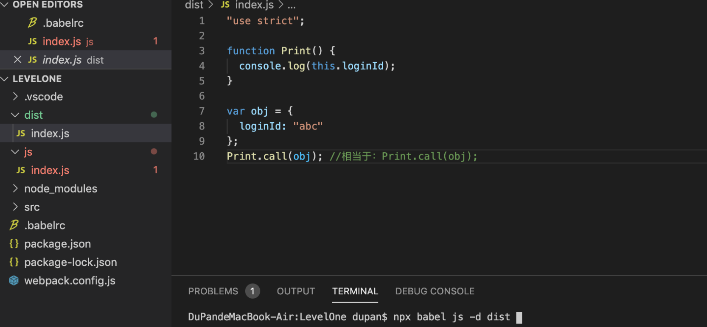

# 03-babel插件 
# 1 babel插件

> @babel/polyfill 已过时，目前被`core-js`和`generator-runtime`所取代。

**除了预设可以转换代码之外，插件也可以转换代码，它们的顺序是：**

> 通常情况下，`@babel/preset-env`只转换那些已经形成正式标准的语法。
> 
> 
> 
> 
> 对于某些处于早期阶段、还没有确定的语法不做转换。如果要转换这些语法，就要单独使用插件。

- 插件在 Presets 前运行 
- 插件顺序从前往后排列 
- Preset 顺序是颠倒的（从后往前） 

    {
    "presets": [ "a", "b"],
    "plugins": ["c", "d"]
    }
    // C--> d--> b--> a

## 1.1 `@babel/plugin-proposal-class-properties`

该插件可以让你在类中书写初始化字段。

- `js/index.js`

    classA {
    a = 1;
    constructor(){
    this.b = 3;
        }
    }

- `.babelrc`

    {
    "presets": [
            ["@babel/preset-env", {
    "useBuiltIns": "usage",
    "corejs": 3        }]
        ],
    "plugins": [
    "@babel/plugin-proposal-class-properties"    ]
    }

- 编译

## 1.2 `@babel/plugin-proposal-function-bind`

该插件可以让你轻松的为某个方法绑定this。

- `js/index.js`

    functionPrint() {
    console.log(this.loginId);
    }
    constobj = {
    loginId: "abc"};
    obj::Print(); //相当于：Print.call(obj);

> 遗憾的是，目前vscode无法识别该语法，会在代码中报错，虽然并不会有什么实际性的危害，但是影响观感

- `.babelrc`

    {
    "presets": [
            ["@babel/preset-env", {
    "useBuiltIns": "usage",
    "corejs": 3        }]
        ],
    "plugins": [
    "@babel/proposal-function-bind"    ]
    }

- 编译

## 1.3  `@babel/plugin-proposal-optional-chaining`

    constobj = {
    foo: {
    bar: {
    baz: 42,
        },
      },
    };
    constbaz = obj?.foo?.bar?.baz; // 42constsafe = obj?.qux?.baz; // undefined

## 1.4  `babel-plugin-transform-remove-console`

该插件会移除源码中的控制台输出语句。

    console.log("foo");
    console.error("bar");

## 1.5 `@babel/plugin-transform-runtime`

用于提供一些公共的API，这些API会帮助代码转换。