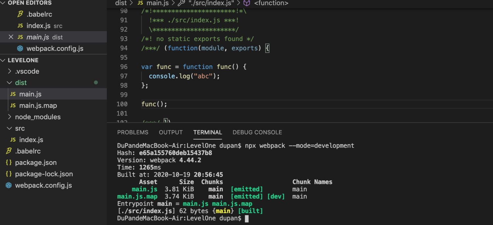

# 04-在webpack中使用babel 
# 1 在webpack中使用babel

- `src/index.js`​

    constfunc = () => {
    console.log("abc");
    }
    func();

- `.babelrc`​

    {
    "presets": [
            ["@babel/preset-env", {
    "useBuiltIns": "usage",
    "corejs": 3        }]
        ]
    }

- `webpack.config.js `​

    module.exports = {
    mode: "development",
    devtool: "source-map",
    module: {
    rules: [
                { test: /\.js$/, use: "babel-loader" }
            ]
        }
    }

- 打包

> `npx webpack --mode=development`​

