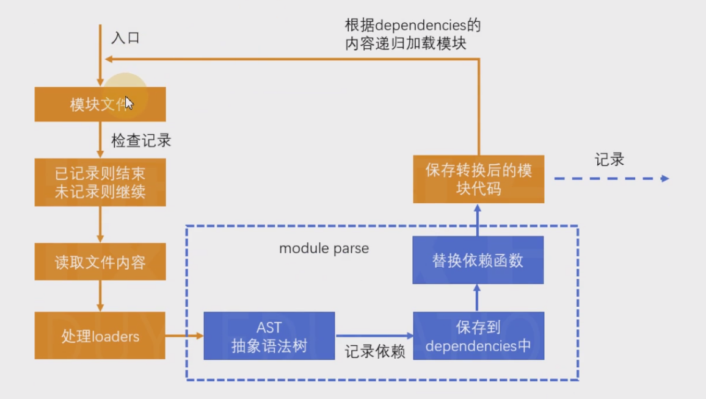
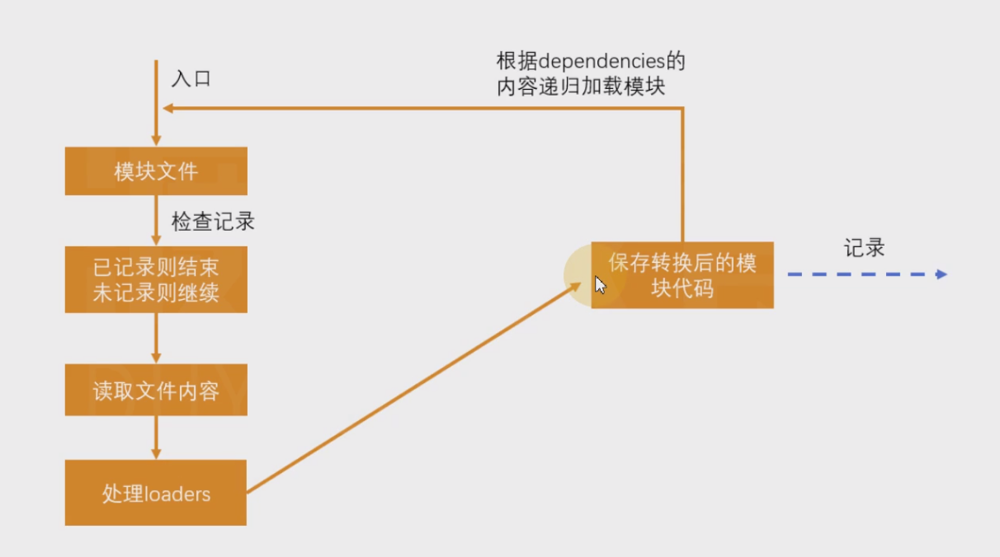

# 02-减少模块解析 
# 1 减少模块解析

**什么叫做模块解析？**

> 模块解析包括：抽象语法树分析、依赖分析、模块语法替换

**不做模块解析会怎样？**

> 如果某个模块不做解析，该模块经过loader处理后的代码就是最终代码。
> 
> 如果没有loader对该模块进行处理，该模块的源码就是最终打包结果的代码。

> 如果不对某个模块进行解析，可以缩短构建时间。

**哪些模块不需要解析？**

> 模块中无其他依赖：一些已经打包好的第三方库，比如jquery。

**如何让某个模块不要解析？**

> 配置`module.noParse`，它是一个正则，被正则匹配到的模块不会解析。

- `index.js`

    import $ from"jquery"console.log($);

- `webpack.config.js`

    module.exports = {
    mode: "development",
    module: {
    noParse: /jquery/
        }
    }