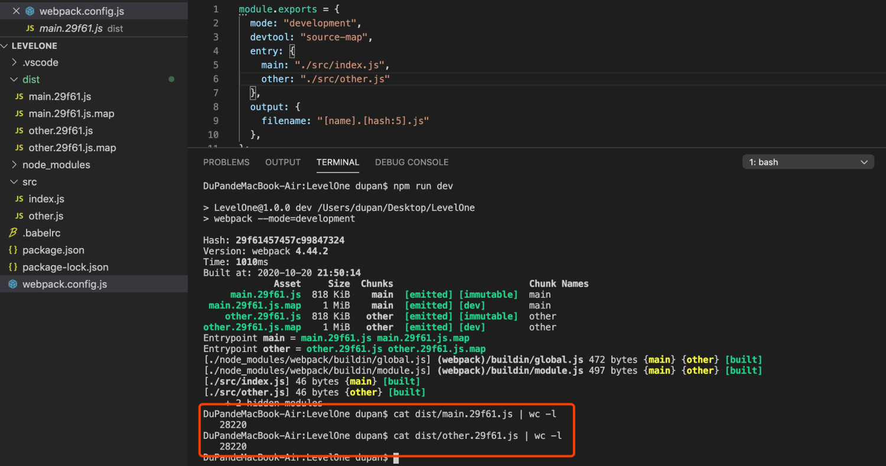
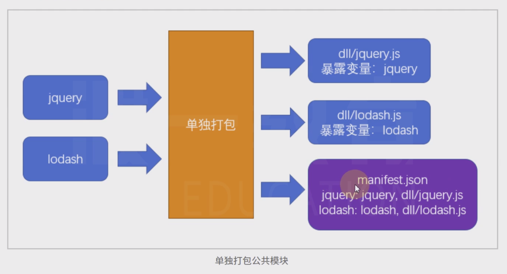
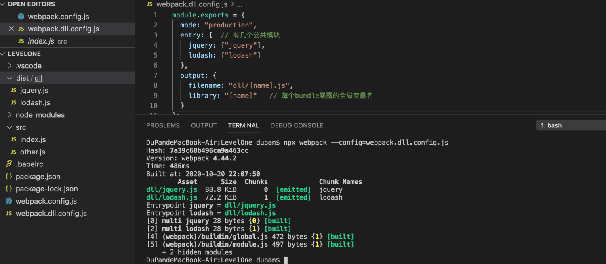
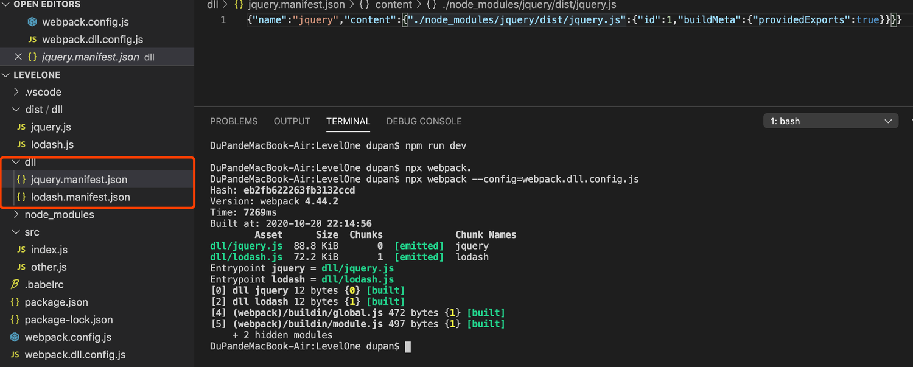
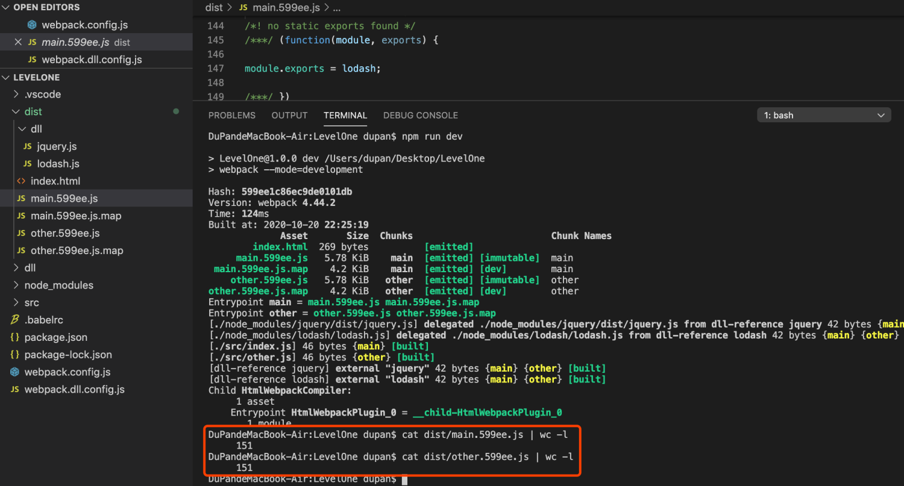

# 05-手动分包 
# 1 手动分包

**分包前的问题：**

> 打包结果存在重复代码。
> 
> 总体积增加。

- src/index.js

    import $ from"jquery"import_from"lodash"

- src/other.js

    import $ from"jquery"import_from"lodash"

- 打包

> main.29f61.js  other.29f61.js 都存在jquery、lodash 的源代码。

**​**

**
**

## 1.1 基本原理

**手动分包的总体思路是：**

1. 先单独的打包公共模块

> 公共模块会被打包成为动态链接库(dll Dynamic Link Library)，并生成资源清单。

1. 根据入口模块进行正常打包

> 打包时，如果发现模块中使用了资源清单中描述的模块，则不会形成下面的代码结构。

    //源码，入口文件index.jsimport $ from"jquery"import_from"lodash"_.isArray($(".red"));

> 由于资源清单中包含`jquery`和`lodash`两个模块，因此打包结果的大致格式是：

    (function(modules){
      //...
    })({
      // index.js文件的打包结果并没有变化
    "./src/index.js":
    function(module, exports, __webpack_require__){
    var $ = __webpack_require__("./node_modules/jquery/index.js")
    var_ = __webpack_require__("./node_modules/lodash/index.js")
    _.isArray($(".red"));
      },
      // 由于资源清单中存在，jquery的代码并不会出现在这里
    "./node_modules/jquery/index.js":
    function(module, exports, __webpack_require__){
    module.exports = jquery;
      },
      // 由于资源清单中存在，lodash的代码并不会出现在这里
    "./node_modules/lodash/index.js":
    function(module, exports, __webpack_require__){
    module.exports = lodash;
      }
    })

## 1.2 打包公共模块

**公共模块打包：**

> 打包公共模块是一个**独立的**打包过程。

1. 单独打包公共模块，暴露变量名

- `webpack.dll.config.js`​

    module.exports = {
    mode: "production",
    entry: {  // 有几个公共模块
    jquery: ["jquery"],
    lodash: ["lodash"]
      },
    output: {
    filename: "dll/[name].js",
    library: "[name]"   // 每个bundle暴露的全局变量名
      }
    };

- 打包公共模块

> `npx webpack --config=webpack.dll.config.js `​

1. 利用`DllPlugin`生成资源清单

    // webpack.dll.config.jsmodule.exports = {
    plugins: [
    newwebpack.DllPlugin({
    path: path.resolve(__dirname, "dll", "[name].manifest.json"), //资源清单的保存位置
    name: "[name]"//资源清单中，暴露的变量名
        })
      ]
    };

- `webpack.dll.config.js`

    constwebpack = require("webpack");
    constpath = require("path");
    module.exports = {
    mode: "production",
    entry: {
    jquery: ["jquery"],
    lodash: ["lodash"]
      },
    output: {
    filename: "dll/[name].js",
    library: "[name]" // 每个bundle暴露的全局变量名
      },
    plugins: [
    newwebpack.DllPlugin({
    path: path.resolve(__dirname, "dll", "[name].manifest.json"),
    name: "[name]"    })
      ]
    };

- 打包

> `npx webpack --config=webpack.dll.config.js `

## 1.3 使用公共模块

1. 在页面中手动引入公共模块

    <scriptsrc="./dll/jquery.js"></script>
    <scriptsrc="./dll/lodash.js"></script>

1. 重新设置`clean-webpack-plugin`

> 如果使用了插件`clean-webpack-plugin`，为了避免它把公共模块清除，需要做出以下配置

    newCleanWebpackPlugin({
      // 要清除的文件或目录
      // 排除掉dll目录本身和它里面的文件
    cleanOnceBeforeBuildPatterns: ["**/*", '!dll', '!dll/*']
    })

> 目录和文件的匹配规则使用的是[globbing patterns](https://github.com/sindresorhus/globby#globbing-patterns)。

1. 使用`DllReferencePlugin`控制打包结果

    module.exports = {
    plugins:[
    newwebpack.DllReferencePlugin({
    manifest: require("./dll/jquery.manifest.json")
        }),
    newwebpack.DllReferencePlugin({
    manifest: require("./dll/lodash.manifest.json")
        })
      ]
    }

- `webpack.config.js`

    constHtmlWebpackPlugin = require("html-webpack-plugin");
    const { CleanWebpackPlugin } = require("clean-webpack-plugin");
    constwebpack = require("webpack");
    module.exports = {
    mode: "development",
    devtool: "source-map",
    entry: {
    main: "./src/index.js",
    other: "./src/other.js"  },
    output: {
    filename: "[name].[hash:5].js"  },
    plugins: [
    newCleanWebpackPlugin({
          // 要清除的文件或目录
          // 排除掉dll目录本身和它里面的文件
    cleanOnceBeforeBuildPatterns: ["**/*", "!dll", "!dll/*"]
        }),
    newHtmlWebpackPlugin(),
    newwebpack.DllReferencePlugin({
    manifest: require("./dll/jquery.manifest.json")
        }),
    newwebpack.DllReferencePlugin({
    manifest: require("./dll/lodash.manifest.json")
        })
      ]
    };

- 根据入口模块进行正常打包

> `npm run dev`​

## 1.4 总结

**手动打包的过程**：

1. 开启`output.library`暴露公共模块
2. 用`DllPlugin`创建资源清单
3. 用`DllReferencePlugin`使用资源清单

**手动打包的注意事项**：

1. 资源清单不参与运行，可以不放到打包目录中
2. 记得手动引入公共JS，以及避免被删除
3. 不要对小型的公共JS库使用

**优点**：

1. 极大提升自身模块的打包速度
2. 极大的缩小了自身文件体积
3. 有利于浏览器缓存第三方库的公共代码

**缺点**：

1. 使用非常繁琐
2. 如果第三方库中包含重复代码，则效果不太理想