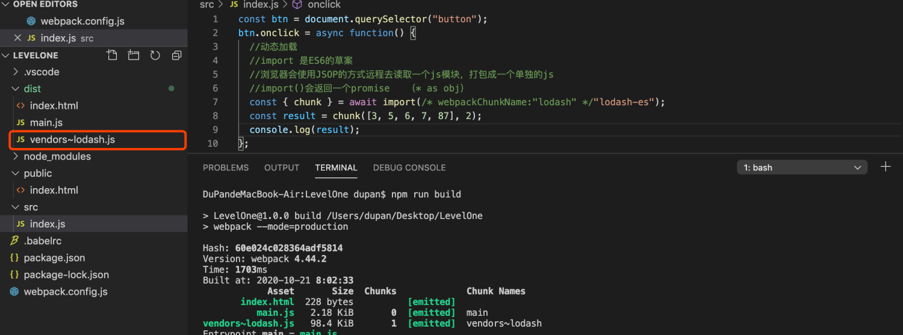
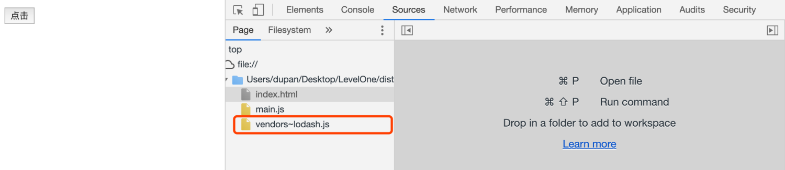
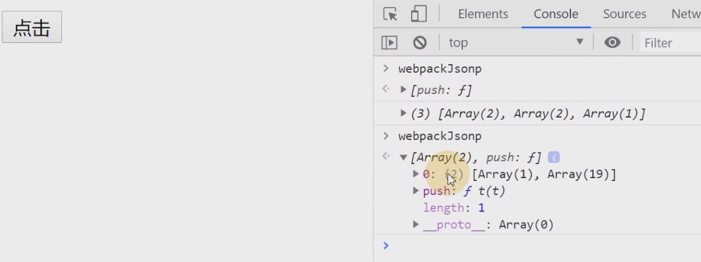

# 09-懒加载 
# 1 **懒加载**

异步的chunk。

**案例：**

> 点击之后加载。

- public/index.html

    <!DOCTYPEhtml><htmllang="en"><head><metacharset="UTF-8"/><metaname="viewport"content="width=device-width, initial-scale=1.0"/><title>Document</title></head><body><button>点击</button></body></html>

- src/index.js

    constbtn=document.querySelector("button");
    btn.onclick=asyncfunction() {
    //动态加载//import 是ES6的草案//浏览器会使用JSOP的方式远程去读取一个js模块，打包成一个单独的js//import()会返回一个promise   （* as obj）const { chunk } =awaitimport(/* webpackChunkName:"lodash" */"lodash-es");
    constresult=chunk([3, 5, 6, 7, 87], 2);
    console.log(result);
    };

- 打包

- 点击前

- 点击

> 动态加载lodash.js

- 原理

> 点击后把远程的模块放到webpackJsonp数组中，这样主模块就能使用了。

**问题：**

> 动态加载 tree-shaking 不起作用了。

- 解决

> 新增静态依赖

util.js

    export { chunk } from"lodash-es";

index.js

    constbtn=document.querySelector("button");
    btn.onclick=asyncfunction() {
    //动态加载//import 是ES6的草案//浏览器会使用JSOP的方式远程去读取一个js模块//import()会返回一个promise   （* as obj）// const { chunk } = await import(/* webpackChunkName:"lodash" */"lodash-es");const { chunk } =awaitimport("./util");
    constresult=chunk([3, 5, 6, 7, 87], 2);
    console.log(result);
    };