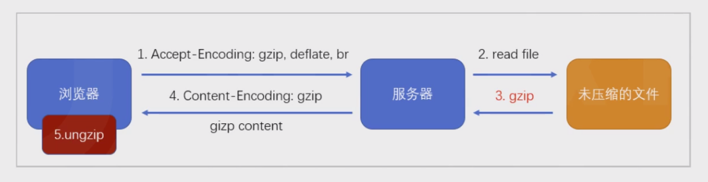
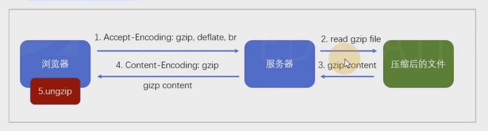

# 12-gzip 
# 1 gzip

gzip是一种压缩文件的算法。

## 1.1 B/S结构中的压缩传输

优点：传输效率可能得到大幅提升

缺点：服务器的压缩需要时间，客户端的解压需要时间

## 1.2 使用webpack进行预压缩

使用`compression-webpack-plugin`插件对打包结果进行预压缩，可以移除服务器的压缩时间。

    const { CleanWebpackPlugin } =require("clean-webpack-plugin");
    constCmpressionWebpackPlugin=require("compression-webpack-plugin")
    module.exports= {
    mode: "production",
    optimization: {
    splitChunks: {
    chunks: "all"    }
      },
    plugins: [
    newCleanWebpackPlugin(),
    newCmpressionWebpackPlugin({
    test: /\.js/,
    minRatio: 0.5    })
      ]
    };

