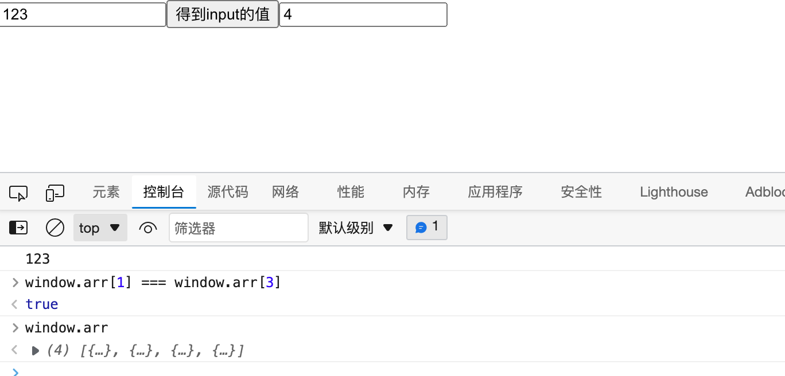

# HOOK简介

HOOK是React16.8.0之后出现

**组件：**

1. 无状态组件（函数组件）
2. 类组件

**类组件中的麻烦：**

1.  this指向问题 
2.  繁琐的生命周期 
3.  其他问题 

HOOK专门用于增强函数组件的功能（HOOK在类组件中是不能使用的），使之理论上可以成为类组件的替代品。

官方强调：没有必要更改已经完成的类组件，官方目前没有计划取消类组件，只是鼓励使用函数组件。

HOOK（钩子）本质上是一个函数(命名上总是以use开头)，该函数可以挂载任何功能。

# State Hook

State Hook是一个在函数组件中使用的函数（useState），用于在**函数组件中使用状态**。

## useState

- 函数有一个参数，这个参数的值表示状态的默认值

- 函数的返回值是一个数组，该数组一定包含两项 

- - 第一项：当前状态的值
  - 第二项：改变状态的函数，参数为新的值

```jsx
import React, { useState } from 'react'

export default function App() {
	const [n, setN] = useState(0)
	return <div>
		<button onClick={
				() => {
					setN(n + 1)
				}
			}>+</button>
		<h2>n: {n}</h2>
	</div>
}
```


- 一个函数组件中可以有多个状态，这种做法非常有利于横向切分关注点


## useState原理


**注意的细节：**

1. useState最好写到函数的起始位置，便于阅读

2. useState严禁出现在代码块（判断、循环）中

3. useState返回的函数（数组的第二项），引用不变（节约内存空间）

4. 使用函数改变数据，若数据和之前的数据完全相等（使用Object.is比较），不会导致重新渲染，以达到优化效率的目的。

5. 使用函数改变数据，传入的值不会和原来的数据进行合并，而是直接替换。

6. 如果要实现强制刷新组件 

   类组件：使用forceUpdate函数

   函数组件：使用一个空对象的useState

```jsx
import React, { useState } from 'react'

export default function App() {
	// 因为每次比较的 {} 地址不一样。
	const [, forceUpdate] = useState({})
	console.log('App Render')
	return <div>
		<button onClick={
				forceUpdate()
			}>+</button>
		<h2>强制刷新</h2>
	</div>
}
```

 

1. **如果某些状态之间没有必然的联系，应该分化为不同的状态，而不要合并成一个对象**

1. 和类组件的状态一样，函数组件中改变状态可能是**异步的（在DOM事件中）**，多个状态变化会合并以提高效率，此时，不能信任之前的状态，而应该使用回调函数的方式改变状态。如果状态变化要使用到之前的状态，尽量传递函数。

```jsx
import React, { useState } from 'react'

export default function App() {
	console.log('App Render')
	const [n, setN] = useState(0)
	return <div>
		<button onClick={
				() => {
					setN(n + 1) //不会立即改变，事件运行完成之后一起改变
					setN(n + 1) //此时，n 的值仍然是0
				}
			}>+</button>
		<h2>n: {n}</h2>
	</div>
}
```


```jsx
import React, { useState } from 'react'

export default function App() {
	console.log('App Render')
	const [n, setN] = useState(0)
	return <div>
		<button onClick={
				() => {
					setN(prevN => prevN + 1) // 传入的函数，在事件完成后统一运行
					setN(prevN => prevN + 1)
				}
			}>+</button>
		<h2>n: {n}</h2>
	</div>
}
```


# Effect Hook

Effect Hook：用于在函数组件中处理副作用。


**副作用：**

1. ajax请求
2. 计时器
3. 其他异步操作
4. 更改真实DOM对象
5. 本地存储
6. 其他会对外部产生影响的操作


- useEffect

该函数接收一个函数作为参数，接收的函数就是需要进行副作用操作的函数

```jsx
import React, { useState, useEffect } from 'react'

export default function App() {
    const [n, setN] = useState(0)
    //以下代码属于副作用
    // document.title = `计数器：${n}`;

    useEffect(() => {
        console.log("改变页面标题的副作用操作")
        document.title = `计数器：${n}`;
    })
    useEffect(() => {
        console.log("其他的副作用操作")
    })
    return (
        <div>
            <span>{n}</span>
            <button onClick={() => {
                setN(n + 1);
            }}>+</button>
        </div>
    )
}
```


## 细节

1. 副作用函数的运行时间点，是在页面完成真实的UI渲染之后。因此它的执行是异步的，并且不会阻塞浏览器 。

**与类组件中componentDidMount和componentDidUpdate的区别：**

`componentDidMount`和`componentDidUpdate`，在更改真实DOM，就会执行。但真实DOM还未渲染完成，同步执行的。

`useEffect`中的副作用函数，在真实DOM渲染完成后执行。异步执行的。

 

2. 每个函数组件中，可以多次使用useEffect，但不要放入判断或循环等代码块中。


3. useEffect中的副作用函数，可以有**返回值**，返回值必须是一个函数，该函数叫做**清理函数** 

   该函数运行时间点，在每次**运行副作用函数之前**。

​		首次渲染组件不会运行。

​		**组件被销毁时一定会运行**。

```jsx
import React, { useState, useEffect } from 'react'
const ref = React.createRef();
window.timer = null; //计时器ID

function stop() {
    console.log('清理函数。。。')
    clearInterval(window.timer); //清空之前的计时器
    window.timer = null;
}
/**
 * 一个可移动的块，该组件每次渲染完成后，始终从0，0坐标在10秒钟内，移动到目标点坐标
 * @param {*} props 
 * props.left，要移动到的目标点横坐标
 * props.top，要移动到的目标点纵坐标
 */
function MovableBlock(props) {
    console.log('渲染。。。')
    useEffect(() => {
        console.log('副作用函数。。。')
        //渲染完成后
        const div = ref.current;
        let curTimes = 0; //当前移动的次数
        const disX = props.left / 1000; //横坐标上每次移动的距离
        const disY = props.top / 1000; //纵坐标上每次移动的距离
        window.timer = setInterval(() => {
            curTimes++;//移动次数+1
            const newLeft = curTimes * disX;
            const newTop = curTimes * disY;
            div.style.left = newLeft + "px";
            div.style.top = newTop + "px";
            if (curTimes === 1000) {
                stop();
            }
        }, 10)
        return stop; //直接使用stop作为清理函数
    })

    return <div ref={ref} style={{
        width: 100,
        height: 100,
        left: 0,
        top: 0,
        position: "fixed",
        background: "#f40"
    }}>

    </div>
}

export default function App() {
    const [point, setPoint] = useState({ x: 0, y: 0 })
    const [visible, setVisible] = useState(true)
    return (
        <div style={{
            paddingTop: 200
        }}>
            {
                visible && (
                    <div>
                        x: <input type="number" value={point.x} onChange={e => {
                            setPoint({
                                ...point,
                                x: parseInt(e.target.value)
                            })
                        }} />
                        y: <input type="number" value={point.y} onChange={e => {
                            setPoint({
                                ...point,
                                y: parseInt(e.target.value)
                            })
                        }} />
                        <MovableBlock left={point.x} top={point.y} />
                    </div>
                )
            }

            <button onClick={() => {
                setVisible(!visible);
            }}>显示/隐藏</button>

        </div>
    )
}
```


 

4. useEffect函数，可以传递第二个参数 

   第二个参数是一个数组

​		数组中记录该副作用的**依赖数据**，当组件重新渲染后，只有依赖数据与上一次不一样的时，才会执行副作用

​		所以，当传递了依赖数据之后，如果数据没有发生变化 

			1. 副作用函数仅在第一次渲染后运行
			1. 清理函数仅在卸载组件后运行

 

```jsx
import React, { useState, useEffect } from 'react'

function Test() {
    useEffect(() => {
        console.log("副作用函数，仅挂载时运行一次")
        return () => {
            console.log("清理函数，仅卸载时运行一次")
        };
    }, []); //使用空数组作为依赖项，则副作用函数仅在挂载的时候运行
    console.log("渲染组件");
    const [, forceUpdate] = useState({})

    return <h1>Test组件 <button onClick={() => {
        forceUpdate({})
    }}>刷新组件</button></h1>
}

export default function App() {
    const [visible, setVisible] = useState(true)
    return (
        <div>
            {
                visible && <Test />
            }
            <button onClick={() => {
                setVisible(!visible);
            }}>显示/隐藏</button>

        </div>
    )
}
```


副作用函数中，如果使用了函数上下文中的变量，则由于闭包的影响，会导致副作用函数中变量不会实时变化。

副作用函数在每次注册时，会覆盖掉之前的副作用函数，因此，尽量保持副作用函数稳定，否则控制起来会比较复杂。


# 自定义Hook

自定义Hook：将一些常用的、跨越多个组件的Hook功能，抽离出去形成一个函数，该函数就是自定义Hook，自定义Hook，由于其内部需要使用Hook功能，所以它本身也需要按照Hook的规则实现：


1. 函数名必须以use开头
2. 调用自定义Hook函数时，应该放到顶层（不能放到判断、循环中）


例如：

1. 很多组件都需要在第一次加载完成后，获取所有学生数据

```jsx
import { useEffect, useState } from "react"
import { getAllStudents } from "../services/student"

/**
 * 当组件首次加载完成后，获取所有学生数据
 */
export default function useAllStudents() {
    const [students, setStudents] = useState([])
    useEffect(() => {
        (async ()=>{
            const stus = await getAllStudents();
            setStudents(stus);
        })();
    }, [])
    return students;
}
```


1. 很多组件都需要在第一次加载完成后，启动一个计时器，然后在组件销毁时卸载

```jsx
/* eslint "react-hooks/exhaustive-deps": "off" */
import { useEffect } from "react"

/**
 * 组件首次渲染后，启动一个Interval计时器
 * 组件卸载后，清除该计时器
 */
export default useTimer(func, duration) => {
    useEffect(() => {
        const timer = setInterval(func, duration)
        return () => {
            clearInterval(timer);
        }
    }, [])
}
```


## 插件

使用Hook的时候，如果没有严格按照Hook的规则进行，eslint的一个插件（`eslint-plugin-react-hooks`）会报出警告。


# Reducer Hook

Flux：Facebook出品的一个数据流框架

1. 规定了数据是单向流动的
2. 数据存储在数据仓库中（目前，可以认为state就是一个存储数据的仓库）
3. action是改变数据的唯一原因（本质上就是一个对象，action有两个属性）
   1. type：字符串，动作的类型
   2. payload：任意类型，动作发生后的附加信息
   3. 例如，如果是添加一个学生，action可以描述为：
      1. ```{ type:"addStudent", payload: {学生对象的各种信息} }```
   4. 例如，如果要删除一个学生，action可以描述为：
      1. ```{ type:"deleteStudent", payload: 学生id }```
4. 具体改变数据的是一个函数，该函数叫做reducer
   1. 该函数接收两个参数
      1. state：表示当前数据仓库中的数据
      2. action：描述了如何去改变数据，以及改变数据的一些附加信息
   2. 该函数必须有一个返回结果，用于表示数据仓库变化之后的数据
      1. Flux要求，对象是不可变的，如果返回对象，必须创建新的对象
   3. reducer必须是纯函数，不能有任何副作用
5. 如果要触发reducer，不可以直接调用，而是应该调用一个辅助函数dispatch
   1. 该函数仅接收一个参数：action
   2. 该函数会间接去调用reducer，以达到改变数据的目的

[react-learn/src/useReducer.js · DEV-Edu/frontend-react - 码云 - 开源中国 (gitee.com)](https://gitee.com/dev-edu/frontend-react/blob/4-6.扩展.ReducerHook/react-learn/src/useReducer.js)


# Context Hook

用于获取上下文数据。

```js
import React, { useContext } from 'react'

const ctx = React.createContext();

// function Test() {
//     return <ctx.Consumer>
//         {value => <h1>Test，上下文的值：{value}</h1>}
//     </ctx.Consumer>
// }

function Test() {
    const value = useContext(ctx);
    return <h1>Test，上下文的值：{value}</h1>
}

export default function App() {
    return (
        <div>
            <ctx.Provider value="abc">
                <Test />
            </ctx.Provider>
        </div>
    )
}

```


# Callback Hook

函数名：useCallback

用于得到一个`固定引用值的函数`，通常用它进行性能优化。

useCallback:

该函数有两个参数：

1. 函数，useCallback会固定该函数的引用，只要依赖项没有发生变化，则始终返回之前函数的地址
2. 数组，记录依赖项

该函数返回：引用相对固定的`函数地址`。


# Memo Hook

用于保持一些比较稳定的数据，通常用于性能优化。


**useMemo 和useCallback 的区别？**

- useCallback

```js
    // 返回的是函数地址
const handleClick = useCallback(() => {
        setTxt(txt + 1)
    }, [txt])


```


- useMemo

> 返回的是函数执行的结果。

```js
    const handleClick = useMemo(() => {
        return () => {
            setTxt(txt + 1)
        };
    }, [txt])
    
    
```

> 返回值可以是任意值。

```js
    const list = useMemo(() => {
        const list = [];
        for (let i = range.min; i <= range.max; i++) {
            list.push(<Item key={i} value={i}></Item>)
        }
        return list;
    }, [range.min, range.max])
```


- 列表渲染使用useMemo优化

> **如果React元素本身的`引用`没有发生变化，一定不会重新渲染**。

[react-learn/src/App.js · DEV-Edu/frontend-react - 码云 - 开源中国 (gitee.com)](https://gitee.com/dev-edu/frontend-react/blob/4-9.MemoHook/react-learn/src/App.js)


# Ref Hook

useRef函数：

1. 一个参数：默认值
2. 返回一个固定的对象，```{current: 值}``` ，多次调用返回的是同一个对象。


**React.createRef 的问题？**

`React.createRef` 每次调用得到的都是新的ref。

```js

import React, {useState} from 'react'
window.arr = []

export default function App() {
  const inpRef = React.createRef()
  window.arr.push(inpRef)
  const [n, setN] = useState(0)
  return (
    <div>
      <input ref={inpRef} type="text" />
      <button
        onClick={() => {
          console.log(inpRef.current.value)
        }}
      >
        得到input的值
      </button>

      <input
        type="number"
        value={n}
        onChange={(e) => {
          setN(e.target.value)
        }}
      />
    </div>
  )
}

```


**使用useRef：**

```js
import React, {useState, useRef} from 'react'
window.arr = []

export default function App() {
  const inpRef = useRef()
  window.arr.push(inpRef)
  const [n, setN] = useState(0)
  return (
    <div>
      <input ref={inpRef} type="text" />
      <button
        onClick={() => {
          console.log(inpRef.current.value)
        }}
      >
        得到input的值
      </button>

      <input
        type="number"
        value={n}
        onChange={(e) => {
          setN(e.target.value)
        }}
      />
    </div>
  )
}

```




# ImperativeHandle Hook

函数：useImperativeHandleHook

[react-learn/src/App.js · DEV-Edu/frontend-react - 码云 - 开源中国 (gitee.com)](https://gitee.com/dev-edu/frontend-react/blob/4-11.ImperativeHandleHook/react-learn/src/App.js)


 # LayoutEffect Hook

useEffect：浏览器渲染完成后，用户看到新的渲染结果之后。

useLayoutEffectHook：`完成了DOM改动，但还没有呈现给用户`，操作真实DOM时使用。

应该尽量使用useEffect，因为它不会导致渲染阻塞，如果出现了问题，再考虑使用useLayoutEffectHook。


 # DebugValue Hook

useDebugValue：用于将`自定义Hook`的关联数据显示到调试栏。

如果创建的自定义Hook通用性比较高，可以选择使用useDebugValue方便调试。


 ```js
 import React, { useState, useEffect, useDebugValue } from 'react'
 
 function useTest(){
     const [students, ] = useState([])
     useDebugValue("学生集合")
     return students;
 }
 
 export default function App() {
     useState(0)
     useState("abc")
     useEffect(() => {
         console.log("effect")
     }, [])
     useTest();
     return (
         <div>
         </div>
     )
 }
 
 ```


