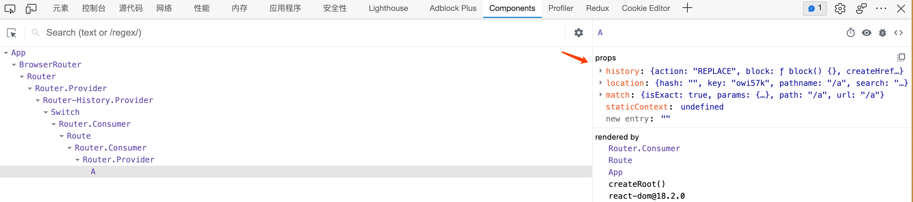

# 路由信息

Router组件会创建一个上下文，并且，向上下文中注入一些信息。

该上下文对开发者是隐藏的，Route组件若匹配到了地址，则会将这些上下文中的信息作为属性`传入对应的组件`。





## history

`history`，我们利用该对象无刷新跳转地址。它并不是window.history对象。

- push：将某个新的地址入栈（历史记录栈） 

- - 参数1：新的地址
  - 参数2：`可选，附带的状态数据`

- replace：将某个新的地址替换掉当前栈中的地址
- go: 与window.history一致
- forward: 与window.history一致
- back: 与window.history一致


**为什么没有直接使用history对象？**

1. React-Router中有两种模式：Hash、History，如果直接使用window.history，只能支持一种模式
2. 当使用`windows.history.pushState`方法时，没有办法收到任何通知，将导致React无法知晓地址发生了变化，结果导致无法重新渲染组件

 

## location

与`history.location完全一致`，是同一个对象，但是，与window.location不同。

location对象中记录了当前地址的相关信息。

我们通常使用第三方库`query-string`，用于解析地址栏中的数据。

```js
import React from 'react'
import { BrowserRouter as Router, Route, Switch } from "react-router-dom"
import qs from "query-string";

function A(props) {
    console.log(props.location)
    var query = qs.parse(props.location.search)
    var hash = qs.parse(props.location.hash);
    return <div>
        <p>组件A</p>
        <p>
            访问地址：{props.location.pathname}
        </p>
        <p>
            地址参数：a:{query.a}, b:{query.b}, c:{query.c}
        </p>
        <p>
            hash: d:{hash.d}, f:{hash.f}
        </p>
    </div>
}

function NotFound() {
    return <h1>找不到页面</h1>
}
export default function App() {
    return (
        <Router>
            <Switch>
                <Route path="/a" exact component={A} />
                <Route component={NotFound} />
            </Switch>
        </Router>
    )
}

```


## match

该对象中保存了，`路由匹配`的相关信息。

- `isExact`：事实上，当前的路径和路由配置的路径是否是精确匹配的
- `params`：获取路径规则中对应的数据


实际上，在书写Route组件的path属性时，可以书写一个`string pattern`（字符串正则）

react-router使用了第三方库：`Path-to-RegExp`，该库的作用是，将一个字符串正则转换成一个真正的正则表达式。


**向某个页面传递数据的方式：**

1. 使用state：在push页面时，加入state
2. **利用search：把数据填写到地址栏中的？后**，`/news?year=2019&month=8&day=6`
3. 利用hash：把数据填写到hash后
4. **params：把数据填写到路径中**，`/news/2019/8/6`

 ```js
 import React from 'react'
 import { BrowserRouter as Router, Route, Switch } from "react-router-dom"
 
 function News(props) {
     console.log(props.match)
     return <div>
         <p>显示{props.match.params.year}年{props.match.params.month}月{props.match.params.day}日的新闻</p>
     </div>
 }
 
 function NotFound() {
     return <h1>找不到页面</h1>
 }
 export default function App() {
     return (
         <Router>
             <Switch>
                 <Route path="/news/:year?/:month?/:day?" component={News} />
                 <Route component={NotFound} />
             </Switch>
         </Router>
     )
 }
 
 ```


```js
export default function App() {
    return (
        <Router>
            <Switch>
                <Route path="/news/:year(\d+)/:month(\d+)/:day(\d+)" component={News} />
                <Route component={NotFound} />
            </Switch>
        </Router>
    )
}
```


## 非路由组件获取路由信息

某些组件，并没有直接放到Route中，而是嵌套在其他普通组件中，因此，它的props中没有路由信息，如果这些组件需要获取到路由信息，可以使用下面两种方式：

1. 将路由信息从父组件一层一层传递到子组件
2. 使用react-router提供的高阶组件`withRouter`，包装要使用的组件，该高阶组件会返回一个新组件，新组件将向提供的组件注入路由信息。

```js
import React from 'react'
import { BrowserRouter as Router, Route, Switch, withRouter } from "react-router-dom"

const AWrapper = withRouter(A);

// function withRouter(Comp) {
//     return function routerWrapper(props) {
//         //获取上下文中的信息
//         return <Comp {...props} history={上下文中的history} />
//     }
// }

function News(props) {
    return <div>
        <h1>新闻列表</h1>
        <AWrapper />
    </div>
}

function A(props) {
    console.log(props)
    return <button onClick={() => {
        props.history.push("/");
    }}>点击返回</button>
}

function Index() {
    return <h1>首页</h1>
}

function NotFound() {
    return <h1>找不到页面</h1>
}
export default function App() {
    return (
        <Router>
            <Switch>
                <Route path="/news" component={News} />
                <Route path="/" exact component={Index} />
                <Route component={NotFound} />
            </Switch>
        </Router>
    )
}

```

